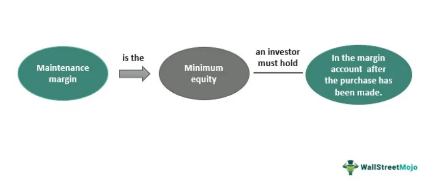

Stock trading encompasses a broad spectrum of strategies and tools aimed at maximizing profits and managing potential losses. Among these tools, the concept of 'maintenance margin' plays a vital role, especially in leveraged trading scenarios. Leveraged trading allows traders to control larger positions with a relatively smaller amount of capital, intensifying both the potential gains and risks. Maintenance margin is the minimum equity amount that must be present in a margin account to keep positions open. 

Given the increasing prevalence of algorithmic trading, where automated systems execute trades at high speeds based on pre-defined criteria, grasping the complexities of margin requirements is crucial. Algorithmic traders must integrate maintenance margin considerations into their strategies to prevent disruptions that could arise from margin violations. Understanding maintenance margin ensures that traders are better equipped to balance the potential for higher returns with the inherent risks involved in using borrowed capital.



This article will explore the complexities of maintenance margins, drawing on insights relevant to both individual and institutional traders engaged in stock trading. It will particularly highlight the challenges and opportunities presented in the context of algorithmic trading environments, offering insights into how this essential mechanism underpins effective risk management and facilitates disciplined trading practices.

## Table of Contents

## What is Maintenance Margin?

Maintenance margin refers to the minimum equity balance that a trader must maintain in a margin account to keep their leveraged positions open. It acts as a financial safeguard against market volatility and is essential for risk management in stock trading. Unlike cash accounts, margin accounts allow traders to borrow funds from their broker to purchase securities, thereby amplifying potential gains. However, this leverage also increases the risk of loss, making the maintenance margin a critical element in ensuring the stability of trading activities.

The maintenance margin is often expressed as a percentage of the total market value of the securities held in the account. For instance, if a brokerage requires a 25% maintenance margin, the trader must maintain equity of at least 25% of the market value of the securities in their margin account. Failure to meet the maintenance margin triggers a margin call, where the trader must either deposit more funds or sell off positions to bring the account back to the required level.

The distinction between maintenance margin and initial margin is significant for traders. The initial margin is the percentage of the purchase price of a security that an investor must pay for with their own funds when making a trade. It provides the basis for entering a leveraged position. In contrast, the maintenance margin is concerned with the ongoing equity requirements necessary to sustain those positions. While the initial margin requirement might be set, for example, at 50%, allowing a trader to borrow up to 50% of the purchase price, the maintenance margin typically requires a lower percentage to be kept as equity to avoid liquidation.

In stock trading, the maintenance margin serves an essential role by mitigating the risks associated with leveraged positions. It protects both the investor and the brokerage. For the trader, it prevents excessive losses when the market value of securities falls by mandating a minimum equity cushion. For the broker, it reduces the risk that a trader's losses could exceed their account balance, ensuring the broker's capital is not jeopardized.

Maintenance margin requirements can vary across different brokers and are influenced by factors such as the [volatility](/wiki/volatility-trading-strategies) of the traded asset, the trader's account history, and regulatory policies. For example, stocks that exhibit higher volatility may have stricter maintenance margin requirements to account for the increased risk of significant price swings.

In summary, maintenance margin is a foundational aspect of margin trading, providing a structured approach to managing leveraged positions and counteracting the inherent risks of trading with borrowed funds. It distinguishes itself from the initial margin by emphasizing ongoing risk management rather than the entry into leveraged trades. Understanding and effectively managing maintenance margin is crucial for traders aiming to optimize their strategies and protect their investments.

## Maintenance Margin vs. Initial Margin

Maintenance margin and initial margin are key concepts that traders must understand to effectively manage their investment accounts, particularly when trading on margin. Both serve distinct purposes and are essential for maintaining the financial health of a margin account.

The initial margin is the amount of capital a trader must deposit to open a leveraged position. This is essentially a down payment that demonstrates the trader's ability to take on the financial risk associated with the position. Brokers set initial margin requirements based on the volatility and risk of the asset being traded, typically expressed as a percentage of the total trade value. For example, if a trader wishes to buy securities worth $100,000 and the broker's initial margin requirement is 50%, the trader must provide $50,000.

Conversely, the maintenance margin is the minimum amount of equity a trader must maintain in their margin account after the position has been opened. It acts as a financial buffer to ensure the account remains solvent in the face of market fluctuations. The maintenance margin is typically lower than the initial margin, often set around 25% of the current market value of the securities. If the account equity falls below this level, the broker will issue a margin call, requiring the trader to either deposit additional funds or liquidate part of their position to replenish the account's equity.

Managing these margins effectively is crucial to avoid margin calls, which can force traders to sell assets under unfavorable conditions. Traders can manage both margins by maintaining a margin cushion, which is an additional amount of equity above the maintenance margin. This cushion acts as a safeguard against market volatility, reducing the likelihood of a margin call. Leveraging strategies such as diversification can also minimize risk, spreading investments across various assets to mitigate potential losses.

For a practical understanding, consider a Python function to calculate whether a margin call is imminent given initial and maintenance margin levels relative to current asset prices:

```python
def check_margin_call(current_value, loan_amount, maintenance_margin_rate):
    equity = current_value - loan_amount
    maintenance_threshold = maintenance_margin_rate * current_value

    if equity < maintenance_threshold:
        return True  # Margin call needed
    else:
        return False  # No margin call

# Example usage
current_value = 70000
loan_amount = 50000
maintenance_margin_rate = 0.25

if check_margin_call(current_value, loan_amount, maintenance_margin_rate):
    print("Margin call needed.")
else:
    print("Account is sufficiently funded.")
```

This script evaluates whether the equity in an account is sufficient to meet the maintenance margin requirements. By inputting current account values, the function helps traders determine if they need to take action to avoid a margin call.

Understanding and managing initial and maintenance margins are integral to risk management and fostering sustainable trading practices. By staying above the required margin levels, traders can maintain control over their investments and reduce the risk of forced liquidations.

## The Role of Maintenance Margin in Risk Management

Maintenance margin serves as a critical component in risk management, acting as a safeguard for both brokers and investors in the volatile environment of stock trading. By ensuring a minimum level of equity in trading accounts, maintenance margin mitigates the potential for severe financial loss in the event of significant market movements.

Maintenance margin fosters a disciplined approach to trading by requiring traders to consistently monitor their account balances relative to their positions. This obligation compels traders to be more cautious, preventing them from overly aggressive investments that could deplete their equity quickly. The maintenance margin acts as a financial checkpoint; when equity falls below this threshold, traders must either deposit additional funds or liquidate positions to restore adequate levels of margin. This practice not only protects individual traders from excessive risk-taking but also helps stabilize the broader market by curbing the ripple effects of massive, unregulated sell-offs.

A key aspect of maintenance margin is the margin call—a notification that the trader must increase their account balance to meet the minimum requirement. Margin calls can have significant implications for trading strategies. They may force the liquidation of valuable positions at potentially unfavorable prices, leading to unintended losses. Traders may employ various strategies to avoid margin calls, such as maintaining a cash buffer or using stop-loss orders to automatically close positions before reaching the maintenance margin threshold.

Furthermore, by enforcing a maintenance margin, brokers ensure their capital remains protected from losses incurred by the traders they back. This buffer is fundamental in maintaining the broker's financial stability, thereby allowing them to continue providing services even during market downturns.

Overall, the maintenance margin is integral not only for the individual trader's financial health but also for the systemic risk management of the stock market ecosystem. It pressures market participants into prudent decision-making, thereby reducing the potential for catastrophic losses stemming from unforeseen market events.

## Algorithmic Trading and Maintenance Margin

Algorithmic trading has significantly transformed the landscape of stock trading by employing sophisticated algorithms to make high-speed decisions and execute trades with precision. These algorithms analyze vast data sets to identify trading opportunities, making split-second decisions that would be impossible for human traders. However, the integration of maintenance margin considerations in [algorithmic trading](/wiki/algorithmic-trading) is a crucial aspect that ensures the sustainability and robustness of trading algorithms.

Maintenance margin represents the minimum equity a trader must maintain in a margin account to keep positions open, thereby acting as a buffer against sudden market movements. For algorithms to function effectively in leveraged trading environments, they must [factor](/wiki/factor-investing) in margin requirements to prevent premature liquidation of positions due to margin calls. This involves constant monitoring of margin levels and adjusting positions dynamically according to market conditions and predefined risk management protocols.

Incorporating maintenance margin parameters into trading algorithms can be achieved via several strategies. Firstly, risk management protocols can automatically adjust leverage levels based on current account equity and the volatility of the trading instrument. For example, an algorithm might be programmed to increase cash reserves or liquidate certain positions if the margin level falls below a predetermined threshold.

```python
def adjust_leverage(account_balance, open_positions, market_volatility):
    required_margin = sum([position.margin_requirement for position in open_positions])  
    if account_balance < required_margin * (1 + market_volatility):
        return "Reduce leverage"
    return "Maintain leverage"
```

Additionally, algorithms can integrate stop-loss orders to minimize potential losses and maintain adequate margin levels. Stop-loss orders automatically sell a security when it reaches a particular price point, thus preventing further losses and preserving margin equity.

Algorithmic traders can enhance their strategies by using historical data to backtest different scenarios where margin requirements might impact trading outcomes. This process helps in understanding how varying leverage levels and market conditions affect account equity, providing insights into optimal settings for different market environments. By adopting a proactive approach to margin management, algorithmic trading systems can achieve a balance between maximizing returns and minimizing risks.

In summary, the successful integration of maintenance margin considerations into algorithmic trading involves constant monitoring, dynamic position adjustments, and automated risk management protocols. By effectively managing these parameters, traders can ensure their algorithms remain resilient in the face of market volatility and continue to optimize trading performance.

## Strategies to Manage Margin Requirements

In order to effectively manage margin requirements and prevent the liquidation of positions in unfavorable market conditions, traders can apply several strategies. These strategies are crucial in adapting to market volatility, particularly in the dynamic environment of stock trading.

### Diversification
Diversification plays a fundamental role in managing margin requirements. By distributing investments across a variety of asset classes, sectors, or geographical locations, traders can reduce the impact of adverse movements in any single investment on the overall portfolio. A diversified portfolio is less likely to experience large swings in value, which helps in maintaining sufficient equity in margin accounts. This is supported by the Modern Portfolio Theory, which suggests that diversification can reduce portfolio risk without compromising on expected returns.

### Maintaining Cash Reserves
Keeping cash reserves is another effective strategy to manage margin requirements. Cash reserves provide [liquidity](/wiki/liquidity-risk-premium), allowing traders to cover margin calls without being forced to sell assets at a loss. By having cash available, traders can also capitalize on market opportunities that require additional margin, without risking their existing positions. Maintaining a certain percentage of the portfolio as cash can provide a buffer against market volatility and ensure that margin requirements are consistently met.

### Stop-Loss Orders
Implementing stop-loss orders is a proactive measure to manage risks associated with margin trading. A stop-loss order automatically sells a security when it reaches a specified price, limiting potential losses. This tool is essential in preserving equity within a margin account and avoiding margin calls. By setting stop-loss orders strategically, traders can protect their portfolio from significant downturns, thereby maintaining the necessary margin level.

Incorporating these strategies allows traders to effectively manage their margin requirements, whether the market is experiencing high volatility or presenting stable conditions. By diversifying portfolios, holding adequate cash reserves, and utilizing stop-loss orders, traders are better equipped to handle the demands of margin trading and reduce the likelihood of forced liquidations.

## Conclusion

Understanding maintenance margin is crucial for traders, especially those utilizing algorithmic trading where rapid decision-making is paramount. The maintenance margin serves as a critical component of risk management, ensuring that traders maintain an adequate balance in their margin accounts to withstand market fluctuations without facing immediate liquidation. Properly managing this margin not only helps in sustaining positions during volatile periods but also contributes to enhancing profitability over time.

Effective management of maintenance margin involves continuous monitoring of account balances relative to current market conditions. This proactive approach enables traders to avoid margin calls and the subsequent forced liquidation of positions, which could lead to substantial losses. By strategically managing margin requirements, traders can better navigate the complexities of the stock market, maximizing their potential returns while minimizing exposure to risk.

Incorporating strategic approaches to margin management, such as maintaining cash reserves, setting appropriate leverage limits, and using advanced algorithmic strategies to monitor and adjust positions in real-time, can provide a competitive advantage. Traders who stay informed about market trends and continuously refine their trading systems are better positioned to capitalize on opportunities and mitigate risks inherent in margin trading.

Ultimately, understanding and managing maintenance margin effectively is not just about compliance; it is about leveraging it as a tool for financial strategy and optimization in the stock market. This knowledge, combined with the disciplined application of trading principles, can offer a significant edge, enabling traders to achieve their investment goals more efficiently.

## References & Further Reading

[1]: Hull, J. C. (2017). ["Options, Futures, and Other Derivatives"](https://www.semanticscholar.org/paper/Options%2C-Futures%2C-and-Other-Derivatives-Hull/89bdee500c8623864fc9eb7a471546aa713acc44). Pearson Education.

[2]: Black, F., & Scholes, M. (1973). ["The Pricing of Options and Corporate Liabilities."](https://www.cs.princeton.edu/courses/archive/fall09/cos323/papers/black_scholes73.pdf) Journal of Political Economy, 81(3), 637–654.

[3]: Lopez de Prado, M. (2018). ["Advances in Financial Machine Learning"](https://www.amazon.com/Advances-Financial-Machine-Learning-Marcos/dp/1119482089). Wiley.

[4]: Jansen, S. (2020). ["Machine Learning for Algorithmic Trading - Second Edition"](https://github.com/stefan-jansen/machine-learning-for-trading). Packt Publishing.

[5]: Chan, E. P. (2009). ["Quantitative Trading: How to Build Your Own Algorithmic Trading Business"](https://github.com/ftvision/quant_trading_echan_book). Wiley.

[6]: Thorp, E. O. (1967). ["Beat the Market: A Scientific Stock Market System"](https://www.economics.uci.edu/files/kassouf/pdfs/beatthemarket.pdf). Random House.

[7]: Aronson, D. R. (2006). ["Evidence-Based Technical Analysis: Applying the Scientific Method and Statistical Inference to Trading Signals"](https://www.amazon.com/Evidence-Based-Technical-Analysis-Scientific-Statistical/dp/0470008741). Wiley.