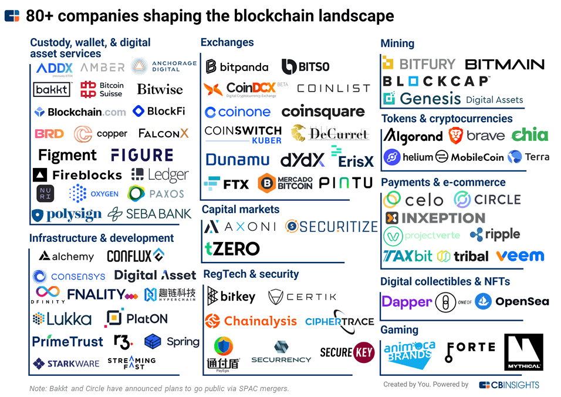

## Table of Contents

## What is blockchain technology and how does it work?

Blockchain technology is like a digital record book that stores information in a way that's very hard to change or cheat. Imagine a chain of blocks, where each block contains a list of transactions or data. Once a block is filled with data, it gets added to the chain and locked in place. Every new block added to the chain is connected to the one before it, making a long chain of blocks. This chain is kept on many computers all over the world, so no single person or group controls it. This makes the information safe and trustworthy because if someone tries to change something, the other computers will notice and stop it.

The way blockchain works is by using special math problems that computers solve to add new blocks to the chain. When someone wants to add new information, like a transaction, it gets checked by many computers in the network. Once they agree that the information is correct, it gets added to a new block. This process is called "mining," and the computers that do this work are called "miners." They get rewarded with a small amount of digital money, like Bitcoin, for their efforts. Because everyone can see the same information and it's very hard to change once it's added, blockchain is great for keeping records of things like money transfers, property deeds, or even voting results.

## What are the main applications of blockchain technology?

Blockchain technology has many uses, but one of the most well-known is in cryptocurrencies like Bitcoin and Ethereum. These digital currencies use blockchain to keep track of who owns what and to make sure transactions are safe and fair. When you send or receive cryptocurrency, the transaction gets recorded on the blockchain, so everyone can see it and agree that it happened. This makes it hard for anyone to cheat or spend the same money twice.

Another big use of blockchain is in supply chain management. Companies can use it to track products from the moment they're made until they reach the customer. This helps make sure everything is done right and on time. For example, a food company might use blockchain to show where their ingredients come from and how they were handled, so customers know the food is safe and fresh. It's like a digital paper trail that everyone can trust.

Blockchain is also being used in other areas like healthcare, voting systems, and even for keeping records of property ownership. In healthcare, it can help keep patient records safe and easy to share between doctors. For voting, blockchain can make sure votes are counted correctly and can't be changed. And for property, it can help prove who owns what without needing a lot of paperwork. These are just a few examples, but blockchain is a versatile technology that can be used in many different ways to make things more transparent and secure.

## Who are the leading companies in the blockchain industry?

Some of the biggest companies in the blockchain world are IBM and Microsoft. IBM has been working on blockchain for a long time and has made a platform called IBM Blockchain. This platform helps businesses use blockchain to keep track of their supply chains and other important stuff. Microsoft also has its own blockchain service called Azure Blockchain Service, which helps companies build and manage their own blockchain networks easily. Both companies are trying to make blockchain easier for other businesses to use.

Another important company is Ripple, which focuses on making international money transfers faster and cheaper using blockchain. Ripple's technology helps banks send money to each other quickly, without needing to wait days like with traditional methods. Then there's Coinbase, a company that lets people buy, sell, and store cryptocurrencies like Bitcoin and Ethereum. Coinbase has made it simple for everyday people to get into the world of digital money. These companies are leading the way in showing how blockchain can be used in real life to solve big problems.

## What role does IBM play in the blockchain ecosystem?

IBM is a big player in the blockchain world. They have created something called IBM Blockchain, which is a platform that helps businesses use blockchain technology. IBM wants to make it easier for companies to keep track of things like their supply chains. For example, a company can use IBM Blockchain to see where their products are at every step, from when they're made until they reach the customer. This helps make sure everything is done right and on time.

IBM also works with other companies to help them build their own blockchain networks. They offer tools and support to make the process easier. This way, businesses can use blockchain to solve their own problems, like keeping records safe and making sure everyone can trust the information. IBM's work in blockchain is all about making the technology useful for everyday business needs.

## How is Ripple transforming international money transfers using blockchain?

Ripple is using blockchain to make sending money across countries faster and cheaper. When you send money to another country, it can take a long time and cost a lot because banks have to go through many steps. Ripple's technology, called RippleNet, helps banks send money to each other directly, without needing to go through all those steps. This means the money can get to where it needs to go much faster, sometimes in just a few seconds, and it costs less too.

Ripple uses a digital currency called XRP to help with these transfers. When a bank wants to send money to another bank in a different country, they can use XRP to make the transfer happen quickly. XRP acts like a bridge between different currencies, making it easier to move money from one place to another. By using blockchain and XRP, Ripple is helping to make international money transfers simpler, faster, and less expensive for everyone.

## What is Ethereum and how does it differ from other blockchain platforms?

Ethereum is a blockchain platform that lets people do more than just send money. It's like a big computer that anyone can use to run special programs called "smart contracts." These smart contracts are like digital agreements that automatically do what they're supposed to do when certain things happen. For example, if you want to rent a car, a smart contract can make sure you get the car when you pay, without needing a middleman. Ethereum also has its own digital money called Ether, which people use to pay for running these smart contracts.

What makes Ethereum different from other blockchain platforms is that it's not just about keeping track of money. While Bitcoin, for example, is mainly used for sending and receiving digital cash, Ethereum lets you build all sorts of apps and games on its blockchain. This means you can create things like digital art, online voting systems, or even games where players own their items. Ethereum's flexibility and the ability to run smart contracts make it a powerful tool for building all kinds of digital services that are safe and transparent.

## How does Coinbase contribute to the blockchain and cryptocurrency market?

Coinbase is a big company that helps people buy, sell, and keep cryptocurrencies like Bitcoin and Ethereum. It's like a digital bank for these new types of money. Coinbase makes it easy for anyone to get into the world of cryptocurrencies by letting them use regular money to buy digital coins. They also have a special place called Coinbase Pro where people who know a lot about trading can do more advanced stuff. By making it simple and safe, Coinbase has helped a lot of people start using cryptocurrencies.

Coinbase also helps the blockchain and [cryptocurrency](/wiki/cryptocurrency) market grow in other ways. They have their own digital money called USD Coin, which is like a digital version of the US dollar. This makes it easier for people to move money around without worrying about the ups and downs of other cryptocurrencies. Coinbase also works on new ideas and technologies to make the whole system better and safer. They're always trying to find new ways to use blockchain to solve problems and make things easier for everyone.

## What are some lesser-known blockchain companies making significant impacts?

One lesser-known company making a big impact is Chainlink. Chainlink helps connect regular computer systems with blockchain systems. Imagine you want to use a smart contract on a blockchain, but you need information from the outside world, like the weather or stock prices. Chainlink acts like a bridge, bringing that information onto the blockchain so the smart contract can use it. This makes blockchain apps more useful because they can work with real-world data.

Another company doing important work is VeChain. VeChain uses blockchain to help businesses keep track of their products. For example, a clothing company can use VeChain to show where their clothes come from and how they were made. This helps customers trust that the clothes are real and not fakes. VeChain makes it easier for companies to be open about their supply chains, which is good for business and for customers who want to know more about what they're buying.

## How are traditional financial institutions like J.P. Morgan using blockchain?

Traditional financial institutions like J.P. Morgan are using blockchain to make their work faster and safer. J.P. Morgan created something called JPM Coin, which is a digital version of the US dollar. This helps them move money around the world quickly and easily. Instead of waiting days for money to go from one place to another, it can happen in seconds. This is really helpful for big businesses that need to pay each other fast.

J.P. Morgan also uses blockchain to keep track of important information. They use it to make sure everything is safe and no one can change the records without being noticed. This is important for things like keeping track of who owns what and making sure all the money transfers are correct. By using blockchain, J.P. Morgan is trying to make their services better and more trustworthy for their customers.

## What are the current trends and future predictions for blockchain technology?

Right now, one of the big trends in blockchain is something called decentralized finance, or DeFi. This means using blockchain to do things like borrowing money, lending money, and trading without needing a bank or other middleman. It's like having a whole financial system that anyone can use, and it's growing fast. Another trend is non-fungible tokens, or NFTs. These are like digital certificates that prove you own something unique, like a piece of art or a song. People are using NFTs to buy and sell all sorts of digital stuff, and it's becoming a big deal.

In the future, experts think blockchain will be used even more in everyday life. They think it could help make voting more fair and safe, and it could change how we keep track of who owns what, like houses or cars. Blockchain might also make supply chains better by letting companies show exactly where their products come from, which is good for the environment and for customers. As more people and businesses see how useful blockchain can be, it's likely to keep growing and finding new ways to make things easier and more trustworthy.

## How do blockchain companies ensure the security and privacy of transactions?

Blockchain companies keep transactions safe and private in a few important ways. First, they use something called cryptography, which is like a secret code that makes sure only the right people can see the information. When you send money or do something on the blockchain, it gets locked up with this code. Only the person it's meant for can unlock it and see what's inside. This keeps your information private and stops others from messing with it.

Second, blockchain works on a system where lots of computers all over the world check and agree on every transaction. This means no one person or group can control the whole thing. If someone tries to change a transaction or do something bad, the other computers will notice and stop it. This makes the blockchain very hard to cheat or hack. Plus, once something is added to the blockchain, it's almost impossible to change, which adds another layer of safety.

## What are the challenges and limitations faced by blockchain companies today?

One big challenge for blockchain companies is that the technology can be slow and use a lot of energy. When you want to add something to the blockchain, like a new transaction, it has to be checked by lots of computers all over the world. This takes time and uses a lot of electricity, which can be bad for the environment. Also, because so many computers need to agree, it can be hard to make changes or fix mistakes once they're added to the blockchain. This makes it tricky to use blockchain for things that need to happen quickly or need to be changed often.

Another problem is that not everyone understands or trusts blockchain yet. Some people think it's too new and risky, so they're not sure they want to use it. This can make it hard for blockchain companies to grow and get more customers. Also, the rules about using blockchain can be different in different places, which can make it hard for companies to work everywhere. They have to figure out how to follow all these different rules, which can be a lot of work.

## References & Further Reading

[1]: Narayanan, A., Bonneau, J., Felten, E., Miller, A., & Goldfeder, S. (2016). ["Bitcoin and Cryptocurrency Technologies: A Comprehensive Introduction."](https://press.princeton.edu/books/hardcover/9780691171692/bitcoin-and-cryptocurrency-technologies) Princeton University Press.

[2]: Mougayar, W. (2016). ["The Business Blockchain: Promise, Practice, and Application of the Next Internet Technology."](https://books.google.com/books/about/The_Business_Blockchain.html?id=CEsPDAAAQBAJ) Wiley.

[3]: Drescher, D. (2017). ["Blockchain Basics: A Non-Technical Introduction in 25 Steps."](https://link.springer.com/book/10.1007/978-1-4842-2604-9) Apress.

[4]: Tapscott, D., & Tapscott, A. (2018). ["Blockchain Revolution: How the Technology Behind Bitcoin and Other Cryptocurrencies is Changing the World."](https://www.tandfonline.com/doi/full/10.1080/10686967.2018.1404373) Penguin Books.

[5]: Antonopoulos, A. M. (2017). ["Mastering Bitcoin: Unlocking Digital Cryptocurrencies."](https://books.google.com/books/about/Mastering_Bitcoin.html?id=IXmrBQAAQBAJ) O'Reilly Media.

[6]: Swam, M. (2015). ["Blockchain: Blueprint for a New Economy."](https://books.google.com/books/about/Blockchain.html?id=RHJmBgAAQBAJ) O'Reilly Media.

[7]: Peters, G., Panayi, E., & Chapelle, A. (2015). ["Trends in Crypto-Currencies and Blockchain Technologies: A Monetary Theory and Regulation Perspective."](https://papers.ssrn.com/sol3/papers.cfm?abstract_id=2646618) Frontiers in ICT.

[8]: Catalini, C., & Gans, J. S. (2016). ["Some Simple Economics of the Blockchain."](https://papers.ssrn.com/sol3/papers.cfm?abstract_id=2874598) National Bureau of Economic Research Working Paper No. 22952.