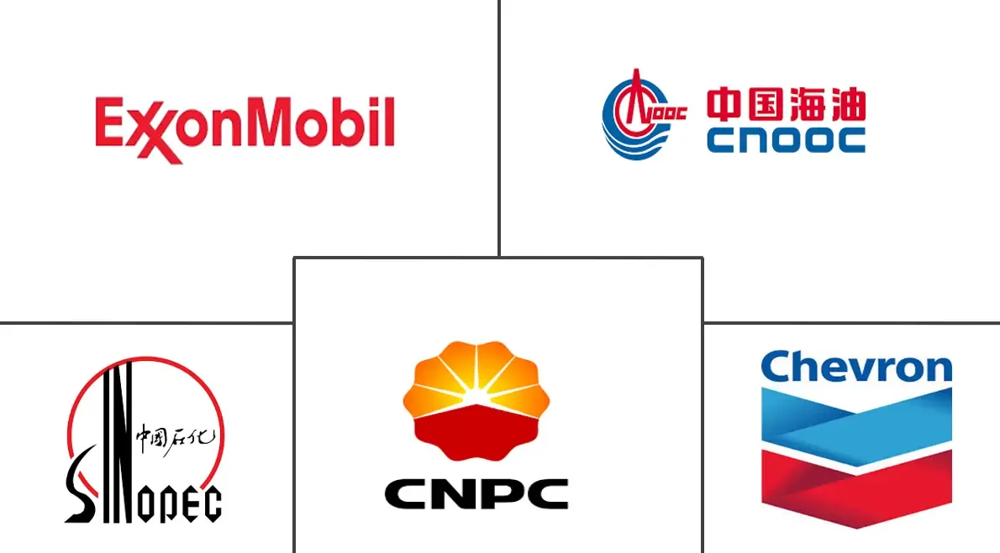

## Table of Contents

## What are the major oil companies in China?

The major oil companies in China are China National Petroleum Corporation (CNPC), also known as PetroChina, Sinopec, and China National Offshore Oil Corporation (CNOOC). These companies are very important for China's energy needs. They help to find, produce, and sell oil and gas both inside China and around the world.

CNPC, or PetroChina, is the biggest oil and gas producer in China. It works on many projects to explore and produce oil and gas. Sinopec is another big company that does a lot of refining and selling of oil products. It also explores for oil and gas. CNOOC focuses on finding and producing oil and gas in the sea areas around China.

These three companies are owned by the Chinese government. They play a big role in making sure China has enough energy. They also help China to be a big player in the global energy market.

## What is the history of the largest Chinese oil company?

The largest Chinese oil company is the China National Petroleum Corporation (CNPC), also known as PetroChina. CNPC was created in 1988 when the Chinese government decided to bring together many smaller oil companies into one big company. Before 1988, these smaller companies were already working to find and produce oil in China. By combining them, the government wanted to make the oil industry stronger and more efficient. CNPC quickly grew and became very important for China's energy needs.

Over the years, CNPC has worked hard to find more oil and gas both in China and in other countries. They have built big pipelines to move oil and gas around China and to other countries. In 1999, CNPC started a company called PetroChina, which is listed on stock markets in China and Hong Kong. This helped CNPC to get more money to grow even bigger. Today, CNPC is not just the biggest oil company in China but also one of the biggest in the world. They keep looking for new ways to find and use oil and gas to meet China's growing energy needs.

## How do Chinese oil companies contribute to the national economy?

Chinese oil companies like CNPC, Sinopec, and CNOOC play a big role in helping the national economy grow. They find and produce oil and gas, which are very important for energy. This energy is used in factories, homes, and transportation. When these companies produce more oil and gas, it helps to keep the cost of energy lower. This makes it easier for other businesses to grow and create jobs. The money these companies make also goes back into the economy through taxes and investments in new projects.

These companies also help the economy by selling oil and gas to other countries. This brings in money from outside China, which is good for the national economy. They also invest in other countries to find more oil and gas. This helps to make sure China has enough energy in the future. By doing all these things, Chinese oil companies help to make the economy stronger and more stable.

## What are the primary operations of these companies?

The primary operations of Chinese oil companies like CNPC, Sinopec, and CNOOC involve finding and producing oil and gas. They explore for these resources both on land and in the sea around China. Once they find oil and gas, they drill wells to bring it up to the surface. They also build pipelines and other ways to move the oil and gas to where it is needed. These companies work hard to make sure they can find enough oil and gas to meet China's energy needs.

Another important part of their operations is refining the oil into products like gasoline and diesel. They have big refineries that turn the raw oil into these useful products. After refining, they sell these products to people and businesses in China and around the world. They also sell the oil and gas they produce to other countries, which helps to bring in money for China. By doing all these things, these companies help to keep the energy flowing and support the economy.

## How do Chinese oil companies impact global oil markets?

Chinese oil companies like CNPC, Sinopec, and CNOOC have a big impact on global oil markets. They are some of the biggest oil and gas producers in the world. When they find and produce more oil and gas, it can change how much oil is available around the world. This can affect the price of oil. If they produce a lot, the price might go down because there is more oil to go around. If they produce less, the price might go up because there is less oil available.

These companies also buy a lot of oil from other countries. This can affect the global oil market too. When they buy a lot of oil, it can make the demand for oil go up, which can push the price up. They also invest in oil projects in other countries. This helps them to have more control over where the oil comes from and how much they can get. By doing all these things, Chinese oil companies help to shape what happens in the global oil market.

## What are the environmental policies of major Chinese oil companies?

Major Chinese oil companies like CNPC, Sinopec, and CNOOC have environmental policies to help protect the planet. They know that oil and gas can harm the environment, so they try to do things in a cleaner way. They use new technology to find and produce oil and gas with less harm to nature. They also work to reduce the pollution that comes from their operations. They have rules to make sure they follow the laws about the environment and try to do more than what the laws say.

These companies also try to lower the amount of greenhouse gases they make. Greenhouse gases can make the Earth warmer, which is bad for the environment. They have plans to use more clean energy like wind and solar power in their operations. They also try to use less energy overall. By doing these things, they hope to help fight climate change and keep the environment safer for everyone.

## How do these companies invest in renewable energy?

Chinese oil companies like CNPC, Sinopec, and CNOOC are putting money into renewable energy. They know that oil and gas won't last forever, so they are looking for other ways to make energy. They are investing in things like wind farms and solar power plants. This helps them to have more types of energy to use and sell. By doing this, they are trying to be ready for a future where people use less oil and more clean energy.

These companies are also trying to use renewable energy in their own operations. They are building wind and solar projects to help power their oil and gas work. This can help them use less oil and gas themselves, which is good for the environment. They are also looking at other kinds of renewable energy, like geothermal and bioenergy. By investing in these new types of energy, they hope to help the world move to cleaner ways of making power.

## What are the key challenges faced by Chinese oil companies?

Chinese oil companies face a lot of challenges. One big challenge is finding enough oil and gas. China uses a lot of energy, and it can be hard to find enough oil and gas to meet everyone's needs. They have to look for oil and gas both in China and in other countries. This can be expensive and risky. They also have to compete with other big oil companies around the world to get the best places to find oil and gas.

Another challenge is dealing with the environment. Oil and gas can harm the environment, so these companies have to follow strict rules to protect nature. They need to use new technology to find and produce oil and gas in cleaner ways. They also have to reduce the pollution they make. This can be hard and costly, but it's important for the future of the planet. They are also trying to move into renewable energy, but this is a big change and takes time and money.

Lastly, Chinese oil companies have to deal with changing global markets. The price of oil can go up and down a lot, which can affect how much money they make. They also have to think about politics in other countries where they work. Sometimes, changes in government or laws can make it hard for them to do business. All these challenges make it tough for Chinese oil companies to keep growing and helping China's energy needs.

## How do Chinese oil companies engage in international partnerships?

Chinese oil companies like CNPC, Sinopec, and CNOOC work with other countries to find and produce oil and gas. They make deals with governments and other oil companies around the world. This helps them get oil and gas from different places, not just China. They invest in oil projects in places like Africa, the Middle East, and South America. By doing this, they can have more oil and gas to use and sell. These partnerships also help them learn new ways to find and produce oil and gas.

These companies also work together with international partners on big projects. For example, they might build pipelines or refineries with other countries. This helps them move oil and gas more easily and make more money. They also share technology and ideas with their partners. This can help them do their work better and in a cleaner way. By working together with other countries, Chinese oil companies can grow bigger and help meet China's energy needs.

## What technological innovations are being pursued by these companies?

Chinese oil companies like CNPC, Sinopec, and CNOOC are working on new technology to find and produce oil and gas in better ways. They use special tools and computers to look deep into the ground and find oil and gas that is hard to see. They also use new ways to drill wells that are faster and safer. This helps them get more oil and gas out of the ground. They are also trying to use technology to make their work cleaner and less harmful to the environment. For example, they use machines that can capture and store the harmful gases that come from oil and gas production.

These companies are also looking into new technology for renewable energy. They are building big wind farms and solar power plants to make clean energy. They use smart technology to make these projects work better and produce more power. They also try to use renewable energy in their own oil and gas work. This can help them use less oil and gas themselves. They are also looking at other new types of energy like geothermal and bioenergy. By using these new technologies, they hope to help the world move to cleaner ways of making power and meet China's growing energy needs in a sustainable way.

## How do government regulations affect the operations of Chinese oil companies?

Government regulations have a big impact on how Chinese oil companies like CNPC, Sinopec, and CNOOC work. The Chinese government sets rules that these companies have to follow. These rules can be about how they find and produce oil and gas, how they take care of the environment, and how they sell their products. For example, the government might tell them to use certain technologies to make their work cleaner. They also have to pay taxes and follow safety rules. These regulations help make sure that the companies work in a safe and responsible way, but they can also make things more difficult and expensive for the companies.

The government also has rules about how these companies can work with other countries. They need to get permission from the government before they can invest in oil projects outside of China. This can help the government control how much oil and gas comes into the country and where it comes from. Sometimes, the government might change these rules, which can make it harder for the companies to plan their work. But these regulations also help the companies work together with the government to meet China's energy needs and keep the country's energy supply safe and stable.

## What are the future prospects and strategies of major Chinese oil companies?

The future for major Chinese oil companies like CNPC, Sinopec, and CNOOC looks busy and full of changes. They will keep looking for more oil and gas both in China and in other countries. They want to find enough to meet China's growing need for energy. They will also use new technology to find and produce oil and gas in cleaner ways. This is important because they need to follow the government's rules about the environment. They will also keep working with other countries and companies to get more oil and gas and learn new ways to do their work.

These companies are also planning for a future where people use less oil and more clean energy. They are investing in things like wind farms and solar power plants. This will help them have more types of energy to use and sell. They are also trying to use renewable energy in their own oil and gas work. This can help them use less oil and gas themselves and be ready for a world that uses more clean energy. By doing all these things, they hope to keep helping China's energy needs and be ready for the future.

## References & Further Reading

[1]: ["Advances in Financial Machine Learning"](https://www.amazon.com/Advances-Financial-Machine-Learning-Marcos/dp/1119482089) by Marcos Lopez de Prado

[2]: ["Machine Learning for Algorithmic Trading"](https://github.com/stefan-jansen/machine-learning-for-trading) by Stefan Jansen

[3]: ["Quantitative Trading: How to Build Your Own Algorithmic Trading Business"](https://www.amazon.com/Quantitative-Trading-Build-Algorithmic-Business/dp/1119800064) by Ernest P. Chan

[4]: Bergstra, J., Bardenet, R., Bengio, Y., & Kégl, B. (2011). ["Algorithms for Hyper-Parameter Optimization."](https://proceedings.neurips.cc/paper/2011/file/86e8f7ab32cfd12577bc2619bc635690-Paper.pdf) Advances in Neural Information Processing Systems 24.

[5]: ["China's State Enterprises: Changing Role in a Rapidly Transforming Economy"](https://link.springer.com/book/10.1007/978-981-13-0176-6) by Brookings Institution

[6]: ["The People's Republic of Chemicals"](https://www.amazon.com/Peoples-Republic-Chemicals-William-Kelly/dp/1940207258) by William J. Carroll