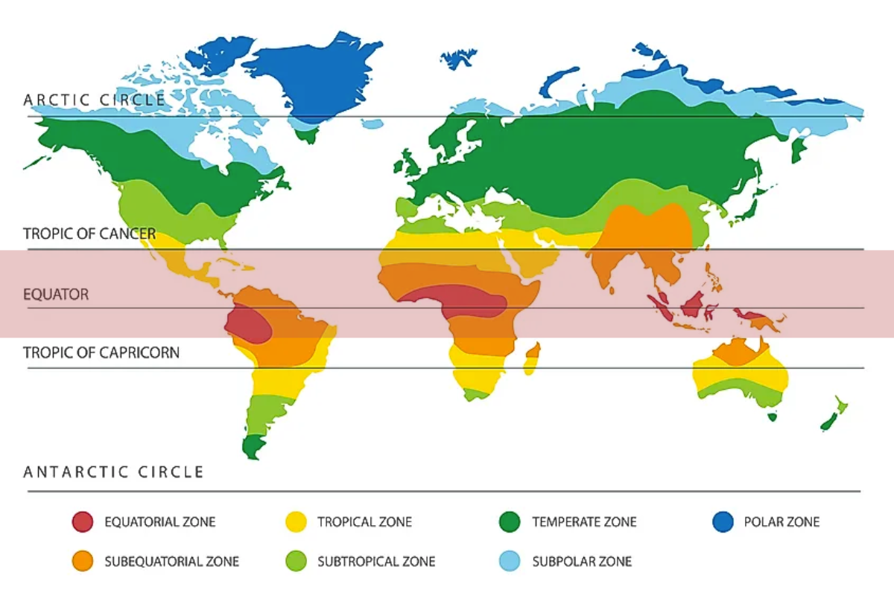

## Table of Contents

## What are the top countries that produce chocolate?

The top countries that produce chocolate are mainly in Europe and Africa. In Europe, countries like Belgium, Switzerland, and Germany are famous for making chocolate. Belgium is known for its high-quality chocolate and has many chocolatiers. Switzerland is also very famous for its chocolate, with big companies like Lindt and Toblerone. Germany makes a lot of chocolate too, with brands like Ritter Sport and Milka.

In Africa, the Ivory Coast and Ghana are the biggest producers of cocoa beans, which are used to make chocolate. The Ivory Coast produces more cocoa than any other country in the world. Ghana is the second largest producer and is known for its high-quality cocoa. Even though these countries grow a lot of cocoa, they do not make as much finished chocolate as the European countries. Instead, they export the cocoa beans to other countries where the chocolate is made.

These countries play a big role in the chocolate industry. Europe is where a lot of the chocolate is made and enjoyed, while Africa grows most of the cocoa beans needed to make chocolate. Together, they help make chocolate a popular treat all around the world.

## How does the climate affect chocolate production in these countries?

Climate plays a big role in how well cocoa beans grow in countries like the Ivory Coast and Ghana. These countries are close to the equator, where it's hot and wet all year. This kind of weather is perfect for cocoa trees, which need a lot of rain and warmth to grow big and healthy. If the weather changes and it gets too dry or too wet, it can hurt the cocoa trees and make it hard to grow enough beans. So, the right climate is very important for these countries to keep making a lot of cocoa.

In Europe, where countries like Belgium, Switzerland, and Germany make a lot of chocolate, the climate is not as important for growing cocoa because they don't grow it there. Instead, they buy cocoa beans from places like the Ivory Coast and Ghana. But, the climate in Europe does affect how chocolate is made and stored. Chocolate can melt if it gets too hot, so factories need to keep their buildings cool. Also, if the weather is too humid, it can make the chocolate go bad. So, even though Europe doesn't grow cocoa, the climate still matters for making good chocolate.

## What types of cocoa beans are grown in the major chocolate-producing countries?

In the Ivory Coast and Ghana, which are the biggest cocoa producers, they mostly grow Forastero cocoa beans. Forastero beans are tough and can handle the hot and wet weather in these countries. They are not as fancy as some other beans, but they make up most of the world's cocoa because they are easy to grow and give a good amount of beans. 

In smaller amounts, these countries also grow Trinitario cocoa beans. Trinitario beans are a mix of Forastero and Criollo beans. They are not as common as Forastero, but they are special because they have a nice flavor that is better than Forastero but still easier to grow than Criollo.

In countries like Ecuador and Indonesia, they grow a lot of Criollo and Trinitario beans. Criollo beans are the rarest and are known for their great taste, but they are hard to grow and do not give as many beans as Forastero. Trinitario beans, which are easier to grow than Criollo, are also popular in these places because they have a good flavor and can handle different weather conditions.

## How do the cultivation practices vary among these countries?

In the Ivory Coast and Ghana, farmers grow a lot of cocoa on small pieces of land. They often use a method called intercropping, where they plant cocoa trees along with other crops like bananas or cassava. This helps the soil stay healthy and gives the farmers different things to sell. They also use a lot of hand labor because many farms are small and do not have big machines. Sometimes, they use chemicals to help the cocoa trees grow better, but this can be bad for the environment if not done carefully.

In countries like Ecuador and Indonesia, the way they grow cocoa can be different. Some farms are bigger and use machines to help with the work. They might use more modern ways to take care of the cocoa trees, like using special fertilizers and keeping the soil in good shape. These countries grow different types of cocoa beans, so they might need different ways to take care of them. For example, Criollo beans need more care than Forastero beans, so farmers in Ecuador might spend more time making sure these trees are healthy.

Even though the ways of growing cocoa can be different, all these countries face some of the same problems. Things like bad weather, diseases, and bugs can hurt the cocoa trees. Farmers need to keep learning and trying new things to make sure they can keep growing good cocoa beans.

## What is the economic impact of chocolate production on these countries?

Chocolate production has a big impact on the economies of countries like the Ivory Coast and Ghana. These countries grow a lot of cocoa beans, which they sell to other countries. This brings in a lot of money and helps their economies grow. Many people in these countries work on cocoa farms, so it gives jobs to a lot of people. But, the money from selling cocoa does not always reach the farmers. Sometimes, big companies and middlemen take most of the money, and the farmers do not get paid enough. This can make life hard for the farmers and their families.

In Europe, countries like Belgium, Switzerland, and Germany make a lot of chocolate from the cocoa beans they buy. This also helps their economies because they can sell the chocolate all over the world. Making chocolate creates jobs in factories and stores, and it brings in money from other countries that buy the chocolate. These countries have a big part in the chocolate business, and it helps their economies stay strong. But, they need to keep buying good cocoa beans from places like the Ivory Coast and Ghana to keep making chocolate.

## How has the history of chocolate influenced its production in these countries?

Chocolate has a long history that started in Central and South America thousands of years ago. The ancient Maya and Aztec people drank chocolate, but it was different from the sweet chocolate we eat today. When European explorers like Christopher Columbus and Hernán Cortés brought cocoa beans back to Europe in the 1500s, people started to change how they used chocolate. They added sugar and other things to make it taste better. This new kind of chocolate became very popular in Europe, and countries like Belgium and Switzerland started making their own special kinds of chocolate. This history is why Europe became a big place for making chocolate.

In Africa, the history of chocolate is different. Cocoa beans were brought to places like the Ivory Coast and Ghana by European countries during the time of colonialism. These countries started growing cocoa because it was a good way to make money. Over time, the Ivory Coast and Ghana became the biggest cocoa growers in the world. Even though they grow a lot of cocoa, they do not make as much finished chocolate as Europe. Instead, they sell the cocoa beans to other countries. The history of how cocoa came to these countries has made them important in the chocolate business, but it also means they face challenges in getting a fair share of the money from chocolate.

## What are the major challenges faced by chocolate producers in these countries?

In countries like the Ivory Coast and Ghana, chocolate producers face many challenges. One big problem is the price of cocoa beans. The price can go up and down a lot, which makes it hard for farmers to know how much money they will make. This can make life hard for them because they might not have enough money to take care of their families. Another problem is diseases and bugs that can hurt the cocoa trees. Farmers need to work hard to keep the trees healthy, but sometimes they do not have the right tools or know-how to do this well.

In Europe, chocolate makers in countries like Belgium, Switzerland, and Germany also have challenges. One big issue is making sure they can always get good cocoa beans. They need to buy cocoa from places like the Ivory Coast and Ghana, and if there are problems there, it can make it hard for them to make chocolate. Another challenge is keeping up with what people want. People always want new kinds of chocolate, so the makers need to keep trying new things. They also need to make sure their chocolate is safe and good quality, which can be hard and expensive.

Both places have to deal with climate change, too. Changes in the weather can make it hard to grow cocoa beans or make chocolate. This is a big problem that everyone in the chocolate business needs to think about and work on together.

## How do government policies affect chocolate production in these countries?

In the Ivory Coast and Ghana, government policies can have a big impact on chocolate production. Both countries have set up ways to control the price of cocoa beans to help farmers get a fair price. They also have rules about how cocoa is grown and sold to make sure it is good quality and safe. But, sometimes these rules can be hard for farmers to follow, especially if they do not have a lot of money or the right tools. The governments also work to stop bad things like child labor on cocoa farms, but it can be hard to make sure everyone follows the rules.

In Europe, government policies in countries like Belgium, Switzerland, and Germany also affect chocolate production. They have strict rules about food safety and quality to make sure the chocolate is safe to eat. These rules can make it more expensive and harder for chocolate makers to do their job. The governments also help chocolate companies by making trade deals with other countries, which can make it easier to buy cocoa beans. But, they also have to think about the environment and try to make rules that help stop climate change, which can affect how chocolate is made.

## What innovations have been introduced in chocolate production in these countries?

In the Ivory Coast and Ghana, farmers have started using new ways to grow cocoa that are better for the environment. They use things like better fertilizers and special ways to take care of the soil to help the cocoa trees grow strong and healthy. Some farmers also use new technology, like apps on their phones, to learn more about how to grow cocoa and sell it for a good price. These new ways help them make more cocoa and make more money, but it can be hard for them to learn how to use these new things.

In Europe, chocolate makers in countries like Belgium, Switzerland, and Germany are always trying new things to make their chocolate even better. They use new machines that can make chocolate faster and more evenly. They also try new recipes and flavors to keep people interested in their chocolate. Some companies are also working on ways to make chocolate that is better for the environment, like using less energy and making less waste. These new ideas help them stay ahead in the chocolate business and keep making chocolate that people love.

## How do these countries ensure the sustainability of their chocolate production?

In the Ivory Coast and Ghana, they work hard to make sure cocoa farming stays good for the future. They use new ways to grow cocoa that do not hurt the earth as much. They try to use less harmful chemicals and take better care of the soil. They also teach farmers how to grow cocoa in ways that help the environment. Sometimes, they work with big companies and groups from other countries to learn more about how to do this. It is not easy, but they keep trying to make cocoa farming better for the earth and for the people who do it.

In Europe, countries like Belgium, Switzerland, and Germany also care about making chocolate in a way that is good for the future. They use new machines that use less energy and make less waste. They also try to buy cocoa beans from places that grow them in a good way for the environment. Some companies even tell people on their chocolate wrappers how they are helping the earth. It is important for them to keep making chocolate that people like, but they also want to make sure they can keep doing it for a long time without hurting the planet.

## What role do these countries play in the global chocolate market?

The Ivory Coast and Ghana are very important in the global chocolate market because they grow a lot of cocoa beans. These countries send cocoa beans to other places around the world, especially to Europe. The money they make from selling cocoa helps their countries grow. But, the farmers who grow the cocoa do not always get a lot of money. They work hard, but sometimes the big companies and people in the middle take most of the money. This can make life hard for the farmers and their families.

In Europe, countries like Belgium, Switzerland, and Germany make a lot of chocolate from the cocoa beans they buy from places like the Ivory Coast and Ghana. They are famous for making really good chocolate that people all over the world love. These countries sell their chocolate to many other countries, which helps their economies grow. They have to make sure they can always get good cocoa beans, and they also need to keep making new kinds of chocolate to keep people interested. Europe plays a big part in the chocolate business because they make so much of the chocolate that people enjoy.

## How are fair trade and ethical sourcing practices implemented in these countries' chocolate industries?

In the Ivory Coast and Ghana, fair trade and ethical sourcing are important because they help make sure cocoa farmers get paid fairly and work in good conditions. Groups like Fairtrade work with farmers to set a price for cocoa that is fair. This means farmers get enough money to live on, even if the price of cocoa goes down. These groups also help stop bad things like child labor. They teach farmers about better ways to grow cocoa and take care of the earth. But, it can be hard for all farmers to follow these rules, especially if they do not have a lot of money or the right tools.

In Europe, countries like Belgium, Switzerland, and Germany use fair trade and ethical sourcing to make sure their chocolate is good for people and the planet. Many chocolate companies buy cocoa beans that have a fair trade label. This means the beans come from farmers who are paid fairly and work in good conditions. Some companies also tell people on their chocolate wrappers how they are helping the earth and the farmers. They try to buy cocoa from places that grow it in ways that do not hurt the environment. This can make the chocolate a bit more expensive, but it helps make sure the chocolate business is good for everyone involved.

## References & Further Reading

[1]: ICCO. ["The world cocoa economy: current status, challenges and prospects."](https://unctad.org/system/files/non-official-document/SUC_MEM2014_09042014_ICCO.pdf) International Cocoa Organization.

[2]: Fountain, A. C., & Huetz-Adams, F. (2020). ["Cocoa Barometer 2020."](https://knowledge4policy.ec.europa.eu/publication/cocoa-barometer-2020_en)

[3]: ICCO. ["Quarterly Bulletin of Cocoa Statistics," Volume XLVI No. 3, Cocoa year 2019/20."](https://www.icco.org/icco-documentation/quarterly-bulletin-of-cocoa-statistics/)

[4]: "The Economics of Chocolate" edited by Mara P. Squicciarini and Johan Swinnen

[5]: Wilkie, W. L. (2012). ["Cocoa Production Trends: Past and Present."](https://www.icco.org/wp-content/uploads/2019/07/EX-146-7-World-Cocoa-Economy-2012-edited-1.pdf) Chocolate Science and Technology.