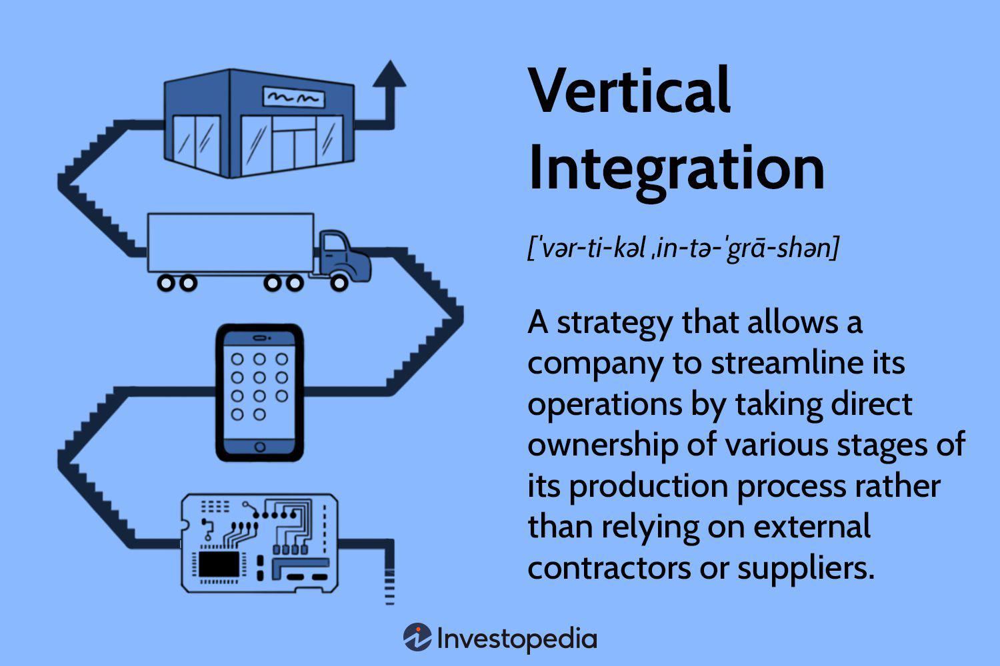

## Table of Contents

## What is a supply chain?

A supply chain is like a big system that helps get products from where they are made to where they are sold or used. It includes all the steps and people involved in making, moving, and delivering a product. For example, it starts with getting raw materials, then making the product, and finally getting it to stores or customers.

Sometimes, the supply chain can be simple, like when a farmer grows vegetables and sells them directly at a local market. Other times, it can be very complex, involving many different companies and countries. For instance, making a smartphone involves getting parts from different places around the world, putting them together, and then shipping the finished product to stores everywhere.

## Why is Apple's supply chain important?

Apple's supply chain is important because it helps them make and sell their products all over the world. They work with many different companies to get the parts they need, like screens and chips, and then put them together to make iPhones, iPads, and other gadgets. If their supply chain works well, Apple can make a lot of products quickly and keep their customers happy by having enough stock in stores.

Another reason Apple's supply chain is important is because it helps them save money and be more efficient. By managing their supply chain well, Apple can find the best places to get parts from and the best ways to move their products. This can make their products cheaper to make, which can help them sell more and make more profit. A good supply chain also helps Apple react quickly if something goes wrong, like if there's a problem with a part or if there's a big change in what customers want.

## Who are the main suppliers for Apple's products?

Apple works with many different companies to get the parts they need for their products. Some of the main suppliers are Foxconn, which helps put together iPhones and iPads in China, and TSMC, which makes the special chips that go inside Apple's devices. Samsung is also important because they make the screens for some Apple products. These companies are big and important because they help Apple make a lot of products quickly.

Another key supplier is LG Display, which makes screens for Apple's devices like the iPhone and MacBook. There are also companies like Murata Manufacturing, which makes the small parts that help the iPhone work properly. Apple tries to work with many suppliers so they can get the best parts and keep making their products even if something goes wrong with one supplier. This helps Apple keep their customers happy by having enough products in stores.

## What role do these suppliers play in the production of Apple devices?

Suppliers like Foxconn, TSMC, and Samsung play a big role in making Apple's devices. Foxconn puts together iPhones and iPads in big factories in China. They take all the parts that Apple needs and assemble them into the finished products. TSMC makes the special chips that go inside Apple's devices. These chips are like the brains of the iPhone and iPad, making them work fast and smoothly. Samsung makes the screens for some of Apple's products, which are important because they show everything on the device.

LG Display also helps by making screens for Apple's devices like the iPhone and MacBook. Murata Manufacturing makes the small parts that help the iPhone work properly, like the parts that let you connect to the internet. All these suppliers work together to make sure Apple can make a lot of products quickly. By working with many different companies, Apple can get the best parts and keep making their devices even if something goes wrong with one supplier. This helps Apple keep their customers happy by having enough products in stores.

## How does Apple manage its supply chain?

Apple manages its supply chain by working closely with many different suppliers around the world. They make sure they have the best parts by choosing suppliers like Foxconn for assembly, TSMC for chips, and Samsung for screens. Apple keeps a close eye on how these suppliers are doing to make sure they can get the parts they need on time. They also use special computer systems to keep track of everything, so they know where each part is and when it will arrive.

Another way Apple manages its supply chain is by planning ahead. They try to guess how many products people will want to buy, so they can order the right amount of parts. If something goes wrong, like if a supplier has a problem, Apple has other suppliers ready to step in. This helps them keep making products without big delays. By managing their supply chain well, Apple can make a lot of products quickly and keep their customers happy.

## What are the key challenges Apple faces in its supply chain?

One big challenge Apple faces in its supply chain is making sure they have enough parts to make all the products people want. If a supplier has a problem, like a factory shutting down because of a storm or a health crisis, Apple might not get the parts they need on time. This can cause delays in making new iPhones or iPads, which can make customers unhappy if they have to wait longer to buy them.

Another challenge is keeping costs down while still getting high-quality parts. Apple works with many suppliers around the world, and sometimes the prices of parts can go up because of things like changes in money values or new rules in different countries. Apple has to find ways to keep making their products without making them too expensive for people to buy. They also need to make sure that all their suppliers follow the rules about how workers are treated and how the environment is protected, which can be hard to keep track of when working with so many companies.

## How does Apple ensure ethical practices among its suppliers?

Apple makes sure its suppliers follow ethical practices by having strict rules and checking on them often. They have a special code of conduct that all their suppliers must follow. This code tells suppliers how to treat their workers fairly, keep them safe, and take care of the environment. Apple also has people who visit the factories to see if everything is being done right. If they find a problem, they work with the supplier to fix it.

Another way Apple ensures ethical practices is by training their suppliers. They teach them about the right way to do things and help them understand why it's important. Apple also works with other groups that watch over how companies treat their workers and the environment. This helps make sure that suppliers are doing what they're supposed to, even when Apple isn't there to check. By doing these things, Apple tries to make sure that the people making their products are treated well and that their products are made in a way that's good for the planet.

## What technological innovations have been introduced in Apple's supply chain?

Apple uses a lot of new technology to make their supply chain work better. They have special computer systems that help them keep track of all the parts they need. These systems can tell Apple where each part is and when it will arrive, so they can plan better. They also use robots and machines in their factories to help put together iPhones and iPads faster and with fewer mistakes. This helps Apple make a lot of products quickly and keep their customers happy.

Another big innovation is using data and computers to guess how many products people will want to buy. Apple looks at information about what people are buying and uses it to order the right amount of parts. This helps them not waste money on parts they don't need and make sure they have enough of what people want. By using these new technologies, Apple can manage their supply chain better and keep making great products.

## How does Apple's supply chain strategy compare to its competitors?

Apple's supply chain strategy is different from its competitors in some big ways. Apple works with a lot of suppliers all over the world to get the best parts for their products. They use special computer systems to keep track of everything and make sure they can get the parts they need on time. Apple also uses robots and machines in their factories to make products faster and better. This helps them make a lot of iPhones and iPads quickly and keep their customers happy. 

On the other hand, some of Apple's competitors, like Samsung, make a lot of their own parts. This can help them control the quality of their products and maybe save money. But it can also be harder for them to change quickly if something goes wrong with making those parts. Other companies, like Dell, might not have as many suppliers as Apple, which can make their supply chain simpler but maybe less flexible. Apple's way of working with many suppliers and using new technology helps them be very good at getting products to people fast and keeping costs down.

## What are the environmental impacts of Apple's supply chain?

Apple's supply chain has some environmental impacts. Making products like iPhones and iPads uses a lot of energy and materials. This can lead to pollution and using up natural resources. For example, making the special chips and screens needs a lot of electricity, which can come from burning coal or gas. This adds to the problem of climate change. Also, getting materials like metals and rare earths can harm the environment if not done carefully.

Apple tries to make their supply chain better for the environment. They use more clean energy in their factories and work with suppliers to do the same. Apple also tries to use less packaging and make it easier to recycle old products. They have rules for their suppliers to follow to reduce waste and pollution. Even though Apple's supply chain still has some bad effects on the environment, they are working hard to make it better and more sustainable.

## How has Apple's supply chain evolved over the years?

Over the years, Apple's supply chain has changed a lot. At first, Apple worked with just a few suppliers and made products in smaller numbers. As more people wanted to buy their products, Apple started working with many more suppliers all over the world. They began using special computer systems to keep track of everything and make sure they could get the parts they needed on time. This helped Apple make more iPhones and iPads quickly and keep their customers happy.

Apple also started using new technology to make their supply chain better. They used robots and machines in their factories to put together products faster and with fewer mistakes. They also used data and computers to guess how many products people would want to buy, so they could order the right amount of parts. This helped them not waste money and make sure they had enough of what people wanted. By doing these things, Apple's supply chain became more efficient and flexible, helping them stay ahead of their competitors.

## What future trends might affect Apple's supply chain?

In the future, Apple's supply chain might be affected by new technologies like [artificial intelligence](/wiki/ai-artificial-intelligence) and automation. These technologies could help Apple make their supply chain even better by using smart computers to predict what people will want to buy and robots to make products faster. This could help Apple save money and make more products quickly. But it might also mean they need to train their workers to use new machines and systems, which could be hard.

Another trend that could affect Apple's supply chain is a focus on being more friendly to the environment. More people are caring about how products are made and if they hurt the planet. Apple might need to use more clean energy and find ways to use less materials. They might also need to work with suppliers who are good at being green. This could make their supply chain more complicated but also help them keep their customers happy by making products in a way that's better for the Earth.

Also, changes in where things are made could affect Apple's supply chain. More countries might want to make their own products instead of buying them from other places. This could mean Apple might need to find new places to make their products or work with different suppliers. This could make their supply chain more flexible but also more challenging to manage.

## References & Further Reading

[1]: ["Apple's 2021 Progress Report: Tapping Economic-Inclusive Green Growth Through Investments and Environmentally Friendly Energy Use"](https://www.vietnam-briefing.com/news/apple-expands-supply-chain-vietnam.html/) - Vietnam Briefing, 2021.

[2]: ["Managing Suppliers to Develop Supply Chain Innovation"](https://www.mckinsey.com/capabilities/operations/our-insights/managing-your-external-supply-system-for-innovation) - Harvard Business Review, 2021.

[3]: ["Apple Environment"](https://www.apple.com/environment/) - Apple’s Environmental Progress Report, 2021.

[4]: ["How Apple Thrives in a World of Shortages"](https://www.ft.com/content/25450ffe-e080-4f7a-b8d5-94d23d52af77) - Harvard Business Review, 2021.

[5]: ["The iPhone Makers' Supply-Chain Secret"](https://storymaps.arcgis.com/stories/f040040d07f045b2b5bb8fa73facf799) - Bloomberg, 2021.

[6]: ["Environmental Leader"](https://www.huffpost.com/entry/top-environmental-leaders-us_n_7206522) - Reports on Apple’s Circular Economy Initiatives, 2022.
