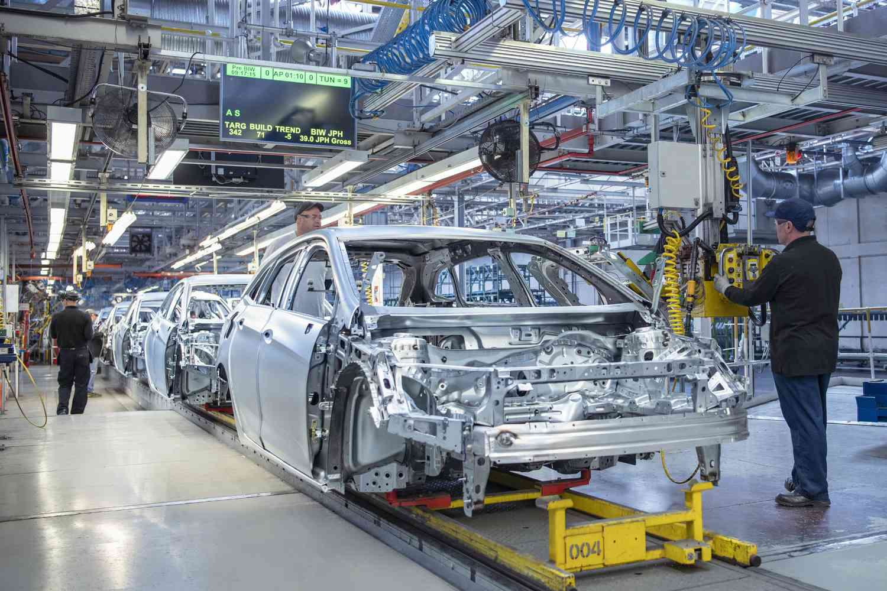

## Table of Contents

## What are some of the largest automotive companies in the world?

Some of the largest automotive companies in the world are Toyota, Volkswagen, and Ford. Toyota, based in Japan, is known for making reliable cars and trucks. They sell a lot of vehicles all over the world. Volkswagen, from Germany, makes many different types of cars and is very popular in Europe and other places. Ford, an American company, has been around for a long time and is famous for its trucks and cars.

Another big company is Hyundai, which comes from South Korea. Hyundai has grown a lot in recent years and now sells many cars in different countries. Honda, also from Japan, is another major player. They are well-known for their cars and motorcycles. These companies are all very big and compete with each other to sell the most vehicles around the world.

In addition to these, General Motors (GM) from the United States is one of the largest. GM owns several brands like Chevrolet and Cadillac. They make a wide range of vehicles from cars to big trucks. These companies are important because they help move people and goods around the world, and they create many jobs.

## How do these companies rank in terms of global market share?

Toyota usually has the biggest share of the global car market. They sell a lot of cars all over the world, more than most other companies. Volkswagen is close behind Toyota. They sell many cars in Europe and other places, but not quite as many as Toyota. Ford is also big but doesn't sell as many cars as Toyota or Volkswagen. Ford is more popular in the United States and some other countries.

Hyundai and Honda are next in line. Hyundai has been growing fast and sells a lot of cars, especially in Asia and other parts of the world. Honda also sells a lot of cars and is well-known for their reliable vehicles. General Motors (GM) is another big player. They sell a lot of cars under different brand names like Chevrolet and Cadillac. GM is very popular in the United States and some other countries.

These rankings can change from year to year because the car market is always changing. But these companies are usually at the top because they sell a lot of cars and have a big presence all over the world.

## What types of vehicles do these major companies produce?

Toyota makes many different kinds of vehicles. They have small cars like the Corolla, big SUVs like the Highlander, and trucks like the Tacoma. They also make hybrid cars, like the Prius, which use both gas and electricity. Toyota is known for making reliable cars that last a long time. Volkswagen makes cars, SUVs, and trucks too. They have popular models like the Golf, Tiguan, and Atlas. They also make electric cars, like the ID.4, and they have luxury cars under the Audi brand. Ford is famous for their trucks, like the F-150, but they also make cars like the Mustang and SUVs like the Explorer. Ford has started making electric vehicles too, like the Mustang Mach-E.

Hyundai makes cars, SUVs, and trucks. They have models like the Elantra, Tucson, and Santa Fe. Hyundai also makes electric cars, like the Ioniq 5. Honda makes cars like the Civic and Accord, SUVs like the CR-V, and they are well-known for their motorcycles. Honda also makes hybrid cars, like the Insight. General Motors (GM) makes many different vehicles under different brand names. Chevrolet makes cars like the Malibu, SUVs like the Tahoe, and trucks like the Silverado. Cadillac makes luxury cars and SUVs. GM also makes electric cars, like the Chevrolet Bolt.

These companies make a wide range of vehicles to meet different needs. Some focus on cars, others on trucks, and many are now making electric and hybrid vehicles to be more environmentally friendly.

## What is the history of these major automotive companies?

Toyota was started in Japan in 1937 by Kiichiro Toyoda. At first, they made cars for the Japanese market. Over time, Toyota grew and started selling cars all over the world. They became famous for making reliable cars that last a long time. Toyota also started making hybrid cars, like the Prius, to help the environment. Today, Toyota is one of the biggest car companies in the world and sells many different kinds of vehicles. Volkswagen was founded in Germany in 1937 by the German government. They wanted to make a car that regular people could afford. The first car they made was the Beetle, which became very popular. Over the years, Volkswagen grew and started making many different kinds of cars, SUVs, and trucks. They also bought other car companies, like Audi, to sell luxury cars. Volkswagen is now one of the biggest car companies in the world and sells cars all over the globe.

Ford was started in the United States in 1903 by Henry Ford. Henry Ford wanted to make cars that regular people could afford. He came up with the idea of the assembly line, which made it faster and cheaper to build cars. The Model T was Ford's first big success. Over time, Ford grew and started making many different kinds of vehicles, including trucks and SUVs. Ford is still a big car company today and is famous for its trucks like the F-150. Hyundai was founded in South Korea in 1967. At first, they made cars for the Korean market. Over time, Hyundai grew and started selling cars all over the world. They became known for making good cars at a lower price. Hyundai also started making electric cars to help the environment. Today, Hyundai is a big car company and sells many different kinds of vehicles.

Honda was started in Japan in 1948 by Soichiro Honda. At first, Honda made motorcycles. They became very successful and then started making cars in the 1960s. Honda became known for making reliable cars and motorcycles. They also started making hybrid cars, like the Insight, to help the environment. Today, Honda is a big car and motorcycle company and sells vehicles all over the world. General Motors (GM) was started in the United States in 1908 by William C. Durant. GM grew quickly by buying other car companies, like Chevrolet and Cadillac. Over the years, GM made many different kinds of vehicles, from cars to big trucks. They faced some tough times but are still a big car company today. GM is now making electric cars, like the Chevrolet Bolt, to help the environment.

## How have these companies evolved their business models over time?

Over the years, these big car companies have changed their business models a lot to keep up with the times. Toyota started out making cars just for Japan but grew to sell cars all over the world. They became famous for making reliable cars and then started making hybrid cars like the Prius to help the environment. Volkswagen began by making the Beetle, a car for regular people, but they grew to make many different kinds of cars and bought other companies like Audi to sell luxury cars. Ford started with the Model T and the idea of the assembly line to make cars cheaper, but now they make many different kinds of vehicles, including electric cars like the Mustang Mach-E. Hyundai began making cars just for Korea but now sells cars all over the world and makes electric cars to help the environment.

Honda started with motorcycles and then moved into cars, becoming known for reliable vehicles. They also started making hybrid cars like the Insight. General Motors (GM) grew by buying other car companies and making many different kinds of vehicles. They faced tough times but now make electric cars like the Chevrolet Bolt to help the environment. All these companies have changed their business models by expanding into new markets, making different kinds of vehicles, and focusing on being more environmentally friendly. They keep changing to meet what people want and to stay competitive in the car market.

## What are the current trends affecting the automotive industry and how are these companies responding?

The automotive industry is seeing big changes right now. One big trend is the move to electric cars. More and more people want cars that don't use gas and are better for the environment. Another trend is the use of technology in cars, like self-driving features and cars that can connect to the internet. Car companies are also trying to make cars that are safer and more comfortable for people to drive. These trends are making car companies change how they make and sell cars.

Toyota, Volkswagen, Ford, Hyundai, Honda, and General Motors are all responding to these trends in different ways. Toyota and Honda are known for their hybrid cars but are also making more electric cars now. Volkswagen has a big plan to make many electric cars in the future, like the ID.4. Ford is making electric cars like the Mustang Mach-E and is also working on self-driving technology. Hyundai is making electric cars like the Ioniq 5 and is trying to use more technology in their cars. General Motors is making electric cars like the Chevrolet Bolt and is also working on self-driving cars. All these companies are trying to keep up with what people want and stay competitive in the changing car market.

## How do these companies approach innovation and technology in their vehicles?

These big car companies are always trying to come up with new ideas and use new technology in their cars. They want to make cars that are better for the environment, so they are making more electric and hybrid cars. Toyota and Honda started with hybrid cars like the Prius and Insight, but now they are also making electric cars. Volkswagen has a big plan to make lots of electric cars in the future, like the ID.4. Ford is making electric cars like the Mustang Mach-E, and they are also working on self-driving technology. Hyundai is making electric cars like the Ioniq 5 and is trying to use more technology in their cars. General Motors is making electric cars like the Chevrolet Bolt and is also working on self-driving cars.

These companies are also using technology to make cars safer and more comfortable. They are adding things like self-driving features and ways for cars to connect to the internet. This helps people drive more easily and stay safe on the road. All these companies are trying to keep up with what people want and stay competitive in the changing car market. They are always looking for new ways to make their cars better and more useful for people.

## What are the sustainability initiatives of these major automotive companies?

These big car companies are working hard to be more friendly to the environment. They are making more electric cars that don't use gas and don't make pollution. Toyota and Honda started with hybrid cars, which use both gas and electricity, but now they are making more electric cars too. Volkswagen has a big plan to make lots of electric cars in the future, like the ID.4. Ford is making electric cars like the Mustang Mach-E. Hyundai is making electric cars like the Ioniq 5. General Motors is making electric cars like the Chevrolet Bolt. All these companies want to help the environment by making cars that don't use gas.

These companies are also trying to use less energy and make less waste when they build cars. They are using more recycled materials and trying to make their factories use less energy. Toyota is working on using more renewable energy in their factories. Volkswagen is trying to make their factories more efficient and use less energy. Ford is working on using more sustainable materials in their cars. Hyundai is trying to reduce waste and use more renewable energy. General Motors is working on using more recycled materials and making their factories more efficient. All these companies are trying to be more sustainable and help the environment in different ways.

## How do these companies manage their global supply chains?

These big car companies have to manage their supply chains all over the world. They need to get parts from different countries and then put them together to make cars. Toyota, for example, has a system called "just-in-time" where they get parts right when they need them, so they don't have to store a lot of parts. This helps them save money and be more efficient. Volkswagen and Ford also use similar systems to manage their supply chains. They work with many suppliers in different countries to get the parts they need.

Sometimes, there can be problems with the supply chain, like when there are not enough parts or when there are delays. These companies have to plan carefully and work closely with their suppliers to make sure they always have the parts they need. Hyundai, Honda, and General Motors also manage their global supply chains by working with suppliers in different countries. They use technology to keep track of their parts and make sure everything is on time. All these companies are always trying to improve their supply chains to make their cars faster and cheaper.

## What are the financial performances of these companies in recent years?

In recent years, Toyota has been doing well financially. They make a lot of money from selling cars all over the world. Toyota's profits have been strong because they sell a lot of reliable cars and have been successful with their hybrid and electric vehicles. Volkswagen has also been doing well. They sell a lot of cars in Europe and other places, and their profits have been good. Volkswagen has been investing a lot in electric cars, which is helping them grow. Ford has had ups and downs. They make a lot of money from selling trucks in the United States, but they have faced some challenges. Ford is working on making more electric cars, which they hope will help them make more money in the future.

Hyundai has been growing fast and making more money in recent years. They sell a lot of cars in Asia and other parts of the world, and their profits have been increasing. Hyundai is also doing well with their electric cars. Honda has been doing okay financially. They make money from selling cars and motorcycles, but their profits have not been as high as some other companies. Honda is also working on electric cars to try to make more money. General Motors (GM) has had some good years and some tough years. They make a lot of money from selling cars and trucks in the United States, but they have faced some challenges. GM is working on electric cars and self-driving technology, which they hope will help them make more money in the future.

## What are the major challenges these companies face in different markets around the world?

These big car companies face different challenges in different parts of the world. In places like the United States and Europe, they have to deal with tough competition from other car companies. They also have to follow strict rules about making cars that are good for the environment. This means they need to make more electric cars, which can be expensive. In Asia, especially in China, the market is growing fast, but it's also very competitive. Car companies have to work hard to sell their cars there and keep up with local companies that are also making good cars.

Another challenge is dealing with changes in what people want. More and more people want electric cars and cars with new technology, like self-driving features. This means car companies have to spend a lot of money on research and development to make these new kinds of cars. They also have to deal with problems in their supply chains, like not having enough parts or delays in getting parts. This can slow down how fast they can make cars and sell them. All these challenges make it hard for these companies to keep making money and growing in different markets around the world.

## How do these companies strategize for future growth and expansion?

These big car companies are always thinking about how to grow and expand in the future. They are making more electric cars because more people want them and they are good for the environment. Toyota, Volkswagen, Ford, Hyundai, Honda, and General Motors are all working on new electric car models to sell all over the world. They are also trying to use more technology in their cars, like self-driving features and ways for cars to connect to the internet. This helps them make cars that people want to buy and keeps them competitive in the market.

Another way these companies are planning for the future is by expanding into new markets. They are trying to sell more cars in places like Asia, especially China, where the market is growing fast. They also want to sell more cars in Europe and other parts of the world. To do this, they are building new factories and working with local companies to make and sell their cars. All these companies are always looking for new ways to make their cars better and sell more of them, so they can keep growing and making money in the future.

## What are the market dynamics of the Big Three Automakers?

General Motors (GM), Ford, and Stellantis, collectively known as the Big Three, hold a significant position in the automotive market. These companies have historically dominated North American automotive sales and production, and their influence extends globally. Each is actively engaging in the transition toward electric mobility and autonomous vehicle technologies, which are reshaping market dynamics.

### Adaptations to Electric Mobility

The shift towards electric vehicles (EVs) is a critical focal point for the Big Three. GM, for instance, has committed to an all-electric future, announcing plans to phase out gasoline and diesel-powered vehicles by 2035. The company's Ultium battery technology is central to this strategy, aiming to lower costs and extend driving ranges. Ford, similarly, is aggressively investing in EV development, epitomized by its electric versions of popular models like the Ford Mustang Mach-E and the Ford F-150 Lightning. Stellantis, formed from the merger of Fiat Chrysler Automobiles and PSA Group, is also pushing into the EV market with a €30 billion investment in electrification and plans to offer electrified versions of nearly all its models by 2025.

### Autonomous Technologies

Beyond electrification, the Big Three are advancing autonomous vehicle technologies. GM's subsidiary, Cruise, is at the forefront of autonomous taxis, already testing their services in major cities. Ford has formed a partnership with Argo AI to develop self-driving technologies for commercialization, particularly in ride-hailing and goods delivery. Stellantis is not lagging, with collaborations aimed at deploying autonomous vehicle systems in passenger cars and commercial vehicles.

### Market Capitalization as a Strategic Indicator

The strategic efforts in electric and autonomous technologies significantly impact the market capitalization of these companies. Market capitalization, a function of the company's stock price and outstanding shares, reflects investor confidence and perceived future growth potential. The formula is given by:

$$
\text{Market Capitalization} = \text{Share Price} \times \text{Number of Outstanding Shares}
$$

This metric serves as a barometer for the competitive positioning of the Big Three. For instance, periods of increased market cap often coincide with major announcements regarding new technology initiatives, signaling investor optimism about long-term growth prospects.

### Comparative Analysis with Global Competitors

The market cap of the Big Three is frequently compared against international powerhouses like Toyota and Volkswagen. Toyota, a pioneer in hybrid technology and a growing force in EVs, often surpasses GM, Ford, and Stellantis in market valuation, reflective of its robust global market share and technological advancements. Volkswagen, with its ambitious "ID" range of electric vehicles, similarly competes intensely with the Big Three, striving to capture a significant portion of the EV market.

In summary, the Big Three automakers are pivotal players in the automotive industry, strategically positioning themselves through substantial investments in electric mobility and autonomous technologies. Their market cap dynamics provide insights into their competitive edges and anticipate future shifts in the global automotive landscape.

## What is Market Capitalization and Why is it Significant?

Market capitalization, often referred to as market cap, is a pivotal metric for assessing the relative size and financial health of a company within the automotive sector. It is determined by multiplying a company’s outstanding shares by its current share price:

$$
\text{Market Cap} = \text{Share Price} \times \text{Number of Outstanding Shares}
$$

This financial measure provides a snapshot of a company's market value and plays an integral role in evaluating investment potential, risk, and company size. In the context of automakers, shifts in market cap reflect not only financial performance but also investor sentiment about future growth prospects and industry trends.

For automotive companies, particularly those navigating the transition to electric vehicles (EVs), market cap trends offer valuable insights into how they are perceived by investors. As consumer preferences shift toward sustainable and environmentally friendly transportation, manufacturers that are at the forefront of this transition are often rewarded with increased market valuations. This is indicative of investor confidence in their ability to capitalize on emerging market opportunities and technological advancements.

Furthermore, market cap fluctuations can signal how automakers are handling industry challenges, such as supply chain disruptions or changing regulatory environments. A rising market cap might indicate successful adaptation and innovation, while a decline could suggest challenges or shifts in competitive positioning.

To effectively gauge the strategic positioning and potential of companies within the automotive industry, stakeholders must routinely monitor market cap trends. This requires understanding broader industry dynamics, including technological advancements and market demand shifts, and how these factors influence stock performance. Investors and analysts often use market cap as a benchmark to compare companies across the industry, facilitating strategic investment decisions.

In summary, market capitalization is not merely a static value; it is a dynamic indicator of an automaker's market standing and potential trajectory. As the automotive industry continues to evolve, particularly with the shift toward electric vehicles, monitoring and analyzing market cap trends will be critical for stakeholders aiming to navigate the competitive landscape successfully.

## References & Further Reading

[1]: ["The Machine That Changed the World: The Story of Lean Production"](https://books.google.com/books/about/The_Machine_That_Changed_the_World.html?id=9NHmNCmDUUoC) by James P. Womack, Daniel T. Jones, and Daniel Roos

[2]: ["Advances in Financial Machine Learning"](https://www.amazon.com/Advances-Financial-Machine-Learning-Marcos/dp/1119482089) by Marcos Lopez de Prado

[3]: Tesla, Inc. (2020). ["Tesla Annual Report 2019"](https://www.sec.gov/Archives/edgar/data/1318605/000156459021004599/tsla-10k_20201231.htm)

[4]: ["Quantitative Trading: How to Build Your Own Algorithmic Trading Business"](https://www.amazon.com/Quantitative-Trading-Build-Algorithmic-Business/dp/1119800064) by Ernest P. Chan

[5]: ["The Second Automobile Revolution: Trajectories of the World Carmakers in the 21st Century"](https://link.springer.com/book/10.1057/9780230236912) by Michel Freyssenet