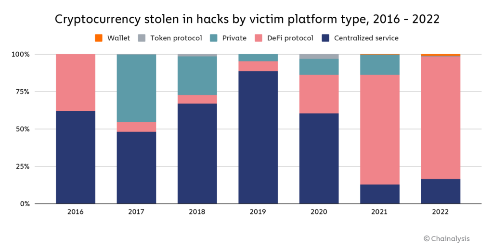

## Table of Contents

## What is a cryptocurrency hack?

A cryptocurrency hack is when someone steals digital money, like Bitcoin or Ethereum, from people or companies. Hackers use different tricks to break into computer systems where the digital money is kept. They might use fake emails to trick people into giving away their passwords or find weaknesses in the computer programs that store the money.

These hacks can cause big problems. People can lose all their savings, and companies might have to close down if they lose a lot of money. It's important for people who use cryptocurrencies to be careful and use strong security to protect their digital money. Banks and other places that keep digital money need to be very careful too, to stop hackers from stealing it.

## Why are cryptocurrencies vulnerable to hacks?

Cryptocurrencies are vulnerable to hacks because they are mostly stored online in digital wallets. These wallets can be connected to the internet, which makes them easier for hackers to reach. Unlike regular money in a bank, cryptocurrencies don't have a big company or government watching over them all the time. This means that if someone hacks into a wallet, it can be harder to get the money back.

Also, the technology behind cryptocurrencies, like blockchain, is very new and still being figured out. Sometimes, there are mistakes or weak spots in the computer programs that run cryptocurrencies. Hackers can find these weak spots and use them to steal money. Because cryptocurrencies are digital and can be sent anywhere in the world quickly, once the money is stolen, it can be very hard to find and get back.

## What was the first major cryptocurrency hack?

The first major [cryptocurrency](/wiki/cryptocurrency) hack happened in 2011. It was called the "Mt. Gox hack." Mt. Gox was a big website where people could buy and sell Bitcoin. Hackers found a way to steal Bitcoins from people's accounts on the website. They stole around 850,000 Bitcoins, which was a lot of money back then.

This hack was a big shock to everyone who used cryptocurrencies. It showed that even though Bitcoin was new and exciting, it could also be very risky. After the hack, many people lost trust in Mt. Gox and other similar websites. It made people realize that they needed to be more careful with their digital money and that the security of these websites needed to be much better.

## Can you list some of the biggest cryptocurrency hacks in history?

One of the biggest cryptocurrency hacks happened in 2014, again to Mt. Gox. This time, hackers stole about 850,000 Bitcoins, which was worth around $450 million at the time. It was a huge loss and caused Mt. Gox to go bankrupt. Another big hack was the Bitfinex hack in 2016. Hackers stole around 120,000 Bitcoins, which was worth about $72 million. Bitfinex had to stop working for a while to fix the problem, and many people lost their money.

In 2018, there was the Coincheck hack in Japan. Hackers stole about $534 million worth of a cryptocurrency called NEM. It was one of the biggest hacks ever and made a lot of people worried about the safety of their digital money. Another big hack happened in 2022, called the Ronin Network hack. Hackers stole around $625 million worth of Ethereum and other cryptocurrencies. This hack showed that even newer and supposedly safer systems could still be at risk.

These hacks show that even though cryptocurrencies are exciting and can be a good way to make money, they can also be very risky. People need to be careful and use strong security to protect their digital money. Companies that handle cryptocurrencies need to do a good job of keeping the money safe too.

## What are the common methods used in cryptocurrency hacks?

One common way hackers steal cryptocurrencies is by using phishing attacks. This is when they send fake emails or messages that look like they come from a real company or website. They trick people into clicking on a link or giving away their passwords. Once the hackers have the passwords, they can get into the person's digital wallet and steal their money. Another method is called a 51% attack. This happens when a group of hackers control more than half of the computer power in a cryptocurrency's network. They can then change the records and steal money or stop other people from using the cryptocurrency.

Hackers also look for weak spots in the computer programs that run cryptocurrencies. If they find a mistake or a hole in the program, they can use it to break into the system and steal money. This is called exploiting vulnerabilities. Sometimes, hackers use malware, which is a type of bad software that can get onto a person's computer without them knowing. The malware can then steal information or money from the person's digital wallet. These methods show that hackers use many different tricks to steal cryptocurrencies, and it's important for people to be careful and use strong security to protect their digital money.

## How do hackers typically gain access to cryptocurrency wallets?

Hackers often gain access to cryptocurrency wallets through phishing attacks. They send fake emails or messages that look like they come from a real company or website. These messages trick people into clicking on a link or entering their passwords on a fake website. Once the hackers get the passwords, they can log into the person's digital wallet and steal the money. It's like someone pretending to be your friend to trick you into giving them your house keys.

Another way hackers get into wallets is by finding weak spots in the computer programs that run cryptocurrencies. They look for mistakes or holes in the software that they can use to break in. This is called exploiting vulnerabilities. Sometimes, hackers use malware, which is bad software that can sneak onto your computer. Once the malware is on your computer, it can steal information or money from your wallet without you knowing. It's like a thief finding a secret way into your house to take your things.

## What are the consequences of a cryptocurrency hack for investors?

When a cryptocurrency hack happens, investors can lose a lot of money. If hackers steal from their digital wallets, all the money they saved up can be gone in a moment. This can be really upsetting and can make it hard for them to trust cryptocurrencies again. They might even lose money they were planning to use for important things like buying a house or paying for school.

Hacks can also make the value of cryptocurrencies go down. When people hear about a big hack, they might get scared and start selling their cryptocurrencies, which can make the price drop. This means that even people who didn't get hacked directly can still lose money because their cryptocurrencies are worth less. It's important for investors to be careful and use strong security to try and keep their digital money safe.

## What security measures can individuals take to protect their cryptocurrencies?

To keep their cryptocurrencies safe, people should use strong, unique passwords for their digital wallets. They should never use the same password for different accounts. It's also a good idea to use two-[factor](/wiki/factor-investing) authentication, which means you need to enter a special code sent to your phone or email to log in. This makes it much harder for hackers to get into your wallet, even if they know your password. People should also be careful about clicking on links in emails or messages, especially if they ask for personal information or passwords. These could be phishing attacks trying to trick you.

Another important thing is to keep most of your cryptocurrencies in a cold wallet, which is not connected to the internet. This makes it much harder for hackers to steal your money. Only keep the cryptocurrencies you need to use often in a hot wallet that's connected to the internet. It's also a good idea to regularly update the software for your wallets and other programs you use with cryptocurrencies. Updates can fix security holes that hackers might try to use. By taking these steps, people can better protect their digital money from being stolen.

## How have cryptocurrency exchanges responded to hacks?

After big hacks, cryptocurrency exchanges have tried to make things safer. They have started using better security systems to keep hackers out. Many exchanges now use two-factor authentication, which makes it harder for hackers to get into people's accounts. They also check their computer programs more often to find and fix any weak spots that hackers could use. Some exchanges have even started keeping most of the money in cold wallets, which are not connected to the internet and are much safer.

Exchanges have also started working with the police and other groups to catch hackers and get stolen money back. They share information about new tricks hackers are using so everyone can be more careful. Some exchanges have also set up special funds to help people who lose money in hacks. This shows that they are trying to make things right and keep people's trust. By doing these things, exchanges hope to stop hacks from happening and make people feel safer about using cryptocurrencies.

## What role does blockchain technology play in preventing or detecting hacks?

Blockchain technology helps prevent and detect hacks by keeping a record of every transaction in a way that is very hard to change. It works like a big, public notebook where everyone can see what's happening. Each page in the notebook, called a block, is linked to the next one, making a chain. If someone tries to change something in one block, it would mess up the whole chain, and everyone would notice. This makes it tough for hackers to steal money without being caught.

Even though blockchain can help, it's not perfect. Sometimes, hackers find ways to trick the system, like taking over more than half of the computers working on the blockchain, which is called a 51% attack. They can then change transactions and steal money. But because blockchain is open and everyone can see what's happening, it's easier to spot these tricks and stop them. So, while blockchain isn't foolproof, it's a big help in keeping cryptocurrencies safer.

## What are the legal implications of cryptocurrency hacks?

When someone hacks a cryptocurrency, it can be against the law. In many places, stealing digital money is treated the same as stealing regular money. Hackers can be charged with crimes like theft, fraud, or breaking into computer systems. The police and other groups try to catch these hackers and bring them to court. But because cryptocurrencies can be sent anywhere in the world quickly, it can be hard to find the hackers and get the money back.

Laws about cryptocurrencies are still new and can be different in different places. Some countries have special rules about digital money, while others are still figuring out what to do. If you lose money in a hack, you might be able to get help from the police or even from the exchange where you kept your money. But it's not always easy because the laws are still changing and not everyone agrees on how to handle these cases. It's important for people to know the rules in their own country and to be careful with their digital money.

## What are the future trends in cryptocurrency security to prevent hacks?

In the future, people are working on making cryptocurrencies safer. One big idea is to use smarter ways to keep money safe, like using [artificial intelligence](/wiki/ai-artificial-intelligence) to spot hackers before they can steal anything. Another idea is to make the computer programs that run cryptocurrencies even stronger, so there are fewer weak spots for hackers to find. People are also thinking about new ways to keep money safe, like using special codes that change all the time, so even if a hacker gets in, they can't steal anything.

Another trend is working together more. Companies that handle cryptocurrencies are starting to share information about new tricks hackers are using. This way, everyone can be ready and stop hacks before they happen. Governments and police are also getting better at catching hackers and getting stolen money back. By working together and using new technology, people hope to make cryptocurrencies a lot safer in the future.

## References & Further Reading

[1]: Antonopoulos, A. M. (2017). ["Mastering Bitcoin: Unlocking Digital Cryptocurrencies"](https://books.google.com/books/about/Mastering_Bitcoin.html?id=IXmrBQAAQBAJ). O'Reilly Media, Inc.

[2]: Böhme, R., Christin, N., Edelman, B., & Moore, T. (2015). ["Bitcoin: Economics, Technology, and Governance"](https://www.aeaweb.org/articles?id=10.1257/jep.29.2.213). Journal of Economic Perspectives, 29(2), 213-238.

[3]: Narayanan, A., Bonneau, J., Felten, E., Miller, A., & Goldfeder, S. (2016). ["Bitcoin and Cryptocurrency Technologies: A Comprehensive Introduction"](https://press.princeton.edu/books/hardcover/9780691171692/bitcoin-and-cryptocurrency-technologies). Princeton University Press.

[4]: Biais, B., Bisiere, C., Bouvard, M., & Casamatta, C. (2019). ["The Blockchain Folk Theorem."](https://academic.oup.com/rfs/article/32/5/1662/5427771) The Review of Economic Studies, 86(2), 588-626.

[5]: Lopez de Prado, M. (2018). ["Advances in Financial Machine Learning"](https://www.amazon.com/Advances-Financial-Machine-Learning-Marcos/dp/1119482089). Wiley. 

[6]: Cont, R. (2001). ["Empirical properties of asset returns: stylized facts and statistical issues"](http://rama.cont.perso.math.cnrs.fr/pdf/empirical.pdf). Quantitative Finance, 1(2), 223-236. 

[7]: Chen, Ying-Ying, & Bellavitis, C. (2020). ["Decentralized finance: Blockchain technology and the quest for an open financial system"](https://papers.ssrn.com/sol3/papers.cfm?abstract_id=3418557). Research in International Business and Finance, 53.