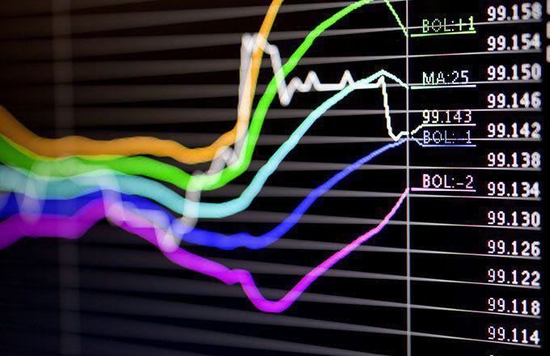

Currency exchange rates significantly influence a nation's economic health by determining the value of one currency in terms of another. These rates affect trade balances, inflation, and economic growth by impacting the price of imports and exports. Exchange rates are generally divided into two categories: free-floating and fixed or pegged. Free-floating exchange rates fluctuate based on market dynamics, such as supply and demand, and are often subject to currency speculation. In contrast, fixed or pegged exchange rates are maintained at a specified value relative to another currency, often to ensure economic stability.

A prevalent practice is pegging a nation's currency to the U.S. dollar, a dominant force in international finance. This means the value of the currency is tied directly to the dollar, with the intent of mitigating exchange rate volatility. The choice of the U.S. dollar as a peg is due to its role as the world's primary reserve currency, widely used in global trade and finance.



This article delves into the intricate dynamics of currency pegging, focusing on currencies pegged to the U.S. dollar, and examines how these pegs are relevant in the context of algorithmic (algo) trading. Algo trading involves utilizing computer algorithms to manage trading decisions in the forex markets, benefiting from stable exchange rate environments provided by currency pegs. Understanding the relationship between currency pegging and algo trading strategies offers valuable insights for economic stability and forex trading efficiency.

## Table of Contents

## Understanding Currency Pegging

Currency pegging is a financial mechanism that involves anchoring a nation's currency to the value of a more stable and influential currency, predominantly the U.S. dollar. This alignment is designed to provide economic stability by curtailing fluctuations in exchange rates. By maintaining a fixed exchange rate with the pegged currency, countries can insulate themselves from unpredictable forex market volatility, which is especially advantageous for nations heavily reliant on international trade.

The U.S. dollar is frequently chosen as the anchor currency due to its status as the world's primary reserve currency. Its widespread acceptance in global trade, combined with its relative stability, makes it an attractive option for currency pegging. When a country's currency is pegged to the U.S. dollar, it experiences diminished exposure to the uncertainties of currency movements, which can enhance trade predictability and economic planning.

For trade-dependent countries, reducing exchange rate volatility is essential. These nations often engage extensively in exports and imports where price stability is a priority; currency variability can effect pricing structures, profit margins, and the overall competitiveness of domestic industries on the world stage. By pegging their currency to the U.S. dollar, these countries aim to create a more predictable economic environment conducive to sustained trade relationships and economic growth.

Moreover, currency pegging may also require the central bank of the pegging nation to hold substantial reserves of the anchor currency. This allows the central bank to actively manage its currency value by buying or selling its own currency in foreign exchange markets to maintain the peg at a constant level. This maintenance of reserves further underpins the credibility and sustainability of the peg, ensuring the domestic economy remains shielded from excessive exchange rate fluctuations. 

This system of pegging serves as a foundation for economic stability in many regions, particularly where domestic economic structures are tightly integrated with global markets.

## Why Peg to the U.S. Dollar?

The U.S. dollar serves as the world's foremost reserve currency, a role entrenched in its widespread use for international trade and finance. This unique position imparts a combination of stability and [liquidity](/wiki/liquidity-risk-premium), making it an attractive option for countries considering a currency peg. By anchoring their currencies to the U.S. dollar, nations can mitigate currency risk, a critical [factor](/wiki/factor-investing) in fostering a stable economic environment conducive to trade and investment.

Currency risk arises from the potential [volatility](/wiki/volatility-trading-strategies) in exchange rates, which can unpredictably alter the value of cross-border transactions. Pegging to a stable currency like the U.S. dollar reduces this risk, creating more predictable and stable conditions for international trade and economic planning. This predictability attracts foreign investment, as investors encounter reduced exchange rate-related uncertainties in dollar-pegged economies.

Moreover, many countries engage in pegging to maintain economic competitiveness and stability. The U.S. dollar’s strength enhances the credibility of the pegging country’s monetary policy, which can be especially valuable for emerging markets struggling with inflation or unstable macroeconomic conditions. A stable currency environment facilitates smoother operations in trade-dependent economies by aligning domestic price levels with global standards, thus improving global trade relations.

In essence, pegging to the U.S. dollar provides a financial anchor that enhances trade opportunities and economic stability. Such financial infrastructure supports economic growth by appealing to international businesses and investors seeking stable and predictable exchange rates, thereby cementing the U.S. dollar’s position as an instrumental element in global economic strategy.

## Major Currencies Pegged to the U.S. Dollar

Several countries around the world choose to peg their currencies to the U.S. dollar, seeking to leverage the stability and international acceptance of the dollar. Notable examples include Saudi Arabia, Hong Kong, and Belize, each with unique economic contexts and motivations for maintaining a dollar peg.

Saudi Arabia pegs its currency, the Saudi Riyal, to the U.S. dollar at a fixed rate of approximately 3.75 Riyals to one dollar. This peg supports Saudi Arabia's oil-driven economy, with oil exports primarily denominated in U.S. dollars. By maintaining this fixed exchange rate, Saudi Arabia can ensure predictable revenue from oil sales and protect itself from exchange rate risks, given its heavy reliance on oil exports for economic stability.

Hong Kong also pegs its currency, the Hong Kong Dollar (HKD), to the U.S. dollar with a narrow band between 7.75 and 7.85 HKD per USD under a currency board system. This peg has been in place since 1983 and contributes to Hong Kong's role as a major global financial hub. The stability fostered by the peg aids Hong Kong's trade and financial transactions, providing confidence to investors and trading partners.

Belize pegs its currency, the Belize Dollar, to the U.S. dollar at a rate of 2 Belize Dollars to one U.S. dollar. The tourism industry, a significant contributor to Belize's economy, benefits from this stability, as fluctuations could deter U.S. tourists, who make up a large proportion of visitors. This peg helps ensure that tourism revenues remain consistent and predictable.

Several other countries also employ pegs to the U.S. dollar, including the United Arab Emirates, Qatar, and Oman, each utilizing the peg to stabilize their economies by mitigating exchange rate volatility, which is crucial for nations dependent on trade or specific industries like tourism or oil exports.

The decision to peg a currency to the U.S. dollar entails significant economic considerations. These countries rely on the predictable costs and price stability afforded by the peg, enabling them to manage their international trade relationships and attract investments more efficiently. In total, the stability of the U.S. dollar remains a key asset for nations choosing this monetary strategy.

## Fixed vs. Floating Currencies

In the global financial landscape, currency systems are primarily categorized into two types: fixed (or pegged) and floating. These systems dictate how a nation's currency value is determined in the foreign exchange market.

**Floating Currencies**

Floating currencies are governed by market forces, where their values fluctuate according to supply and demand in the [forex](/wiki/forex-system) markets. Essentially, the exchange rate for floating currencies is determined by the market without direct intervention from the country's central bank or government. Factors influencing these fluctuations include interest rates, inflation, political stability, and economic performance. The U.S. dollar (USD), the Euro (EUR), and the Japanese Yen (JPY) are prime examples of floating currencies.

One of the advantages of floating currencies is their ability to reflect the true economic strength of a nation. As a currency appreciates or depreciates based on market perceptions of economic conditions, it adjusts naturally to external shocks and changes in the economic landscape, providing a self-correcting mechanism. On the downside, this can lead to higher volatility and unpredictability, which can pose challenges for businesses engaged in international trade.

**Fixed Currencies**

In contrast, fixed or pegged currencies are those whose values are tied to a major currency, such as the U.S. dollar or the Euro. This system requires the country's central bank to maintain the currency's value within a narrow band relative to the pegged currency. The Hong Kong dollar (HKD) pegged to the U.S. dollar is an illustrative example of a fixed exchange rate system.

The primary advantage of fixed currencies is stability. By pegging to a strong and stable currency, nations can reduce exchange rate volatility, making international trade and investment more predictable and less risky. However, maintaining a fixed rate requires substantial foreign reserves to defend the peg. Furthermore, because these currencies do not fluctuate naturally with market conditions, countries with peg systems may face economic issues if their economic fundamentals diverge significantly from the currency they are pegged to.

**Comparison**

The choice between a fixed and floating currency system entails weighing the benefits of stability against the flexibility to respond to economic changes. Floating currencies can provide insights into a country's economic health and offer the flexibility to adjust to economic dynamics. Meanwhile, fixed currencies can shield an economy from market volatility but at the cost of potentially massive reserves and economic adaptability.

In summary, both systems have inherent strengths and drawbacks that can significantly affect a country's economic strategy and financial stability. The decision to adopt a fixed or floating currency regime depends on a nation's economic priorities, resource availability, and desired level of participation in the global economy.

## The Role of Algo Trading in Forex Markets

Algorithmic trading, frequently referred to as algo trading, represents the use of computerized systems to execute trades in the forex markets. It encompasses strategies that leverage complex algorithms to capitalize on market opportunities by analyzing data and executing orders more efficiently and accurately than can be achieved manually. 

Fixed exchange rates provide a substantial advantage for algo trading. By pegging a currency to the U.S. dollar, these rates create a predictable environment which is invaluable for algorithmic strategies. Traders can program their algorithms to operate under the assumption of minimal currency rate fluctuation, allowing for precision in predicting and executing trades. This stability reduces the risk associated with forex trading, as it mitigates the potential for unexpected currency swings that can adversely affect trading positions.

For effective forex trading algorithms, understanding the mechanics and implications of currency pegs is crucial. The stability of a pegged exchange rate necessitates specific considerations in the algorithms designed for these markets. Algorithms must be tuned to account for the characteristics of the fixed rate, enabling traders to focus more on spreads, interest differentials, and market liquidity. Python, a widely used language in algo trading, facilitates such customizations with its robust libraries like NumPy for numerical analysis, and Pandas for data manipulation. 

Here’s a simple example of how a Python script can be structured to exploit a predictable exchange rate:

```python
import pandas as pd
import numpy as np

# Load forex data
data = pd.read_csv('forex_data.csv')

# Set parameters based on the fixed exchange rate
fixed_rate = 1.75  # Assume this is the peg rate
threshold = 0.05   # Trading threshold for slight fluctuations

# Function to determine buy/sell signals
def trade_signal(row):
    if row['exchange_rate'] < fixed_rate - threshold:
        return 'buy'
    elif row['exchange_rate'] > fixed_rate + threshold:
        return 'sell'
    else:
        return 'hold'

# Apply the trading signal function to the dataset
data['signal'] = data.apply(trade_signal, axis=1)

# Print trading signals
print(data[['date', 'exchange_rate', 'signal']])
```

The given example highlights the utility of algorithmic systems in recognizing and exploiting small deviations around a fixed rate. It demonstrates how mathematical precision and programmable logic execute trades with minimal human intervention, particularly in environments with stable exchange rates. As global trade continues to expand and [algorithmic trading](/wiki/algorithmic-trading) grows more sophisticated, the importance of understanding currency pegs will be an indispensable element in developing robust forex trading strategies.

## Pros and Cons of Currency Pegging

Currency pegging involves anchoring a domestic currency's value to a foreign currency, such as the U.S. dollar. This mechanism offers several advantages and disadvantages that can affect a nation's economic environment.

**Pros of Currency Pegging**:
1. **Stability**: One of the primary advantages of currency pegging is economic stability. By fixing the exchange rate to a stable currency like the U.S. dollar, countries can mitigate the uncertainty and volatility associated with fluctuating exchange rates. This is particularly beneficial for economies that rely heavily on trade, as stable exchange rates simplify international transactions and contracts.

2. **Reduced Volatility**: Pegging can substantially dampen the volatility seen in floating exchange rate systems. This reduction in volatility can enhance business confidence and plan future investments, as companies can predict costs and revenues more accurately without the unpredictability of currency fluctuations.

3. **Protection Against Forex Price Swings**: Countries that peg their currencies often shield themselves from speculative attacks and forex market fluctuations. By maintaining a fixed relation with a stable currency, nations can safeguard their economies from abrupt devaluations or appreciations that typically characterize free-floating systems.

**Cons of Currency Pegging**:
1. **Need for Substantial Reserves**: Maintaining a currency peg requires significant foreign exchange reserves. A government may need to intervene in the currency markets frequently to bolster the currency's value against the pegged rate. This entails accumulating and maintaining large amounts of foreign currency reserves, which could otherwise be used for domestic investments.

2. **Vulnerability to Economic Pressures**: Although pegged currencies enjoy stability, they are not immune to external economic pressures, such as inflation. If the anchor currency (e.g., the U.S. dollar) undergoes a period of inflation, the pegged currency can import this inflation if local economic policies do not counterbalance these forces.

3. **Loss of Monetary Autonomy**: Countries with pegged exchange rates may face limited monetary policy flexibility. The central bank often cannot adjust interest rates independently to address domestic economic conditions, as doing so might disrupt the pegged exchange rate. This lack of autonomy can be detrimental, particularly in times of economic crisis when tailored monetary interventions are necessary.

4. **Risk of Speculative Attacks**: Even with the stability offered by a peg, countries can be susceptible to speculative attacks if market participants doubt the central bank's ability to sustain the peg. Such attacks can deplete foreign reserves rapidly and challenge the country's financial stability.

In summary, while currency pegging can provide significant economic benefits, including stability and reduced volatility, it also poses challenges, requiring substantial reserves and posing risks related to economic inflexibility and exposure to external pressures. Understanding these dynamics is essential for policymakers and economists when deciding to implement or maintain a currency peg.

## Conclusion

Currency pegging to the U.S. dollar plays a critical role in global economics and trading strategies by providing a stabilizing mechanism for nations heavily involved in international trade. By anchoring their currencies to the dollar, countries can mitigate exchange rate volatility, fostering a more predictable environment for economic transactions. This stability is particularly advantageous for nations reliant on exports to the United States or those with significant tourism sectors, as it reduces currency risk and strengthens economic competitiveness.

From a trading perspective, understanding the dynamics of pegged currencies becomes an essential tool for traders and investors seeking to optimize their strategies. Currency pegs offer a relatively stable platform for algorithmic traders, allowing them to develop and implement strategies with greater precision and reduced risk. The static nature of pegged exchange rates minimizes abrupt market fluctuations, thereby providing a conducive atmosphere for algorithmic trading, which thrives on stability and predictability.

As global trade and financial markets continue to evolve, the interrelationship between currency pegs and algorithmic trading strategies is poised for further growth. Nations and traders who grasp the intricacies of currency pegging can harness its strategic advantages, aligning economic and trading objectives with broader market trends. The increasing complexity of global markets underscores the importance of currency pegging as both an economic tool and a trading strategy, suggesting that its significance will only expand in the future.

## References & Further Reading

[1]: ["Advances in Financial Machine Learning"](https://www.amazon.com/Advances-Financial-Machine-Learning-Marcos/dp/1119482089) by Marcos Lopez de Prado

[2]: ["Quantitative Trading: How to Build Your Own Algorithmic Trading Business"](https://www.amazon.com/Quantitative-Trading-Build-Algorithmic-Business/dp/1119800064) by Ernest P. Chan

[3]: Frankel, J. A. (1999). ["No Single Currency Regime is Right for All Countries or at All Times."](https://www.nber.org/papers/w7338) NBER Working Paper No. 7338.

[4]: ["The Dollar Trap: How the U.S. Dollar Tightened Its Grip on Global Finance"](https://www.jstor.org/stable/j.ctvc77646) by Eswar S. Prasad

[5]: ["Machine Learning for Algorithmic Trading"](https://github.com/PacktPublishing/Machine-Learning-for-Algorithmic-Trading-Second-Edition) by Stefan Jansen

[6]: Reinhart, C. M., & Rogoff, K. S. (2004). ["The Modern History of Exchange Rate Arrangements: A Reinterpretation."](https://www.nber.org/papers/w8963) Quarterly Journal of Economics, 119(1), 1-48.

[7]: ["The Economics of Exchange Rates"](https://www.jstor.org/stable/2728909) by Lucio Sarno and Mark P. Taylor