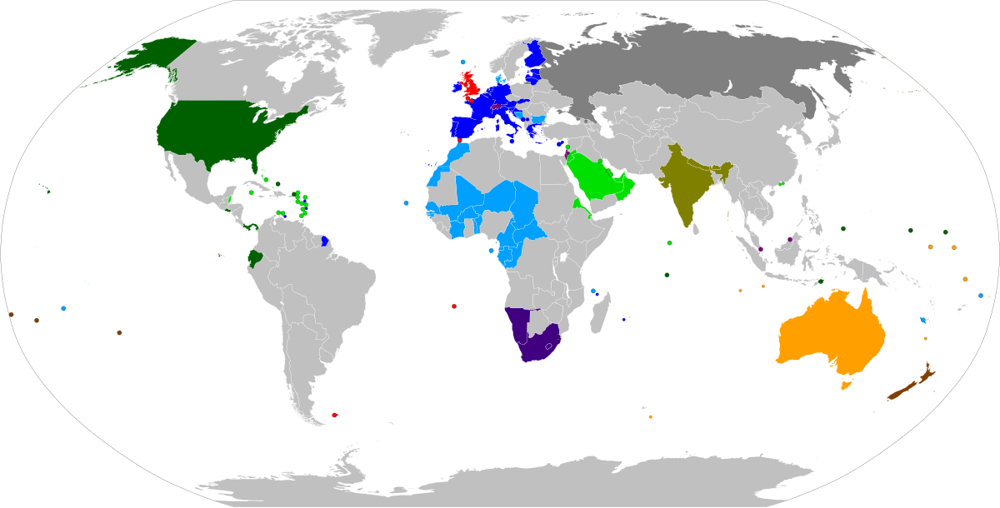

## Table of Contents

## What does it mean for a currency to be pegged to the U.S. dollar?

When a currency is pegged to the U.S. dollar, it means that the value of that currency is fixed to the value of the U.S. dollar. This is done by the country's government or central bank, which sets an exchange rate and then uses its reserves of U.S. dollars to keep the value of its own currency stable. For example, if the exchange rate is set at 1 U.S. dollar = 10 units of the other currency, the government will buy or sell its currency to make sure it stays at that rate.

Pegging a currency to the U.S. dollar can help make trade and investment easier between the two countries. It reduces the risk for businesses that need to convert money between the two currencies. However, it can also be challenging for the country with the pegged currency. If the U.S. dollar's value changes a lot, the country might have to use a lot of its U.S. dollar reserves to keep the peg in place. This can be hard to maintain over time.

## Which countries currently have their currencies pegged to the U.S. dollar?

Several countries around the world have their currencies pegged to the U.S. dollar. Some of these countries include Hong Kong, Saudi Arabia, and the United Arab Emirates. Hong Kong uses the Hong Kong dollar, which is pegged to the U.S. dollar at a rate of about 7.8 HKD to 1 USD. Saudi Arabia uses the Saudi riyal, pegged at a rate of 3.75 SAR to 1 USD. The United Arab Emirates uses the Emirati dirham, pegged at a rate of 3.67 AED to 1 USD.

These countries peg their currencies to the U.S. dollar for different reasons. For Hong Kong, it helps maintain stability and confidence in its financial system. For Saudi Arabia and the United Arab Emirates, pegging to the U.S. dollar helps stabilize their economies, which rely heavily on oil exports priced in U.S. dollars. By pegging their currencies, these countries make it easier for businesses to trade and invest, but they also have to manage their reserves carefully to keep the peg in place.

## What are the benefits of pegging a currency to the U.S. dollar for a country's economy?

Pegging a currency to the U.S. dollar can help a country's economy in several ways. One big benefit is that it makes trade easier. When a country's currency is pegged to the U.S. dollar, businesses know exactly how much their money is worth when they buy or sell things with countries that use the U.S. dollar. This can make companies feel more confident about trading and investing. It also helps keep prices stable, which can be good for the economy because people know what to expect when they buy things.

Another benefit is that pegging to the U.S. dollar can attract more foreign investment. Investors often like stability, and a currency pegged to the U.S. dollar can seem safer than one that changes a lot. This can bring more money into the country, which can help create jobs and grow the economy. However, countries need to be careful because keeping the peg can be hard if the U.S. dollar's value changes a lot. They need to have enough U.S. dollars in reserve to make sure they can keep the peg in place.

## What are the potential drawbacks of pegging a currency to the U.S. dollar?

Pegging a currency to the U.S. dollar can be hard for a country to keep up. If the U.S. dollar's value goes up or down a lot, the country with the pegged currency has to use its own U.S. dollar reserves to keep the peg in place. If they run out of U.S. dollars, they might not be able to keep the peg anymore. This can make people lose trust in the country's money and cause problems in the economy.

Also, pegging to the U.S. dollar means a country can't use its own money policies to help its economy. For example, if the country is having a hard time and needs to make money cheaper to help businesses, it can't do that if its currency is pegged. This can make it harder for the country to deal with economic problems. So, while pegging can help with trade and investment, it also limits what a country can do to help its own economy.

## How does a currency peg to the U.S. dollar affect international trade?

When a country pegs its currency to the U.S. dollar, it makes international trade easier. Businesses know exactly how much their money is worth when they buy or sell things with countries that use the U.S. dollar. This can make companies feel more confident about trading because they don't have to worry about the value of their money changing suddenly. It also helps keep prices stable, which is good for both buyers and sellers. For example, if a company in a country with a pegged currency wants to buy goods from the U.S., they know exactly how much it will cost in their own money.

However, pegging a currency to the U.S. dollar can also create challenges for international trade. If the U.S. dollar's value changes a lot, the country with the pegged currency might have to use a lot of its U.S. dollar reserves to keep the peg in place. If they run out of U.S. dollars, they might not be able to keep the peg anymore, which can cause problems for businesses that rely on the stable exchange rate. Also, if the country can't use its own money policies to help its economy, it might struggle more during tough economic times, which can affect its ability to trade internationally.

## What historical events have influenced countries to peg their currencies to the U.S. dollar?

One big reason countries started pegging their currencies to the U.S. dollar was after World War II. During the war, many countries' economies were messed up. After the war, they wanted to make their money more stable. In 1944, a lot of countries met at a place called Bretton Woods and decided to peg their currencies to the U.S. dollar. This helped make trade easier and helped countries rebuild their economies. The U.S. dollar was seen as strong and stable, so it made sense for other countries to use it as a base for their own money.

Another important event was the oil crisis in the 1970s. Many countries that produce oil, like Saudi Arabia, started pegging their currencies to the U.S. dollar because oil was being sold in U.S. dollars. This made it easier for them to sell oil and keep their economies stable. When the price of oil went up and down a lot, having a currency pegged to the U.S. dollar helped these countries manage their money better. Even today, many oil-producing countries still peg their currencies to the U.S. dollar for the same reasons.

## How do central banks maintain a currency peg to the U.S. dollar?

Central banks keep a currency peg to the U.S. dollar by buying and selling their own currency. If the value of their currency starts to go up too much, the central bank will sell some of its currency and buy U.S. dollars instead. This makes more of their currency available in the market, which brings its value down and keeps it at the right level compared to the U.S. dollar. If the value of their currency starts to go down too much, the central bank will buy some of its own currency using its U.S. dollar reserves. This takes some of their currency out of the market, which helps bring its value back up to the pegged rate.

Keeping a currency peg can be hard work for central banks. They need to have enough U.S. dollars saved up to buy and sell their currency whenever they need to. If the U.S. dollar's value changes a lot, the central bank might have to use a lot of its reserves to keep the peg in place. This can be tough, especially if the central bank runs out of U.S. dollars. But when they do it right, it helps keep the country's economy stable and makes it easier for businesses to trade and invest.

## What are the differences between a hard peg and a soft peg to the U.S. dollar?

A hard peg to the U.S. dollar means a country's currency is very tightly linked to the U.S. dollar. The country sets a fixed exchange rate and sticks to it no matter what. For example, if the peg is set at 1 U.S. dollar equals 10 units of the other currency, the central bank will do whatever it takes to keep that rate. This can be hard because if the U.S. dollar's value changes a lot, the country might have to use a lot of its U.S. dollar reserves. But it makes the country's money very stable, which can be good for trade and investment.

A soft peg to the U.S. dollar is less strict. The country still tries to keep its currency's value close to the U.S. dollar, but it can change the exchange rate a little bit if it needs to. This gives the country more flexibility to deal with changes in the economy. For example, if the U.S. dollar goes up a lot, the country might let its currency's value go up a little too, instead of using all its reserves to keep the exact same rate. A soft peg can be easier to maintain, but it might not make the currency as stable as a hard peg.

## How does pegging to the U.S. dollar impact a country's monetary policy?

When a country pegs its currency to the U.S. dollar, it can't use its own money policies as freely. The country has to keep its currency at the same value as the U.S. dollar, which means it can't change how much money is in the economy or the interest rates as easily. If the country tries to make more money or lower interest rates to help its businesses, it might make its currency's value go down. Then, the country would have to use its U.S. dollar reserves to bring the value back up, which can be hard.

This can make it tough for the country to deal with economic problems. If the economy is not doing well, the country might want to make money cheaper to help businesses, but it can't do that if it wants to keep the peg. On the other hand, if the economy is doing too well and causing prices to go up too fast, the country might want to make money more expensive, but that could also mess up the peg. So, pegging to the U.S. dollar can limit what a country can do to help its own economy.

## What are the economic implications of de-pegging from the U.S. dollar?

When a country decides to stop pegging its currency to the U.S. dollar, it can have big effects on its economy. If the peg is removed, the country's currency can go up or down in value compared to the U.S. dollar. This can make things more expensive or cheaper for people in the country, depending on which way the currency moves. If the currency goes down a lot, it might make imports more expensive, which can lead to higher prices for things like food and gas. On the other hand, it might make the country's exports cheaper, which could help businesses that sell things to other countries.

De-pegging can also give the country more freedom to use its own money policies. Without the peg, the country can change how much money is in the economy or the interest rates to help its businesses and people. This can be good if the economy is having a hard time because the country can do things to help it get better. However, it can also be risky because if the country's money policies are not good, it might make the economy worse. Also, if people lose trust in the country's currency after it stops being pegged, it can cause big problems for the economy.

## How do fluctuations in the U.S. dollar affect countries with pegged currencies?

When the U.S. dollar goes up or down in value, it can be hard for countries that have their currencies pegged to it. If the U.S. dollar goes up a lot, the country with the pegged currency has to use its U.S. dollar reserves to buy its own currency and keep the value the same. This can be tough because if the country runs out of U.S. dollars, it might not be able to keep the peg anymore. If the U.S. dollar goes down a lot, the country has to sell its own currency to buy more U.S. dollars, which can also be hard to do.

These changes in the U.S. dollar's value can make it tricky for the country to keep its economy stable. If the country has to use a lot of its U.S. dollar reserves to keep the peg, it might not have enough money left to help its own economy. This can make businesses and people worried about the future, which can cause problems. Also, if the U.S. dollar changes a lot, it can make things more expensive or cheaper for the country, which can affect how much people can buy and how well businesses do.

## What are the future prospects for countries with currencies pegged to the U.S. dollar in the global economy?

Countries with currencies pegged to the U.S. dollar will face challenges and opportunities in the future. As the global economy changes, these countries will need to keep a close eye on the U.S. dollar's value. If the U.S. dollar goes up or down a lot, it can be hard for them to keep their currencies pegged. They might have to use a lot of their U.S. dollar reserves, which can be tough if they run out. But if they can manage it well, pegging to the U.S. dollar can help make trade easier and attract more investment. This can be good for their economies because it makes businesses feel more confident about buying and selling things.

In the future, these countries might also think about changing their money policies. If the global economy changes a lot, they might need to be more flexible with their currencies. This could mean letting their currencies move a little bit more compared to the U.S. dollar, which can give them more freedom to help their own economies. But it can also be risky because if people lose trust in their currencies, it can cause big problems. So, these countries will need to balance the benefits of a stable currency with the need to adapt to new economic challenges.

## References & Further Reading

[1]: ["Advances in Financial Machine Learning"](https://www.amazon.com/Advances-Financial-Machine-Learning-Marcos/dp/1119482089) by Marcos Lopez de Prado

[2]: ["Quantitative Trading: How to Build Your Own Algorithmic Trading Business"](https://www.amazon.com/Quantitative-Trading-Build-Algorithmic-Business/dp/1119800064) by Ernest P. Chan

[3]: Frankel, J. A. (1999). ["No Single Currency Regime is Right for All Countries or at All Times."](https://www.nber.org/papers/w7338) NBER Working Paper No. 7338.

[4]: ["The Dollar Trap: How the U.S. Dollar Tightened Its Grip on Global Finance"](https://www.jstor.org/stable/j.ctvc77646) by Eswar S. Prasad

[5]: ["Machine Learning for Algorithmic Trading"](https://github.com/PacktPublishing/Machine-Learning-for-Algorithmic-Trading-Second-Edition) by Stefan Jansen

[6]: Reinhart, C. M., & Rogoff, K. S. (2004). ["The Modern History of Exchange Rate Arrangements: A Reinterpretation."](https://www.nber.org/papers/w8963) Quarterly Journal of Economics, 119(1), 1-48.

[7]: ["The Economics of Exchange Rates"](https://www.jstor.org/stable/2728909) by Lucio Sarno and Mark P. Taylor