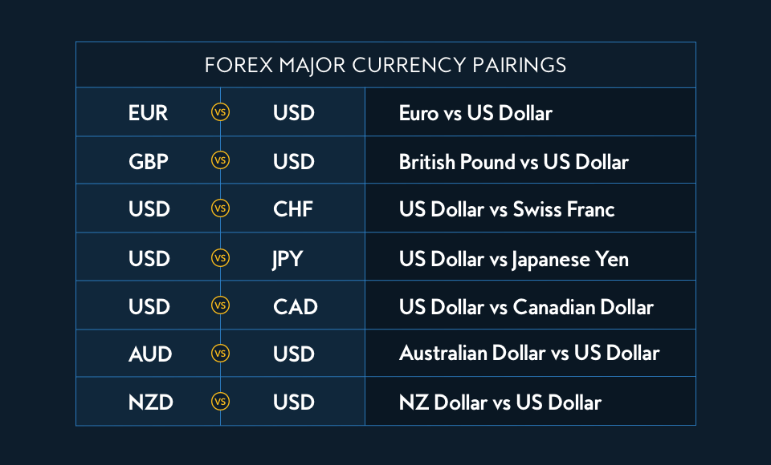

## Table of Contents

## What are major currency pairs in forex trading?

Major currency pairs in forex trading are the most traded pairs in the world. They always include the US dollar on one side of the pair. The most common major pairs are the EUR/USD, USD/JPY, GBP/USD, and USD/CHF. These pairs are called majors because they have high liquidity and low spreads, which means they are easy to buy and sell without big price changes.

These pairs are important because they represent the economies of major countries. For example, EUR/USD shows the value of the Euro compared to the US dollar. This pair is affected by economic news from the Eurozone and the US. Traders watch these pairs closely because they can show what is happening in the world economy. If the US economy is doing well, the USD might get stronger, and this can affect all the major pairs.

Understanding major currency pairs is key for anyone trading forex. They are the first pairs that new traders learn about. By focusing on these pairs, traders can get a good sense of the market. The high volume of trades in these pairs also means that there is a lot of information and analysis available, which can help traders make better decisions.

## How many major currency pairs are there?

There are seven major currency pairs in [forex](/wiki/forex-system) trading. These pairs all have the US dollar on one side. The pairs are EUR/USD, USD/JPY, GBP/USD, USD/CHF, AUD/USD, USD/CAD, and NZD/USD. They are called major pairs because they are traded a lot and are easy to buy and sell.

These pairs are important because they show how strong or weak the US dollar is compared to other big currencies. They also show what is happening in the economies of countries like Europe, Japan, the UK, Switzerland, Australia, Canada, and New Zealand. Traders watch these pairs to understand the global economy and make trading decisions.

## Which currencies are included in major currency pairs?

The major currency pairs in forex trading include the US dollar and six other major world currencies. These currencies are the Euro (EUR), Japanese Yen (JPY), British Pound (GBP), Swiss Franc (CHF), Australian Dollar (AUD), Canadian Dollar (CAD), and New Zealand Dollar (NZD). The US dollar is always on one side of these pairs.

These pairs are called major because they are traded a lot and are easy to buy and sell. They show how the US dollar compares to other big currencies. Traders use them to understand what's happening in the global economy. For example, if the US economy is doing well, the US dollar might get stronger, and this can affect all the major pairs.

## Why are these currency pairs considered 'major'?

These currency pairs are called 'major' because they are traded a lot and are easy to buy and sell. They always have the US dollar on one side, which is the world's most traded currency. When people trade these pairs, they can do it quickly and without big price changes. This makes it easier for traders to get in and out of trades.

The major pairs show how the US dollar compares to other big world currencies like the Euro, Japanese Yen, British Pound, Swiss Franc, Australian Dollar, Canadian Dollar, and New Zealand Dollar. Traders watch these pairs to understand what's happening in the global economy. For example, if the US economy is doing well, the US dollar might get stronger, and this can affect all the major pairs. This information helps traders make better decisions.

## What is the most traded major currency pair?

The most traded major currency pair is the EUR/USD. This pair shows the value of the Euro compared to the US dollar. It is traded a lot because the Eurozone and the US are big economies. Many people and businesses need to change Euros into US dollars and vice versa. This makes the EUR/USD pair very liquid, which means it's easy to buy and sell without big price changes.

Traders watch the EUR/USD pair closely because it can show what is happening in the world economy. If the US economy is doing well, the US dollar might get stronger, and this can make the EUR/USD pair go down. On the other hand, if the Eurozone economy is doing well, the Euro might get stronger, and the EUR/USD pair might go up. Because so many people trade this pair, there is a lot of information and analysis available, which helps traders make better decisions.

## How do major currency pairs affect global forex markets?

Major currency pairs have a big impact on the global forex markets because they are traded a lot and show how strong or weak the US dollar is compared to other big currencies. When traders buy and sell these pairs, they can change the prices of other currencies too. For example, if many traders think the US dollar will get stronger, they might buy USD/JPY, which can make the Japanese Yen weaker. This can affect other pairs that include the Yen, like EUR/JPY.

These pairs also help traders understand what is happening in the world economy. If the US economy is doing well, the US dollar might get stronger, and this can affect all the major pairs. Traders watch these pairs to see if they should buy or sell other currencies. For example, if the EUR/USD pair goes down, it might mean the Euro is getting weaker, and traders might decide to sell Euros or buy other currencies that are getting stronger. This way, major currency pairs can start a chain reaction in the forex market, where one move can lead to many others.

## What are the typical spreads for major currency pairs?

The typical spreads for major currency pairs are usually very small because these pairs are traded a lot. For example, the EUR/USD pair might have a spread of about 0.1 to 1 pip. A pip is a small change in the price of a currency pair. The spread is the difference between the price to buy and the price to sell. Because major pairs are easy to buy and sell, the spreads are low, which means traders can make money even with small price changes.

Spreads can change depending on the time of day and what is happening in the world. During busy trading times, like when the markets in Europe and the US are open at the same time, spreads can be even smaller. But if something big happens, like a surprise announcement from a central bank, spreads can get bigger because it's harder to buy and sell quickly. Traders need to watch the spreads because they can affect how much money they make or lose.

## How does liquidity in major currency pairs impact trading?

Liquidity in major currency pairs makes trading easier and cheaper. When a pair is liquid, it means a lot of people are buying and selling it. This makes it easy to buy or sell without waiting too long or causing big price changes. The high [liquidity](/wiki/liquidity-risk-premium) in major pairs like EUR/USD means the difference between the buying and selling price, called the spread, is small. This is good for traders because they can make money even if the price only changes a little bit.

The impact of liquidity on trading is big because it affects how fast and how much you can trade. If a pair is not liquid, it can be hard to buy or sell quickly, and the price might jump around a lot. This can make trading more risky and expensive. But with major pairs, traders can move in and out of trades easily, which helps them react to news and changes in the market faster. This is why traders often start with major pairs when they are learning to trade forex.

## What are the best times to trade major currency pairs?

The best times to trade major currency pairs are when the markets in different countries are open at the same time. This is called an overlap. The most important overlaps for major pairs are when the European market and the US market are both open. This happens from about 8 AM to 12 PM Eastern Time. During this time, a lot of people are trading, so the market is very active. This can make it easier to buy and sell without big price changes.

Another good time to trade is when the Asian market and the European market overlap. This happens from about 2 AM to 4 AM Eastern Time. During this time, pairs like EUR/JPY and GBP/JPY can be more active. But, the best time for most major pairs is still during the European and US overlap because that's when the most trading happens. Traders should watch the news and economic reports too, because big news can change when it's good to trade.

## How do economic indicators influence major currency pairs?

Economic indicators are like reports that tell us how an economy is doing. They can change the value of major currency pairs because they give traders new information. For example, if a report says that the US economy is growing fast, traders might think the US dollar will get stronger. This can make pairs like EUR/USD go down because the US dollar is getting stronger compared to the Euro. On the other hand, if a report says the Eurozone is doing well, the Euro might get stronger, and EUR/USD might go up.

These reports can also make the market move a lot. When a big report comes out, like one about jobs or inflation, traders might buy or sell quickly. This can make the prices of major pairs change fast. Traders need to watch these reports and be ready to act. If they know what to expect, they can make better trading decisions. For example, if a report is expected to be good for the US, traders might buy USD/JPY before the report comes out, hoping to make money as the US dollar gets stronger.

## What strategies are effective for trading major currency pairs?

One effective strategy for trading major currency pairs is called [trend following](/wiki/trend-following). This means watching the price of a pair over time and trying to find a pattern. If the price is going up, traders might buy the pair, hoping it will keep going up. If the price is going down, they might sell it, hoping it will keep going down. To do this, traders use charts and tools like moving averages to see where the price might be headed next. This strategy works well with major pairs because they are traded a lot and often follow clear trends.

Another good strategy is called range trading. This is when traders look for times when the price of a pair stays between two levels, like a high and a low. If the price keeps bouncing between these levels, traders might buy near the low and sell near the high. This can work well with major pairs because they can be stable for a while. Traders use charts to find these ranges and set their buy and sell points. Both trend following and range trading can help traders make money with major pairs, but they need to watch the market closely and be ready to change their plans if the market moves differently than expected.

## How can traders use technical analysis on major currency pairs?

Traders can use technical analysis on major currency pairs to try to predict where the price might go next. They look at charts and use tools like moving averages, which show the average price over a certain time. If the price is above the moving average, it might mean the pair is going up. If it's below, it might mean it's going down. Traders also use support and resistance levels, which are like invisible lines on the chart where the price often stops and turns around. By watching these levels, traders can decide when to buy or sell.

Another way traders use technical analysis is by looking at patterns on the charts. For example, they might see a head and shoulders pattern, which can mean the price is about to change direction. Or they might see a triangle, which can mean the price is getting ready to break out. These patterns can help traders guess what might happen next. By using these tools and patterns, traders can make better decisions about when to enter or [exit](/wiki/exit-strategy) trades on major currency pairs.

## References & Further Reading

[1]: ["Foreign Exchange Markets"](https://www.investopedia.com/terms/forex/f/foreign-exchange-markets.asp) by Bank for International Settlements. 

[2]: ["Algorithmic Trading in the Foreign Exchange Market"](https://onlinelibrary.wiley.com/doi/abs/10.1111/jofi.12186) - A comprehensive research article exploring the impact of algorithmic trading in forex markets.

[3]: ["Advances in Financial Machine Learning"](https://www.amazon.com/Advances-Financial-Machine-Learning-Marcos/dp/1119482089) by Marcos Lopez de Prado.

[4]: ["Quantitative Trading: How to Build Your Own Algorithmic Trading Business"](https://www.wiley.com/en-us/Quantitative+Trading%3A+How+to+Build+Your+Own+Algorithmic+Trading+Business+-p-9781119203377) by Ernest P. Chan. 

[5]: ["Machine Learning for Algorithmic Trading"](https://github.com/PacktPublishing/Machine-Learning-for-Algorithmic-Trading-Second-Edition) by Stefan Jansen.