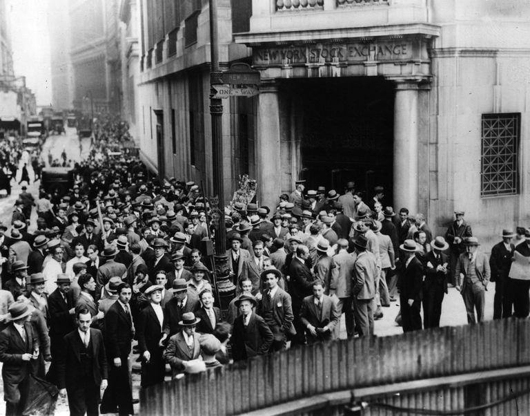

Deflation is a fundamental economic phenomenon that has significantly influenced various historical periods in the United States. Defined as the opposite of inflation, deflation entails a decrease in the general price level of goods and services. It reflects a contraction in consumer demand or an expansion in production capacity, both of which can lead to a sustained decline in prices. Various sectors may experience these changes, influencing overall economic activity.

Several key factors can trigger deflation, each playing a distinct role in shaping economic conditions. A decrease in consumer demand is often a precursor, reducing the velocity of money and inhibiting spending. Simultaneously, an increase in production capacity without a corresponding rise in demand can exacerbate this downward pressure on prices. This imbalance between supply and demand can create a deflationary environment, as producers lower prices to stimulate consumption.



Historically, the United States has witnessed several significant deflationary periods, each with profound economic implications. These episodes have not only affected prices and wages but also altered the broader economic landscape, influencing employment levels, investment strategies, and government policies. Notable periods of deflation have left enduring scars and have shaped policy-making decisions aimed at stabilizing the economy.

Understanding these historical deflationary periods is crucial for leveraging current economic models. In particular, this knowledge plays a vital role in informing algorithmic trading strategies. Algorithmic trading, which utilizes advanced computational techniques to make investment decisions based on market data trends, can benefit from insights into deflationary patterns. By recognizing the signals and consequences of deflation, these algorithms can optimize investment strategies, anticipate market shifts, and protect against potential economic downturns. Recognizing past deflationary trends allows traders to better predict and react to similar future economic environments, enhancing the resilience and effectiveness of modern trading strategies.

## Table of Contents

## 19th Century Deflationary Periods

The 19th century in the United States was characterized by significant deflationary periods, particularly between 1815-1860 and 1865-1900. This era of deflation was largely influenced by the outcomes of the War of 1812, industrial advancements, and substantial shifts in production capabilities.

Following the War of 1812, the U.S. experienced a pronounced deflationary phase due to two primary factors: industrial mechanization and the lack of a unified national currency. The absence of a centralized currency led to financial instability, while the rise of industrial mechanization increased productivity at a time when demand did not keep pace, thereby putting downward pressure on prices. This scenario illustrates a classical deflationary cycle where enhancements in production lead to an overabundance of goods without a corresponding growth in consumer demand.

The latter part of the century saw the so-called "Long Depression" from 1873 to 1896. This period, although marked by economic expansion, faced persistent price deflation, which had a significant impact on real wages. Despite the apparent economic growth, the expansion of production capacities—spurred by technological advances and an ever-evolving industrial landscape—outpaced demand. The result was a sustained decrease in prices. Such deflationary conditions had nuanced effects on labor markets and wage dynamics, often eroding the purchasing power of workers despite nominal wage increases.

Historical data indicates that during these deflationary periods, the disparities between production growth and consumer demand highlighted the vulnerabilities in economic structures. Understanding these factors is crucial for interpreting the broader implications of deflation and its disruptive potential on real wages and economic stability.

## The Great Depression

The Great Depression from 1930 to 1933 stands as the most severe deflationary episode in U.S. history. This catastrophic economic downturn was fundamentally triggered by a massive collapse in the financial sector, epitomized by widespread bank failures. As banks struggled, a cascading effect ensued, resulting in a sharp decline in both prices and overall economic output. During this period, the Consumer Price Index (CPI) recorded an average annual decrease of approximately 7%, coupled with an unprecedented rise in unemployment, reaching levels upwards of 25% at its peak.

The economic mechanisms during the Great Depression unfolded in a self-perpetuating cycle. With falling prices, consumer purchasing power was paradoxically increased, yet it was marred by skyrocketing unemployment which suppressed aggregate demand further. Businesses, observing diminishing demand, were compelled to cut costs, leading to more layoffs and perpetuating the vicious cycle of deflation. The downward spiral of prices wasn't merely a benign reduction in the cost of living; instead, it reflected severe underlying economic distress, characterized by collapsing production, investment, and trade levels.

The dangers posed by unchecked deflation became evident as it led to a debilitating economic environment. Deflation increased the real burden of existing debt, as the nominal value of debt remained unchanged while the value of currency increased. This insolvency risk further discouraged borrowing and spending by both consumers and businesses. Additionally, the real interest rates rose despite nominal rates being low, as the deflation rate effectively amplified the cost of borrowing.

This period underscored the critical need for proactive fiscal and monetary policies to counteract deflationary pressures. It spurred key economic reforms and regulatory measures to stabilize the financial system and prevent a recurrence of such economic devastation. The lessons derived from this era continue to inform economic policy-making, emphasizing the importance of monitoring inflationary and deflationary trends to maintain economic stability.

## 21st Century Deflation: The Great Recession

The Great Recession, spanning from 2007 to 2009, marked the most recent notable instance of deflation in the United States. While not as severe as the deflation experienced during the Great Depression, this period was significant enough to trigger concerns about potential long-term economic stagnation. Economists were particularly worried about the characteristics of deflation that could potentially exacerbate recessionary conditions. Key concerns included an increase in unemployment rates and a decrease in consumer spending, both of which could potentially trap the economy in a self-reinforcing cycle of downturn.

One of the defining features of the Great Recession was the initial introduction of deflationary pressures that affected the economy. The housing bubble burst, causing a dramatic decrease in asset prices, which rippled through financial markets and consumer confidence. As asset values plummeted, household wealth shrank, leading to reduced spending, while businesses faced declining profits and were compelled to lay off employees, raising unemployment levels further.

Another complication during this period was the challenge of high borrowing costs. Even with the presence of deflation, businesses were not able to significantly decrease their prices. The financial sector's instability led to tighter credit conditions and higher costs of borrowing, which limited the ability of companies to cut prices and further stimulated demand. This scenario helped prevent the United States from plunging into a more profound deflationary spiral, which could have slowed economic recovery even further.

Despite these challenges, the response to the Great Recession involved several monetary and fiscal interventions aimed at stabilizing the economy. The Federal Reserve, for instance, employed unconventional monetary policy measures including large-scale asset purchases to increase [liquidity](/wiki/liquidity-risk-premium) in the financial system and lower interest rates. These policy actions contributed to mitigating the extent of the deflationary pressures, supporting economic recovery over the subsequent years.

In summary, while the Great Recession's deflationary impact was moderate compared to historical precedents, it nonetheless highlighted key risks associated with deflation in modern economies. The economy's resilience in this scenario underscores the importance of timely and effective policy interventions to counteract these challenges.

## Algorithmic Trading and Economic Deflation

Algorithmic trading utilizes sophisticated models and algorithms to make rapid decisions based on market data, with the ability to execute trades at speeds and frequencies that human traders cannot match. During deflationary periods, this technology offers unique advantages in adjusting and optimizing investment strategies to capitalize on price fluctuations. Deflation often results in decreased consumer spending and lower prices, factors that, if anticipated correctly, can be exploited for profit through [algorithmic trading](/wiki/algorithmic-trading).

Algos are designed to adapt to changing market conditions, such as those induced by deflation. They can adjust trading parameters in real-time, responding to shifts in price levels quickly to maintain or enhance profitability. For instance, if market data signals an impending decline in asset prices due to deflationary pressures, an algorithm can trigger a series of trades to either short-sell overvalued stocks or invest in undervalued assets expected to recover when market conditions stabilize.

Moreover, historical insights into deflationary trends guide the development of algorithms geared towards anticipating market shifts. Understanding previous deflationary periods enables the crafting of robust trading strategies that aim to mitigate potential losses during economic downturns. Algorithms can incorporate historical data into their predictive models to enhance accuracy and reliability.

For example, a basic algorithm might resemble the following Python code snippet, which captures data-driven decision-making processes:

```python
def trading_strategy(market_data):
    price_moving_average = market_data['price'].rolling(window=10).mean()
    if market_data['price'][-1] < price_moving_average[-1] * 0.95:
        return "buy"
    elif market_data['price'][-1] > price_moving_average[-1] * 1.05:
        return "sell"
    else:
        return "hold"

# Sample market data input
market_data = {'price': [100, 98, 95, 97, 93, 91, 89, 90, 88, 85]}
trade_decision = trading_strategy(market_data)
```

In this simple algorithm, the strategy capitalizes on price movements under deflationary conditions by comparing current prices with a moving average. If prices dip significantly below the average, the algo suggests a "buy" decision, anticipating a market correction or recovery once deflationary pressures ease. Conversely, if prices soar above the average, it advises selling to lock in gains before a potential decline.

Overall, the ability of algorithmic trading to process vast amounts of data and respond instantaneously to market signals positions it as a vital tool during deflationary times. By leveraging historical insights and current market data, algorithmic systems can optimize trading strategies, offering investors a hedge against the uncertainties of economic deflation.

## Conclusion

Deflation has significantly influenced the U.S. economic environment, highlighting the importance of understanding its historical context for facing future challenges. Its recurring nature reveals essential economic principles that can be applied to contemporary financial strategies. One key area benefiting from these insights is financial technology, where algorithmic trading is increasingly integral.

Algorithmic trading can use historical deflationary data to refine trading algorithms, improving their adaptability and robustness. For instance, during deflation, prices tend to decrease, which can lead to specific trading patterns. By integrating historical data concerning deflationary periods, algorithms can be developed to better anticipate market trends and optimize investment decisions. This involves employing [machine learning](/wiki/machine-learning) and statistical models to predict price changes, ensuring profitable strategies are employed even when market conditions are challenging.

Moreover, understanding deflation's impact on consumer behavior and market dynamics allows algorithms to adjust parameters in real-time, ensuring they remain effective. For instance, during periods of declining prices, trader algorithms can be programmed to increase short selling or adjust asset portfolios, reflecting expected sector performances. Here is a basic outline of how a Python script might be structured to incorporate historical deflation data into trading algorithms:

```python
import pandas as pd
from sklearn.model_selection import train_test_split
from sklearn.ensemble import RandomForestRegressor

# Load historical deflation data
data = pd.read_csv('historical_deflation_data.csv')
X = data.drop('price_change', axis=1)  # Features
y = data['price_change']  # Target variable: price change percentage

# Split the data for training and testing
X_train, X_test, y_train, y_test = train_test_split(X, y, test_size=0.2, random_state=42)

# Initialize algorithm for prediction
model = RandomForestRegressor(n_estimators=100, random_state=42)
model.fit(X_train, y_train)

# Predict future price changes
predictions = model.predict(X_test)
```

This example demonstrates how understanding deflationary principles can heighten the precision and effectiveness of algorithmic trading strategies. Such strategies not only capitalize on current market conditions but also build resilience against possible economic downturns. Thus, by learning from deflation’s historical impacts, traders and economists can better position themselves to navigate future economic uncertainties successfully.

## References & Further Reading

[1]: FRED Economic Data. ["Consumer Price Index for All Urban Consumers: All Items in U.S. City Average."](https://fred.stlouisfed.org/series/CPIAUCSL) Federal Reserve Bank of St. Louis.

[2]: Mishkin, Frederic S., "The Economics of Money, Banking and Financial Markets". Pearson.

[3]: ["A Monetary History of the United States, 1867-1960"](https://www.jstor.org/stable/j.ctt7s1vp) by Milton Friedman and Anna J. Schwartz

[4]: [U.S Bureau of Labor Statistics.](https://www.bls.gov/) Consumer Price Index (CPI) Information.

[5]: Eichengreen, Barry, "Hall of Mirrors: The Great Depression, The Great Recession, and the Uses-and Misuses-of History". Oxford University Press.

[6]: ["Extraordinary Popular Delusions and the Madness of Crowds"](https://en.wikipedia.org/wiki/Extraordinary_Popular_Delusions_and_the_Madness_of_Crowds) by Charles Mackay

[7]: ["Irrational Exuberance"](https://en.wikipedia.org/wiki/Irrational_exuberance) by Robert J. Shiller