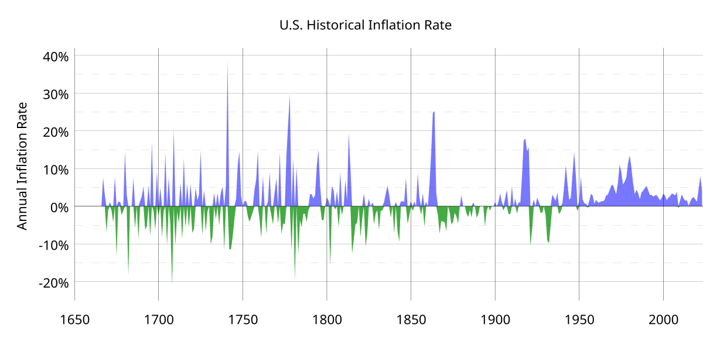

## Table of Contents

## What is deflation and how does it affect the economy?

Deflation is when the prices of things people buy, like food and clothes, go down over time. It's the opposite of inflation, where prices go up. When deflation happens, money becomes more valuable because you can buy more with the same amount of money. This might sound good at first, but it can cause problems for the economy.

Deflation can make people and businesses wait to buy things, hoping prices will drop even more. This waiting can slow down the economy because fewer things are being bought and sold. Also, if prices are falling, people might have to pay back loans with money that's worth more than when they borrowed it, which can be hard. This can lead to less spending, fewer jobs, and a weaker economy overall.

## What are the main causes of deflation?

Deflation can happen for a few reasons. One big reason is when there's not enough money going around in the economy. This can happen if people and businesses start saving more and spending less. When everyone is holding onto their money, there's less money to buy things, so sellers might lower their prices to get people to buy. Another reason is when there's too much stuff to buy but not enough people wanting to buy it. This can happen if companies make too many products or if new technology makes things cheaper to produce. When there's more stuff than people want, sellers have to lower prices to sell it all.

Another cause of deflation can be a drop in demand because people think prices will keep going down. If everyone believes prices will be lower next month, they might wait to buy things, which makes demand go down even more. This can start a cycle where prices keep falling because no one wants to buy right away. Also, big debts can lead to deflation. If a lot of people or businesses owe money, they might cut back on spending to pay off their debts, which can lower demand and push prices down.

## Can you list some major deflationary periods in U.S. history?

One big time of deflation in the U.S. was during the Great Depression, from 1929 to 1933. Prices fell a lot during these years. People lost jobs and didn't have money to spend, so stores had to lower prices to sell anything. This made the economy even worse because businesses made less money and had to let more people go. It was a tough time for everyone.

Another time was after the Civil War, from 1865 to 1896. This period is called the Long Depression. Prices went down because there was too much stuff and not enough people buying it. Farmers had a hard time because the price of crops dropped a lot. This made it hard for them to make money and pay back loans. The economy struggled for a long time during this period.

A more recent example was in the early 2000s, after the dot-com bubble burst. From 2001 to 2002, there was a small period of deflation. Tech companies failed, and people lost trust in the stock market. This made people spend less, and prices started to fall a bit. It wasn't as bad as the Great Depression, but it still showed how deflation can affect the economy.

## What was the economic impact of the deflation during the Panic of 1837?

The Panic of 1837 led to a big deflation that hurt the U.S. economy a lot. It started when banks failed and people couldn't get their money. This made everyone scared, so they stopped spending and started saving. With less money being spent, prices of things like food and clothes went down. But this wasn't good for the economy. Businesses sold less, so they had to let workers go. Many people lost their jobs and struggled to buy even the basics.

The deflation lasted for years and made things worse. Farmers were hit hard because the price of crops dropped a lot. They couldn't make enough money to pay back loans, and many lost their farms. This led to more people being out of work and less money moving around in the economy. The whole country felt the effects, with businesses closing and people moving around looking for work. It took a long time for the economy to get better after the Panic of 1837.

## How did the deflation of the 1870s, known as the Long Depression, affect American society?

The Long Depression in the 1870s hit American society hard. Many people lost their jobs because businesses were selling less stuff and had to let workers go. Farmers had a tough time too. The price of crops went down a lot, so they couldn't make enough money to pay back loans. Some farmers even lost their farms because of this. People moved around a lot, looking for work and a better life. Cities got more crowded, and life was hard for many families.

The deflation made everything worse. When prices kept going down, people didn't want to spend money because they thought things would be cheaper later. This made businesses struggle even more. Banks also had problems because people couldn't pay back loans. Some banks failed, which made people lose trust in them. The whole country felt the effects of the Long Depression. It took a long time for things to get better, and many people had to deal with tough times for years.

## What were the key factors leading to deflation during the Great Depression of the 1930s?

Deflation during the Great Depression in the 1930s started because people lost trust in banks and the economy. When the stock market crashed in 1929, many people lost their savings and jobs. They stopped spending money and started saving it instead. This made businesses sell less stuff, so they had to lower prices to get people to buy anything. When prices kept going down, people waited even longer to buy things, hoping prices would drop more. This cycle of waiting and lower prices made the economy worse.

Another reason for deflation was that banks failed. When banks went bankrupt, people couldn't get their money out. This scared everyone, so they saved even more and spent even less. Businesses couldn't sell enough to stay open, so they let workers go. With more people out of work, they couldn't buy things, so prices kept falling. The government didn't do much to help at first, which made the deflation and the depression last longer. It took years for the economy to start getting better.

## How did the U.S. government respond to deflation during the Great Depression?

At first, the U.S. government didn't do much to stop the deflation during the Great Depression. They thought the economy would fix itself. But as things got worse, they started to take action. President Franklin D. Roosevelt came up with the New Deal, a bunch of programs to help people and the economy. The New Deal tried to get people back to work by starting big projects like building roads and dams. This helped a little because people had jobs and could spend money again.

The government also tried to stop deflation by making more money. They did this by leaving the gold standard, which meant they could print more money without having to back it up with gold. This was supposed to make prices go up a bit. The government also set up the Federal Deposit Insurance Corporation (FDIC) to make people feel safe about keeping their money in banks. This helped stop bank runs and made people trust banks again. Slowly, these actions helped the economy start to get better, but it took a long time for things to really improve.

## What were the long-term effects of the deflationary period following World War II?

After World War II, the U.S. had a short time of deflation. This happened because the war was over, and the government didn't need to spend as much money. Also, factories that made things for the war started making things for people again. At first, there were a lot of these things, so prices went down. But this deflation didn't last long because people started spending more money on things they couldn't buy during the war.

The short deflation after World War II didn't hurt the economy too much. Instead, it helped make things stable. Soon, the economy started growing again, and prices began to go up a little. This time is known as the post-war economic boom. People had jobs, and they could buy houses and cars. The government helped by making sure there was enough money in the economy. So, even though there was a little deflation right after the war, it didn't stop the U.S. from having a good, long time of growth and prosperity.

## How did monetary policies contribute to deflation in the early 2000s?

In the early 2000s, the U.S. had a small period of deflation after the dot-com bubble burst. The Federal Reserve, which controls the country's money, had been keeping interest rates pretty high before the bubble burst. High interest rates make it more expensive for people and businesses to borrow money. When the bubble burst, people lost trust in the stock market and started saving more instead of spending. This made demand for things go down, and prices started to fall a bit.

The Federal Reserve then tried to help by lowering interest rates. They wanted to make it easier for people to borrow money and spend it, which would help the economy. But it took some time for these lower rates to really work. In the meantime, the economy was still feeling the effects of the dot-com crash, and the deflation continued for a while. It wasn't as bad as other times in history, but it showed how hard it can be to control deflation with monetary policy.

## What role did technology and globalization play in deflationary pressures in recent decades?

Technology has made things cheaper to make. Computers and robots can do a lot of work that people used to do. This means companies can make more stuff without spending as much money. When things cost less to make, companies can sell them for less money too. This can lead to deflation because prices go down. Also, the internet makes it easy for people to find the cheapest prices. If everyone is looking for the best deals, companies have to keep lowering their prices to sell their stuff.

Globalization has also helped cause deflation. It means that countries all over the world can trade with each other more easily. Companies can make things in countries where it's cheaper and then sell them everywhere. This brings more stuff into the market and can make prices go down. Also, workers in different countries might work for less money, so companies can pay less to make things. When companies can make things for less, they can sell them for less too, which can lead to deflation.

## How do deflationary periods in the U.S. compare to those in other countries?

Deflation in the U.S. has been similar to deflation in other countries in some ways, but different in others. Like in the U.S., many countries have had times when prices went down because people weren't spending money. For example, Japan had a long time of deflation starting in the 1990s. People there saved a lot and didn't buy things, so prices kept going down. This was a lot like what happened in the U.S. during the Great Depression, where people also saved instead of spending, and prices fell.

But there are also differences. In some countries, deflation happened because of big changes in the economy, like when the Soviet Union broke up in the early 1990s. Prices went down because the new countries had to figure out how to make and sell things on their own. In the U.S., deflation often came from big events like the stock market crash or the end of wars. Also, how governments and central banks in different countries respond to deflation can be different. The U.S. has used things like the New Deal and changing interest rates to fight deflation, while other countries might have done things differently.

## What are the current economic theories and models used to predict and manage deflation?

Economists use different theories and models to understand and deal with deflation. One big idea is the quantity theory of money, which says that if there's less money in the economy, prices will go down. This is because when people have less money, they buy less stuff, so sellers have to lower prices. Another important theory is the Keynesian model, which focuses on how much people want to spend. If people are scared and save their money instead of spending it, demand goes down, and prices fall. Economists use these ideas to guess when deflation might happen and how bad it could be.

To manage deflation, central banks like the Federal Reserve use monetary policy. They can lower interest rates to make it cheaper for people and businesses to borrow money. When borrowing is cheaper, people might spend more, which can help stop prices from falling. Sometimes, central banks also use something called quantitative easing, where they buy things like government bonds to put more money into the economy. Governments can also use fiscal policy, like spending more money on projects to create jobs and get people spending again. These actions help keep the economy stable and prevent long periods of deflation.

## References & Further Reading

[1]: FRED Economic Data. ["Consumer Price Index for All Urban Consumers: All Items in U.S. City Average."](https://fred.stlouisfed.org/series/CPIAUCSL) Federal Reserve Bank of St. Louis.

[2]: Mishkin, Frederic S., "The Economics of Money, Banking and Financial Markets". Pearson.

[3]: ["A Monetary History of the United States, 1867-1960"](https://www.jstor.org/stable/j.ctt7s1vp) by Milton Friedman and Anna J. Schwartz

[4]: [U.S Bureau of Labor Statistics.](https://www.bls.gov/) Consumer Price Index (CPI) Information.

[5]: Eichengreen, Barry, "Hall of Mirrors: The Great Depression, The Great Recession, and the Uses-and Misuses-of History". Oxford University Press.

[6]: ["Extraordinary Popular Delusions and the Madness of Crowds"](https://en.wikipedia.org/wiki/Extraordinary_Popular_Delusions_and_the_Madness_of_Crowds) by Charles Mackay

[7]: ["Irrational Exuberance"](https://en.wikipedia.org/wiki/Irrational_exuberance) by Robert J. Shiller