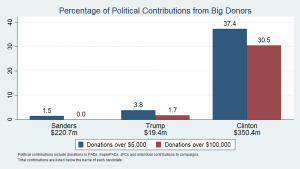

## Table of Contents

## Who were the major donors to the Clinton campaign?

The Clinton campaign received money from many people and groups. Some of the biggest donors were people like S. Daniel Abraham, who gave a lot of money. Other big donors included people like Fred Eychaner and James Simons. These people gave money because they supported Hillary Clinton and her ideas.

Groups also gave money to the Clinton campaign. One of the biggest groups was Priorities USA Action, a super PAC that supported Clinton. Another group was the American Federation of State, County and Municipal Employees, which is a union. These groups wanted to help Clinton win the election, so they gave money to her campaign.

Overall, the Clinton campaign got money from many different places. Both people and groups gave money because they believed in what Clinton stood for. The money helped her run her campaign and try to win the election.

## What industries were the major donors from?

Many of the big donors to the Clinton campaign came from the finance and investment industry. People like S. Daniel Abraham and James Simons made their money in finance. They gave a lot of money to help Clinton because they thought she would be good for their businesses. Another big donor, Fred Eychaner, was involved in media and advertising. He also supported Clinton because he believed in her ideas.

Groups that gave money to the Clinton campaign came from different industries too. Priorities USA Action, a big super PAC, got money from many places, but a lot of it came from people in finance and technology. The American Federation of State, County and Municipal Employees is a union that represents workers in public services. They supported Clinton because they thought she would help their members. So, the money came from industries like finance, technology, media, and public services.

## How much did the top donors contribute to the Clinton campaign?

The top donors to the Clinton campaign gave a lot of money. S. Daniel Abraham, a businessman in the finance industry, donated about $2 million. James Simons, who also worked in finance, gave around $10 million. Fred Eychaner, from the media and advertising world, contributed about $12 million. These big donors wanted to help Clinton because they believed in her and thought she would be good for their industries.

Groups also gave a lot of money to the Clinton campaign. Priorities USA Action, a super PAC, spent over $190 million to support Clinton. This money came from many donors, but a lot of it was from people in finance and technology. The American Federation of State, County and Municipal Employees, a union, gave about $2.7 million. These groups wanted to help Clinton win the election because they thought she would help their members and support their causes.

## Were there any notable foreign donors to the Clinton campaign?

The Clinton campaign did not accept direct donations from foreign nationals, as that is against U.S. election laws. However, some foreign individuals and companies were linked to donations through U.S. citizens or organizations. For example, there were reports about a Canadian businessman, Frank Giustra, who had ties to the Clinton Foundation and was involved in fundraising efforts that indirectly supported the campaign.

Another notable case involved the company Uranium One, which had connections to Russian investors. While the company itself did not donate directly to the Clinton campaign, its investors and related parties were known to have contributed to the Clinton Foundation. These connections raised questions about foreign influence, even though the campaign itself did not receive direct foreign donations.

## How did the Clinton campaign utilize the funds from major donors?

The Clinton campaign used the money from big donors to help Hillary Clinton try to win the election. They spent a lot of the money on TV ads to tell people about Clinton and her ideas. The ads were shown all over the country to reach as many voters as possible. The campaign also used the money to pay for people to work on the campaign, like organizers and volunteers. These people helped get more people to support Clinton and vote for her.

The money also helped the campaign travel around the country. Clinton and her team went to many different places to talk to voters and explain why she should be president. They used the money to rent places for speeches and events, and to pay for things like food and transportation. Overall, the money from big donors was very important for the Clinton campaign. It helped them do all the things they needed to do to try to win the election.

## What was the impact of major donor contributions on the Clinton campaign's strategy?

The money from big donors helped the Clinton campaign a lot. It let them do things they needed to do to try to win the election. With the money, they could pay for TV ads all over the country. These ads told people about Clinton and her ideas. They also used the money to hire people to work on the campaign. These people helped get more voters to support Clinton. Without the money from big donors, the campaign would not have been able to do all these things.

The money also helped the campaign travel around the country. Clinton and her team went to many places to talk to voters. They used the money to pay for places to give speeches and to cover costs like food and travel. This helped them reach more people and explain why Clinton should be president. Overall, the big donor money was really important. It helped shape the campaign's strategy by letting them do more advertising, hiring, and traveling.

## Were there any legal or ethical controversies surrounding the major donors to the Clinton campaign?

There were some legal and ethical controversies about the big donors to the Clinton campaign. One big issue was about foreign money. Even though the campaign did not take money directly from people outside the U.S., some foreign people and companies were linked to donations through U.S. citizens or groups. For example, a Canadian businessman named Frank Giustra and the company Uranium One, which had Russian investors, were connected to the Clinton Foundation. This raised questions about whether foreign money was trying to influence the campaign.

Another issue was about how much money some big donors gave. Some people thought that big donors like S. Daniel Abraham, James Simons, and Fred Eychaner might have too much influence on the campaign because they gave so much money. There were also worries about super PACs like Priorities USA Action, which spent a lot of money to help Clinton. Some people thought these groups had too much power and that it was not fair. These controversies made some people question if the campaign was doing things the right way.

## How did the contributions from major donors compare to those of other presidential campaigns?

The Clinton campaign got a lot of money from big donors, more than many other presidential campaigns. For example, Hillary Clinton's campaign raised over $560 million in total. A lot of this money came from big donors like S. Daniel Abraham, James Simons, and Fred Eychaner. These people gave millions of dollars to help Clinton. Other campaigns, like Bernie Sanders', also got a lot of money, but they got it from many small donors instead of just a few big ones. Sanders raised over $230 million, but most of it came from people giving small amounts.

Compared to other campaigns, the Clinton campaign's use of big donors was pretty common. Many presidential candidates get money from big donors and groups like super PACs. For example, Donald Trump's campaign also got a lot of money from big donors, raising over $330 million. But Trump's campaign also used his own money, which was different from Clinton's. Overall, the Clinton campaign's strategy of getting money from big donors was similar to what many other campaigns do, but the amounts and the sources were a bit different for each candidate.

## What role did bundlers play in securing major donations for the Clinton campaign?

Bundlers were really important for the Clinton campaign. They helped get big donations by asking their friends and business partners to give money. Bundlers are people who collect money from a lot of different people and give it all to the campaign at once. This helped the Clinton campaign get more money than they could have gotten from just a few people. Some of the bundlers were famous people or people who knew a lot of rich people. They used their connections to help the campaign.

The bundlers made a big difference because they helped the Clinton campaign reach more people who could give big donations. For example, a bundler might ask 20 of their rich friends to each give $10,000. That would be $200,000 that the campaign could use. This was a smart way to get more money. The bundlers were like helpers who made it easier for the campaign to get the money it needed to do things like TV ads and travel. Without bundlers, the campaign might not have been able to raise as much money.

## How did the Clinton campaign disclose and report major donor contributions?

The Clinton campaign had to follow rules about telling people where their money came from. They did this by reporting to the Federal Election Commission (FEC). The FEC is a group that makes sure campaigns follow the law about money. The Clinton campaign had to say who gave them money and how much. They did this by filling out forms and sending them to the FEC. These forms had the names of the donors and the amounts they gave. This way, everyone could see where the campaign's money came from.

The campaign also put this information on their website. They wanted to be open about where their money came from. On the website, people could see lists of donors and how much they gave. This helped people trust the campaign more because they could see that the campaign was following the rules. The Clinton campaign worked hard to make sure they reported everything correctly. They knew it was important to be honest about their money so people would believe in them.

## What were the long-term political implications of the major donor support for the Clinton campaign?

The big donor support for the Clinton campaign had some important effects on politics in the long run. One big effect was that it made people talk more about money in politics. When people saw that big donors like S. Daniel Abraham, James Simons, and Fred Eychaner gave a lot of money, they started to worry about how much influence these donors had. This made more people want to change the rules about campaign money. They wanted to make sure that rich people did not have too much power over who wins elections.

Another effect was that it changed how people thought about the Democratic Party. Some people felt that the party was too close to big donors and not close enough to regular voters. This made some people in the party want to focus more on getting money from small donors instead of big ones. It also made some people support candidates who promised to change how campaigns get money. Overall, the big donor support for the Clinton campaign made people think more about money in politics and how to make things fairer.

## How did the demographic profile of major donors to the Clinton campaign align with the campaign's voter base?

The major donors to the Clinton campaign were mostly rich people who worked in finance, technology, and media. They were different from the people who usually voted for Clinton. Clinton's voters were a mix of different groups, like women, young people, and people from cities. But the big donors were mostly older and richer than the average Clinton voter. They gave a lot of money because they thought Clinton would help their businesses and support their ideas.

Even though the big donors were different from most of Clinton's voters, their money helped the campaign a lot. The campaign used the money to do things like TV ads and travel around the country. This helped Clinton reach more voters and explain her ideas. But some people worried that the campaign was too close to rich donors and not close enough to regular voters. This made some people in the Democratic Party want to change how they get money for campaigns in the future.

## References & Further Reading

[1]: Corrado, A. B. (2017). ["The Impact of Super PACs on Political Campaigning."](https://bipartisanpolicy.org/download/?file=/wp-content/uploads/2019/05/The-Impact-of-Organizational-Characteristics-on-Super-PAC-Financing-and-Independent-Expenditures.pdf) Annual Review of Political Science, 20, 407-426.

[2]: Ferguson, T., Jorgensen, P., & Chen, J. (2018). ["Industrial Structure and Party Competition in an Age of Hunger Games: Donald Trump and the 2016 U.S. Presidential Election."](https://link.springer.com/article/10.1007/s40203-024-00294-1) Institute for New Economic Thinking.

[3]: Drutman, L. (2015). ["The Business of America is Lobbying: How Corporations Became Politicized and Politics Became More Corporate."](https://academic.oup.com/book/9937) Oxford University Press.

[4]: Lopez de Prado, M. (2018). ["Advances in Financial Machine Learning."](https://www.amazon.com/Advances-Financial-Machine-Learning-Marcos/dp/1119482089) John Wiley & Sons.

[5]: Pallin, R. (2016). ["Hacked Emails Show How the Clinton Campaign Warped the Democratic Primary."](https://www.bbc.com/news/election-us-2016-36927523) The Intercept.

[6]: Seib, G. (2016). ["With Big Donors, Hillary Clinton Has No Equal."](https://www.cnn.com/2016/01/31/politics/sanders-clinton-trump-cruz-campaign-finance-super-pacs/index.html) The Wall Street Journal.