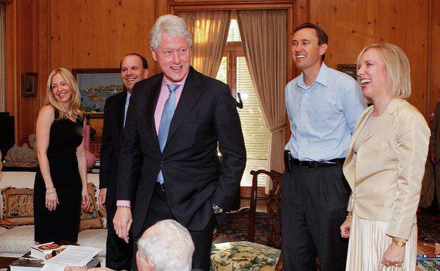

Financial contributions are a cornerstone of political campaigns, significantly shaping the trajectory and dynamics of the political landscape. The 2016 Hillary Clinton presidential campaign stands as a notable example of this phenomenon, demonstrating the critical role of extensive fundraising operations. During this campaign, a sophisticated network of donors and super PACs contributed to the financial machinery that powered the campaign, showcasing the interplay of wealth and politics in the electoral process.

One of the key aspects of the Clinton campaign was its ability to attract substantial contributions from a variety of sources, highlighting the influence of high-profile donors and super PACs in modern politics. These contributions not only facilitated campaign activities but also had wider implications for political strategies and messaging. Additionally, the campaign marked an evolution in fundraising techniques, incorporating advanced technologies such as algorithmic trading—typically associated with financial markets—into political fundraising strategies. 



Algorithmic trading, with its roots in financial markets, has been adapted to optimize political fundraising. Algorithms can efficiently determine optimal fundraising timings and resource management, demonstrating the increasing sophistication of contemporary campaign finance operations. This integration underscores the dynamic relationship between technological innovation and political fundraising, adding complexity to campaign finance dynamics.

Through an examination of the Clinton campaign's fundraising strategies, this article explores the intersecting roles of donors, super PACs, and technological advances in shaping political outcomes. Understanding these elements is essential for comprehending the modern political fundraising landscape and its potential impact on future campaigns.

## Table of Contents

## Understanding Political Donations

Political donations are essential for the viability of any political campaign, serving as the primary mechanism for candidates to engage with voters and disseminate their platforms. Campaign finance regulations are critical components in this process, establishing a framework that governs how donations are reported and managed. In the United States, the Federal Election Commission (FEC) oversees these regulations, ensuring that data on campaign contributions are accessible to the public. This transparency is intended to foster accountability and trust in the electoral process.

Key actors in political finance include individual donors, Political Action Committees (PACs), and super PACs, each governed by distinct regulatory standards. Individual donors contribute directly to candidates' campaigns, but these contributions are subject to strict limits. For instance, in the 2016 election cycle, an individual donor could contribute a maximum of $2,700 per election to each candidate (primary and general elections are considered separate). These limitations are enforced to prevent disproportionate influence from any single donor.

PACs, organizations that collect contributions from members and donate those funds to campaigns, face different restrictions. A traditional PAC is allowed to donate up to $5,000 per candidate, per election, and can receive up to $5,000 per year from any individual donor or another PAC. These limitations are designed to maintain a balance in political influence exerted by organizations.

Super PACs, however, operate under fundamentally different constraints. Entities like Priorities USA Action exemplify super PACs' capabilities, as they can raise and spend unlimited funds to support or oppose political candidates as long as they act independently and do not coordinate directly with the candidates or their campaigns. This autonomy enables super PACs to exert significant influence on election campaigns through extensive advertising and outreach activities. While super PACs cannot donate directly to candidates, they offer a mechanism for donors to bypass the contribution limits imposed on direct campaign donations.

This ability to raise unlimited funds without direct coordination allows super PACs to channel substantial resources into political campaigns, often used for sophisticated advertising strategies aimed at influencing voter perceptions and behaviors. The existence of super PACs highlights the evolving dynamics of campaign finance, where financial strategies are continually adapted to maximize electoral impact while navigating the complexities of campaign finance law.

## Top Contributors to the Clinton Campaign

The 2016 Hillary Clinton presidential campaign garnered substantial financial support from prominent individuals and organizations, underscoring the significance of high-level donor engagement in political campaigns. At the forefront were Dustin Moskovitz and Cari Tuna, whose combined contributions amounted to $35 million. Such a substantial financial commitment highlights the influential role that major donors play in shaping election strategies and outcomes.

In addition to Moskovitz and Tuna, several other key figures were instrumental in backing the Clinton campaign. Donald Sussman, a [hedge fund](/wiki/hedge-fund-trading-strategies) manager, was one of the major contributors, demonstrating not only his financial capacity but also his political motivations aligned with Clinton's policy agenda. Jay Robert Pritzker, a member of the wealthy Pritzker family, contributed significantly, underscoring the longstanding influence of prominent American families in political landscapes. Likewise, George Soros, a financier and well-known philanthropist, provided substantial financial support, reflecting his commitment to the Democratic platform.

Each of these contributors had distinct strategies and motivations that reveal the complex interplay between wealth and politics. Moskovitz and Tuna were driven by a desire to prevent a Trump presidency, advocating for a vision aligned with progressive values. Sussman’s donations were part of a broader engagement with Democratic politics, aiming to influence policy directions positively. Pritzker’s contributions can be linked to longstanding familial and personal relationships with the Democratic Party. Soros, known for his advocacy for open societies, used his financial muscle to promote policy agendas favoring human rights, democracy, and open governance.

The financial support from these donors was pivotal not just for Clinton's campaign operations but also for shaping broader political narratives and policy discussions. Their contributions provided the necessary resources for campaign advertisements, voter outreach, and strategic planning. More broadly, these financial endorsements created ripple effects across the political spectrum, influencing policy priorities and legislative discussions beyond the immediate campaign.

Understanding the contribution strategies and political motivations of these major donors provides insight into the complex dynamics of modern campaign finance. The interplay between significant financial contributions and political influence raises important discussions concerning the regulation and transparency of political donations, a theme critical to maintaining the integrity of democratic processes.

## The Role of Super PACs

Super PACs, formally known as independent expenditure-only committees, played a crucial role in the 2016 election cycle, particularly in the context of Hillary Clinton's presidential campaign. A notable example is Priorities USA Action, which significantly influenced the campaign's financial landscape. Unlike traditional political action committees (PACs), Super PACs can raise and spend unlimited funds, provided that they operate independently from any candidate. This financial flexibility allows them to engage in extensive political campaigning activities, thereby impacting the electoral process.

Super PACs primarily channel their resources into initiatives such as advertisements, voter outreach efforts, and broader political advocacy. These activities aim to sway public opinion and voter behavior to favor specific political agendas or candidates. The ability to spend without limits means that Super PACs can substantially amplify their messages, often overshadowing the official campaigns themselves. This dynamic is evident in the substantial funds raised and disbursed by entities like Priorities USA Action, which mobilized significant financial resources to support Clinton's campaign.

The influence of Super PACs also extends to modern electioneering strategies. By employing data-driven approaches, they can target advertisements and outreach efforts to specific demographics, maximizing the impact of their expenditures. This strategic deployment of resources underscores their ability to shape election outcomes significantly. For instance, by analyzing voter data and media consumption patterns, Super PACs can tailor their messages to resonate with particular segments of the electorate.

In summary, the role of Super PACs in political campaigns is multifaceted, involving not only the consolidation and [dispersion](/wiki/dispersion-trading) of financial resources but also the strategic planning of electoral influence. Their activities provide insight into the evolving nature of political campaigning, which increasingly relies on substantial financial inputs and sophisticated targeting strategies to sway the democratic process. The involvement of entities like Priorities USA Action illustrates the pivotal role Super PACs have in shaping the discourse and outcomes of elections.

## Algorithmic Trading and Political Fundraising

Algorithmic trading, while traditionally associated with financial markets, has found applications in political fundraising, providing campaigns with sophisticated tools to optimize their financial strategies. Advanced algorithms are employed to forecast optimal times for soliciting donations, allowing campaigns to maximize their fundraising potential. These algorithms analyze vast datasets, encompassing historical contribution patterns, donor behavior, and economic indicators to determine when individuals or organizations are most likely to contribute.

Hedge funds and financial experts apply these algorithms to strategically allocate resources, thereby ensuring a campaign's message reaches the intended audience with maximum efficiency and impact. This involves deploying data-driven models to segment potential donors, personalize outreach efforts, and time communications to coincide with periods where donors exhibit a higher propensity to give. The integration of [algorithmic trading](/wiki/algorithmic-trading) techniques underscores the sophistication of modern campaign finance operations, highlighting the convergence of technology and politics.

The influence of algorithmic trading on political donations introduces complexity into contemporary campaign strategies. As campaigns leverage these technological advancements, they gain the ability to adapt quickly to shifting donor preferences and economic conditions. This agility can be crucial in closely contested elections where financial resources are pivotal in swaying voter opinion through advertising and outreach initiatives.

For example, a Python-based algorithm might use [machine learning](/wiki/machine-learning) models to predict donor behavior. By analyzing the frequency, timing, and amount of previous contributions, the model could identify patterns and suggest optimal fundraising strategies. Here is a simple conceptual Python snippet demonstrating such a model:

```python
import pandas as pd
from sklearn.model_selection import train_test_split
from sklearn.ensemble import RandomForestClassifier

# Sample data representing donor behavior
data = pd.DataFrame({
    'donation_amount': [100, 250, 50, 300, 80],
    'donation_frequency': [4, 6, 2, 8, 3],
    'economic_indicator': [1.2, 1.3, 1.1, 1.5, 1.0],
    'past_donation': [1, 0, 1, 0, 1]  # 1 if donated, 0 if not
})

# Features and target variable
X = data[['donation_amount', 'donation_frequency', 'economic_indicator']]
y = data['past_donation']

# Split the data
X_train, X_test, y_train, y_test = train_test_split(X, y, test_size=0.2, random_state=42)

# Model training
model = RandomForestClassifier()
model.fit(X_train, y_train)

# Model prediction
predictions = model.predict(X_test)
```

In this example, the model could predict the likelihood of future donations based on historical data, guiding campaigns on when to focus their fundraising efforts. As algorithmic trading continues to permeate political fundraising, its role underscores the increasing interdependence of technology and electoral processes, prompting a reevaluation of strategies used to engage donors ethically and effectively.

## Ethical Considerations in Campaign Finance

The convergence of wealth, technology, and politics in modern campaign finance has given rise to significant ethical considerations. Ensuring transparency in campaign financing remains a cornerstone for maintaining public trust and ensuring fair democratic processes. This transparency is vital to prevent the manipulation of political systems by wealthy donors or corporations whose financial influence can skew political equity. The opaqueness inherent in some current fundraising practices, especially those involving super PACs and complex technologies like algorithmic trading, can create avenues for undue influence, undermining the fundamental principles of democracy.

Super PACs, while legally independent from candidates, wield substantial power due to their ability to raise and spend unlimited amounts of money. This financial latitude often translates into significant sway over election outcomes, overshadowing the voices of average voters. Thus, regulating the operations and financial flows of super PACs remains an ongoing challenge for policymakers intent on ensuring a level playing field.

The introduction of algorithmic trading into political fundraising further complicates this landscape. By leveraging advanced data analytics and prediction algorithms, campaigns can optimize their fundraising efforts, potentially leading to an imbalance where campaigns with superior technological resources have a definitive edge. The lack of clear regulations governing the use of such technologies in campaign finance further exacerbates these ethical dilemmas.

Voter awareness and advocacy are essential tools in confronting these ethical concerns. By staying informed about the sources and amounts of campaign contributions, voters can make more informed decisions at the ballot box. Advocacy groups also play a crucial role in pushing for legislative changes that promote transparency and fairness. For instance, initiatives aimed at enhancing the disclosure of super PAC funding sources and limiting the potential for algorithmic trading to exploit regulatory loopholes are critical steps toward safeguarding the democratic process. 

The dynamic interplay between these factors calls for continuous vigilance and adaptation from both regulators and the electorate to ensure that the evolving landscape of campaign finance supports, rather than undermines, democratic integrity.

## Conclusion

The 2016 Hillary Clinton presidential campaign underscores the substantial impact that major donors and sophisticated fundraising techniques can have on election outcomes. This campaign exemplified the critical role of financial contributions, both from individual donors and super PACs, in shaping political contests. As political campaigns increasingly integrate advanced technologies, it becomes essential for citizens to comprehend these dynamics for informed civic participation.

Technological advancements in campaign fundraising, including algorithmic trading, have introduced new complexities into the political landscape. These developments suggest that future election cycles will likely experience further evolution in fundraising strategies, driven by both political and technological changes. Understanding the methods by which funds are raised and spent can provide insight into the broader political processes at play.

Maintaining ethical standards amid innovation in fundraising is crucial for ensuring healthy democratic practices. The potential for undue influence from wealthy donors or technologically sophisticated fundraising tactics underscores the need for a balance between innovation and integrity. Regulatory frameworks must adapt to these changes, ensuring transparency and fairness in the electoral process.

Ongoing scrutiny and regulation of campaign finance will play a vital role in determining the future transparency and equity of elections. As campaigns continue to innovate in their fundraising approaches, it is imperative that they operate within ethical boundaries to maintain public trust and uphold democratic values. Voter awareness and advocacy will be key in pushing for necessary reforms and addressing ethical concerns in political fundraising.

## References & Further Reading

[1]: Corrado, A. B. (2017). ["The Impact of Super PACs on Political Campaigning."](https://bipartisanpolicy.org/download/?file=/wp-content/uploads/2019/05/The-Impact-of-Organizational-Characteristics-on-Super-PAC-Financing-and-Independent-Expenditures.pdf) Annual Review of Political Science, 20, 407-426.

[2]: Ferguson, T., Jorgensen, P., & Chen, J. (2018). ["Industrial Structure and Party Competition in an Age of Hunger Games: Donald Trump and the 2016 U.S. Presidential Election."](https://link.springer.com/article/10.1007/s40203-024-00294-1) Institute for New Economic Thinking.

[3]: Drutman, L. (2015). ["The Business of America is Lobbying: How Corporations Became Politicized and Politics Became More Corporate."](https://academic.oup.com/book/9937) Oxford University Press.

[4]: Lopez de Prado, M. (2018). ["Advances in Financial Machine Learning."](https://www.amazon.com/Advances-Financial-Machine-Learning-Marcos/dp/1119482089) John Wiley & Sons.

[5]: Pallin, R. (2016). ["Hacked Emails Show How the Clinton Campaign Warped the Democratic Primary."](https://www.bbc.com/news/election-us-2016-36927523) The Intercept.

[6]: Seib, G. (2016). ["With Big Donors, Hillary Clinton Has No Equal."](https://www.cnn.com/2016/01/31/politics/sanders-clinton-trump-cruz-campaign-finance-super-pacs/index.html) The Wall Street Journal.