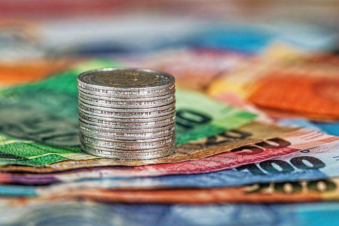

## Table of Contents

## What is a fiat currency?

A fiat currency is a type of money that a government says is worth something, even though it's not backed by a physical thing like gold or silver. It's valuable because people trust that the government will keep its value stable and accept it for paying taxes and buying things. Most countries use fiat currency, like the US dollar, the euro, and the Japanese yen.

The value of a fiat currency can go up or down based on how much people want it and how much of it is available. If a lot of people want to use it and there's not too much of it around, its value can go up. But if there's too much of it and not enough people want it, its value can go down. Governments and central banks try to manage this by controlling how much money is in circulation and setting interest rates.

## How are fiat currencies used in Bitcoin trading?

Fiat currencies are used in Bitcoin trading as a way to buy and sell Bitcoins. When someone wants to buy Bitcoin, they usually use a fiat currency like the US dollar or the euro to pay for it. They can do this on special websites called cryptocurrency exchanges. On these exchanges, people can trade their fiat money for Bitcoin, just like they might trade one country's money for another's when they travel.

When someone wants to sell their Bitcoin, they can also use these exchanges to trade it back into a fiat currency. This makes it easy for people to get in and out of Bitcoin with money they are already familiar with. The price of Bitcoin in terms of fiat currency can change a lot, so people watch the exchange rates closely to decide when to buy or sell. This way, fiat currencies help make Bitcoin more accessible and usable for everyday people.

## What are the most commonly traded fiat currencies in the Bitcoin market?

The most commonly traded fiat currencies in the Bitcoin market are the US dollar, the euro, and the Japanese yen. These currencies are used because they are widely recognized and trusted around the world. The US dollar is the most popular because it's the main currency used in global trade and finance. Many Bitcoin exchanges allow people to buy and sell Bitcoin using the US dollar, making it easy for a lot of people to get involved.

The euro is also very common in Bitcoin trading, especially in Europe. People in countries that use the euro can easily trade it for Bitcoin on many exchanges. The Japanese yen is another important currency in the Bitcoin market, particularly in Japan, where Bitcoin is widely accepted. These three currencies make up a big part of the trading activity in the Bitcoin market because they are stable and widely used.

## Why is the US Dollar important in Bitcoin trading?

The US dollar is really important in Bitcoin trading because it's the main currency used all around the world for buying and selling things. It's like the king of money in global trade. When people want to buy Bitcoin, they often use US dollars because it's easy to find and everyone knows it. This makes it simple for people from different countries to trade Bitcoin with each other, using the US dollar as a common language.

Also, the US dollar is seen as a safe and stable currency. People trust it because it's backed by the US government, which is strong and has a good economy. When the price of Bitcoin goes up and down, having a stable currency like the US dollar to trade with helps people feel more secure. This is why a lot of Bitcoin exchanges let people buy and sell Bitcoin using US dollars, making it the most popular choice for trading.

## How does the Euro impact Bitcoin trading?

The euro is important in Bitcoin trading because it's the money used by many countries in Europe. People in these countries can easily buy and sell Bitcoin using euros, which makes trading simpler for them. Many big Bitcoin exchanges let people use euros to trade, so it's a common choice for Europeans who want to get into Bitcoin. This helps more people from Europe join the Bitcoin market without having to change their money into another currency first.

The euro also matters because it's a strong and trusted currency, like the US dollar. When people trade Bitcoin, they want to use money that they know is safe and stable. The euro fits this because it's backed by the European Union, which has a big and strong economy. So, when people in Europe trade Bitcoin, using euros helps them feel more secure and confident in their trades.

## What role does the Japanese Yen play in the Bitcoin market?

The Japanese yen is important in the Bitcoin market because Japan is a big place for Bitcoin trading. A lot of people in Japan use Bitcoin, and the country has rules that make it easy and safe to trade. This means many Bitcoin exchanges let people use yen to buy and sell Bitcoin. It's like how people in Europe use euros; in Japan, they use yen. This makes it simple for Japanese people to get into Bitcoin without having to change their money into another currency first.

The yen is also seen as a safe and stable currency, which is good for trading Bitcoin. When the price of Bitcoin goes up and down a lot, people want to use money they trust. The yen is backed by Japan's strong economy, so people feel good about using it to trade Bitcoin. This helps make the Bitcoin market in Japan very active and busy, with a lot of trading happening every day.

## How do fluctuations in the British Pound affect Bitcoin trading?

When the British pound goes up or down, it can change how people trade Bitcoin. If the pound gets stronger, it might make Bitcoin seem cheaper for people who use pounds. This could make them want to buy more Bitcoin. But if the pound gets weaker, Bitcoin might seem more expensive, and people might not want to buy as much. This is important because a lot of people in the UK use pounds to trade Bitcoin on exchanges.

The British pound can also affect how much people from other countries want to trade Bitcoin with pounds. If the pound is strong, people from other countries might think it's a good time to buy pounds and then use them to buy Bitcoin. But if the pound is weak, they might not want to trade their money for pounds to buy Bitcoin. So, the ups and downs of the British pound can make a big difference in how active the Bitcoin market is, especially in the UK and for people who trade with pounds.

## What are the advantages of using the Chinese Yuan in Bitcoin transactions?

Using the Chinese Yuan in Bitcoin transactions can be good because China has a lot of people who want to use Bitcoin. It's easier for them to buy and sell Bitcoin with Yuan because they don't have to change their money into another currency first. This makes trading simpler and faster. Also, China has a big economy, so the Yuan is seen as a strong and stable currency. When people trade Bitcoin, they like to use money they trust, and the Yuan fits that.

Another advantage is that some Bitcoin exchanges in China let people use Yuan to trade. This means more Chinese people can join the Bitcoin market easily. It can make the market more active and busy because more people are trading. Even though the Chinese government has rules about using Bitcoin, the Yuan still helps make it easier for people in China to get involved in Bitcoin trading.

## How do smaller fiat currencies like the Australian Dollar influence Bitcoin trading?

Smaller fiat currencies like the Australian Dollar can still have an impact on Bitcoin trading, even if they are not as big as the US Dollar or the Euro. When the Australian Dollar goes up or down, it can change how much people in Australia want to buy or sell Bitcoin. If the Australian Dollar gets stronger, Bitcoin might seem cheaper for Australians, so they might want to buy more. But if the Australian Dollar gets weaker, Bitcoin could seem more expensive, and people might not buy as much. This can make the Bitcoin market in Australia more active or less active, depending on what's happening with the Australian Dollar.

Even though the Australian Dollar is smaller on the world stage, it's still important for Bitcoin trading in Australia. A lot of people in Australia use the Australian Dollar to trade Bitcoin on special websites called exchanges. These exchanges let Australians buy and sell Bitcoin easily with their own money, without having to change it into another currency first. This makes it simpler for Australians to get into Bitcoin trading and can help grow the Bitcoin market in Australia.

## What are the risks associated with trading Bitcoin with fiat currencies?

Trading Bitcoin with fiat currencies can be risky because the value of Bitcoin can change a lot very quickly. One day, Bitcoin might be worth a lot of money, and the next day, it could be worth less. This means if you buy Bitcoin with your fiat money, like dollars or euros, and the price goes down, you could lose money. It's hard to know what will happen to the price of Bitcoin, so it's a bit like gambling. You need to be ready for the price to go up or down and not use money you can't afford to lose.

Another risk is that the value of the fiat currency you use can also change. If the currency you use to buy Bitcoin gets weaker compared to other currencies, it might make your Bitcoin seem less valuable when you want to trade it back. Also, different countries have different rules about using Bitcoin, and these rules can change. If the rules in your country get stricter, it might be harder to trade Bitcoin with your fiat money. So, you need to keep an eye on both the Bitcoin market and what's happening with your fiat currency to try and make good trading choices.

## How do regulatory changes in different countries affect the use of their fiat currencies in Bitcoin trading?

When countries change their rules about Bitcoin, it can make a big difference in how people use their fiat money to trade it. If a country makes new laws that make it easier to use Bitcoin, more people might start trading with their local currency. This can make the Bitcoin market in that country busier and more active. But if a country makes rules that make it harder to use Bitcoin, like saying you need to pay taxes on it or you can't use it to buy things, fewer people might want to trade with their fiat money. This can make the Bitcoin market in that country slower and less active.

These changes in rules can also affect how much people trust using their fiat money to trade Bitcoin. If a country's government says Bitcoin is okay and safe to use, people might feel more comfortable using their local currency to buy and sell it. But if the government says Bitcoin is risky or not allowed, people might not want to use their money to trade it. This can change how much people want to use their fiat currency in the Bitcoin market, making it more or less popular depending on what the rules are.

## What advanced strategies can traders use when dealing with multiple fiat currencies in Bitcoin markets?

When trading Bitcoin with multiple fiat currencies, traders can use a strategy called [arbitrage](/wiki/arbitrage). This means they look for differences in Bitcoin's price on different exchanges that use different fiat currencies. If Bitcoin is cheaper on one exchange in US dollars but more expensive on another in euros, a trader can buy Bitcoin with US dollars where it's cheaper and then sell it for euros where it's more expensive. This way, they can make a profit from the price difference. It's like buying something on sale in one store and selling it for a higher price in another store. But traders need to be quick because these price differences don't last long.

Another strategy is called hedging. This is when traders use different fiat currencies to protect themselves from big changes in Bitcoin's price. For example, if a trader thinks the price of Bitcoin might go down, they can use one fiat currency to buy Bitcoin and another to bet that the price will go down. This way, if Bitcoin's price does go down, they can make money from their bet and lose less on their Bitcoin. It's like having a safety net. Hedging can be a bit tricky because it involves understanding how different currencies move together, but it can help traders feel more secure when trading Bitcoin.

## References & Further Reading

[1]: Nakamoto, S. (2008). ["Bitcoin: A Peer-to-Peer Electronic Cash System."](https://nakamotoinstitute.org/library/bitcoin/)

[2]: Popper, N. (2015). ["Digital Gold: Bitcoin and the Inside Story of the Misfits and Millionaires Trying to Reinvent Money."](https://www.amazon.com/Digital-Gold-Bitcoin-Millionaires-Reinvent/dp/006236250X) Harper.

[3]: DeVries, P. D. (2016). ["An Analysis of Cryptocurrency, Bitcoin, and the Future."](https://www.researchgate.net/publication/316656878_An_Analysis_of_Cryptocurrency_Bitcoin_and_the_Future) *International Journal of Business Management and Commerce* 1(2), 1-9.

[4]: Burniske, C., & Tatar, J. (2017). ["Cryptoassets: The Innovative Investor's Guide to Bitcoin and Beyond."](https://www.amazon.com/Cryptoassets-Innovative-Investors-Bitcoin-Beyond/dp/1260026671) McGraw-Hill Education.

[5]: Gomber, P., Arndt B., Lutat, M., & Uhle, T. (2011). ["High-Frequency Trading."](https://papers.ssrn.com/sol3/papers.cfm?abstract_id=1858626) *SSRN Electronic Journal*. 

[6]: Barber, S., Boyen, X., Shi, E., & Uzun, E. (2012). ["Bitter to Better—How to Make Bitcoin a Better Currency."](https://link.springer.com/content/pdf/10.1007/978-3-642-32946-3_29.pdf) *FC’12: Proceedings of the 16th International Conference on Financial Cryptography and Data Security*.

[7]: Chuen, D. L. K. (Ed.). (2015). ["Handbook of Digital Currency: Bitcoin, Innovation, Financial Instruments, and Big Data."](https://www.sciencedirect.com/book/9780128021170/handbook-of-digital-currency) Academic Press.