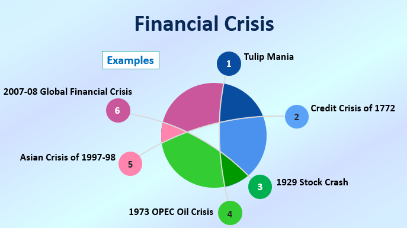

## Table of Contents

## What is a financial crisis?

A financial crisis is when the money system in a country or the world gets into big trouble. It happens when banks, businesses, and people can't pay back their loans, and the value of money goes down. This makes it hard for everyone to buy things they need and can lead to many people losing their jobs.

During a financial crisis, you might see banks closing down, the stock market crashing, and the price of things like houses going down a lot. Governments and big organizations try to fix the problem by making new rules or giving money to help. But it takes time, and life can be really hard for many people until things get better.

## What was the Dot-com Bubble and when did it occur?

The Dot-com Bubble was a time when a lot of people got excited about internet companies. It happened in the late 1990s and early 2000s. Many new companies started up, hoping to make money from the internet. People thought these companies would be very successful, so they invested a lot of money in them. The stock prices of these companies went up really high, even if the companies weren't making any profit yet.

But then, in 2000, people started to realize that many of these internet companies weren't going to be as successful as they thought. The stock prices started to fall, and many companies went out of business. This caused a lot of people to lose money. The bubble burst, and it took a few years for the economy to recover. This event taught people to be more careful about investing in new and untested businesses.

## How did the 9/11 attacks impact the global economy?

The 9/11 attacks had a big effect on the global economy. Right after the attacks, the stock markets around the world dropped a lot. In the United States, the New York Stock Exchange closed for a few days, which had not happened since 1933. When it opened again, the value of stocks went down a lot. This made many people lose money and feel unsure about the future. Businesses, especially airlines and tourism, were hit hard because people were scared to travel.

The attacks also led to more spending on security and defense, not just in the U.S. but around the world. Governments had to spend more money to keep people safe, which meant less money for other things like schools and hospitals. The war in Afghanistan that started after 9/11 also cost a lot of money. All of this made the economy slower to grow and recover. It took years for things to get back to normal, and some industries never fully recovered from the impact of the attacks.

## What caused the 2007-2008 Financial Crisis?

The 2007-2008 Financial Crisis started because of problems with loans, especially home loans called mortgages. Banks were giving out these loans to people who couldn't afford them, thinking that the price of houses would keep going up. But when house prices started to fall, many people couldn't pay back their loans. This led to a lot of homes being taken back by banks, which made the problem even worse. Banks had also been selling these risky loans to other investors around the world, so when the loans started to fail, it caused trouble everywhere.

As more and more loans failed, banks started to lose a lot of money. Some banks even went bankrupt. This made people scared and they started taking their money out of banks, which made the situation even worse. Governments had to step in to save the banks and stop the crisis from getting worse. The crisis led to a big drop in the stock market and many people lost their jobs. It took years for the economy to recover, and it affected people all over the world.

## What were the key events of the 2007-2008 Financial Crisis?

The 2007-2008 Financial Crisis started when banks gave out too many risky home loans, called subprime mortgages, to people who couldn't afford them. They thought the price of houses would keep going up, but when house prices started to fall, many people couldn't pay back their loans. This led to a lot of homes being taken back by banks, which made the problem even worse. Banks had also been selling these risky loans to other investors around the world, so when the loans started to fail, it caused trouble everywhere.

As more and more loans failed, banks started to lose a lot of money. Some big banks, like Lehman Brothers, went bankrupt in September 2008. This made people scared and they started taking their money out of banks, which made the situation even worse. Governments had to step in to save the banks and stop the crisis from getting worse. In the U.S., the government passed a big plan called the Troubled Asset Relief Program (TARP) to help banks. The crisis led to a big drop in the stock market and many people lost their jobs. It took years for the economy to recover, and it affected people all over the world.

## How did the 2007-2008 Financial Crisis affect the world economy?

The 2007-2008 Financial Crisis had a big impact on the world economy. It started in the United States but quickly spread to other countries. Many banks around the world had invested in the risky loans that caused the crisis, so when those loans failed, banks everywhere lost a lot of money. This made it hard for businesses to get loans, which meant they couldn't grow or hire new workers. As a result, many people lost their jobs and had a hard time paying their bills. The stock markets also crashed, which made people who had invested in stocks lose a lot of money.

Governments around the world had to step in to help fix the problem. They gave money to banks to keep them from going bankrupt and tried to help people who lost their jobs. But it took a long time for the economy to get better. In some countries, it took years for people to find new jobs and for businesses to start growing again. The crisis also made people more careful about borrowing money and investing in risky things. Overall, the 2007-2008 Financial Crisis made life harder for a lot of people and changed how the world economy works.

## What was the European Sovereign Debt Crisis and when did it start?

The European Sovereign Debt Crisis was a big problem that started in late 2009. It happened because some countries in Europe, like Greece, had borrowed too much money and couldn't pay it back. This made people worried that other countries might also have trouble paying their debts. Banks and investors started to pull their money out of these countries, which made the problem even worse.

The crisis spread to other countries like Ireland, Portugal, Spain, and Italy. Governments and the European Union had to step in to help these countries. They made plans to give them money and make new rules to stop the crisis from getting worse. It took many years for things to get better, and some countries are still dealing with the effects of the crisis today.

## What were the main causes of the European Sovereign Debt Crisis?

The European Sovereign Debt Crisis started because some countries in Europe, like Greece, had borrowed too much money and couldn't pay it back. They had been spending more money than they were making, often on things like pensions and public services. Banks and other countries had lent them this money, but when it became clear that these countries couldn't pay it back, people got worried. This worry spread to other countries like Ireland, Portugal, Spain, and Italy, because people thought they might also have trouble with their debts.

Another big reason for the crisis was that many banks in Europe had bought bonds from these countries. When the countries couldn't pay back their debts, the value of these bonds went down a lot. This made the banks lose a lot of money and made it hard for them to lend money to businesses and people. Governments and the European Union had to step in to help. They made plans to give money to the struggling countries and made new rules to try to stop the crisis from getting worse. It took a long time for things to get better, and some countries are still dealing with the effects of the crisis.

## How did the European Sovereign Debt Crisis impact the Eurozone?

The European Sovereign Debt Crisis had a big impact on the Eurozone, which is the group of countries that use the euro as their money. When countries like Greece couldn't pay back their debts, it made people worried about the whole Eurozone. Banks and investors started to pull their money out of these countries, which made it hard for them to borrow more money. This led to higher interest rates for these countries, making it even harder for them to pay back what they owed. The crisis also made the value of the euro go down, which affected the price of things people bought from other countries.

The crisis also caused a lot of problems for people living in the Eurozone. Many people lost their jobs because businesses couldn't get loans from banks. Governments had to cut back on spending, which meant less money for things like schools and hospitals. Some countries had to ask for help from the European Union and the International Monetary Fund, which came with strict rules about how they could spend their money. It took a long time for the Eurozone to recover, and some countries are still feeling the effects of the crisis today.

## What is the significance of the 2015 Chinese Stock Market Crash?

The 2015 Chinese Stock Market Crash was a big event that started in June 2015 and lasted for several months. It happened because many people in China started buying stocks, thinking they would make a lot of money. But then, the prices of these stocks started to fall quickly, and people got scared. They started selling their stocks, which made the prices fall even more. This crash affected not just China but the whole world because many other countries had invested in the Chinese market.

The crash had a big impact on China's economy. Many people lost a lot of money, and it made the government worried. The government tried to stop the crash by making new rules and spending money to buy stocks. But it took a long time for the market to get better. The crash also made people around the world more careful about investing in China. It showed that even big economies like China can have big problems, and it can affect everyone.

## How have financial regulations changed post-2008 to prevent future crises?

After the 2008 financial crisis, governments and banks around the world made new rules to try to stop it from happening again. In the United States, they passed a big law called the Dodd-Frank Act. This law made banks have more money saved up, so they could handle problems better. It also made new groups to watch over the banks and make sure they were not taking too many risks. In Europe, they made rules to make sure countries did not borrow too much money and to help banks be safer.

These new rules have helped make the financial system safer, but they are not perfect. Some people think the rules are too strict and make it hard for banks to help the economy grow. Others think the rules are not strict enough and that we need even more changes. But everyone agrees that we need to keep watching the financial system closely to make sure it stays safe and helps people.

## What are the ongoing risks and potential triggers for future financial crises?

There are still many things that could cause another financial crisis. One big risk is that banks and other financial companies might take too many risks again. They might lend money to people or businesses that can't pay it back, or they might invest in things that could lose a lot of value quickly. Another risk is that countries might borrow too much money and not be able to pay it back. This could make people scared and start pulling their money out of those countries, just like what happened during the European Sovereign Debt Crisis.

Also, new problems could come from things we don't expect, like a big cyber attack on banks or a sudden change in the world economy. For example, if there's a big drop in the price of oil or other important things, it could hurt countries that depend on selling those things. And if people start to worry and stop spending money or investing, it could make the economy slow down quickly. Keeping an eye on these risks and making sure banks and countries are careful with their money can help stop a new crisis from happening, but it's always a challenge.

## References & Further Reading

Lewis, M. (2010). *The Big Short: Inside the Doomsday Machine*. This book provides an insightful account of the 2008 Global Financial Crisis, focusing on the asset bubbles in real estate and the excessive risk-taking by financial institutions. The narrative offers a detailed exploration of the events and decisions that led to the crisis and the individuals who predicted its occurrence.

Johnson, H., & Kwok, C. (2010). *Re-examining the Causes of the Flash Crash of 2010*. This work investigates the causes of the Flash Crash, emphasizing the role of [algorithmic trading](/wiki/algorithmic-trading) in market instability. It examines how rapid trade execution during volatile market conditions can exacerbate price swings and contribute to market crashes.

MacKenzie, D. A., & Spears, T. (2018). *The Invention of Credit Default Swaps*. This publication explores the development and impact of credit default swaps (CDS) on financial markets, which played a significant role in the 2008 financial meltdown. It highlights the systemic risks introduced by CDS and the regulatory challenges they pose.

Pasquariello, P. (2019). *Financial Market Dislocations*. This book investigates into the phenomenon of market dislocations, where asset prices are significantly detached from fundamental values due to [liquidity](/wiki/liquidity-risk-premium) crises and other factors. It provides an analytical framework for understanding these dislocations and their implications for financial stability.

Aldridge, I. (2013). *High-Frequency Trading: A Practical Guide to Algorithmic Strategies and Trading Systems*. This guide covers the mechanics of high-frequency trading and its impact on market dynamics. It discusses both the benefits, such as enhanced market liquidity, and the risks, including potential for increased [volatility](/wiki/volatility-trading-strategies) and systemic instability, associated with algorithmic trading practices.

