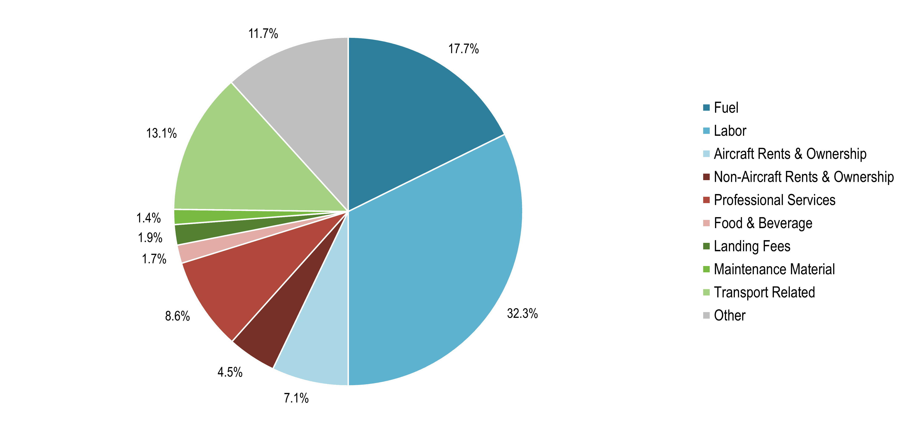

## Table of Contents

## What are the main types of financial expenditures for airline companies?

Airline companies have several main types of financial expenditures that they need to manage carefully. The first major expense is fuel costs. Airplanes use a lot of jet fuel, and the price of fuel can change a lot. This means airlines have to keep a close eye on fuel prices and try to buy fuel when it's cheaper. Another big expense is labor costs. This includes paying pilots, flight attendants, mechanics, and other staff. These costs can be high because it takes a lot of skilled people to run an airline safely and efficiently.

In addition to fuel and labor, airlines also have to spend a lot on aircraft maintenance and ownership. Planes need regular checks and repairs to stay safe and fly well. This can be very expensive, especially for older planes. Airlines also have to pay for the planes themselves, either by buying them outright or leasing them. Leasing can help spread out the costs over time, but it still adds up. Finally, there are other smaller but important expenses like airport fees, marketing, and customer service. All these costs together make running an airline a complex and costly business.

## How do fuel costs impact the financials of airline companies?

Fuel costs are a big deal for airline companies because they can really affect how much money the company makes. When the price of jet fuel goes up, airlines have to spend more money to fly their planes. This means they might have to charge more for tickets or find other ways to save money. If fuel prices stay high for a long time, it can make it hard for airlines to make a profit, especially if people aren't willing to pay more for their flights.

To deal with changing fuel prices, airlines often try to buy fuel when it's cheaper or use special agreements to lock in lower prices for a while. They might also try to make their planes use less fuel by flying more efficiently or using newer, more fuel-efficient aircraft. Even small changes in how much fuel a plane uses can make a big difference in the airline's overall costs. So, managing fuel costs is a key part of running a successful airline.

## What are the typical costs associated with aircraft maintenance and how do they affect airline budgets?

Aircraft maintenance is a big part of what airlines have to pay for. Planes need to be checked and fixed regularly to make sure they are safe and work well. This includes things like changing parts, fixing engines, and doing regular inspections. All of this can be very expensive. For example, a routine check-up can cost a lot of money, and if something big breaks, like an engine, it can cost even more. Airlines have to plan for these costs because they happen all the time and can't be avoided.

These maintenance costs can really affect an airline's budget. They have to set aside a lot of money just to keep their planes in good shape. If something unexpected happens, like a part breaking suddenly, it can mess up their plans and make it hard to stick to their budget. Airlines try to manage these costs by scheduling maintenance during times when planes aren't flying as much, and by keeping good records of when parts need to be replaced. But even with careful planning, maintenance is always going to be a big expense that airlines have to deal with.

## How do labor costs contribute to the overall expenses of an airline?

Labor costs are a big part of what airlines have to pay for. This includes salaries for pilots, flight attendants, mechanics, and all the other people who work for the airline. Pilots and flight attendants need special training and skills, so they can be expensive to hire and keep. Mechanics and other ground staff are also important because they make sure the planes are safe and ready to fly. All these people need to be paid well, and their salaries add up to a lot of money for the airline.

These labor costs can really affect how much money an airline has left over after paying for everything. If labor costs go up, the airline might have to charge more for tickets or find other ways to save money. Sometimes, airlines try to keep costs down by negotiating with unions or by hiring people who are just starting out and might not need to be paid as much. But no matter what, labor costs are always going to be a big part of what airlines have to spend money on, and they have to plan carefully to make sure they can still make a profit.

## What role do airport fees and charges play in the financial expenditures of airlines?

Airport fees and charges are another big expense for airlines. Every time a plane lands or takes off, the airline has to pay fees to the airport. These fees can be different depending on the size of the plane, how busy the airport is, and other things. Airports also charge for things like using the gates, using the runways, and even for services like handling baggage. All these fees add up and can make a big difference in how much money an airline has to spend.

These airport costs can affect how airlines plan their flights. For example, an airline might choose to fly to airports with lower fees to save money. Or they might try to negotiate better deals with airports to lower their costs. But no matter what, airport fees are always going to be a part of what airlines have to pay, and they need to think about these costs when they are figuring out how to make money.

## How do airlines manage and budget for marketing and advertising expenses?

Airlines need to spend money on marketing and advertising to let people know about their flights and special deals. They use different ways to reach people, like TV ads, online ads, social media, and even billboards at airports. All of these things cost money, and airlines have to plan carefully to make sure they are spending their marketing budget in the best way possible. They might focus on certain times of the year, like holidays, when more people are looking to book flights. Or they might target specific groups of people who are more likely to fly with them.

To manage their marketing budget, airlines often set a certain amount of money aside just for marketing and advertising. They might work with marketing agencies to help them figure out the best ways to spend this money. Airlines also look at how well their marketing is working by seeing if more people are booking flights after seeing their ads. If something is working well, they might spend more money on it. If it's not working, they might try something different. This way, they can make sure their marketing dollars are being used wisely and helping them make more money in the end.

## What are the financial implications of leasing versus buying aircraft for airlines?

When airlines decide whether to lease or buy aircraft, it can really affect their money situation. Leasing means the airline pays to use the plane for a certain amount of time, but they don't own it. This can be good because it spreads out the cost over time, and the airline doesn't have to pay a big amount all at once. Leasing also lets airlines try out new planes without committing to owning them. But, leasing can end up costing more over the long run because the airline is always paying to use the plane and never owns it.

On the other hand, buying an aircraft means the airline owns it and can use it for as long as they want. This can be cheaper in the long run because once the plane is paid off, the airline doesn't have to keep paying for it. But buying a plane is a big expense right away, and it can be hard for airlines to come up with that much money. Also, if the airline decides they don't want the plane anymore, it can be hard to sell it and get their money back. So, airlines have to think carefully about whether leasing or buying is the better choice for their budget and plans.

## How do insurance costs affect the financial planning of airline companies?

Insurance is a big expense for airlines because it helps them protect against things like crashes or other bad events. They have to pay for insurance every year, and it can cost a lot of money. The cost of insurance can change depending on things like how safe the airline is, how old their planes are, and even what's happening in the world. If something big happens, like a crash, insurance can help the airline pay for the damage and keep going. But, the more an airline has to pay for insurance, the less money they have left for other things.

To manage insurance costs, airlines have to plan carefully. They might try to keep their safety record good so they can get lower insurance rates. They also have to think about how much insurance they need and what kind. Sometimes, they can save money by choosing insurance plans that cover less, but that can be risky if something bad happens. So, airlines have to balance the cost of insurance with the need to protect themselves, and it's a big part of their overall financial planning.

## What strategies do airlines use to mitigate the financial impact of fluctuating currency exchange rates?

Airlines often have to deal with money in different countries because they fly all over the world. When the value of one country's money goes up or down compared to another, it can affect how much airlines have to pay for things like fuel or airport fees. To handle this, airlines use something called hedging. Hedging is like making a bet on what the exchange rate will be in the future. By doing this, airlines can lock in a certain rate and know how much they will have to pay, even if the actual rate changes later.

Another way airlines manage currency exchange rates is by keeping money in different currencies. If they know they will have to pay for something in a certain country's money, they might keep some of their money in that currency. This way, if the exchange rate changes, they won't lose as much money. Airlines also try to match their income and expenses in the same currency as much as possible. For example, if they earn money in dollars, they try to pay for things in dollars too. This helps them avoid losing money when exchange rates change.

## How do technological investments influence the long-term financial expenditures of airlines?

When airlines spend money on new technology, it can change how much they have to spend over a long time. New technology, like better computers or new ways to check in passengers, can help airlines save money in the future. For example, if they use new software to plan their flights better, they might use less fuel. Or if they have new machines to check in passengers faster, they might need fewer people working at the airport. These savings can add up and help the airline make more money in the long run.

But, spending on technology can also be expensive at first. Buying new computers or building new apps costs a lot of money right away. Airlines have to think carefully about whether the money they spend now will help them save more money later. If they make the right choices, the technology can help them run better and make more money. But if they spend too much on things that don't help, it can hurt their budget. So, airlines need to plan well and pick the right technology to invest in.

## What are the considerations and costs involved in route planning and network expansion for airlines?

When airlines plan new routes or want to fly to more places, they have to think about a lot of things. They need to look at how many people want to fly to those places and if they can make money from those flights. They also have to think about how much it will cost to fly there, like fuel costs and airport fees. Sometimes, they might need to buy or lease new planes to fly the new routes. All of these things can add up to a lot of money, so airlines have to be careful and make sure the new routes will be worth it.

Expanding their network can help airlines make more money if they do it right. If they find good new routes, they can get more passengers and make more money from tickets. But, it can also be risky. If the new routes don't work out, the airline might lose money. They have to spend a lot on marketing to let people know about the new flights, and they might need to hire more people to fly the planes and help passengers. So, airlines have to plan carefully and do a lot of research before they decide to add new routes or fly to new places.

## How do environmental regulations and sustainability initiatives impact the financial expenditures of airline companies?

Environmental rules and trying to be more sustainable can change how much money airlines have to spend. Governments around the world are making new rules to help the environment, like cutting down on how much pollution planes can make. To follow these rules, airlines might have to buy new planes that use less fuel or change how they fly to save energy. All of these things cost money. Airlines also have to pay for things like carbon credits, which let them keep flying even if they are making pollution. These costs can add up and make it harder for airlines to make money.

But, being more sustainable can also help airlines save money in the long run. If they use planes that use less fuel, they don't have to spend as much on fuel. And if they find new ways to save energy, like using less paper or recycling more, they can save money too. Airlines might also get a good reputation for being green, which can make more people want to fly with them. So, while it might cost money at first to follow environmental rules and be more sustainable, it can help airlines save money and do better in the long run.

## References & Further Reading

[1]: Vasigh, B., Fleming, K., & Tacker, T. (2017). ["Introduction to Air Transport Economics: From Theory to Applications."](https://www.taylorfrancis.com/books/mono/10.4324/9781315299075/introduction-air-transport-economics-bijan-vasigh-ken-fleming-thomas-tacker) Routledge.

[2]: Belobaba, P., Odoni, A., & Barnhart, C. (2015). ["The Global Airline Industry."](https://onlinelibrary.wiley.com/doi/book/10.1002/9780470744734) John Wiley & Sons.

[3]: Ettinger, M. (2016). ["Aviation and Its Management: Global Challenges and Opportunities."](https://www.intechopen.com/books/7571) Springer.

[4]: Lopez de Prado, M. (2018). ["Advances in Financial Machine Learning."](https://www.amazon.com/Advances-Financial-Machine-Learning-Marcos/dp/1119482089) Wiley.

[5]: Oum, T., Zhang, A., & Zhang, Y. (1993). ["Inter-firm Rivalry and Firm Specific Price Elasticities in Deregulated Airline Markets."](https://www.jstor.org/stable/20053000) Journal of Transport Economics and Policy.

[6]: De Neufville, R., & Odoni, A. (2013). ["Airport Systems: Planning, Design, and Management."](https://www.semanticscholar.org/paper/Airport-systems-planning%2C-design%2C-and-management-Neufville-Odoni/654f3418405e9b871acabaaa52a84d14365a97ee) McGraw Hill Professional.