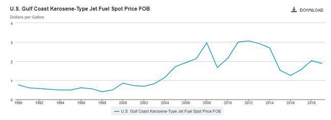

The airline industry is a crucial component of global transportation, connecting cities, countries, and continents with increasing efficiency. This sector is characterized by its complexity and dynamism, driven by a myriad of factors including technological advancements, regulatory environments, and varying economic conditions. For this industry to function effectively, a deep understanding of the associated costs is essential. These costs, including expenses like fuel, labor, maintenance, and overheads, significantly influence the operational strategies and profitability of airlines.

Fuel costs, often constituting the largest portion of an airline's expenditure, are influenced by global oil prices and geopolitical events, which can result in significant financial volatility. Labor costs include the compensation for pilots, cabin crew, and ground staff, all crucial for maintaining high safety and service standards. Maintenance expenses, another critical component, ensure that aircraft are safe, reliable, and meet regulatory requirements. Overhead costs encompass a wide range of expenses such as administrative, airport fees, and marketing.

This article aims to explore the intersection of these airline costs with aviation expenses and algorithmic trading (algo trading). By examining the integration of advanced technologies, the article will highlight how airlines manage financial efficiency. These technologies include data analytics for route optimization, IoT for predictive maintenance, and automation for operational productivity, all contributing to reduced expenses.

Moreover, the potential impact of algo trading on the aviation sector's financial practices will be analyzed. Traditionally used in financial markets, algo trading is now being explored by airlines to hedge fuel costs, manage currency exchange risks, and enhance overall financial strategies. This innovative approach promises to revolutionize cost management and improve profitability.

The airline industry is poised on the brink of transformation, driven by these technological and financial innovations. By staying informed and adaptable, airlines can maintain a competitive edge while navigating future challenges.

## Table of Contents

## Understanding Airline Costs

Airline costs are a multifaceted component of the aviation industry, with expenses divided into several key categories: fuel, labor, maintenance, and overhead. Understanding these costs is essential to comprehend the financial structure and strategic decisions of airlines.

Fuel costs constitute one of the most significant portions of an airline's expenditures. Fluctuations in [crude oil](/wiki/crude-oil) prices and geopolitical factors can lead to substantial variability in fuel expenses. Consequently, efficient fuel management and hedging strategies are vital for stabilizing fuel costs and safeguarding profit margins.

Labor costs comprise a considerable segment of airline expenses, covering salaries for pilots, cabin crew, and ground staff. Beyond direct wages, airlines also incur additional costs related to training, benefits, and pensions. For example, the total compensation for pilots often includes not just salary but also allowances for travel and layover expenses.

Maintenance costs are critical to ensuring the safety and reliability of aircraft. Regular inspections, repairs, and parts replacements are integral to the operational continuity of an airline. Compliance with stringent aviation regulatory standards necessitates a well-funded maintenance program, which includes both scheduled and unexpected repairs.

Overhead costs encompass administrative operations, airport fees, and marketing efforts. Administrative expenses include the cost of running headquarters and regional offices, encompassing salaries for management and administrative staff, utilities, and other office-related costs. Airport fees include charges for landing, parking, and security, often varying by airport and contributing significantly to operational expenses. Additionally, marketing budgets are essential for brand positioning and competitive advantage, encompassing advertising, promotions, and customer engagement initiatives.

Each of these cost categories presents its unique challenges and requires strategic management for airlines to maintain profitability and competitive advantage.

## Impact of Aviation Expenses on Profitability

Aviation expenses significantly influence the profitability of airlines, playing a pivotal role in shaping ticket pricing strategies. One of the most substantial costs affecting airlines is fuel expenditure, which is subject to volatile price fluctuations. This [volatility](/wiki/volatility-trading-strategies) necessitates the adoption of efficient hedging strategies to mitigate financial risks. Hedging allows airlines to lock in fuel prices for a period, protecting them from sudden increases in market rates. For example, an airline might use futures contracts or options to stabilize fuel costs, which can lead to more predictable budgeting and pricing.

Labor expenses are another critical component, encompassing salaries for pilots, cabin crew, and ground staff. These expenses are augmented by the need for ongoing training and development programs aimed at enhancing workforce efficiency and ensuring compliance with safety regulations. While these programs add to labor costs, they are essential for maintaining high service standards and operational efficiency.

Balancing cost-cutting measures with the maintenance of quality service is a strategic challenge faced by many airlines. Reducing expenses is essential for boosting profitability, yet it must not compromise the passenger experience. Airlines often explore various strategies, such as optimizing flight routes, improving fleet efficiency, and implementing customer service innovations, to manage this balance effectively.

Economic factors such as fluctuating demand and competitive pressure further amplify the impact of aviation expenses. In times of high demand, airlines might increase ticket prices to capitalize on market conditions. Conversely, during periods of low demand or heightened competition, pricing strategies may shift to attract more passengers, which can compress profit margins. This dynamic environment requires airlines to be agile in their financial planning and responsive to market changes to sustain profitability.

In summary, aviation expenses, encompassing fuel, labor, and operational costs, critically influence airline profitability and ticket pricing strategies. Effective management of these costs, through mechanisms such as hedging and strategic planning, is essential for maintaining financial health in an industry marked by economic variability and intense competition.

## The Role of Technology in Cost Management

Technological advancements are reshaping the landscape of cost management in the airline industry, offering numerous opportunities for enhancing efficiency and reducing expenditures. One of the primary domains where technology is making a substantial impact is data analytics. By analyzing vast amounts of operational data, airlines can gain valuable insights into optimizing flight routes, fuel consumption, and crew scheduling. For instance, predictive analytics models can process historical flight data to suggest more fuel-efficient flight paths that take into account weather patterns and air traffic conditions. This optimization can lead to significant fuel savings, a critical [factor](/wiki/factor-investing) given that fuel costs represent a substantial portion of airline expenses.

Furthermore, the Internet of Things (IoT) is playing an increasingly important role in predictive maintenance, allowing airlines to proactively address maintenance needs before they escalate into costly repairs. By equipping aircraft with sensors that monitor real-time data such as engine performance, temperature, and pressure, airlines can detect anomalies and predict component failures. This approach not only reduces unexpected downtime and repair costs but also enhances flight safety by ensuring that maintenance is conducted when necessary, rather than on a fixed schedule.

Automation is another technological facet revolutionizing operations management within airlines. By automating repetitive tasks, airlines can enhance productivity and reduce the likelihood of human error. For example, automated systems can manage crew scheduling, aircraft dispatch, and passenger check-in processes more efficiently than traditional manual methods. Automation also extends to customer service, wherein chatbots and virtual assistants handle routine inquiries, enabling human staff to focus on more complex issues.

Investment in these innovative technologies is essential for airlines aiming for long-term sustainability and cost-effectiveness. Such investments may require significant initial outlay, but the return on investment can be substantial through decreased operational costs and improved service levels. As technology continues to evolve, airlines that embrace these advancements will be well-positioned to reduce their aviation expenses, improve their competitive standing, and ensure sustainable growth in a challenging economic environment.

## Algo Trading: A New Frontier in Aviation Finance

Algorithmic trading, a staple of financial markets, is gaining traction in the aviation industry as a tool for cost optimization and profitability enhancement. Traditionally, [algorithmic trading](/wiki/algorithmic-trading) involves using complex algorithms to execute trades at speeds and frequencies impossible for human traders. In aviation, this approach is being adapted to manage financial risks and streamline operations, particularly concerning fuel costs and currency exchange fluctuations.

Airlines face constant fuel price volatility which profoundly impacts their operating budgets. Fuel hedging, a strategy to lock in fuel prices, is where algo trading demonstrates significant potential. By incorporating algorithms into hedging strategies, airlines can analyze vast datasets to predict fuel price movements with greater accuracy. This advanced predictive capability enables more strategic purchasing decisions, potentially leading to substantial cost reductions.

Furthermore, the introduction of algo trading into aviation finance enhances risk management. Automated trading systems process real-time data rapidly, allowing airlines to adapt to market changes almost instantaneously. This real-time adaptation reduces the exposure to adverse price movements and improves decision-making efficiency.

Currency exchange rate fluctuations pose another challenge for international airlines, as they often operate in multiple currencies. Algo trading can be utilized to optimize these fluctuations by automatically executing currency trades when certain conditions are met, thereby minimizing losses related to exchange rate swings. 

The implementation of these algorithms not only streamlines trading operations but also promises to transform how airlines handle their financial management. By integrating these systems, airlines stand to better manage costs, reduce exposure to financial risks, and ultimately boost their profitability.

In conclusion, as airlines explore the application of algorithmic trading, they could pave the way for a new era of financial efficiency within the aviation sector. With the right implementation, these strategies could significantly enhance the industry's approach to cost management and profitability.

## Challenges and Considerations in Implementing Algo Trading

Implementing algorithmic trading within the aviation industry poses several challenges and necessitates careful consideration. One of the primary issues is the lag in regulatory compliance and legal frameworks, which must evolve to address the complexities introduced by advanced technological systems. The aviation industry, traditionally regulated to ensure operational safety and financial integrity, requires updated regulations that also consider the nuances of automated and algorithm-driven trading systems. This involves amending existing financial and aviation laws to accommodate and regulate the new technological landscapes, ensuring transparency, accountability, and ethical trading practices.

Furthermore, the integration of AI-driven models into the aviation financial structure demands a significant initial investment and a steep learning curve. Airlines must allocate resources for technology acquisition, staff training, and system integration to ensure that algorithmic trading models function effectively. This process involves understanding complex algorithms, setting up infrastructure for real-time data processing, and adjusting organizational workflows to incorporate new trading strategies. The requirement for skilled personnel who can develop, manage, and refine these systems adds another layer of complexity, highlighting the need for continuous education and training programs.

Data security and privacy present another major challenge. Algorithmic trading relies heavily on accessing and processing vast amounts of sensitive data to make informed decisions. This necessitates robust cybersecurity measures to prevent data breaches and unauthorized access, which could result in financial losses or strategic disadvantages. Airlines must implement strong encryption, secure networks, and access controls to safeguard both their financial data and operational systems from potential threats. Moreover, compliance with data protection regulations, such as the General Data Protection Regulation (GDPR) in Europe, is crucial to avoid legal repercussions and maintain consumer trust.

Finally, balancing technology with human oversight is essential to minimize the risks posed by automated systems. While algorithms can process and analyze data more quickly and accurately than humans, they lack the intuition and judgment that human oversight can provide. In scenarios where algorithms might fail due to unforeseen circumstances, human intervention is necessary to prevent erroneous trading decisions that could lead to substantial financial losses. Therefore, establishing a framework where human operators are capable of assessing and intervening when necessary is critical. This hybrid approach ensures that while the efficiency of algorithmic trading can be utilized, the human element remains integral to safeguarding against potential pitfalls, ensuring that the system remains reliable and effective. 

Implementing algorithmic trading within airlines, thus requires not just technological investment, but an overarching strategy that includes regulatory alignment, comprehensive training, robust data security, and balanced oversight mechanisms to fully realize its benefits while mitigating associated risks.

## Case Studies: Airlines Harnessing Technology and Algo Trading

Airlines around the globe are increasingly turning to technology and algorithmic trading (algo trading) to optimize their financial operations. By examining the experiences of leaders such as Delta Air Lines and Emirates, we can understand how these advancements are reshaping cost management strategies within the industry.

Delta Air Lines has been at the forefront of integrating [artificial intelligence](/wiki/ai-artificial-intelligence) (AI) to enhance operational efficiency. For example, Delta employs AI-driven analytics to optimize route planning and crew scheduling, leading to significant reductions in fuel consumption and labor costs. This use of technology not only helps streamline their operational expenditure but also enhances overall customer satisfaction by minimizing delays and optimizing flight connections. Furthermore, Delta has ventured into algo trading for fuel hedging, allowing the airline to manage fuel price volatility more effectively by predicting fluctuating fuel prices with greater accuracy.

Emirates has likewise embraced technological innovations, implementing advanced data analytics and IoT for predictive maintenance of its fleet. By doing so, Emirates reduces unexpected breakdowns and maintenance costs, leading to improved aircraft availability and reliability. Moreover, Emirates uses algo trading to hedge currency risks, which helps stabilize its financial outcomes against the backdrop of fluctuating international markets. This strategic approach to financial risk management demonstrates the airline's commitment to innovation and financial prudence.

The success of these airlines in utilizing technology and algo trading underscores the importance of a tailored approach in adopting advanced technologies. While Delta focuses more on AI and fuel hedging, Emirates emphasizes predictive maintenance and currency risk management. These tailored strategies indicate that a one-size-fits-all approach is not optimal; instead, airlines must assess their specific challenges and opportunities to harness technology effectively.

Airlines venturing into algo trading face challenges, including regulatory compliance and the initial investment needed for integration. However, the benefits, as demonstrated by Delta and Emirates, significantly outweigh these hurdles. Insights from these case studies emphasize the transformative potential of technology and algo trading, serving as a guide for other airlines aiming to enhance financial efficiency through innovation.

As technological advancements continue to redefine aviation finance, the experiences of Delta and Emirates provide a framework for other airlines. By overcoming initial challenges and successfully integrating technology, these airlines highlight the promising future of the aviation industry's financial strategies. Their journey offers a roadmap for leveraging tech-driven solutions to thrive in today's competitive landscape.

## Conclusion

The relationship between airline costs, aviation expenses, and algorithmic trading underscores the dynamic and evolving nature of the airline industry. Technological advancements are playing a pivotal role in transforming traditional cost management strategies, allowing airlines to optimize operations and improve financial efficiency. The emergence of algorithmic trading presents an opportunity to significantly enhance profitability by providing tools for more precise hedging, risk management, and cost forecasting.

Algorithmic trading, when leveraged effectively, has the potential to be transformative. By enabling airlines to better predict fuel price fluctuations and manage currency exchange volatility, algo trading could lead to more strategic financial planning and decision-making. This transformation necessitates a willingness to adapt and incorporate innovative technologies into financial strategies.

Moreover, the continuous evolution of the industry demands that airlines remain agile and well-informed. By staying abreast of technological developments and being adaptable in implementing them, airlines can secure a competitive advantage. As the industry moves forward, agility and a commitment to innovation will be crucial for success in navigating cost management and profitability challenges.

## References & Further Reading

[1]: Vasigh, B., Fleming, K., & Tacker, T. (2017). ["Introduction to Air Transport Economics: From Theory to Applications."](https://www.taylorfrancis.com/books/mono/10.4324/9781315299075/introduction-air-transport-economics-bijan-vasigh-ken-fleming-thomas-tacker) Routledge.

[2]: Belobaba, P., Odoni, A., & Barnhart, C. (2015). ["The Global Airline Industry."](https://onlinelibrary.wiley.com/doi/book/10.1002/9780470744734) John Wiley & Sons.

[3]: Ettinger, M. (2016). ["Aviation and Its Management: Global Challenges and Opportunities."](https://www.intechopen.com/books/7571) Springer.

[4]: Lopez de Prado, M. (2018). ["Advances in Financial Machine Learning."](https://www.amazon.com/Advances-Financial-Machine-Learning-Marcos/dp/1119482089) Wiley.

[5]: Oum, T., Zhang, A., & Zhang, Y. (1993). ["Inter-firm Rivalry and Firm Specific Price Elasticities in Deregulated Airline Markets."](https://www.jstor.org/stable/20053000) Journal of Transport Economics and Policy.

[6]: De Neufville, R., & Odoni, A. (2013). ["Airport Systems: Planning, Design, and Management."](https://www.semanticscholar.org/paper/Airport-systems-planning%2C-design%2C-and-management-Neufville-Odoni/654f3418405e9b871acabaaa52a84d14365a97ee) McGraw Hill Professional.