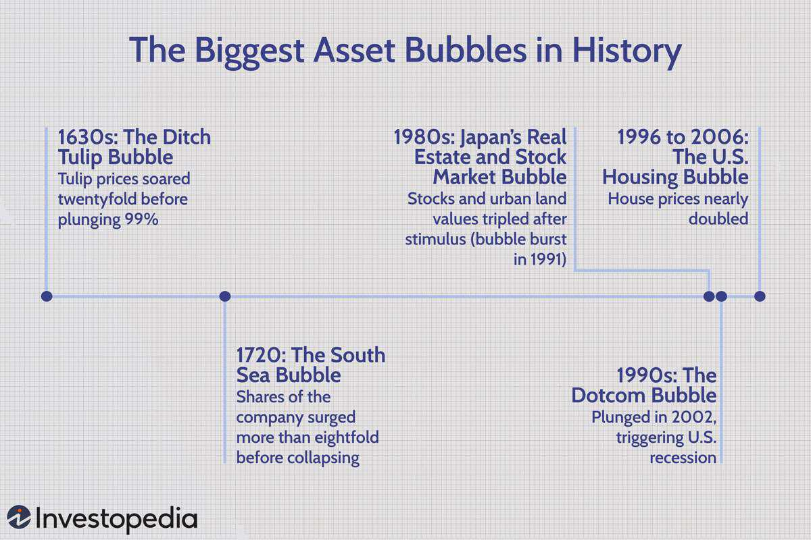

Asset bubbles and economic history are closely interconnected, often leading to financial crises that impact economies on a global scale. Understanding the evolution of asset bubbles is crucial as they often trigger significant market instability. These bubbles occur when the price of an asset surges significantly above its intrinsic value, driven largely by speculative investment behavior. This disparity between asset price and intrinsic value can lead to volatile market conditions and economic disruptions when the bubble ultimately bursts.

Historically, asset bubbles have shared common characteristics and triggers, such as excessive monetary liquidity, speculative investor behavior, and rapid technological advancements. A typical asset bubble follows a discernible lifecycle characterized by a build-up phase, where asset prices begin to rise, often fueled by a mix of market optimism and speculative investment. This phase is followed by a peak, where asset prices reach unsustainable levels, only to be followed by a burst, leading to sharp declines in prices and significant financial upheaval.



This article will present key historical examples of asset bubbles and their consequential impacts on economies around the world. Examples include the Dutch Tulip Mania of the 1630s, the South Sea Bubble in 1720, Japan's Economic Bubble of the 1980s, the Dot-com Bubble in the late 1990s, and the U.S. Housing Bubble that precipitated the 2008 Financial Crisis. Each of these cases demonstrates the profound effects that asset bubbles can have on both national and global economies, offering valuable lessons for contemporary financial practices.

Furthermore, modern trading practices, particularly algorithmic trading, have intersected with asset bubbles, at times exacerbating their formation and subsequent busts. Algorithmic trading, with its ability to execute high volumes of transactions at unprecedented speeds, introduces both efficiencies and risks into the market. This article will explore how these algorithms have both benefited and heightened the volatility associated with asset bubbles, and how they have interacted with traditional market dynamics.

In conclusion, a thorough exploration of asset bubbles, their historical precedence, and modern trading practices such as algorithmic trading is essential for understanding and mitigating potential future financial risks. By examining past financial crises, we can seek to build more robust economic frameworks and develop balanced approaches to trading and policy-making, ultimately aiming to prevent future market instability and economic downturns.

## Table of Contents

## The Anatomy of Asset Bubbles

Asset bubbles emerge when the prices of assets elevate substantially, surpassing their fundamental intrinsic values. These occurrences are generally fueled by speculative investments, where investors purchase assets with the expectation of future price increases, often disregarding the underlying financial indicators of the assets themselves. Asset bubbles are characterized by a distinct lifecycle, consisting of phases such as the build-up, peak, and inevitable burst.

The build-up phase is marked by increasing investor enthusiasm and capital inflows into particular asset classes, causing prices to rise. During this period, optimism and the "fear of missing out" (FOMO) often lead more investors to enter the market, further inflating prices. A notable feature of bubble formation is the intensifying disconnect between market prices and intrinsic values, alongside excessive leverage and borrowing.

As the bubble reaches its peak, the disparity between actual asset values and market prices becomes critically unsustainable. At this juncture, any adverse development—such as shifts in investor sentiment or macroeconomic changes—can precipitate a rapid decline in asset prices. This downward shift, often referred to as the burst, is usually accompanied by widespread selling, eroding investor confidence, and triggering a sharp market correction.

Several factors contribute to the development of asset bubbles:

1. **Monetary Policy Decisions**: Central bank policies, especially those affecting interest rates and liquidity, have a profound impact on asset prices. Low interest rates can encourage borrowing and speculative investment, inflating asset prices.

2. **Investor Behavior**: Psychological factors, including herd behavior and overconfidence, play a significant role. When investors collectively believe that prices will continue to rise, their actions can contribute to the bubble's growth.

3. **Technological Changes**: Innovations can create optimism about the future earning potential of new sectors, often resulting in speculative price surges. For example, during the dot-com bubble, the rapid adoption of internet technologies led to unrealistic valuations of tech companies.

Understanding the anatomy of asset bubbles is crucial for developing strategies to preempt such economic disruptions. Awareness of these phases and contributing factors can help policymakers and investors anticipate or mitigate the detrimental impacts of future bubbles.

## Historical Examples of Asset Bubbles

### Historical Examples of Asset Bubbles

#### Dutch Tulip Mania

The Dutch Tulip Mania of the 1630s is often cited as one of the first recorded examples of a speculative bubble. During this period, the price of tulip bulbs skyrocketed in the Dutch Republic, reaching extraordinarily high levels before dramatically collapsing in February 1637. This bubble was characterized by the classic features of speculation: investors drove prices higher in the hopes of selling at a profit, leading to a disconnect between the tulip bulbs' market price and their intrinsic value. The bubble's burst resulted in significant financial losses for those who had invested heavily.

#### The South Sea Bubble

The South Sea Bubble of 1720 was a significant financial event in Great Britain, resulting from speculation in the South Sea Company. This company had been granted a monopoly on trade in the South Seas (Latin America), and its stocks were heavily promoted. Speculative frenzy led to a massive inflation of stock prices, which eventually culminated in a crash. Many investors, including notable figures such as Sir Isaac Newton, suffered substantial financial losses.

#### Japan's Economic Bubble of the 1980s

Japan's economic bubble of the 1980s was marked by excessive valuation in both real estate and stock markets. Driven by extensive speculation and favorable economic conditions, asset prices climbed to unsustainable levels. The Nikkei stock index, for example, nearly tripled between 1985 and 1989. The inevitable burst in the early 1990s led to a prolonged period of economic stagnation known as the Lost Decade, characterized by deflation and a slow recovery process.

#### Dot-com Bubble

The dot-com bubble of the late 1990s represented another significant episode of speculative investment. As internet-based companies emerged, investors feverishly bought tech stocks, often without regard for traditional valuation metrics such as earnings. At the height of the frenzy, many companies were valued at billions of dollars despite lacking viable business models or profits. The bubble burst in the early 2000s, resulting in a precipitous decline in stock prices and substantial economic repercussions.

#### U.S. Housing Bubble and the 2008 Financial Crisis

The U.S. housing bubble, which developed in the early 2000s, was fueled by high-risk lending practices and the proliferation of complex financial instruments like mortgage-backed securities and collateralized debt obligations. Housing prices soared as speculative investments increased, only to crash in 2007. This collapse triggered the 2008 financial crisis, leading to a global recession. The repercussions were severe, affecting countless homeowners and resulting in widespread foreclosures and banking failures.

These historical examples highlight the common elements of asset bubbles: rapid price increases spurred by speculative behavior, a disconnect between asset prices and intrinsic values, and subsequent economic consequences following burst events. Each instance serves as a critical study in understanding the triggers and impacts of speculative bubbles on economies worldwide.

## Algorithmic Trading: A Modern Influence

Algorithmic trading has become a transformative force in financial markets, characterized by its use of computer algorithms to automate trading decisions, thereby increasing both the speed and [volume](/wiki/volume-trading-strategy) of transactions. This modern practice leverages historical price data and advanced quantitative models to execute trades more efficiently than human traders.

Traditionally, trading involved manual processes, but algorithms now enable decisions in fractions of a second, far beyond human capability. These algorithms can assess multiple market conditions, analyzing price movements, and executing strategies such as [arbitrage](/wiki/arbitrage) or [market making](/wiki/market-making) to enhance operational efficiency. High-Frequency Trading ([HFT](/wiki/high-frequency-trading-strategies)), a subset of [algorithmic trading](/wiki/algorithmic-trading), specifically focuses on executing a high number of orders at extremely fast speeds, often exploiting minuscule price discrepancies.

**Benefits of Algorithmic Trading**

One of the primary benefits of algorithmic trading is its contribution to market efficiency. By executing thousands of trades per second, algorithms enhance price discovery, ensuring that asset prices more accurately reflect available information. This increased efficiency is complemented by improved [liquidity](/wiki/liquidity-risk-premium), as algorithms continually provide supply and demand in the market, reducing spreads and lowering transaction costs for traders.

Another advantage is the reduction of human error and emotional decision-making in trading strategies. Algorithms eliminate the biases and inconsistencies often inherent in human traders by following predefined, systematic approaches. This can particularly benefit portfolio diversification and risk management as algorithms can quickly adjust to changing market conditions.

**Risks of Algorithmic Trading**

Despite these advantages, algorithmic trading poses significant risks, particularly related to market stability. One concern is the potential for increased [volatility](/wiki/volatility-trading-strategies). Algorithms, designed to respond swiftly to market changes, can exacerbate price swings through rapid trade execution, which may prompt further algorithmic responses, creating feedback loops. Such was the case during the 2010 Flash Crash when the Dow Jones Industrial Average plunged almost 1,000 points in minutes due, in part, to algorithmic trading anomalies.

Moreover, algorithms can malfunction or behave unpredictably under unanticipated market conditions, leading to unintended trading actions with wide-reaching implications. These "black swan" events, although rare, highlight the systemic risks associated with algorithm-dependent trading environments.

The intricate nature of algorithms also complicates regulatory oversight. As algorithms become more complex, ensuring compliance with existing trading regulations becomes challenging. This necessitates robust risk management strategies and the development of adaptive regulatory frameworks that can keep pace with technological advancements, balancing innovation with the need for stability in financial markets.

## The Interplay Between Asset Bubbles and Algorithmic Trading

Algorithmic trading has revolutionized financial markets by leveraging computer algorithms to execute high-speed, high-frequency trades. However, this technological innovation has significantly intersected with asset bubbles, influencing their development and impact on market stability.

#### Amplification of Asset Bubbles

Algorithmic trading can intensify asset bubbles through feedback loops. These loops occur when rising asset prices trigger algorithms to execute further buy orders, pushing prices even higher. This [momentum](/wiki/momentum)-based trading behavior can inflate prices beyond intrinsic values, contributing to bubble formation. For instance, during rapid price increases, algorithms relying on technical indicators might detect bullish patterns and amplify trading volume, reinforcing the price surge without regard to fundamental value.

#### Case Studies

One notable case is the 2010 Flash Crash, where the Dow Jones Industrial Average dropped nearly 1,000 points within minutes, largely due to algorithmic trades reacting to market conditions. This incident highlighted the vulnerability of markets to algorithm-driven volatility, showcasing how automated strategies could destabilize markets during volatile periods, potentially fuelling bubble behavior.

Another example is the [cryptocurrency](/wiki/cryptocurrency) market, where algorithmic trading plays a significant role. The highly speculative nature of cryptocurrencies and the prevalence of algorithmic trades have often led to heightened volatility and speculative bubbles, contributing to extreme market fluctuations.

#### Feedback Mechanisms and Price Fluctuations

Algorithmic trading strategies, such as trend-following and mean-reversion, can exacerbate price fluctuations. Trend-following algorithms buy assets as prices rise and sell as they fall, amplifying price movements. In contrast, mean-reversion strategies can suddenly reverse positions, leading to abrupt price changes. Both can create self-reinforcing cycles, distorting asset prices.

Automated arbitrage strategies, designed to exploit price discrepancies between markets, can also contribute to volatility. When a bubble begins deflating, arbitrage algorithms might swiftly withdraw liquidity, worsening the price decline and facilitating a rapid burst of the bubble.

The formula for a simple momentum-based trading strategy might look like this:

```python
def simple_momentum_strategy(prices, threshold):
    signals = []
    for i in range(1, len(prices)):
        change = prices[i] - prices[i - 1]
        if change > threshold:
            signals.append('buy')
        elif change < -threshold:
            signals.append('sell')
        else:
            signals.append('hold')
    return signals

# Example usage
prices = [100, 102, 105, 103, 101]
threshold = 2
signals = simple_momentum_strategy(prices, threshold)
print(signals)  # ['hold', 'buy', 'buy', 'sell']
```

This strategy illustrates a rudimentary approach where buy or sell signals are triggered based on price movements exceeding a defined threshold, embodying the kind of algorithmic pattern recognition that can influence bubble dynamics.

#### Conclusion

While algorithmic trading enhances market efficiency, it also introduces risks that can intensify asset bubbles. Understanding the interplay between algorithms and bubble dynamics is crucial for developing effective risk management strategies and regulatory frameworks. Such measures should aim to harness the benefits of algorithmic trading while mitigating its potential to exacerbate financial instability.

## Risk Management and Regulatory Considerations

Risk management and regulatory considerations are critical in mitigating the risks associated with algorithmic trading. Algorithmic trading, characterized by high-frequency transactions and complex trading strategies, has transformed financial markets but also introduced new challenges that necessitate a robust regulatory framework.

**Strategies to Mitigate Risks**

One essential strategy to mitigate algorithmic trading risks is the implementation of advanced risk controls at various levels, including pre-trade, at-trade, and post-trade stages. Pre-trade risk controls involve setting limits on order sizes and the number of trades to curb excessive risk-taking. Circuit breakers are another tool that can be used to temporarily halt trading during extreme market conditions, allowing for the stabilization of prices and preventing downward spirals.

Furthermore, stress testing and scenario analysis are instrumental in evaluating the potential impact of extreme but plausible trading scenarios. These tests help financial institutions understand their risk exposure and prepare for adverse market conditions. By simulating various market conditions, traders can identify vulnerabilities in their trading algorithms and adjust their strategies accordingly.

**The Necessity for Robust Regulatory Frameworks**

The rapid evolution of algorithmic trading accentuates the need for strong regulatory frameworks. Regulatory bodies must ensure that trading algorithms are designed and operated within a set of predefined ethical and economic guidelines. This can include enforcing transparency in algorithmic strategies to prevent market manipulation and illicit practices. 

Frequent auditing of trading algorithms is also necessary to verify compliance with regulatory standards. These audits can ensure that algorithms do not foster unfair trading advantages or exploit market inefficiencies at the expense of other market participants.

**Examples of Successful Regulatory Approaches**

The European Union’s Markets in Financial Instruments Directive II (MiFID II) serves as an example of a comprehensive regulatory framework tailored for modern trading environments. MiFID II requires trading algorithms to be tested under a variety of market conditions before deployment, ensuring their robustness and reliability. It also enforces strict record-keeping requirements to facilitate transparency and accountability.

In the United States, the Securities and Exchange Commission (SEC) has implemented regulations requiring high-frequency trading firms to register as broker-dealers. This ensures these firms fall under the SEC’s supervisory scope, promoting greater accountability and oversight.

**Areas Needing Improvement**

Despite these efforts, areas for improvement remain. Regulatory bodies face challenges in keeping pace with the rapid development of trading technologies. Regulations often lag behind technological advancements, creating loopholes that can be exploited. One recommended approach is to foster collaboration between regulators, academia, and industry experts to develop adaptive and forward-thinking policies. Additionally, there is a need for international cooperation in regulatory practices to address the global nature of finance effectively.

Continuous review and update of regulatory measures are vital to accommodate the dynamic and evolving landscape of algorithmic trading, ensuring market stability and investor protection. By incorporating adaptive regulatory frameworks, financial markets can better harness the benefits of algorithmic trading while minimizing its inherent risks.

## Conclusion

Asset bubbles have left a significant imprint on economic history, often serving as harbingers of financial crises. These events underscore the intricate relationship between speculative exuberance and economic downturns. The recurrence of asset bubbles throughout history—from the Dutch Tulip Mania of the 1630s to the housing market collapse that precipitated the 2008 financial crisis—highlights the potential of speculative excess to disrupt economic stability. Such historical episodes teach vital lessons about the dangers of unchecked speculation and the importance of understanding market dynamics to establish robust financial systems.

Contemporary trading methods like algorithmic trading amplify these challenges. While algorithmic trading has enhanced market efficiency and liquidity, its rapid and automated nature can magnify market movements, potentially aggravating asset bubbles. Algorithms can create feedback loops that exacerbate price instability, as they might reinforce upward price trends through automated buying or trigger cascading sales in response to market declines.

Learning from past financial crises is crucial for developing economic structures resilient to the pressures posed by asset bubbles and algorithmic influences. Policymakers and financial institutions must cultivate an acute awareness of historical patterns and underlying economic principles to mitigate these risks. It is critical to implement regulatory frameworks tailored to oversee the complexities of modern trading strategies—particularly algorithmic trading. Robust regulations can help temper the exaggeration of price movements, manage market volatility, and harness the benefits of technological advancements in trading while safeguarding economic stability.

A balanced approach to integrating trading innovations and informed economic policies is essential to preventing future crises. This involves fostering a synergy between cutting-edge technology and prudent regulation. Such an approach ensures that financial markets remain dynamic and resilient, capable of absorbing shocks without devolving into destabilizing spirals. By drawing from historical insights and adapting to contemporary challenges, economies can aim for a more secure financial future, reducing the likelihood of catastrophic bubbles and their associated crises.

## References & Further Reading

1. Kindleberger, C. P., & Aliber, R. Z. (2011). *Manias, Panics, and Crashes: A History of Financial Crises*. Palgrave Macmillan. This classic text provides a comprehensive analysis of financial crises throughout history, exploring the dynamics of asset bubbles and their economic impacts.

2. Shiller, R. J. (2005). *Irrational Exuberance*. Princeton University Press. Shiller's work critically examines speculative bubbles in the stock and real estate markets, using empirical data and behavioral economic insights.

3. Malkiel, B. G. (2015). *A Random Walk Down Wall Street: The Time-tested Strategy for Successful Investing*. W. W. Norton & Company. The book offers insights into market inefficiencies and the occurrence of speculative bubbles, promoting a long-term investment approach.

4. Gorton, G. B. (2010). *Slapped by the Invisible Hand: The Panic of 2007*. Oxford University Press. This book provides an in-depth analysis of the 2008 financial crisis, exploring the housing bubble's role and the subsequent global recession.

5. Biais, B., & Woolley, P. (2012). *High-Frequency Trading*. Annual Reviews of Financial Economics, 4, 235-254. A detailed review of high-frequency trading practices, discussing their influence on market dynamics, asset pricing, and potential to exacerbate market bubbles.

6. Hendershott, T., Jones, C. M., & Menkveld, A. J. (2011). Does Algorithmic Trading Improve Liquidity? *The Journal of Finance, 66*(1), 1-33. This study investigates the impact of algorithmic trading on market liquidity and efficiency.

7. Brunnermeier, M. K., & Oehmke, M. (2013). *Bubbles, Financial Crises, and Systemic Risk*. National Bureau of Economic Research Macroeconomics Annual, 28(1), 85-153. This paper explores the relationship between asset bubbles, financial crises, and systemic risk.

8. Lewis, M. (2015). *Flash Boys: A Wall Street Revolt*. W. W. Norton & Company. Lewis's book sheds light on high-frequency trading, its potential pitfalls, and its impact on financial markets.

9. Shleifer, A., & Vishny, R. W. (1997). *The Limits of Arbitrage*. The Journal of Finance, 52(1), 35-55. An essential read on the constraints of arbitrage in financial markets and its implications for asset pricing bubbles.

These references provide a solid foundation for understanding the complexities of asset bubbles and the influence of algorithmic trading on financial markets.