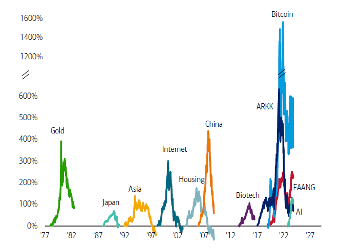

## Table of Contents

## What is an asset bubble?

An asset bubble happens when the price of something, like a house or a stock, goes up a lot more than it should. People start buying it because they think the price will keep going up. They might not care about how much the thing is really worth. They just want to buy it and sell it later for more money. This makes the price go up even more, even though the thing itself hasn't changed or gotten better.

But, eventually, people realize that the price is too high. They stop buying, and the price starts to fall. This can happen quickly, and a lot of people can lose money. It's called a bubble because it grows big and then pops. When it pops, it can cause problems for the economy because many people might have borrowed money to buy the asset, and now they can't pay it back.

## Can you explain the concept of a historical asset bubble?

A famous example of a historical asset bubble is the Dutch Tulip Mania in the 1600s. During this time, people in the Netherlands started buying tulip bulbs for very high prices. They thought the prices would keep going up, so they wanted to buy the bulbs and sell them later for more money. This made the prices go even higher, much more than what the tulips were actually worth. At one point, some tulip bulbs were worth more than a house! But then, people realized that the prices were too high and stopped buying. The prices crashed, and many people lost a lot of money.

Another example is the South Sea Bubble in the early 1700s in England. The South Sea Company was formed to trade with South America, but it didn't have many real profits. However, people started buying its stocks because they believed the company would make a lot of money in the future. The stock prices went up a lot, and more people wanted to buy them. But like the tulip bulbs, the stock prices were much higher than the company's real value. When people realized this, they started selling their stocks, and the prices fell quickly. Many people lost their savings, and it caused a big economic problem in England.

## What are some common characteristics of asset bubbles?

Asset bubbles often start when people get excited about something and think its price will keep going up. They might not care about how much the thing is really worth. They just want to buy it and sell it later for more money. This makes more people want to buy it, and the price goes up even more. It can happen with things like houses, stocks, or even tulip bulbs. People might borrow money to buy these things, hoping to make a profit when they sell.

But then, something changes. People start to think the price is too high and stop buying. When this happens, the price can fall quickly. This is called the bubble "popping." When it pops, it can cause big problems. People who borrowed money to buy the asset might not be able to pay it back. This can hurt the economy and make it hard for people to trust in buying things again. Asset bubbles are tricky because it's hard to know when they will start or end.

## What was the Tulip Mania and when did it occur?

Tulip Mania was a time when people in the Netherlands got really excited about tulip bulbs in the 1600s. They started buying the bulbs for very high prices because they thought the prices would keep going up. People wanted to buy the bulbs and sell them later for even more money. This made the prices go up a lot, much more than what the tulips were really worth. At one point, some tulip bulbs were worth more than a house!

But then, people realized that the prices were too high and stopped buying. The prices crashed, and many people lost a lot of money. This event is now known as one of the first big asset bubbles in history. It showed how people can get carried away with buying something just because they think its price will keep going up, even if it doesn't make sense.

## How did the South Sea Bubble impact the economy in the early 18th century?

The South Sea Bubble had a big impact on the economy in the early 18th century. It started when the South Sea Company, which was supposed to trade with South America, got a lot of attention. People started buying its stocks because they thought the company would make a lot of money. But the company didn't really have many profits, and the stock prices went up way too high. When people realized this, they started selling their stocks, and the prices fell quickly. This made a lot of people lose their savings.

When the bubble popped, it caused big problems for the economy. Many people had borrowed money to buy the stocks, and now they couldn't pay it back. This hurt businesses and made it hard for people to trust in buying things again. The government had to step in to help fix the mess. It took a long time for the economy to get better, and it made people more careful about investing in the future.

## What were the causes and effects of the Mississippi Bubble?

The Mississippi Bubble happened in France in the early 1700s. It started when a man named John Law created a company called the Mississippi Company. He said the company would make a lot of money by trading with the land around the Mississippi River. People got excited and started buying the company's stocks because they thought they would get rich. The prices of the stocks went up a lot, even though the company wasn't making much money. People were buying the stocks just because they thought the prices would keep going up.

But then, people realized that the prices were too high and the company wasn't as good as they thought. They started selling their stocks, and the prices fell quickly. This made a lot of people lose their money. When the bubble popped, it caused big problems for France's economy. Many people had borrowed money to buy the stocks, and now they couldn't pay it back. This hurt businesses and made it hard for people to trust in buying things again. It took a long time for France's economy to get better, and it made people more careful about investing in the future.

## Can you describe the Wall Street Crash of 1929 and its role as an asset bubble?

The Wall Street Crash of 1929 was a big event that happened in the United States. It started when people got really excited about buying stocks. They thought the prices would keep going up, so they bought a lot of them. This made the prices go up even more, even though the companies weren't worth that much. People were buying stocks on credit, which means they borrowed money to buy them. They hoped to sell the stocks later for more money and pay back the loans. But then, people started to think the prices were too high and stopped buying. When this happened, the stock prices fell quickly, and it's called the Wall Street Crash of 1929.

When the stock market crashed, it caused a lot of problems. Many people lost all their money because they couldn't sell their stocks for what they paid. People who borrowed money to buy stocks couldn't pay back their loans. This hurt banks and businesses, and it made it hard for people to trust in buying things again. The crash led to the Great Depression, which was a time when a lot of people were out of work and the economy was very bad. It took many years for things to get better, and it showed how dangerous it can be when people get too excited about buying something just because they think its price will keep going up.

## What led to the Japanese asset price bubble in the late 1980s?

The Japanese asset price bubble in the late 1980s was caused by a lot of excitement about buying things like land and stocks. People thought the prices would keep going up, so they bought a lot of them. The government and banks made it easy for people to borrow money to buy these things. This made the prices go up even more, much higher than what they were really worth. People were buying land and stocks just because they thought they could sell them later for more money.

But then, people started to think the prices were too high and stopped buying. When this happened, the prices fell quickly, and it's called the Japanese asset price bubble bursting. A lot of people lost their money because they couldn't sell their land and stocks for what they paid. People who borrowed money to buy these things couldn't pay back their loans. This hurt banks and businesses, and it made it hard for people to trust in buying things again. It took a long time for Japan's economy to get better, and it showed how dangerous it can be when people get too excited about buying something just because they think its price will keep going up.

## How did the Dot-com bubble form and eventually burst in the early 2000s?

The Dot-com bubble started in the late 1990s when people got really excited about internet companies. They thought these companies would make a lot of money in the future, so they started buying their stocks. The prices of these stocks went up a lot, even though many of the companies weren't making any money yet. People were buying the stocks just because they thought the prices would keep going up. This made more people want to buy them, and the prices went up even more. It was easy for people to borrow money to buy these stocks, which made the bubble grow bigger.

But then, in the early 2000s, people started to think the prices were too high and stopped buying. When this happened, the stock prices fell quickly, and it's called the Dot-com bubble bursting. A lot of people lost their money because they couldn't sell their stocks for what they paid. People who borrowed money to buy these stocks couldn't pay back their loans. This hurt businesses and made it hard for people to trust in buying things again. It took a long time for the economy to get better, and it showed how dangerous it can be when people get too excited about buying something just because they think its price will keep going up.

## What were the key factors behind the 2008 housing bubble and financial crisis?

The 2008 housing bubble and financial crisis started because people got really excited about buying houses. They thought the prices would keep going up, so they bought a lot of them. Banks made it easy for people to borrow money to buy houses, even if they couldn't really afford them. This made the prices go up even more, much higher than what the houses were really worth. People were buying houses just because they thought they could sell them later for more money. This made more people want to buy them, and the bubble grew bigger.

But then, people started to think the prices were too high and stopped buying. When this happened, the house prices fell quickly, and it's called the housing bubble bursting. A lot of people lost their money because they couldn't sell their houses for what they paid. People who borrowed money to buy these houses couldn't pay back their loans. This hurt banks and businesses, and it made it hard for people to trust in buying things again. The crisis spread to the whole economy, causing a lot of people to lose their jobs and making it hard for businesses to get money. It took a long time for things to get better, and it showed how dangerous it can be when people get too excited about buying something just because they think its price will keep going up.

## How do historical asset bubbles influence modern economic policies?

Historical asset bubbles have taught us a lot about how to make better economic policies today. Governments and central banks now watch the economy more closely to stop bubbles from getting too big. They look at things like how fast prices are going up and how much people are borrowing money. If they see a bubble starting, they might raise interest rates to make borrowing money more expensive. This can help slow down the bubble before it gets too big and pops. They also make rules to make sure banks and businesses are being careful with their money, so they don't take too many risks.

Another way historical bubbles affect modern policies is by making people more aware of the dangers of getting too excited about buying things. People and businesses are more careful about investing now. They think more about how much something is really worth, not just about how much its price might go up. Governments also help by teaching people about the risks of investing and how to make smart choices. This can help stop bubbles from starting in the first place. By learning from the past, we can try to keep the economy more stable and avoid big problems like the ones caused by historical bubbles.

## What lessons can investors learn from studying major historical asset bubbles?

Studying major historical asset bubbles teaches investors to be careful and not get too excited about buying things just because their prices are going up. These bubbles show that prices can go up a lot more than they should, but they can also fall quickly. Investors should always think about how much something is really worth, not just about how much its price might go up. They should also be careful about borrowing money to buy things, because if the price falls, they might not be able to pay back the loan.

Another lesson from historical bubbles is that it's important to look at the big picture. Investors should pay attention to what's happening in the economy and not just focus on one thing. If everyone is buying the same thing and the price is going up a lot, it might be a sign of a bubble. By learning from the past, investors can make smarter choices and avoid losing a lot of money when a bubble pops.

## References & Further Reading

1. Kindleberger, C. P., & Aliber, R. Z. (2011). *Manias, Panics, and Crashes: A History of Financial Crises*. Palgrave Macmillan. This classic text provides a comprehensive analysis of financial crises throughout history, exploring the dynamics of asset bubbles and their economic impacts.

2. Shiller, R. J. (2005). *Irrational Exuberance*. Princeton University Press. Shiller's work critically examines speculative bubbles in the stock and real estate markets, using empirical data and behavioral economic insights.

3. Malkiel, B. G. (2015). *A Random Walk Down Wall Street: The Time-tested Strategy for Successful Investing*. W. W. Norton & Company. The book offers insights into market inefficiencies and the occurrence of speculative bubbles, promoting a long-term investment approach.

4. Gorton, G. B. (2010). *Slapped by the Invisible Hand: The Panic of 2007*. Oxford University Press. This book provides an in-depth analysis of the 2008 financial crisis, exploring the housing bubble's role and the subsequent global recession.

5. Biais, B., & Woolley, P. (2012). *High-Frequency Trading*. Annual Reviews of Financial Economics, 4, 235-254. A detailed review of high-frequency trading practices, discussing their influence on market dynamics, asset pricing, and potential to exacerbate market bubbles.

6. Hendershott, T., Jones, C. M., & Menkveld, A. J. (2011). Does Algorithmic Trading Improve Liquidity? *The Journal of Finance, 66*(1), 1-33. This study investigates the impact of algorithmic trading on market liquidity and efficiency.

7. Brunnermeier, M. K., & Oehmke, M. (2013). *Bubbles, Financial Crises, and Systemic Risk*. National Bureau of Economic Research Macroeconomics Annual, 28(1), 85-153. This paper explores the relationship between asset bubbles, financial crises, and systemic risk.

8. Lewis, M. (2015). *Flash Boys: A Wall Street Revolt*. W. W. Norton & Company. Lewis's book sheds light on high-frequency trading, its potential pitfalls, and its impact on financial markets.

9. Shleifer, A., & Vishny, R. W. (1997). *The Limits of Arbitrage*. The Journal of Finance, 52(1), 35-55. An essential read on the constraints of arbitrage in financial markets and its implications for asset pricing bubbles.

These references provide a solid foundation for understanding the complexities of asset bubbles and the influence of [algorithmic trading](/wiki/algorithmic-trading) on financial markets.

