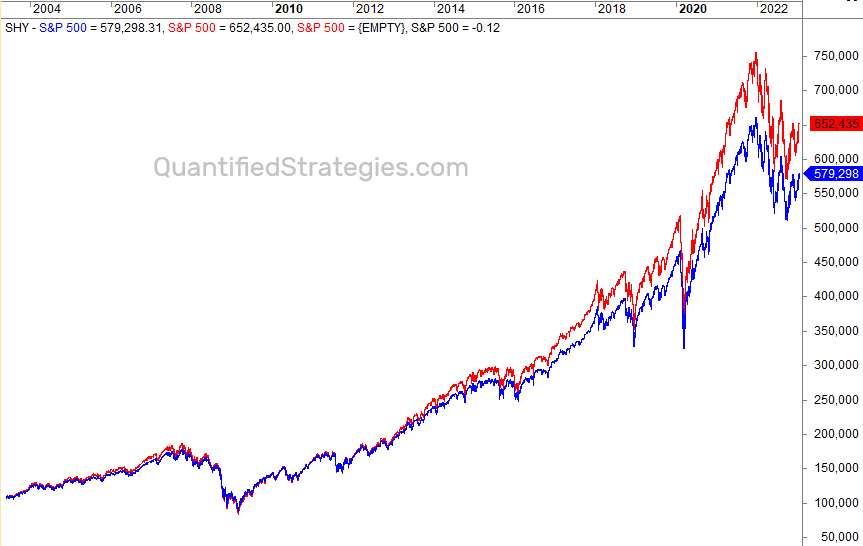

Warren Buffett is widely regarded as one of the most successful investors of all time. His legendary status in the field of investment is largely attributed to his company, Berkshire Hathaway, which holds a diversified investment portfolio. This portfolio attracts significant attention due to its composition and the insights it offers into Buffett's strategies. Known for his value-investing philosophy, Buffett emphasizes choosing stocks that are undervalued relative to their intrinsic worth. This approach has guided Berkshire Hathaway to achieve substantial returns over several decades, often outpacing broader market indices like the S&P 500.

This article explores Warren Buffett's stock holdings and their impact on Berkshire Hathaway's investment portfolio. Key holdings often include high-profile companies that reflect Buffett’s confidence in their long-term prospects, such as Apple, Bank of America, and Coca-Cola. The careful selection of these stocks showcases Buffett's preference for firms with robust fundamentals, strong management, and competitive advantages.



Moreover, the article considers the role of algorithmic trading in modern investment strategies. Algorithmic trading, or 'algo trading', leverages automated systems to execute transactions at high speed and accuracy, capitalizing on short-term market trends. This contrasts with Buffett’s traditional, long-term investment approach, providing a unique lens through which to view contemporary investment strategies. By understanding Buffett's investment strategy and the potential integration with modern trading technologies, readers can gain a comprehensive view of the evolving financial landscape.

## Table of Contents

## Overview of Warren Buffett's Investment Philosophy

Warren Buffett's investment philosophy is synonymous with value investing, a method focused on identifying stocks that the market has undervalued based on their intrinsic worth. By valuing companies through a detailed analysis of their financial statements, future earnings potential, assets, and liabilities, Buffett aims to buy stocks that are priced below their true value. This strategy, often encapsulated by the principle of "buy low, sell high", involves rigorous financial analysis and a deep understanding of the company's business model and potential for future growth.

Buffett is renowned for his long-term investment approach, prioritizing businesses with robust fundamentals. Key principles of his philosophy include a focus on companies with strong management, and inherent competitive advantages, often referred to as 'economic moats’. These features provide the business a sustainable edge over competitors, allowing it to maintain profitability over time. The willingness to accept short-term market volatility for the sake of long-term gains is a hallmark of Buffett's methodology, as he advocates for patience and discipline in holding onto investments that continue to possess intrinsic value.

Over several decades, this philosophy has enabled Berkshire Hathaway to consistently outperform the S&P 500. Historical data shows that from 1965 to 2020, Berkshire Hathaway achieved an average annual return of approximately 20%, sharply exceeding the market's average of about 10%. This impressive track record is attributed to Buffett's strategic selection of companies whose intrinsic values are not reflected in their market prices at the time of investment.

Buffett's preference for blue-chip stocks underscores his investment philosophy. Blue-chip companies are typically well-established, financially sound enterprises with a history of reliable performance. Examples of such investments include American Express, Coca-Cola, and Johnson & Johnson, which have provided steady returns through their inherent stability and reputation for enduring market leadership. These companies often feature in Berkshire Hathaway’s portfolio due to their ability to generate sustainable profits and withstand financial adversities. 

Buffett's approach remains a touchstone for investors seeking to combine analytical rigor with strategic patience, driven by the belief that intrinsic value will eventually be recognized by the market. This fundamental commitment to value investing continues to guide Berkshire Hathaway toward stable and long-term financial success.

## Key Holdings in Berkshire Hathaway's Portfolio

Berkshire Hathaway's investment portfolio is a subject of significant attention, largely due to the influence of Warren Buffett's strategic selections. A foremost component of this portfolio is Apple Inc., which constitutes a substantial share. As of recent filings, Apple alone accounts for a considerable percentage of the overall holdings, underscoring Buffett’s confidence in its long-term stability and growth potential.

Beyond Apple, Berkshire Hathaway's portfolio is diversified across several high-profile stocks. Bank of America is another major holding, highlighting Buffett’s belief in the resilience and profitability of the financial sector. This investment echoes his broader strategy of investing in blue-chip companies with a solid foundation and capacity for sustained performance over time.

Coca-Cola represents another cornerstone of Berkshire's investments and serves as a classic example of Buffett’s affinity toward companies with strong brand recognition and consumer loyalty. Having held a position in Coca-Cola for decades, Buffett has frequently cited its enduring brand power and consistent dividend returns as key factors.

Further reflecting his strategic foresight, Berkshire Hathaway holds significant stakes in American Express and Chevron. American Express corresponds to Buffett’s interest in financial services companies that benefit from cyclical economic improvements and boast a steady customer base. Chevron aligns with his approach to energy investments, betting on established firms amidst fluctuating market conditions.

These selections underscore a broader pattern in Buffett’s investment strategy, which favors companies equipped with proven track records and inherent competitive strengths. By focusing on businesses with the potential for sustainable growth and income generation, Berkshire Hathaway’s portfolio consistently reflects Buffett's value investing principles.

## The Role of Algorithmic Trading in Modern Investing

Algorithmic trading, commonly known as 'algo trading', represents a significant evolution in the methods used by investors and traders to engage with financial markets. This practice utilizes computer algorithms to automatically execute trading orders at high speeds that transcend human capabilities. The core of [algorithmic trading](/wiki/algorithmic-trading) lies in its ability to analyze market conditions, identify trading opportunities, and execute trades with unparalleled precision and speed.

At its essence, algorithmic trading is driven by predefined sets of rules or instructions. These instructions, or algorithms, incorporate various parameters such as timing, price, quantity, and even complex mathematical models that account for large volumes of data. The primary advantage of algo trading is its ability to rapidly execute transactions, a quality that is especially valuable in fast-paced markets where millisecond advantages can lead to significant profits.

The influence of algorithmic trading on financial markets is profound, with estimates suggesting that it accounts for a substantial percentage of trading activity in major exchanges across the world. Its advantages are clear: speed, reduced transaction costs, and the elimination of human errors associated with emotional and psychological factors. Additionally, algorithmic trading can simultaneously monitor and execute trades across multiple markets and instruments, providing an edge that is increasingly critical in today’s interconnected global markets.

The deployment of algorithmic trading often leverages high-frequency trading ([HFT](/wiki/high-frequency-trading-strategies)), a subset that focuses on executing a large number of orders at very high speeds. HFT strategies typically exploit small price discrepancies that exist for extremely short periods, requiring both advanced technology and sophisticated algorithms to be successful.

Python code is frequently used in developing algorithmic trading strategies due to its simplicity and robust libraries that support data analysis and algorithm development. For example, a basic algorithmic trading strategy in Python might involve using historical price data to develop a moving average crossover strategy. Here is a simplified Python snippet to illustrate such an implementation:

```python
import pandas as pd

# Sample function to calculate moving averages and generate trading signals
def moving_average_strategy(prices, short_window, long_window):
    signals = pd.DataFrame(index=prices.index)
    signals['price'] = prices
    signals['short_mavg'] = prices.rolling(window=short_window, min_periods=1).mean()
    signals['long_mavg'] = prices.rolling(window=long_window, min_periods=1).mean()
    signals['signal'] = 0.0
    signals['signal'][short_window:] = np.where(signals['short_mavg'][short_window:] 
                                                 > signals['long_mavg'][short_window:], 1.0, 0.0)   
    signals['positions'] = signals['signal'].diff()
    return signals

# Assuming 'data' is a DataFrame with a 'Close' column for stock prices
short_window = 40
long_window = 100
signals = moving_average_strategy(data['Close'], short_window, long_window)
```

Despite its many advantages, algorithmic trading also has potential pitfalls. Market [liquidity](/wiki/liquidity-risk-premium) can be affected due to the uniformity of algorithms executing similar strategies, leading to herding behavior. Moreover, technical failures and systemic risks associated with automated systems necessitate robust risk management and regulatory oversight.

In contrast to the methodology employed by traditional investors like Warren Buffett, algorithmic trading tends to prioritize short-term movements and trends over long-term value assessments. While Buffett's strategies are rooted in [fundamental analysis](/wiki/fundamental-analysis) focusing on intrinsic company value and sustainable growth, algorithmic trading often tilts towards technical analysis and statistical [arbitrage](/wiki/arbitrage), highlighting the diverse array of strategies available to modern investors.

## Comparison Between Buffett’s Approach and Algorithmic Trading

Warren Buffett's investment approach and algorithmic trading represent fundamentally different strategies within the financial markets, each with unique characteristics and implications for investors. 

Buffett's strategy is deeply rooted in fundamental analysis, which involves a thorough evaluation of a company's intrinsic value by examining its financial statements, management quality, competitive position, and other qualitative and quantitative factors. This approach necessitates an extensive understanding of the business, its industry, and its long-term potential. Buffett typically favors blue-chip stocks, known for their stability and consistent performance. His preference for a long-term investment horizon is premised on the belief that holding high-quality companies will yield compound returns over time, a strategy that has historically enabled Berkshire Hathaway to outperform the broader market indices, such as the S&P 500. 

Conversely, algorithmic trading, or algo trading, employs automated systems to execute transactions at high speed based on pre-set criteria. Algorithms are designed to capitalize on short-term market inefficiencies and fluctuations, often utilizing technical analysis and statistical methods to identify trading opportunities. This can include high-frequency trading where trades are completed within milliseconds. Algorithmic systems are highly data-driven, processing vast amounts of market data in real-time to make decisions. The reliance on statistical models and pattern recognition allows algo trading to exploit trends and execute trades with precision and timing that human traders cannot match.

The juxtaposition of Buffett’s fundamental analysis-driven, long-term strategy with the data-intensive, short-term focus of algorithmic trading highlights the diverse range of investment strategies available today. Each method carries distinct risks and advantages. Buffett's approach may be more resilient to market [volatility](/wiki/volatility-trading-strategies) and focused on sustainable growth, whereas algorithmic trading offers speed and the potential for exploiting immediate market movements but may be susceptible to rapid shifts in market conditions without human oversight.

For investors, the choice between these strategies often hinges on their objectives, risk tolerance, and market perspective. Those seeking stable, long-term growth may align more closely with Buffett’s traditional strategies. However, investors looking for rapid gains and who are comfortable navigating the complexities of technology might find algorithmic trading appealing. This diversity in investment approaches underscores the dynamic nature of financial markets, where varied methodologies can lead to success, depending on an individual's goals and the specific context of their investment portfolio.

## Potential Integration of Traditional and Algorithmic Strategies

The integration of traditional value investing principles, championed by Warren Buffett, with contemporary algorithmic trading strategies represents a burgeoning area of interest in the investment community. This integration seeks to combine the methodical, research-driven approach of value investing with the data processing and speed advantages afforded by algorithmic trading.

Value investing, as practiced by Buffett, focuses on identifying stocks that are undervalued in relation to their intrinsic worth. This approach involves extensive research and analysis of a company's financial health, management quality, and competitive positioning. Buffett's long-term horizon is well-documented; however, the advent of algorithmic trading offers new possibilities for enhancing this traditional approach.

Algorithmic trading leverages computational power to analyze vast datasets, identify trends, and execute trades at speeds unattainable by human traders. By integrating these algorithms with value investing principles, investors can potentially improve decision-making processes, utilizing data-driven insights to reinforce more traditional methods. For instance, algorithms can be employed to scan for stocks that meet specific value investing criteria, conducting initial screens that save investors considerable time and effort.

Additionally, [machine learning](/wiki/machine-learning) models can be trained to recognize patterns and forecast financial outcomes based on historical data, which supports fundamental analysis. This approach allows for the rapid evaluation of a vast number of companies, ensuring that opportunities are identified and assessed with a level of precision and speed that manual methods could not match.

Python, a popular programming language in this domain, offers robust libraries such as pandas, NumPy, and scikit-learn, which are well-suited for data analysis and machine learning tasks. For example, a simple implementation in Python might involve using pandas to manage financial data, employing NumPy to perform numerical computations, and leveraging scikit-learn to build and train predictive models. The use of such tools can efficiently narrow down the list of potential investments that align with Buffett's value investing philosophy.

In conclusion, while traditional value investing and algorithmic trading operate on fundamentally different paradigms, their integration holds promise for creating a more refined and dynamic investment strategy. The ability to synthesize Buffett’s disciplined approach with the rapid, data-driven capabilities of modern algorithms could provide a competitive edge, theoretically enabling investors to achieve superior outcomes while adhering to the tenets of value investing.

## Conclusion

Warren Buffett's investment portfolio serves as a benchmark for value investing strategies, demonstrating sustained success through its adherence to fundamental principles. His approach focuses on identifying undervalued companies with strong financial health, a robust competitive edge, and competent management. This methodology has consistently delivered impressive outcomes, with Berkshire Hathaway often outperforming broader market indices like the S&P 500.

On the other hand, algorithmic trading offers a contemporary, data-driven approach to investments. It leverages technological advancements to execute trades at high speed, analyzing vast datasets to identify short-term market trends and opportunities. While these two strategies appear distinct, exploring how they might be integrated could provide new insights into investment management. A synthesis of these methods might use algorithmic tools for detailed data analysis while maintaining value-oriented decision-making processes, potentially enhancing investment results.

Ultimately, deciding between these approaches—or considering a combination thereof—depends on an investor’s specific objectives, tolerance for risk, and broader market perspective. Those inclined towards a long-term, stable growth model may align with Buffett's methodology, whereas those seeking rapid profits might prefer algorithmic tactics. Each strategy offers unique opportunities and challenges, and the ideal choice will vary based on individual goals and market conditions.

## References & Further Reading

[1]: Hagstrom, R. G. (2013). ["The Warren Buffett Way"](https://www.amazon.com/Warren-Buffett-Way-Robert-Hagstrom/dp/1118503252). Wiley.

[2]: Graham, B. (2006). ["The Intelligent Investor: The Definitive Book on Value Investing."](https://www.amazon.com/Intelligent-Investor-Definitive-Investing-Essentials/dp/0060555661) Collins Business Essentials.

[3]: Tharp, V. K. (2013). ["Trade Your Way to Financial Freedom"](https://www.amazon.com/Trade-Your-Way-Financial-Freedom/dp/007147871X). McGraw-Hill Education.

[4]: Buffett, W. E., & Cunningham, L. A. (2001). ["The Essays of Warren Buffett: Lessons for Corporate America."](https://yourknowledgedigest.org/wp-content/uploads/2020/04/the-essays-of-warren-buffett.pdf) The Cunningham Group.

[5]: Menkveld, A. J. (2016). "The Economics of High-Frequency Trading: Taking Stock." Annual Review of Financial Economics, 8, 1-24.