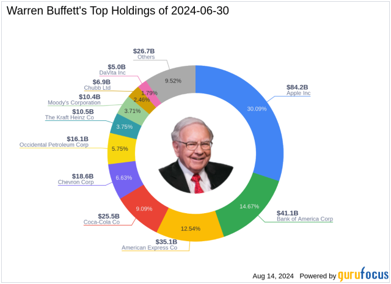

## Table of Contents

## What is Warren Buffett's investment philosophy?

Warren Buffett's investment philosophy is based on value investing. This means he looks for companies that are undervalued, or priced lower than what they are really worth. He believes in buying these companies and holding onto them for a long time. Buffett learned a lot from Benjamin Graham, who wrote the famous book "The Intelligent Investor." Graham taught him to focus on the company's fundamentals, like its earnings and assets, rather than just following the stock market trends.

Buffett also stresses the importance of understanding the businesses he invests in. He only invests in companies he knows well and believes will do well in the future. He looks for companies with strong competitive advantages, or what he calls "economic moats." These are things that make it hard for other companies to compete with them. For example, a strong brand or a unique technology can be an economic moat. Buffett also believes in being patient and not getting swayed by short-term market changes. He says that the stock market is there to serve you, not to guide you.

Overall, Buffett's approach is about being smart, patient, and sticking to what you know. He avoids risky investments and focuses on long-term growth. By doing this, he has been able to build a huge amount of wealth over many years. His philosophy is not just about making money, but about making wise choices that stand the test of time.

## Who is Warren Buffett and why is his portfolio significant?

Warren Buffett is a very famous investor and businessman. He was born in 1930 in Nebraska, USA. He is known as the "Oracle of Omaha" because he lives in Omaha and is very good at [picking](/wiki/asset-class-picking) investments. He started investing when he was just a kid and became very rich by buying and holding onto good companies for a long time. He runs a big company called Berkshire Hathaway, which owns many other companies and investments.

Buffett's portfolio is significant because it shows how he invests his money and what he believes in. His portfolio includes big companies like Apple, Coca-Cola, and Bank of America. People watch his portfolio closely because it can give them ideas about what might be good investments. Also, because he is so successful, many people try to copy what he does. His choices can affect the stock market and show what he thinks will do well in the future.

## What are the top holdings in Warren Buffett's portfolio?

Warren Buffett's portfolio includes many big companies. Some of the top holdings are Apple, Bank of America, and Coca-Cola. These are companies that Buffett believes will do well over a long time. Apple is the biggest holding in his portfolio. He started buying Apple stock in 2016 and has kept adding to it because he thinks Apple is a great company with strong products and a loyal customer base.

Bank of America is another big holding. Buffett likes this bank because it is one of the largest in the U.S. and he trusts its management. Coca-Cola is also a big part of his portfolio. Buffett has owned Coca-Cola stock for a very long time, starting in the late 1980s. He likes Coca-Cola because it has a strong brand and makes money all over the world. These top holdings show what Buffett looks for in a company: strong brands, good management, and the ability to grow over time.

## How does Warren Buffett select companies for investment?

Warren Buffett picks companies by looking for ones that are a good deal. He wants to buy them when they are cheaper than what they are really worth. He learned this from a man named Benjamin Graham, who taught him to check the company's earnings and what it owns. Buffett also makes sure he understands the business well before he invests. He only puts money into companies he knows a lot about and thinks will do well in the future.

Buffett also looks for companies that have something special that makes them hard to compete with. He calls this an "economic moat." It could be a famous brand, like Coca-Cola, or a unique technology that other companies don't have. He likes companies that can keep making money over a long time. Buffett is patient and doesn't worry about what the stock market is doing every day. He believes in holding onto good companies for many years, which is why he has been so successful.

## What percentage of Berkshire Hathaway's portfolio is allocated to its top 5 holdings?

A big part of Berkshire Hathaway's money is put into just a few companies. The top 5 holdings make up about 75% of the whole portfolio. This means that three out of every four dollars in the portfolio are in these top companies. The biggest one is Apple, which takes up a lot of the money. The other big ones are Bank of America, Coca-Cola, American Express, and Chevron.

Buffett likes to focus on a few good companies instead of spreading his money out too much. By putting so much in the top 5, he shows he really believes in these companies. He thinks they will keep doing well and making money for a long time. This way of investing has worked well for him over many years.

## How have the major holdings in Buffett's portfolio performed over the last decade?

Over the last 10 years, the major holdings in Warren Buffett's portfolio have done very well. Apple, which is the biggest part of his portfolio, has grown a lot. When Buffett started buying Apple stock in 2016, it was already a big company, but it has gotten even bigger since then. The stock price has gone up a lot, and Apple has kept making new products that people want to buy. Bank of America, another big holding, has also done well. It has been able to make more money and grow, even when the economy has had some tough times.

Coca-Cola has been a steady performer for Buffett. He started buying Coca-Cola stock a long time ago, and it has kept paying dividends, which means it gives money back to its shareholders regularly. Even though it doesn't grow as fast as Apple, Coca-Cola is a reliable company that keeps making money. American Express and Chevron have also been important parts of his portfolio. American Express has grown its business and made more money, while Chevron has had ups and downs because of changes in oil prices, but it is still a strong company. Overall, these major holdings have helped Buffett's portfolio grow a lot over the last decade.

## What industries are most represented in Warren Buffett's current investment portfolio?

Warren Buffett's investment portfolio includes companies from many different industries, but some are more common than others. The biggest industry in his portfolio is technology, with Apple being the largest holding. Apple makes smartphones, computers, and other tech products. Buffett also has a lot of money in the financial industry, with big investments in companies like Bank of America and American Express. These companies deal with banking and credit cards.

Another important industry in Buffett's portfolio is consumer goods. Coca-Cola, a company that makes drinks, is one of his long-time favorites. He also has investments in companies like Kraft Heinz, which makes food products. The energy sector is also well-represented, with Chevron being a major holding. Chevron is an oil and gas company. Overall, Buffett's portfolio shows that he likes to invest in industries that he understands well and that he thinks will keep making money over time.

## How does Warren Buffett's approach to diversification differ from traditional investment strategies?

Warren Buffett's approach to diversification is different from what many people think of as traditional investment strategies. Traditional strategies often tell people to spread their money out over many different kinds of investments. This is to lower the risk of losing money if one investment does badly. But Buffett doesn't spread his money out as much. He believes in putting a lot of money into a few companies that he really believes in. He thinks that if you know a lot about a company and it's a good one, it's better to put more money into it than to spread it out too thinly.

Buffett's way of doing things is based on his confidence in his own choices. He spends a lot of time learning about the businesses he invests in. Because he knows so much about them, he is willing to put a big part of his money into just a few companies. For example, a large part of his portfolio is in companies like Apple and Bank of America. He thinks that focusing on a few great companies can lead to bigger gains than trying to own a little bit of everything. This approach has worked well for him, but it's not what most people are taught about diversification.

## What are the long-term investment strategies employed by Warren Buffett in his major holdings?

Warren Buffett's long-term investment strategy is all about buying good companies and holding onto them for a long time. He looks for companies that are undervalued, meaning they are cheaper than what they are really worth. Once he finds these companies, he buys a lot of their stock and keeps it for many years. He believes that if you buy a great company at a fair price, it will grow and make more money over time. This is why he has held onto companies like Coca-Cola for decades. He doesn't worry about short-term changes in the stock market because he knows that good companies will do well in the long run.

Buffett also focuses on companies that have a strong competitive advantage, which he calls an "economic moat." This means the company has something special that makes it hard for other companies to compete with it. For example, Apple has a strong brand and loyal customers, which makes it hard for other tech companies to take away its business. By investing in companies with these advantages, Buffett believes they will keep making money and growing. His strategy is about being patient, understanding the business well, and sticking with it for the long haul. This approach has helped him build a huge amount of wealth over many years.

## How does Warren Buffett manage risk within his portfolio, particularly with his major holdings?

Warren Buffett manages risk in his portfolio by focusing on companies he knows well and believes in for the long term. He doesn't like to take big risks with his money. Instead, he looks for companies that are a good deal and have something special that makes them hard to compete with. He calls this an "economic moat." By investing in these kinds of companies, like Apple and Coca-Cola, he thinks they will keep making money and growing, even if the stock market goes up and down.

Buffett also spreads his money out, but not in the way most people do. Instead of owning a little bit of many different things, he puts a lot of money into a few companies he really trusts. This means that if one of his big investments does badly, it could hurt his portfolio a lot. But he is okay with this because he believes in these companies so much. He thinks that over many years, these good companies will do well and make up for any short-term problems.

## What are some lesser-known but significant holdings in Warren Buffett's portfolio?

Warren Buffett's portfolio is not just about the big names like Apple and Coca-Cola. He also has some lesser-known but still important investments. One of these is a company called Moody's. Moody's is a company that rates how safe it is to lend money to other companies or governments. Buffett likes Moody's because it has a strong position in its industry and makes good money. Another lesser-known holding is DaVita, a company that runs kidney dialysis centers. Buffett sees DaVita as a steady business that helps a lot of people and makes money in a way that is not affected too much by the economy.

Another interesting but lesser-known investment in Buffett's portfolio is a company called Liberty Media. This company owns a lot of different businesses, including sports and entertainment. Buffett likes Liberty Media because it has a lot of different ways to make money, which can help spread out risk. He also owns part of a company called StoneCo, which is a payment processing company in Brazil. Even though these companies are not as famous as some of his other holdings, they show that Buffett is always looking for good deals and companies that he thinks will do well over time.

## How do global economic conditions influence Warren Buffett's decisions regarding his major holdings?

Global economic conditions play a big role in Warren Buffett's decisions about his major holdings. He keeps a close eye on what's happening around the world because it can affect the companies he owns. For example, if there's a big economic downturn, like a recession, he knows that companies like Bank of America might have a harder time making money. But he also looks for opportunities during tough times. When stock prices go down because people are worried, Buffett might see it as a chance to buy more shares of a good company at a lower price. He believes that over time, the economy will get better, and the companies he invests in will do well again.

Buffett also thinks about how global events can impact specific industries. For instance, changes in oil prices can affect Chevron, one of his major holdings. If oil prices go up, Chevron might make more money, but if they go down, it could hurt the company. He also considers how things like trade wars or changes in government policies might affect companies like Apple, which sells products all over the world. Even though global economic conditions can be unpredictable, Buffett tries to make smart choices by understanding how these conditions might affect his investments in the long run.

## References & Further Reading

[1]: Hagstrom, R. G. (2013). ["The Warren Buffett Way"](https://www.amazon.com/Warren-Buffett-Way-Robert-Hagstrom/dp/1118503252). Wiley.

[2]: Graham, B. (2006). ["The Intelligent Investor: The Definitive Book on Value Investing."](https://www.amazon.com/Intelligent-Investor-Definitive-Investing-Essentials/dp/0060555661) Collins Business Essentials.

[3]: Tharp, V. K. (2013). ["Trade Your Way to Financial Freedom"](https://www.amazon.com/Trade-Your-Way-Financial-Freedom/dp/007147871X). McGraw-Hill Education.

[4]: Buffett, W. E., & Cunningham, L. A. (2001). ["The Essays of Warren Buffett: Lessons for Corporate America."](https://yourknowledgedigest.org/wp-content/uploads/2020/04/the-essays-of-warren-buffett.pdf) The Cunningham Group.

[5]: Menkveld, A. J. (2016). "The Economics of High-Frequency Trading: Taking Stock." Annual Review of Financial Economics, 8, 1-24.