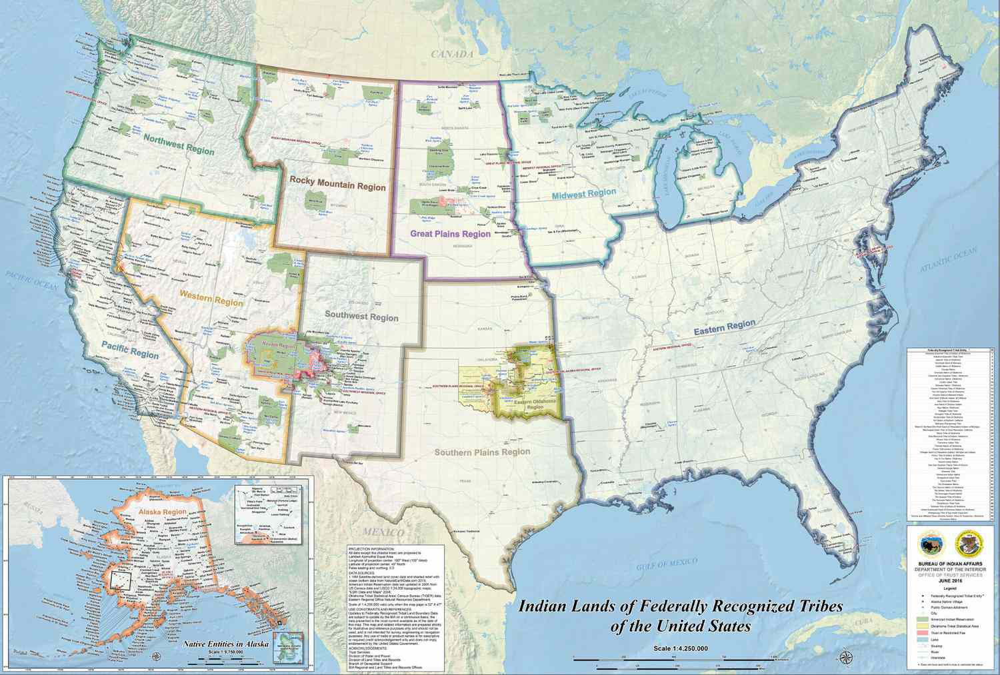

Indigenous tribes and Native American groups hold a significant place in the cultural and historical tapestry of the United States. For millennia, these communities have contributed to the rich heritage of the nation through their unique traditions, languages, and social structures. The recognition of their enduring legacy and customs is crucial to understanding the broader narrative of American history.

In recent years, there has been a noticeable increase in the involvement of Indigenous populations in a variety of modern fields, including technology and finance. This engagement is not just a testament to the adaptability and resilience of these communities, but also a reflection of their active pursuit of economic self-sufficiency and sustainability in a rapidly evolving world. Among these pursuits is the intriguing and relatively nascent participation of Native American groups in algorithmic trading—a field traditionally dominated by major financial institutions.



Algorithmic trading, a transparent method that uses mathematical models and automated systems to execute trades, has attracted the attention of various sectors aiming to harness its potential for economic gain. The growing intersection between Indigenous groups and this innovative financial practice is particularly noteworthy. It suggests a shift towards combining traditional economic activities with cutting-edge technology, thereby creating new opportunities for economic empowerment.

This intersection is not without its complexities. The integration of algorithmic trading practices involves navigating challenges such as ensuring cultural values are upheld while engaging with highly technical and economically driven sectors. It invites a broader conversation on how Indigenous communities can maintain their cultural identities while exploring modern economic avenues.

This article explores the connection between Indigenous tribes and algorithmic trading, shedding light on the potential impacts this relationship could have on Indigenous communities. It aims to provide insights into how this intersection could influence cultural preservation, economic development, and the future participation of Indigenous populations in high-tech financial markets.

## Table of Contents

## Understanding Indigenous Tribes and Native American Groups in the U.S.

Indigenous tribes and Native American groups in the United States represent a vast and diverse array of cultures and histories that have significantly shaped the nation's heritage. These groups, including well-known tribes such as the Navajo, Cherokee, Sioux, and Lakota, among many others, provide a vital link to understanding the cultural and historical context of North America before European colonization. Historically, Indigenous tribes have made substantial contributions to American culture, ranging from agricultural practices like the "Three Sisters" farming technique—corn, beans, and squash—to sustainable living practices and medicinal knowledge.

The diversity among Indigenous tribes is notable, with each group exhibiting distinct languages, traditions, and social structures. For example, the Navajo people are renowned for their weaving and artwork, while the Iroquois Confederacy is celebrated for its sophisticated political system that served as an inspiration for the American democratic system. The cultural richness of these tribes is reflected in an array of languages, with over 300 indigenous languages historically spoken across the continent, although many are endangered today.

Current demographic [statistics](/wiki/bayesian-statistics) indicate that there are approximately 574 federally recognized tribes in the United States. The Native American population is estimated to be around 6.9 million, accounting for about 2% of the total U.S. population as per the U.S. Census Bureau data. This population is diverse in its socio-economic status, with many tribes struggling with challenges such as poverty, unemployment, and education disparities. According to statistics from the National Congress of American Indians, the poverty rate among Native American and Alaska Native families is more than twice the national average, highlighting significant socio-economic challenges.

Despite facing numerous challenges, Indigenous tribes continue to uphold rich cultural traditions and are increasingly participating in economic ventures, thereby asserting their sovereignty and striving for economic development. Issues such as healthcare, education, and maintaining cultural heritage remain at the forefront of their socio-economic pursuits, as tribes navigate contemporary challenges while preserving their unique cultural identities.

In summary, the Indigenous tribes and Native American groups in the United States are marked by their historical significance and cultural contributions. Their diversity and the unique characteristics that distinguish each tribe are vital to understanding the broader spectrum of American heritage. However, despite the cultural richness, significant socio-economic challenges persist, necessitating continued efforts to address these issues while promoting the welfare and growth of Indigenous communities.

## The Economic Landscape of Indigenous Populations

Native American groups have historically engaged in a variety of economic activities that have shaped their societies and relationships with the environment. Traditionally, many Indigenous communities practiced hunting, fishing, gathering, and agriculture, which were crucial for their sustenance and cultural practices. These activities were often guided by profound spiritual and ecological knowledge passed down through generations, reflecting a symbiotic relationship with nature.

Over time, the economic landscape for Indigenous populations has transformed due to external pressures such as colonization, land dispossession, and forced assimilation policies. Despite these challenges, many tribes have adapted by diversifying their economic activities. Today, some of the primary economic sectors that Indigenous populations are involved in include agriculture, energy production, gaming, tourism, and artisanal crafts. Notably, tribal gaming has become a significant economic driver, with some tribes successfully operating casinos and using the revenues to fund community development, education, and health services.

Another key [factor](/wiki/factor-investing) shaping Indigenous economies is tribal sovereignty. Tribal sovereignty refers to the inherent authority of Indigenous tribes to govern themselves within the borders of the United States. This legal recognition allows tribes to establish and enforce their economic regulations, often leading to innovative approaches in economic development. Self-determination enables tribes to enter into business ventures, manage natural resources, and negotiate partnerships and agreements that respect their cultural and economic priorities.

Tribal sovereignty plays a crucial role in economic development and self-determination by providing a framework for tribes to pursue economic activities aligned with their values and goals. For example, some tribes prioritize sustainable practices that align with traditional environmental stewardship, while others focus on sectors like renewable energy to ensure long-term economic viability. Additionally, the ability to control their education systems, healthcare, and housing through sovereign governance supports a holistic approach to improving socio-economic conditions.

In summary, the economic landscape of Indigenous populations in the U.S. has evolved significantly from traditional practices to contemporary diversified sectors. The roles of tribal sovereignty and self-determination remain pivotal in shaping economic strategies and empowering Native American communities to thrive within and beyond their traditional territories.

 to Algorithmic Trading

Algorithmic trading, often termed algo trading, refers to the use of computer programs and systems to execute trades in financial markets based on predetermined criteria and algorithms. This method leverages complex mathematical models and formulas to take advantage of market inefficiencies, aiming to optimize the speed and accuracy of trade execution. At its core, [algorithmic trading](/wiki/algorithmic-trading) is designed to minimize human intervention, thus reducing the potential for errors and emotional biases in trading decisions. 

The basic principles of algorithmic trading revolve around automation, speed, efficiency, and precision. Algorithms are employed to analyze numerous market variables such as price, timing, and [volume](/wiki/volume-trading-strategy). These algorithms work by scanning market data continuously and executing trades based on the parameters pre-set by the traders. This process can be expressed through a simple conceptual model:

$$
\text{Trade Signal} = f(\text{Market Data}, \text{Predetermined Strategy})
$$

where $f$ denotes the function defined by the algorithm that determines when to buy or sell based on the incoming market data.

In mainstream financial markets, algorithmic trading has gained substantial traction. It now accounts for a significant portion of the trades on major stock exchanges. Estimates suggest that algo trading contributes to approximately 70% of the total trading volume in U.S. equity markets, illustrating its dominance in high-frequency trading environments. This prevalence is driven by the ability of algorithms to perform trades within milliseconds—a speed inconceivable for human traders—which is crucial in the highly competitive landscape of financial markets.

Technological advancements have been pivotal in the evolution of trading methods from traditional, manual processes to highly automated systems. Innovations in computing power, data processing capabilities, and [machine learning](/wiki/machine-learning) have empowered algorithms to evolve continuously and adapt to new market conditions. Technologies such as [artificial intelligence](/wiki/ai-artificial-intelligence) enable traders to develop predictive models that learn from historical data. For example, machine learning algorithms might be used to predict the price movements of a stock based on historical trends and patterns:

```python
from sklearn.ensemble import RandomForestRegressor
import numpy as np

# Example of price prediction model using historical data
def predict_price(history_data):
    X = np.array(history_data['features'])  # Historical features
    y = np.array(history_data['target'])    # Target variable (price)

    model = RandomForestRegressor()
    model.fit(X, y)

    future_features = np.array(history_data['future_features'])
    predicted_price = model.predict(future_features)
    return predicted_price
```

These technological shifts facilitate a transition from the traditional methodologies, which relied heavily on human expertise and intuition, to modern approaches driven by data science and quantitative analysis. The integration of technology in trading has fostered a more efficient, transparent, and accessible marketplace, redefining how financial services operate across the globe. By embracing these innovations, traders can capitalize on opportunities presented by [volatility](/wiki/volatility-trading-strategies) and market trends with increased precision and reduced transaction costs.

## Indigenous Participation in Algorithmic Trading

The integration of Indigenous tribes into algorithmic trading represents an innovative frontier in modern financial markets. Indigenous participation in this field is not merely a shift in economic activities but signifies a broader recognition of the potential these communities have in navigating and shaping cutting-edge financial technologies. Historically, Indigenous tribes have been involved in various economic pursuits, but the complexity of algorithmic trading introduces both opportunities and challenges.

**Case Studies and Examples**

Several Native American groups have ventured into modern financial markets, seeking to leverage algorithmic trading as a means of economic empowerment. For instance, the Navajo Nation has explored investment strategies that include algorithmic trading to generate revenue and support community development projects. Such initiatives reflect a growing ambition to transcend traditional economic limitations and engage with global market dynamics.

The First Nations in Canada have also shown interest in financial technologies, collaborating with educational institutions to create learning programs that include coding and financial analytics. These programs aim to equip community members with the skills needed to participate in high-frequency trading markets. By fostering such collaborations, these groups are not only participating in algorithmic trading but are also setting a precedent for integrating advanced financial strategies with community development.

**Economic Empowerment and Challenges**

Indigenous participation in algorithmic trading holds the promise of significant economic empowerment. Through strategic investments and the use of sophisticated trading algorithms, these communities can generate new revenue streams, reduce reliance on traditional funding sources, and foster economic self-sufficiency. Algorithmic trading, with its capability to process massive volumes of data and execute trades at high speed, offers a unique tool for maximizing financial returns.

However, there are notable challenges. Algorithmic trading requires substantial initial investment in technology and expertise, which may be a barrier for some Indigenous communities. Furthermore, the volatility and complexity of financial markets pose risks that necessitate comprehensive risk management strategies. Without adequate infrastructure and expertise, these risks might outweigh potential benefits.

Moreover, there is the challenge of preserving cultural values while engaging with modern financial systems. Indigenous communities have long emphasized sustainability and communal well-being, values that can sometimes be at odds with the profit-driven nature of financial markets. Thus, creating a model of algorithmic trading that aligns with community values is crucial.

In conclusion, the involvement of Indigenous tribes in algorithmic trading is a testament to their adaptability and vision. While the path is laden with obstacles, the potential for economic empowerment and innovation offers a compelling narrative of progress and resilience. Through continued learning, collaboration, and strategic alignment with cultural values, Indigenous communities can redefine their economic futures in the context of modern financial markets.

## The Intersection of Culture and Technology

Indigenous communities are increasingly intertwining their rich cultural heritage with technological innovations. This intersection presents a unique opportunity for these groups to leverage modern tools while honoring their ancestral traditions. One notable example is the adoption of technology to preserve and revitalize Indigenous languages. Digital platforms and mobile applications are being developed to document, teach, and promote the use of native languages, ensuring that these vital aspects of cultural identity endure for future generations.

Furthermore, technology provides Indigenous groups with the means to enhance traditional economic practices. For instance, many communities rely on agriculture, arts, and crafts as primary sources of income. Online marketplaces and e-commerce platforms allow them to reach broader audiences, thereby boosting economic prospects without compromising cultural expressions. This symbiosis enables Indigenous artisans to maintain traditional craftsmanship while tapping into global markets, exemplifying how cultural values can coexist with contemporary economic practices.

However, the integration of technology is not without challenges. A significant concern is the potential for cultural dilution. As Indigenous communities engage with broader economic systems, there is a risk that cultural practices could be commercialized in ways that erode their original meanings and significance. To address this, many groups are proactively setting guidelines and standards that safeguard cultural integrity, even as they capitalize on technological advancements.

Moreover, the digital divide poses a substantial barrier. Access to reliable internet and technological infrastructure is unevenly distributed, particularly in remote Indigenous territories. Bridging this gap is crucial to ensure equitable participation in digital economies. Efforts are underway to improve connectivity, providing communities with the necessary resources to engage with technology meaningfully.

The preservation of cultural identity amidst technological progress also involves reconciling traditional governance structures with modern economic strategies. Indigenous groups often operate under principles distinct from conventional business models, emphasizing community welfare over individual profit. As they adopt technologies like algorithmic trading, they are creatively adapting these tools to fit communal values and priorities, ensuring that economic benefits are shared equitably.

In conclusion, the fusion of Indigenous cultural values with technological advancements creates a dynamic landscape where tradition and innovation coexist. By carefully navigating the balance between cultural identity and modern practices, Indigenous communities can harness technology to empower themselves economically while preserving their rich heritage. As this intersection evolves, it holds the promise of enriching both Indigenous societies and the broader global community.

## Potential Impacts and Future Trends

Algorithmic trading, a dominant feature of modern financial markets, is gradually permeating the economic activities of Indigenous communities. Its integration presents a dual narrative: one of economic empowerment and another of cultural considerations.

The potential impacts of algorithmic trading on Indigenous economies are profound. Firstly, it provides opportunities for financial growth and diversification. By engaging in algorithmic trading, Indigenous communities can leverage advanced technologies to optimize returns on their investments. The precision and speed of algorithms can help these communities participate more effectively in the financial markets, potentially leading to enhanced economic stability and self-sufficiency. Additionally, access to global markets through algorithmic trading can present new avenues for income generation, reducing reliance on traditional economic activities that are often subject to external fluctuations and constraints.

However, the transition into high-tech financial markets is not without challenges. One key concern is the resource gap. Indigenous communities may face difficulties in acquiring the technological infrastructure and expertise necessary to engage in algorithmic trading. Bridging this gap requires targeted education and capacity-building initiatives, which can empower these groups to navigate the complexities of algorithmic trading and protect their economic interests.

Cultural preservation is another significant consideration. The integration of Indigenous communities into high-tech financial markets prompts a dialogue on the balance between technological advancement and cultural identity. Algorithmic trading inherently prioritizes efficiency and data-driven decision-making, which may conflict with traditional Indigenous economic practices that often emphasize community welfare and ecological balance. This intersection necessitates a careful approach to ensure that cultural values are not overshadowed by economic pursuits.

Looking ahead, several trends may emerge as Indigenous participation in algorithmic trading evolves. One possible direction is the development of culturally adaptive trading algorithms that incorporate Indigenous values and priorities. By designing algorithms that factor in community-specific data and ethical considerations, Indigenous groups can create financial systems that support their broader socio-cultural objectives.

Moreover, partnerships between Indigenous communities and financial technology firms could foster mutual growth and understanding. Such collaborations can facilitate knowledge exchange and provide Indigenous traders with insights into cutting-edge technologies, thus enabling them to participate more fully in global financial markets.

In conclusion, while algorithmic trading presents significant opportunities for economic advancement among Indigenous populations, it is crucial to address the accompanying challenges. Ensuring equitable access to technology and education, along with the preservation of cultural identity, will be key to harnessing the full potential of algorithmic trading as a tool for economic development in Indigenous communities.

## Conclusion

The intersection of Indigenous tribes and Native American groups with modern economic practices, such as algorithmic trading, presents a dynamic landscape of opportunities and challenges. Traditionally, these communities have navigated economic spheres deeply rooted in cultural heritage and self-determination. However, their evolving roles now include participation in contemporary financial markets, empowered by advancements in technology.

Algorithmic trading offers significant potential for Indigenous populations seeking economic empowerment. By leveraging automated trading systems, these communities can participate in global financial markets more efficiently and with greater strategic insight. Algorithmic tools can optimize trading decisions, potentially increasing returns, and contributing to the economic growth of Native American groups.

Nevertheless, integrating such advanced practices with traditional values creates both risks and opportunities. It necessitates a balance between maintaining cultural identity and embracing technology-driven economic activities. Acknowledging these complexities encourages ongoing dialogue and careful exploration of how traditional cultural values can coexist with innovative financial strategies.

The potential of algorithmic trading as a transformative tool for Indigenous economic empowerment is significant. To fully harness these benefits, continuous engagement and dialogue are essential, ensuring that the pursuit of economic prosperity aligns with the preservation of cultural heritage. As Indigenous groups navigate these intersecting fields, they carve pathways that not only enhance their economic prospects but also enrich the broader narrative of cultural and technological integration.

## References & Further Reading

[1]: ["Indigenous Sovereignty in the United States: A Handbook for Understanding."](https://journals.sagepub.com/doi/full/10.1177/1177180121994681) by Wade Davies

[2]: Lopez de Prado, M. (2018). ["Advances in Financial Machine Learning."](https://books.google.com/books/about/Advances_in_Financial_Machine_Learning.html?id=oU9KDwAAQBAJ) Wiley

[3]: Chan, E. (2009). ["Quantitative Trading: How to Build Your Own Algorithmic Trading Business."](https://github.com/ftvision/quant_trading_echan_book) Wiley

[4]: ["Machine Learning for Algorithmic Trading"](https://github.com/stefan-jansen/machine-learning-for-trading) by Stefan Jansen

[5]: ["American Indian Sovereignty and the U.S. Supreme Court: The Masking of Justice"](https://archive.org/details/americanindianso00wilk) by David E. Wilkins

[6]: Aronson, D. R. (2006). ["Evidence-Based Technical Analysis: Applying the Scientific Method and Statistical Inference to Trading Signals."](https://www.amazon.com/Evidence-Based-Technical-Analysis-Scientific-Statistical/dp/0470008741) Wiley