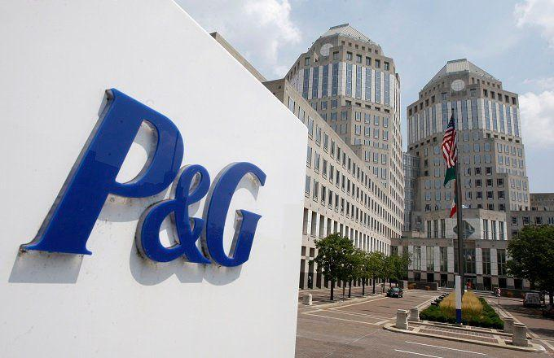

Procter & Gamble (P&G) is a renowned multinational corporation primarily engaged in the production and distribution of a wide range of consumer goods. Established in 1837, P&G has continually expanded its reach and influence, becoming a formidable player in the consumer goods sector. The company manages a diverse portfolio of brands across various categories such as personal health, hygiene, and household care, including well-known names like Tide, Gillette, and Pampers. P&G’s strategic focus on product innovation, marketing, and global expansion has contributed to its sustained market leadership and significant revenue generation.

Institutional investment plays a crucial role in reinforcing P&G's position in the stock market. Exchange-Traded Funds (ETFs) and mutual funds are among the most significant institutional investors. These funds pool capital from numerous investors to purchase a diversified portfolio of stocks, including large corporations like P&G. By investing in P&G, these funds enhance the company's stock liquidity and influence its market valuation. Notably, the investors' decisions can be instrumental in shaping P&G's financial performance and strategic directions. As such, understanding the dynamics of ETFs and mutual funds is vital for comprehending P&G’s market presence.

This article aims to explore the leading mutual funds and ETFs with substantial holdings in P&G, offering insights into their investment strategies and the broader implications for the company. Additionally, the role of algorithmic trading will be examined, highlighting how it transforms investment strategies and optimizes the performance of ETFs and mutual funds. Algorithmic trading involves using computer algorithms to execute trades at high speed and volume, harnessing data analytics and advanced algorithms to make informed investment decisions. It has become increasingly relevant in institutional investing, providing efficiencies and strategic advantages for funds managing large portfolios. Through this lens, the article will assess the interplay between algorithmic trading and institutional investments, delineating their impact on P&G’s market stature.

## Table of Contents

## Exploring ETFs and Mutual Funds Investing in P&G

Exchange-Traded Funds (ETFs) and mutual funds are essential investment vehicles that provide investors with the opportunity to access diversified portfolios. These financial instruments pool capital from multiple investors to purchase a collection of assets, which can include stocks, bonds, or other securities. ETFs are traded on stock exchanges much like individual stocks, offering liquidity and flexibility, while mutual funds are typically purchased directly from the issuing company at the end of the trading day.

For large corporations like Procter & Gamble (P&G), ETFs and mutual funds represent significant interest and ownership stakes. These funds are crucial in providing stability, liquidity, and potential growth in the stock market. Institutional investments from ETFs and mutual funds can substantially influence a company's stock price due to the volume of shares held.

P&G, a leading player in the consumer goods sector, attracts considerable attention from ETFs and mutual funds. Among the top mutual funds and ETFs investing in P&G are:

1. **Vanguard Total Stock Market Index Fund (VTSAX)**: Known for its broad exposure to the entire U.S. stock market, VTSAX holds a diverse range of stocks, including a significant position in P&G. This fund aims to mimic the performance of the CRSP US Total Market Index.

2. **Vanguard 500 Index Fund (VFINX)**: As one of the first index funds, VFIAX aims to track the S&P 500 Index, which includes P&G as one of its major constituents. By investing in VFIAX, shareholders indirectly gain exposure to companies with substantial market capitalization, like P&G.

3. **Fidelity 500 Index Fund (FXAIX)**: Similar to VFINX, FXAIX also tracks the S&P 500 Index and includes P&G in its portfolio. This fund is attractive for those seeking a low-cost strategy to participate in the growth of America's largest companies.

4. **SPDR S&P 500 ETF Trust (SPY)**: As one of the most traded ETFs globally, SPY provides exposure to the S&P 500 Index, encompassing top-tier corporations such as P&G. This ETF is frequently used by traders for its liquidity and efficient replication of the index.

The holdings of these funds in P&G underscore the brand's solid market position and its attractive characteristics to institutional investors. By participating in these funds, investors gain indirect but significant exposure to P&G's business performance and strategic growth.

## Key Players in ETFs and Mutual Funds

The Vanguard Total Stock Market Index Fund (VTSAX) is one of the prominent ETFs with significant holdings in Procter & Gamble (P&G). VTSAX is a broad-based index fund that aims to replicate the performance of the entire U.S. stock market. It includes a wide variety of sectors, providing investors with diversified exposure. As a part of its extensive portfolio, VTSAX holds substantial shares in P&G, which is a key player in the consumer goods sector. This position underscores VTSAX's strategy of holding established, large-cap companies to maintain stability and growth in its fund.

The Vanguard 500 Index Fund (VFIAX) is another major investment fund that includes P&G as part of its core holdings. VFIAX is designed to track the performance of the S&P 500 Index, which represents the stock market's large-cap segment and includes companies with substantial market capitalizations. P&G, as a longstanding component of this index, benefits from the regular inflow of funds from VFIAX's passive investment approach. This strategy primarily focuses on mirroring the index's performance and capturing broad market trends, allowing investors to benefit from the overall market's upward trajectory.

Fidelity 500 Index Fund (FXAIX) similarly holds P&G within its portfolio. FXAIX is known for its low-cost structure and dedication to tracking the S&P 500 Index. This mutual fund emphasizes passive investment strategies, which are especially attractive to investors seeking to minimize expenses while ensuring exposure to the market's top performers. The inclusion of P&G in FXAIX highlights the fund's reliance on high-quality, stable companies to achieve long-term capital appreciation.

The SPDR S&P 500 [ETF](/wiki/etf-trading-strategies) (SPY) is among the most widely traded ETFs and also includes P&G as a significant component. SPY aims to provide investment results that correspond to the S&P 500 Index's price and yield performance. As one of the first ETFs established, SPY has become a benchmark for U.S. equities, representing a considerable portion of the market's daily trading [volume](/wiki/volume-trading-strategy). SPY's inclusion of P&G not only demonstrates the latter's influence and stability within the stock market but also its importance to investors seeking safe, blue-chip investments through ETF channels.

These funds, through their holdings in P&G, play a crucial role in influencing the company's stock performance and market valuation. The aggregation of these substantial ETF and mutual fund investments underscores P&G's standing as a leader in the consumer goods sector and highlights the impact of these investment vehicles in the broader financial landscape.

## Algorithmic Trading and Its Impact

Algorithmic trading, often referred to as algo trading, leverages computer algorithms to execute trades at high speeds and volumes, with minimal human intervention. These algorithms are programmed to follow specific instructions based on variables such as timing, price, and quantity, and are capable of scanning markets for opportunities across various asset classes, executing orders under pre-defined criteria. The primary advantage of [algorithmic trading](/wiki/algorithmic-trading) is its ability to process data and transact at speeds far beyond human capability, which is essential in the fast-paced environment of financial markets.

For large fund managers, algorithmic trading offers the ability to optimize the performance of exchange-traded funds (ETFs) and mutual funds. It allows for precision in executing orders by mitigating the risks associated with manual trading, such as human error and latency. Furthermore, algorithms can be designed to implement complex trading strategies that consider a multitude of variables, improving the chances of achieving optimal trade execution.

One of the notable benefits of algorithmic trading is its support in enhancing [liquidity](/wiki/liquidity-risk-premium). By breaking down large orders into smaller orders and executing these in a time-sensitive manner, algorithms minimize the market impact and thereby avoid substantial price adjustments that could disadvantage the investment strategy. This approach is particularly beneficial for large fund managers holding sizable positions in stocks like Procter & Gamble (P&G), where discreetly managing large-scale trades is crucial.

Algorithmic trading can play a critical role in formulating investment strategies related to significant stakes in companies like P&G. For example, algorithms can be used to track market signals and trends, adjusting positions in real-time as new information emerges. This capability ensures that fund managers can respond rapidly to market changes, maintaining the strategic balance between risk and return.

Moreover, algorithmic trading enables [backtesting](/wiki/backtesting), which allows fund managers to test the viability of their strategies using historical data. By simulating trading scenarios, managers can evaluate the potential effectiveness and adjust the strategy parameters as needed before actual deployment.

As technology continues to advance, algorithmic trading is poised to further integrate with traditional trading methods, enhancing the investment strategies deployed by large funds holding significant positions in market-leading firms such as P&G. Its role in improving execution efficiency and investment precision underscores its value in contemporary fund management.

## Case Study: P&G’s Performance Influenced by Investor Actions

Procter & Gamble (P&G), recognized for its extensive portfolio of consumer brands, has consistently attracted substantial investments from ETFs and mutual funds, reflecting its formidable presence in the stock market. Institutional investors frequently turn to P&G due to its stable financial performance and market capitalization, both critical indicators of a corporation's potential for growth and reliability as an investment.

Recent financial metrics reaffirm P&G's robust economic standing. For the fiscal year ending in 2023, P&G reported a revenue increase driven by sustained consumer demand across its product categories, ranging from beauty to household care. The company's net income demonstrated positive growth, underpinned by strategic cost management and pricing strategies. As a result, P&G's market capitalization has experienced upward trends, resonating with its solid financial health and investor confidence. According to financial data sources, P&G's market capitalization stood at over $350 billion, marking it as a dominant entity in the consumer goods industry.

The significance of high institutional ownership percentages in companies like P&G cannot be overstated. Such percentages often indicate a high level of trust and expectation from sophisticated investors in the company's future performance. For P&G, institutional ownership accounts for a substantial portion of its outstanding shares. This considerable stake underscores institutional confidence in P&G's management and operational strategies, which aim to deliver consistent shareholder value. High institutional ownership can lead to stock price stability owing to the reduced likelihood of large-scale sell-offs, which are typically more common among retail investors.

Moreover, the actions and decisions of substantial ETF and mutual fund holders can influence P&G's stock performance. These investors often engage with company management to align corporate strategies with shareholder interests, potentially leading to initiatives that enhance long-term profitability. Thus, their involvement not only reflects market strength but also actively contributes to the strategic direction and performance trajectories of P&G.

In summary, P&G’s financial metrics and market capitalization position it as a strong candidate for institutional investors. The sizeable holdings by ETFs and mutual funds are indicative of P&G’s reliability and growth prospects, contributing positively to its stock performance and market valuation. As P&G continues to demonstrate economic durability and attract institutional investments, it stands as a pivotal player in its industry.

## Conclusion

In summarizing the insights discussed regarding ETFs, mutual funds, and their pivotal role in Procter & Gamble's (P&G) financial ecosystem, it's evident that institutional investments significantly bolster P&G's market standing. Key institutional players, such as the Vanguard Total Stock Market Index Fund (VTSAX), Vanguard 500 Index Fund (VFIAX), and Fidelity 500 Index Fund (FXAIX), maintain substantial holdings in P&G, reflecting the company's robust market valuation and investor confidence. These investment vehicles not only enhance liquidity but also contribute to the stabilization of P&G's stock price amidst market fluctuations.

Algorithmic trading presents a transformative avenue for optimizing the performance of ETFs and mutual funds. By leveraging sophisticated algorithms and automated trading strategies, fund managers can make data-driven decisions that enhance the efficiency and profitability of investments. This synergy between algorithmic trading and institutional investments allows for more dynamic responses to market trends and improved precision in asset allocation.

Looking ahead, P&G's future in the investment landscape appears promising, underpinned by the continued support of significant ETF and mutual fund stakeholders. The integration of advanced technologies, including algorithmic trading, is likely to further cement P&G's position within portfolios, offering enhanced returns for investors. As P&G navigates an evolving market environment, these institutional partnerships and innovative trading strategies will be instrumental in sustaining its growth trajectory.

## References & Further Reading

[1]: ["ETF & Mutual Fund Overview: How They Work"](https://www.morningstar.com/funds/etfs-vs-mutual-funds-benefits-that-really-matter) - Investopedia

[2]: ["The Vanguard Group: Key Investment Strategies"](https://corporate.vanguard.com/content/corporatesite/us/en/corp/what-we-think/investment-strategy-group.html) - Vanguard

[3]: ["Advances in Financial Machine Learning"](https://www.amazon.com/Advances-Financial-Machine-Learning-Marcos/dp/1119482089) by Marcos Lopez de Prado

[4]: ["Introduction to Ethnic Markets and Options"](https://www.taylorfrancis.com/books/edit/10.4324/9781315454894/ethnic-marketing-john-stanton-guilherme-pires) - CFA Institute

[5]: ["Algorithmic and High-Frequency Trading"](https://www.cambridge.org/us/universitypress/subjects/mathematics/mathematical-finance/algorithmic-and-high-frequency-trading?format=AR&isbn=9781316455579) by Álvaro Cartea, Sebastian Jaimungal, and José Penalva