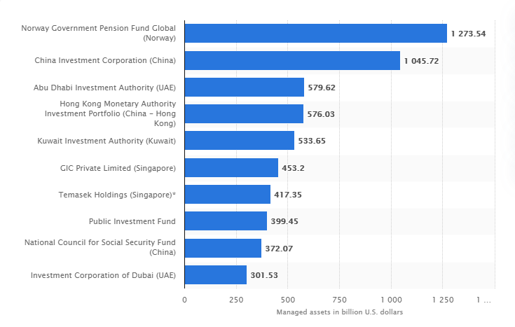

## Table of Contents

## What is a mutual fund?

A mutual fund is a type of investment where many people put their money together to buy a variety of stocks, bonds, or other assets. It's like a big basket where everyone's money goes in, and a professional manager decides what to buy and sell. This makes it easier for people who don't want to pick individual investments themselves.

When you invest in a mutual fund, you own a small part of the entire basket, not just one stock or bond. This helps spread out the risk because if one investment does poorly, the others might do well and balance it out. Mutual funds are popular because they are a simple way to invest in a diverse range of assets without needing a lot of money or investment knowledge.

## Who are the major mutual fund investors in Activision Blizzard?

The major mutual fund investors in Activision Blizzard are big companies that manage money for lots of people. Some of the biggest ones are Vanguard Group, BlackRock, and Fidelity Investments. These companies have a lot of money from their customers, and they use it to buy shares in companies like Activision Blizzard. This makes them big shareholders and gives them a say in how the company is run.

Vanguard Group is one of the biggest because they have a lot of different funds that invest in Activision Blizzard. They focus on helping people save for retirement and other long-term goals. BlackRock is another giant in the investment world, and they also have many funds that own pieces of Activision Blizzard. They are known for managing money for big institutions like pension funds and insurance companies.

Fidelity Investments is also a major player. They offer many different mutual funds, and some of these funds have a lot of Activision Blizzard shares. Fidelity helps people with their investments and retirement planning, so they have a lot of money to invest in companies like Activision Blizzard. These three companies, Vanguard, BlackRock, and Fidelity, are some of the biggest mutual fund investors in the gaming company.

## How do mutual funds invest in companies like Activision Blizzard?

Mutual funds invest in companies like Activision Blizzard by pooling money from many investors and using that money to buy shares of the company. When a mutual fund decides to invest in Activision Blizzard, it buys shares on the stock market, just like an individual investor would. The difference is that a mutual fund is buying these shares with money from many different people, so it can buy a lot more shares than one person could on their own. This makes the mutual fund a big shareholder in Activision Blizzard.

The decision to invest in Activision Blizzard is made by the fund's manager, who looks at things like the company's performance, future growth potential, and how it fits into the fund's overall investment strategy. If the manager thinks Activision Blizzard is a good investment, they will use the fund's money to buy its shares. This way, all the investors in the mutual fund own a small piece of Activision Blizzard, even if they didn't choose the company themselves. This helps spread out the risk because the mutual fund owns many different companies, not just Activision Blizzard.

## What percentage of Activision Blizzard is owned by mutual funds?

Mutual funds own a big part of Activision Blizzard, around 30-40% of the company. This means that a lot of the money that people have put into mutual funds is being used to buy shares of Activision Blizzard. The exact percentage can change because mutual funds are always buying and selling shares, but it's always a big chunk of the company.

The reason mutual funds own so much of Activision Blizzard is because they are big investors. They pool money from lots of people and use it to buy shares in many different companies, including Activision Blizzard. This helps spread out the risk for the people who invest in mutual funds because their money is not all in one company.

## Which mutual fund has the largest stake in Activision Blizzard?

The mutual fund with the largest stake in Activision Blizzard is managed by Vanguard Group. They own a big part of the company because they have a lot of different funds that invest in Activision Blizzard. Vanguard helps people save for retirement and other long-term goals, so they have a lot of money to invest in companies like this.

Vanguard's stake in Activision Blizzard is around 7-8% of the company. This is a lot of shares, and it makes Vanguard one of the biggest shareholders. They use the money from their investors to buy these shares, which helps spread out the risk for everyone who invests in their funds.

## How has the investment in Activision Blizzard by mutual funds changed over the past year?

Over the past year, the investment in Activision Blizzard by mutual funds has stayed pretty steady. Mutual funds like those managed by Vanguard, BlackRock, and Fidelity have kept a big part of their money in Activision Blizzard because they believe it's a good company to invest in. These funds help a lot of people save for the future, so they are always looking for strong companies to put their money into. Activision Blizzard has been doing well, so the mutual funds have not made big changes to how much they own.

There have been some small changes, though. Some mutual funds might have bought a little more or sold a little less of Activision Blizzard's shares, but overall, their investment has not changed a lot. This is because mutual funds usually think about the long term, so they don't make big moves unless something big changes with the company. Activision Blizzard has been a solid investment, so the mutual funds have kept their money there, helping their investors own a piece of the company.

## What are the performance metrics of these mutual funds in relation to Activision Blizzard?

The performance of mutual funds that invest in Activision Blizzard can be measured by how well the funds do overall and how Activision Blizzard's stock price changes. When Activision Blizzard does well, its stock price goes up, and the mutual funds that own a lot of its shares also go up in value. For example, if Activision Blizzard has a good year with strong sales of their games, the mutual funds that own its shares will likely see a good return on their investment. Over the past year, Activision Blizzard's stock has been pretty steady, which means the mutual funds have not seen big changes in their performance because of this company.

The performance of these mutual funds is also affected by how much they own of Activision Blizzard compared to other companies. If a mutual fund has a big part of its money in Activision Blizzard, then the fund's performance will be more tied to how Activision Blizzard does. For instance, Vanguard's funds, which own around 7-8% of Activision Blizzard, will see a bigger impact from Activision Blizzard's performance than a fund that owns less of the company. Overall, the mutual funds have done okay because Activision Blizzard has been stable, but they are always looking at many different companies to make sure their investors get the best returns.

## How do mutual fund investments impact Activision Blizzard's corporate governance?

Mutual fund investments have a big impact on how Activision Blizzard is run. When mutual funds own a lot of shares in a company, they become big shareholders. This gives them a say in important decisions, like who should be on the board of directors or how the company should be managed. Because mutual funds like Vanguard, BlackRock, and Fidelity own a big part of Activision Blizzard, they can vote on these decisions and influence the company's direction. They want the company to do well because their investors' money is tied up in it, so they try to make sure the company is run in a way that will make it successful.

This influence can lead to changes in how Activision Blizzard operates. For example, if the mutual funds think the company should focus more on certain types of games or improve its management practices, they can push for these changes. They might also encourage the company to be more open about its plans and performance, which can help build trust with investors. Overall, the big investments from mutual funds help guide Activision Blizzard's decisions and make sure the company is working towards goals that will benefit everyone who owns a piece of it.

## What are the potential risks for mutual funds investing heavily in Activision Blizzard?

When mutual funds put a lot of their money into Activision Blizzard, they face some risks. One big risk is that if Activision Blizzard does not do well, the value of the mutual funds can go down. For example, if Activision Blizzard's games don't sell as well as expected or if they have problems with their business, their stock price can drop. This would hurt the mutual funds because they own a lot of Activision Blizzard's shares, and their investors' money would be worth less.

Another risk is that the gaming industry can change quickly. New technology or new games from other companies can make Activision Blizzard's games less popular. If this happens, the mutual funds could lose money because the value of Activision Blizzard's stock might go down. Also, if too many mutual funds are investing in the same company, it can make the market less diverse, which means if something bad happens to Activision Blizzard, it could affect a lot of investors at the same time.

## How do mutual funds influence Activision Blizzard's strategic decisions?

Mutual funds have a big say in Activision Blizzard's big decisions because they own a lot of the company. When mutual funds like Vanguard, BlackRock, and Fidelity have a lot of shares, they can vote on important things like who should be on the board of directors or what the company's main goals should be. They want Activision Blizzard to do well because their investors' money is tied up in it. So, they might push for the company to focus on making new games or improving how they manage things to make sure the company keeps growing and making money.

Because mutual funds are such big shareholders, they can also suggest changes that they think will help Activision Blizzard in the long run. For example, if they think the company should spend more on research and development to come up with new game ideas, they can vote to make that happen. This influence helps guide Activision Blizzard's strategy to make sure it stays successful and keeps making money for everyone who owns a piece of it, including the mutual funds and their investors.

## What are the long-term investment strategies of mutual funds in the gaming industry, specifically with Activision Blizzard?

Mutual funds like Vanguard, BlackRock, and Fidelity have a long-term view when they invest in companies like Activision Blizzard. They believe that the gaming industry will keep growing, so they want to own a piece of it for a long time. They think Activision Blizzard will keep making popular games and making money, which is good for their investors. That's why they don't just buy and sell shares quickly; they hold onto them for years. This long-term strategy helps them spread out the risk because they are not betting on just one year's performance but on the company's success over many years.

In the long term, mutual funds want Activision Blizzard to keep coming up with new games and ideas. They encourage the company to invest in research and development so they can stay ahead in the gaming world. They also want Activision Blizzard to be managed well, so they might vote for changes in how the company is run if they think it will help. By doing this, mutual funds help guide Activision Blizzard to make decisions that will keep the company strong and profitable, which is good for everyone who owns a piece of it, including the mutual funds and their investors.

## How do regulatory changes affect mutual fund investments in companies like Activision Blizzard?

When the rules about investing change, it can affect how mutual funds put their money into companies like Activision Blizzard. If new laws make it harder for mutual funds to own a lot of shares in one company, they might have to sell some of their Activision Blizzard stock. This could mean less money for Activision Blizzard and less influence for the mutual funds on how the company is run. Also, if new rules change how much risk mutual funds can take, they might decide to invest less in the gaming industry because it can be risky.

On the other hand, if the rules make it easier for mutual funds to invest in companies like Activision Blizzard, they might buy more shares. This could give them more say in how the company makes decisions and could help Activision Blizzard grow because more money would be coming in. Either way, when the rules change, mutual funds have to think about how it affects their long-term plans and whether they need to adjust their investments to stay within the new rules while still trying to make money for their investors.

## References & Further Reading

[1]: ["Advances in Financial Machine Learning"](https://www.amazon.com/Advances-Financial-Machine-Learning-Marcos/dp/1119482089) by Marcos Lopez de Prado

[2]: ["Machine Learning for Algorithmic Trading"](https://github.com/stefan-jansen/machine-learning-for-trading) by Stefan Jansen

[3]: ["Quantitative Trading: How to Build Your Own Algorithmic Trading Business"](https://www.amazon.com/Quantitative-Trading-Build-Algorithmic-Business/dp/1119800064) by Ernest P. Chan

[4]: ["Evidence-Based Technical Analysis: Applying the Scientific Method and Statistical Inference to Trading Signals"](https://www.amazon.com/Evidence-Based-Technical-Analysis-Scientific-Statistical/dp/0470008741) by David Aronson

[5]: ["Algorithms for Hyper-Parameter Optimization"](https://dl.acm.org/doi/10.5555/2986459.2986743) by Bergstra, J., Bardenet, R., Bengio, Y., & Kégl, B., Advances in Neural Information Processing Systems 24.