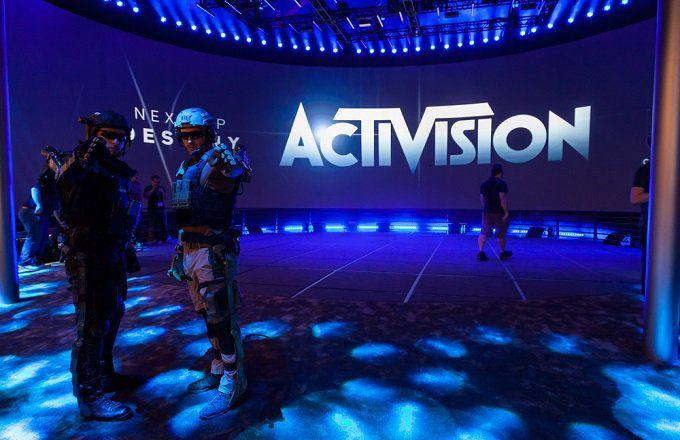

Mutual fund investments in Activision Blizzard represent a significant area of interest within the financial markets, reflecting the enduring impact and substantial growth potential of the gaming and technology sectors. Activision Blizzard, a prominent player in the global gaming industry, has established itself as a key company with successful franchises such as Call of Duty and World of Warcraft. This article explores the dynamics of mutual fund investments in Activision Blizzard, with a particular focus on those funds employing algorithmic trading strategies.

The article highlights the strategic importance of mutual fund investments in Activision Blizzard, particularly in light of the company's recent acquisition by Microsoft. This acquisition not only underscores the value of the gaming and entertainment sector but also signals a shift in how major technology companies view the gaming landscape. For investors and mutual funds, this development is pivotal, as it affects company valuation, growth projections, and investment strategies.

Mutual funds, especially those utilizing algorithmic trading, play a significant role in shaping the market's engagement with large technology and gaming stocks like Activision Blizzard. Algorithmic trading—a method of executing orders using automated and pre-programmed trading instructions—enhances the ability of mutual funds to manage large equity positions efficiently. It improves trading efficiency, optimizes market timing, and allows for swift execution, all of which are vital in the fast-paced financial environment where technology stocks often dominate.

This article sets the stage for examining specific mutual funds that hold significant shares in Activision Blizzard, detailing their investment strategies and the advantages they bring to investors. By emphasizing algorithmic trading, we highlight a critical aspect of modern investment that allows mutual funds to navigate complex financial landscapes effectively.

In conclusion, understanding mutual fund investments in Activision Blizzard provides insights into broader financial trends in the gaming and technology sectors. As mutual funds increasingly use algorithmic trading to manage investments, they offer a model of how innovative strategies can enhance traditional investment approaches. This exploration is crucial for investors seeking to leverage the growing potential of the gaming industry through diversified mutual fund strategies.

## Table of Contents

## Overview of Activision Blizzard and Its Market Position

Activision Blizzard, Inc. is a major force in the interactive gaming industry. The company was formed in July 2008 through the merger of Activision, Inc., a leading developer and publisher of video games, and Vivendi Games, which owned Blizzard Entertainment. This merger combined two powerful entities in the gaming world, each with its own successful franchises and customer base, subsequently creating one of the largest gaming companies globally by market value.

Activision Blizzard's portfolio includes some of the most famous gaming franchises, such as Call of Duty, a blockbuster first-person shooter series, and World of Warcraft, a highly popular massive multiplayer online role-playing game (MMORPG). These franchises have significantly contributed to the company’s revenue, establishing a strong foothold in the gaming industry. The company expanded its influence within the industry by nurturing other popular series, including Candy Crush Saga through its acquisition of King in 2016, further diversifying its offerings in the mobile gaming market.

In January 2022, Microsoft Corporation announced its intention to acquire Activision Blizzard in an all-cash transaction valued at approximately $68.7 billion. This acquisition is set to position Microsoft as one of the world's largest gaming companies by revenue, enhancing its competitive stance in the burgeoning metaverse space. For investors and mutual fund holders, this acquisition implies potential growth opportunities due to synergies between Microsoft's infrastructure and Activision's gaming prowess. However, it also calls for a reevaluation of strategies to align with Microsoft's broader vision for gaming across platforms like Xbox and PC.

Analyzing Activision Blizzard's financial performance provides insight into its market position. For fiscal year 2021, the company reported a revenue of $8.8 billion, showcasing a robust financial standing. Despite challenges such as internal controversies and competitive pressures, Activision Blizzard has maintained its status as an influential player in the tech sector.

Video game publishers, such as Activision Blizzard, play a crucial role in the broader technology sector, serving as key drivers of digital entertainment and innovation. They attract significant investor interest due to the growth potential in gaming, esports, and the emerging metaverse. Consequently, portfolios that include video game stocks like Activision Blizzard's offer investors exposure to these dynamic and expanding markets, reflecting both growth prospects and the diversification benefits within the high-growth technology sector.

## Top Mutual Funds Holding Activision Blizzard Shares

Mutual funds provide diversified portfolios for investors, mitigating risk while enabling exposure to specific sectors. Among technology and gaming companies, Activision Blizzard is a popular choice for mutual funds due to its substantial market influence and consistent performance. Several prominent mutual funds have significant holdings in Activision Blizzard, such as the Vanguard Total Stock Market Index Fund and The Growth Fund of America.

### Vanguard Total Stock Market Index Fund

The Vanguard Total Stock Market Index Fund is renowned for its broad diversification, encompassing a wide range of equities aimed at tracking the performance of the U.S. stock market. This fund holds Activision Blizzard as part of its extensive portfolio. The size of its holding in Activision Blizzard often reflects the company's market capitalization and performance relative to other stocks in the U.S. market. This fund's strategy focuses on a comprehensive approach to exposure across sectors, including gaming and technology, as a means of achieving stable, long-term growth.

- **Holding Size and Market Value**: The fund's holding in Activision Blizzard is subject to periodic adjustments, in line with shifts in market capitalization and overall fund strategy.
- **Investment Goals and Strategies**: The primary investment goal is long-term capital growth. The strategy includes diversification across a wide array of stocks, with risk management facilitated by exposure to all key sectors.

### The Growth Fund of America

Managed by American Funds, The Growth Fund of America targets long-term growth through investments in U.S. companies with strong growth potential. Activision Blizzard fits well within this strategy, given its leadership in the gaming sector and innovative business model.

- **Holding Size and Market Value**: The Growth Fund of America maintains a substantial investment in Activision Blizzard, reflecting confidence in the company's growth trajectory and market position.
- **Investment Goals and Strategies**: The fund seeks to capitalize on high-growth opportunities primarily within the U.S. market. By emphasizing growth sectors such as technology and entertainment, it aligns with the expanding market share and future prospects of Activision Blizzard.

### Role in Exposure to Gaming and Technology

These funds provide investors with significant exposure to the gaming and technology sectors, with Activision Blizzard as a cornerstone of their respective portfolios. The integration of such a key player in gaming into their holdings enables investors to benefit from trends within this dynamic industry. This exposure is crucial for capturing potential returns from rapid technological advances and consumer interest in digital entertainment.

### Unique Characteristics and Advantages

- **Fees and Accessibility**: Both funds offer competitive fee structures, making them accessible to a broad range of investors. The Vanguard Total Stock Market Index Fund is particularly noted for its low expense ratio, typical of index-tracking funds, which makes it an attractive option for cost-conscious investors.
- **Returns**: Historical returns for both funds have demonstrated resilience and growth, buoyed by their strategic holdings in high-performing companies like Activision Blizzard. 

In conclusion, the inclusion of Activision Blizzard in these top mutual funds underscores the strategic allocation towards companies with influence in technology and gaming. Both the Vanguard Total Stock Market Index Fund and The Growth Fund of America illustrate how mutual funds balance risk and opportunity, furnishing investors with pathways to engage with the burgeoning sector of digital entertainment.

## Algorithmic Trading Strategies in Mutual Funds

Algorithmic trading has become an essential component in the strategy arsenal of mutual funds, particularly when managing substantial equity positions like those in Activision Blizzard. Algorithmic trading employs complex mathematical models and software programs to make high-frequency and large-[volume](/wiki/volume-trading-strategy) trades at speeds and frequencies that a traditional human trader cannot match. This approach allows mutual funds to optimize the execution of their trades, thereby reducing transaction costs and maximizing profits.

Various technologies and methodologies are integral to the implementation of [algorithmic trading](/wiki/algorithmic-trading) by mutual funds. High-frequency trading ([HFT](/wiki/high-frequency-trading-strategies)) platforms, statistical [arbitrage](/wiki/arbitrage) models, and [machine learning](/wiki/machine-learning) algorithms are commonly used. These technologies enable funds to analyze market conditions swiftly and accurately, facilitating better decision-making in executing large trades efficiently. Machine learning, in particular, aids in the dynamic adjustment of strategies based on evolving market patterns, enhancing prediction accuracy and risk assessment.

The adoption of algorithmic trading significantly enhances trading efficiency for mutual funds. It ensures optimal market timing and speedier execution, which is crucial when handling large equity stakes like those in Activision Blizzard. For instance, algorithmic systems can break large orders into smaller, market-friendly chunks, minimizing market impact and achieving better price points. This precision in trade execution ensures that the funds maintain competitive advantages in market presence.

Furthermore, algorithmic trading positively impacts the performance of mutual funds holding Activision Blizzard shares. By leveraging real-time data and historical trends, funds can make informed decisions to capitalize on short-lived market opportunities. This capability is crucial given the dynamic nature of the gaming and tech sectors, where stock prices can be volatile and influenced by various external factors, such as game releases or technological advancements.

However, algorithmic trading is not without its risks and ethical considerations. The rapid execution and high-frequency nature of trades can inadvertently lead to increased market [volatility](/wiki/volatility-trading-strategies), contributing to systemic risk. Moreover, the black-box nature of some algorithmic models raises transparency concerns, as decisions made by complex algorithms might not be easily interpretable by fund managers or regulators. There is also the potential for ethical issues, such as the unfair advantage over traditional traders and the risk of algorithms executing unintended trades due to malfunctions or flawed code.

In conclusion, while algorithmic trading presents distinct advantages in terms of efficiency and performance optimization for mutual funds investing in substantial shares of companies like Activision Blizzard, it is imperative to address its accompanying risks and ethical concerns through robust oversight, transparency, and the continuous updating of technological frameworks.

## Conclusion

The exploration of mutual fund investments in Activision Blizzard underscores the strategic significance of this gaming giant within the global financial landscape. Activision Blizzard's role as a prominent player in the gaming industry, coupled with its acquisition by Microsoft, positions it as a key asset for mutual funds seeking exposure to the lucrative gaming and technology sectors.

Mutual funds, such as the Vanguard Total Stock Market Index Fund and The Growth Fund of America, represent major stakeholders in Activision Blizzard. Their investment strategies often emphasize diversification and risk management, allowing them to balance potential returns with market volatility. These funds provide investors with not just a stake in a leading gaming firm but also a broader reach into technology and entertainment industries.

Algorithmic trading emerges as a pivotal tool, enhancing the efficiency and execution of trades within these mutual funds. By utilizing advanced technologies and methodologies, fund managers can optimize trading strategies, improve market timing, and execute transactions with greater speed and accuracy. This approach is increasingly important as the volume and complexity of trades grow, particularly in large equity holdings like those in Activision Blizzard.

Looking to the future, mutual funds are likely to continue capitalizing on algorithmic trading to refine their investment strategies. The growing importance of this technology suggests a transformative impact on mutual fund performance, offering potential advantages in terms of speed, efficiency, and cost-effectiveness. As the gaming and technology sectors evolve, mutual funds remain a viable avenue for investors seeking to tap into the growth and innovation of companies like Activision Blizzard.

Investors are encouraged to recognize the benefits of diversified investment strategies, including those that leverage algorithmic trading. By considering mutual funds that actively engage with advanced trading techniques, investors can potentially enhance their portfolios, achieving both diversification and exposure to cutting-edge industries.

In conclusion, the intersection of gaming, technology, and financial innovation presents exciting opportunities for mutual funds and investors alike. As mutual funds continue to adapt and innovate, the landscape of investment in large technology and entertainment companies promises to evolve, offering diverse prospects for growth and value creation.

## References & Further Reading

[1]: ["Advances in Financial Machine Learning"](https://www.amazon.com/Advances-Financial-Machine-Learning-Marcos/dp/1119482089) by Marcos Lopez de Prado

[2]: ["Machine Learning for Algorithmic Trading"](https://github.com/stefan-jansen/machine-learning-for-trading) by Stefan Jansen

[3]: ["Quantitative Trading: How to Build Your Own Algorithmic Trading Business"](https://www.amazon.com/Quantitative-Trading-Build-Algorithmic-Business/dp/1119800064) by Ernest P. Chan

[4]: ["Evidence-Based Technical Analysis: Applying the Scientific Method and Statistical Inference to Trading Signals"](https://www.amazon.com/Evidence-Based-Technical-Analysis-Scientific-Statistical/dp/0470008741) by David Aronson

[5]: ["Algorithms for Hyper-Parameter Optimization"](https://dl.acm.org/doi/10.5555/2986459.2986743) by Bergstra, J., Bardenet, R., Bengio, Y., & Kégl, B., Advances in Neural Information Processing Systems 24.