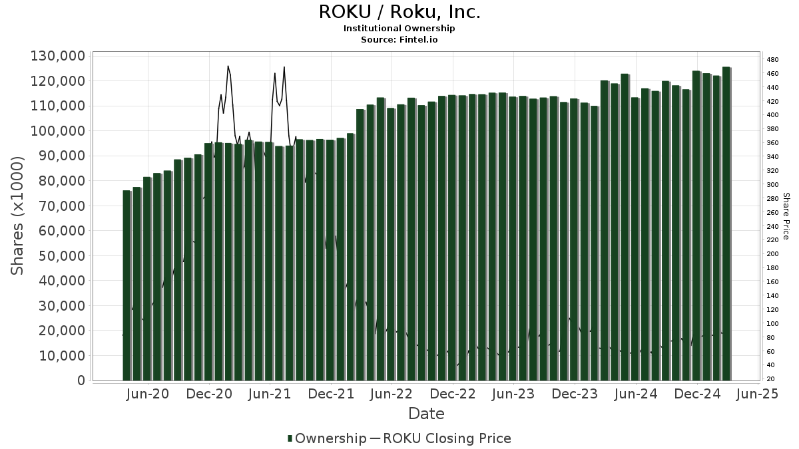

Roku Inc. has emerged as a significant force within the consumer electronics and streaming industry by offering users a simple platform to experience streaming entertainment. Established in 2002, Roku provides a diverse range of streaming devices that allow viewers to access multiple content forms such as Netflix, Hulu, and Disney+ through a single interface. This approach not only enhances the user experience but also catalyzes cutting-edge innovation in the media consumption landscape.

Mutual funds have identified Roku's strategic position in the market, choosing to invest in its shares as part of their diversified portfolios. These investment vehicles, managing pooled funds to purchase securities, are influenced by the performance and potential growth of companies like Roku. As a result, the allocation of assets in Roku's stocks is of keen interest to portfolio managers aiming to capitalize on Roku's promising market trends and performance metrics.



The integration of algorithmic trading presents a transformative factor in the financial industry, impacting the structure and strategy behind mutual fund investments. This modern approach utilizes complex algorithms to analyze market data and execute trades at high speeds, often surpassing human capabilities in terms of accuracy and timing. By leveraging algorithmic trading, mutual funds can efficiently manage Roku stock investments, aiming for optimal returns by adjusting their positions based on predictive analytics. As these algorithms evolve, they offer a frontier of potential advantages in maximizing the yield and reducing risks in volatile market environments.

With the convergence of Roku's market dynamics and the strategic operations of mutual funds through algorithmic trading, the landscape of investment continues to change. Staying informed and adaptive to these developments is key for investors and fund managers looking to navigate the sophisticated intersections of technology and finance.

## Table of Contents

## Roku Inc.: A Brief Overview

Roku Inc. is a prominent player in the streaming industry, recognized for its robust business model centered around streaming devices and digital content. The company's core offerings involve manufacturing and distributing smart TVs and streaming players, providing users with access to a wide range of streaming services through an easy-to-use platform. Roku generates revenue through hardware sales, advertising, and its Roku Channel, which streams content for free with ad support, as well as through licensing its operating system to third-party TV manufacturers.

Roku debuted on the public market with its initial public offering (IPO) in September 2017, at an opening price of $14 per share. Since then, Roku's stock has experienced significant fluctuations reflective of its rapid growth and the volatile technology sector. Initially, it faced skepticism due to intense competition from tech giants like Apple, Amazon, and Google, which offer similar streaming solutions. However, Roku has carved out a unique space by maintaining an open platform strategy, welcoming all streaming services, which has enabled it to capture a substantial market share.

Over the years, Roku's stock performance has been marked by periods of significant appreciation, driven by an expanding user base, increased streaming hours, and a growing ad business. For instance, in 2020, during the COVID-19 pandemic, Roku saw a surge in new users and streaming hours as homebound consumers looked for entertainment options, resulting in a corresponding rise in stock value. However, like many tech companies, Roku has also faced stock valuation pressures associated with market corrections and competition.

As of the latest fiscal reports, Roku's financial health exhibits both strengths and challenges. The company has consistently driven revenue growth primarily through its platform segment, which includes advertising and licensing. Yet, it also faces profitability pressures as it continues to invest in scaling its operations and expanding its market presence. The company's market valuation reflects its position as a leader in the streaming field but also factors in competitive risks and the dynamic nature of the streaming services industry.

Overall, Roku's strategic positioning as a neutral platform provider in the streaming ecosystem has allowed it to thrive amidst fierce competition, and its continued focus on expanding ad revenue and user engagement remains central to its financial outlook.

## Top Mutual Fund Holders of Roku

Roku Inc. has attracted significant interest from various mutual funds due to its pivotal role in the streaming and consumer electronics industry. Among the major mutual funds that hold substantial shares in Roku are the ARK Innovation [ETF](/wiki/etf-trading-strategies), Vanguard Total Stock Market Index Fund, Fidelity Growth Company Fund, and Vanguard Mid-Cap Index Fund.

The ARK Innovation ETF, managed by ARK Invest, is known for its focus on disruptive technologies and innovation-driven companies. Roku fits well within this investment strategy given its consistent growth in the streaming space and efforts to expand its presence in digital media. The fund has been aggressive in acquiring Roku shares, reflecting confidence in the company's future potential.

Vanguard Total Stock Market Index Fund, as a broad-market index fund, holds Roku shares as part of its strategy to provide comprehensive market exposure. This fund invests in a wide array of sectors and industries, enabling it to capture the overall growth of the market, including the burgeoning streaming sector. Its stake in Roku represents a commitment to tracking the performance of the total stock market, which includes emerging industry leaders like Roku.

Fidelity Growth Company Fund targets companies demonstrating high growth potential. Roku's innovative business model and its leadership in connected television platforms make it an ideal candidate for this fund. Fidelity's investment strategy focuses on capital appreciation, and its holdings in Roku signify the firm's belief in the company's upward trajectory and long-term growth prospects.

The Vanguard Mid-Cap Index Fund invests in medium-sized companies with potential for growth. Its inclusion of Roku aligns with its objective to channel investments into mid-cap firms that are poised for expansion. The fund's ownership of Roku shares highlights its strategy of pursuing diversified growth opportunities across different segments of the market.

When comparing these mutual funds, a few critical aspects define their holdings. The ARK Innovation ETF often holds a more significant percentage of its assets in high-[growth stocks](/wiki/growth-stocks) like Roku, focusing on companies with breakthrough innovations. Vanguard's Total Stock Market and Mid-Cap Index Funds tend to have more diversified holdings, with Roku being a smaller fraction of their overall portfolios, as their primary goal is broad-market exposure. Fidelity Growth Company Fund, emphasizing growth potential, maintains a relatively balanced yet growth-oriented portfolio, betting on companies like Roku for strong future gains.

The market value of their Roku share holdings fluctuates with market conditions, but the strategic inclusion of Roku within these funds showcases the diverse approaches mutual funds use—from growth focused to total market tracking—when investing in technology-driven companies such as Roku.

## Algorithmic Trading: Transforming Investments

Algorithmic trading refers to the use of computer algorithms to automate the execution of trading orders with speed and precision that far surpasses human capabilities. These algorithms, driven by pre-set rules involving timing, price, quantity, and other mathematical models, are employed to execute trades rapidly and effectively. They enable traders to quickly analyze vast datasets and execute trades at optimal speeds, which is critical in the highly competitive landscape of modern financial markets.

The role of [algorithmic trading](/wiki/algorithmic-trading) in contemporary financial markets is profound. It enhances market efficiency by minimizing the time between the occurrence of relevant market events and the execution of trades. This fosters greater [liquidity](/wiki/liquidity-risk-premium), narrower bid-ask spreads, and improved pricing of securities. Moreover, algorithmic trading helps in arbitraging price differences across various markets and exploiting short-lived trading opportunities that human traders might easily miss.

Mutual funds increasingly leverage algorithmic trading to refine their investment strategies and maximize returns for their investors. By utilizing sophisticated algorithms, mutual funds can process and analyze streams of market data in real-time to identify emerging trends and make swift investment decisions. This capability is critical in managing large portfolios where timely decision-making can significantly impact returns.

A common strategy employed by mutual funds is the use of algorithmic trading to implement quantitative investment strategies. These strategies might include statistical [arbitrage](/wiki/arbitrage), which capitalizes on price inefficiencies between correlated securities, or [momentum](/wiki/momentum) trading, which exploits trends in stock prices. Furthermore, algorithms can be calibrated to adapt to varying market conditions, allowing mutual funds to dynamically shift their asset allocations in response to evolving circumstances.

Despite its advantages, algorithmic trading also presents several potential drawbacks for mutual fund holders. One significant concern is the risk of increased [volatility](/wiki/volatility-trading-strategies), as algorithms, particularly those programmed for high-frequency trading, can lead to swift and significant price movements when they execute large volumes of trades simultaneously. This can exacerbate market swings and potentially destabilize markets during periods of heightened uncertainty.

Another challenge is the technical and operational risk associated with algorithmic trading systems. Systematic errors, software glitches, or connectivity issues can lead to unintended trades that can be costly. Moreover, the reliance on sophisticated technology and data analytics necessitates substantial investment in infrastructure and expertise, which may not be feasible for all mutual funds.

In conclusion, while algorithmic trading can offer mutual funds improved efficiency and performance, it also requires careful management of the associated risks. Understanding these dynamics enables mutual funds to harness the benefits of algorithmic trading while mitigating potential adverse impacts on their investment portfolios.

## Impact of Algorithmic Trading on Roku Investments

Algorithmic trading has become a significant force in financial markets, including the trading of ROKU shares. By utilizing complex algorithms and high-speed data analysis, algorithmic trading can optimize the timing, size, and execution of trades. For ROKU, this has led to increased trading [volume](/wiki/volume-trading-strategy) and liquidity, making it an attractive option for mutual funds seeking to enhance their portfolios.

One of the primary ways algorithmic trading impacts ROKU shares is by improving market efficiency. Algorithms execute trades at speeds and frequencies beyond human capability, quickly integrating new information into the market prices. This can lead to reduced spreads and increased liquidity, which are beneficial for investors, including mutual funds, looking to buy or sell large volumes of stocks without significantly impacting the market price. 

The potential benefits of algorithmic trading for mutual funds holding Roku include increased execution speed and reduced transaction costs. Algorithms can buy and sell shares at optimal times, minimizing the impact of volatility and slippage on large transactions. This precision enables mutual funds to adjust their holdings more efficiently in response to market conditions or strategic shifts.

Moreover, funds that employ algorithmic strategies often have an edge in terms of risk management. Algorithms can monitor market conditions in real-time, adjusting positions in response to various factors like news events, economic data releases, or changes in trading patterns. For example, a sudden spike in trading volume or a significant price movement in ROKU shares could trigger an algorithm to execute a predefined trading strategy, helping a fund capitalize on short-term opportunities or mitigate potential losses.

There are documented instances of market reactions and returns driven by algorithmic trades on ROKU shares. For example, during periods of significant news announcements regarding Roku, such as quarterly earnings releases or strategic partnerships, algorithms may trigger trades that amplify price movements due to their speed and volume capacity. These algorithms can capitalize on price discrepancies or momentum trades which might not be possible for traditional trading methods.

Considering a simplistic scenario, if a mutual fund uses a mean-reversion algorithm, the algorithm might execute a strategy where it buys ROKU shares if the price drops below a certain deviation from the mean, expecting the price to revert back to its average. This can be implemented in Python as follows:

```python
def mean_reversion_strategy(prices, window):
    mean_price = prices[-window:].mean()
    current_price = prices[-1]
    if current_price < mean_price * (1 - 0.05):  # 5% below mean
        return "Buy"
    elif current_price > mean_price * (1 + 0.05):  # 5% above mean
        return "Sell"
    else:
        return "Hold"

# Example usage
import numpy as np
prices = np.random.normal(loc=100, scale=5, size=100)  # Simulated ROKU prices
action = mean_reversion_strategy(prices, window=20)
print(action)
```

Such algorithmic strategies can identify and exploit short-term pricing anomalies, providing a potential for enhanced returns.

Overall, the integration of algorithmic trading in the handling of ROKU shares by mutual funds is reshaping investment approaches, offering a blend of increased efficiency, strategic agility, and potential cost savings. However, this also requires careful management to avoid pitfalls such as over-reliance on automated processes or exacerbating market volatility during times of financial stress.

## Future Outlook for Roku and its Mutual Fund Holders

Predictions for Roku's market performance and innovation in streaming technology suggest a continued commitment to expanding its user base and enhancing its platform's capabilities. Roku Inc. has established itself as a dominant entity in the streaming industry, and its future endeavors include improving user experience and expanding global presence to capitalize on the increasing demand for streaming services. The market is expected to grow, with more consumers shifting from traditional cable to streaming, which bodes well for Roku's potential for revenue growth. Analysts anticipate innovations such as enhanced personalized content recommendations, integration with smart home devices, and partnerships with new content providers as pivotal elements in Roku's strategy.

Algorithmic trading is poised to play a significant role in future mutual fund strategies concerning Roku. By using complex mathematical models and algorithms, mutual funds can execute trades at high speeds and optimal prices, thereby potentially increasing returns. These algorithms analyze vast amounts of data, including market trends, news reports, and social media sentiment, to inform trading decisions. As a result, mutual funds may leverage such technologies to respond swiftly to market changes affecting ROKU shares, optimizing their investment strategies and enhancing portfolio performance.

Investors and mutual fund managers face several considerations and potential challenges. The volatility of the technology sector, regulatory changes, and competitive pressures are crucial factors that must be monitored. Additionally, the reliance on algorithmic models introduces risks associated with model accuracy and the speed of technological advancements. There is the need to balance algorithmic insights with traditional investment analysis to ensure comprehensive decision-making. Furthermore, managers must remain vigilant about maintaining robust cybersecurity measures to protect trading platforms from potential threats.

Overall, Roku's strategic initiatives and the incorporation of algorithmic trading strategies present promising opportunities for mutual fund holders. However, staying informed and adaptable to technological and market shifts will remain essential for navigating the challenges and reaping the benefits of future investments in Roku.

## Conclusion

Roku Inc. stands as a prominent figure in the consumer electronics and streaming sector, significantly impacting the mutual fund market. Roku's continuous growth and innovative contributions to streaming technology have made it an attractive investment for various mutual funds, seeking to capitalize on its expanding market presence. This strategic interest stems from Roku's ability to adapt and thrive in an increasingly competitive market.

The integration of algorithmic trading in investment strategies has further transformed how mutual fund managers approach stocks like Roku. Algorithmic trading allows for more efficient decision-making by leveraging data and mathematical models to execute trades at optimal prices. This technology has enabled mutual funds to manage their portfolios with greater precision and responsiveness to market fluctuations. However, it also introduces complexities, requiring investors to comprehend the algorithms' underlying mechanisms to minimize risks.

For investors in mutual funds that hold substantial Roku shares, remaining informed about ongoing advancements in technology, such as algorithmic trading, is crucial. These trends not only influence investment outcomes but also shape the broader financial industry. Staying updated on these changes will empower investors to make informed decisions, balancing potential returns with associated risks in a rapidly evolving market landscape.

## References & Further Reading

[1]: ["Advances in Financial Machine Learning"](https://www.amazon.com/Advances-Financial-Machine-Learning-Marcos/dp/1119482089) by Marcos Lopez de Prado

[2]: ["Algorithms for Hyper-Parameter Optimization"](https://dl.acm.org/doi/10.5555/2986459.2986743) by Bergstra, J., Bardenet, R., Bengio, Y., & Kégl, B.

[3]: ["Evidence-Based Technical Analysis: Applying the Scientific Method and Statistical Inference to Trading Signals"](https://www.amazon.com/Evidence-Based-Technical-Analysis-Scientific-Statistical/dp/0470008741) by David Aronson

[4]: ["Machine Learning for Algorithmic Trading"](https://github.com/stefan-jansen/machine-learning-for-trading) by Stefan Jansen

[5]: ["Quantitative Trading: How to Build Your Own Algorithmic Trading Business"](https://github.com/LucindaYa/quant-resources/blob/master/Quantitative%20Trading%20How%20to%20Build%20Your%20Own%20Algorithmic%20Trading%20Business.pdf) by Ernest P. Chan