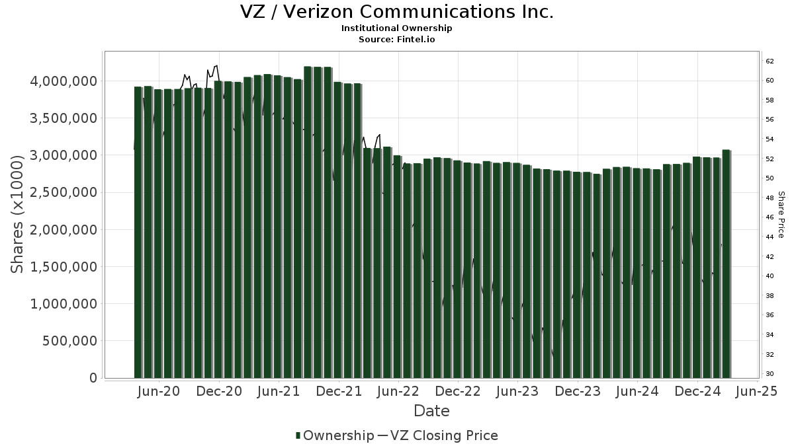

## Table of Contents

## What is a mutual fund?

A mutual fund is a type of investment where many people pool their money together to buy a variety of stocks, bonds, or other assets. This is managed by a professional who makes decisions on what to buy and sell. When you invest in a mutual fund, you are buying shares of the fund, and the value of your shares will go up or down based on how well the investments in the fund are doing.

Mutual funds are popular because they allow people to invest in a diversified portfolio without needing a lot of money or knowledge about individual stocks and bonds. By spreading the money across many different investments, the risk is reduced. This makes mutual funds a good choice for people who want to grow their savings over time but don't want to spend a lot of time managing their investments.

## What does it mean to be a stakeholder in a company like Verizon?

Being a stakeholder in a company like Verizon means you have an interest or concern in the company's performance and decisions. Stakeholders can include shareholders, employees, customers, and even the community where Verizon operates. If you're a shareholder, you own part of the company through stocks and you want the company to do well so the value of your stocks goes up. Employees care about Verizon's success because their jobs and benefits depend on it. Customers want Verizon to provide good service and products at a fair price.

Different stakeholders have different needs and goals. For example, shareholders might focus on profits and stock prices, while employees might be more concerned about job security and working conditions. Customers want reliable service and competitive prices. The community might care about how Verizon affects the local economy and environment. Verizon tries to balance these different interests to keep all stakeholders happy and support the company's long-term success.

## How do mutual funds invest in companies like Verizon?

Mutual funds invest in companies like Verizon by using the money they collect from many people to buy stocks. When a mutual fund buys Verizon stock, it becomes a part-owner of Verizon. The fund manager decides which stocks to buy based on what they think will make the fund grow. If Verizon does well, the value of the mutual fund's shares goes up, and everyone who invested in the fund benefits.

The goal of the mutual fund is to make money for its investors. By buying Verizon stock, the fund is betting that Verizon will do well in the future. If Verizon pays dividends, the mutual fund gets some of that money, which can then be given to the people who invested in the fund. This way, even small investors can own a piece of big companies like Verizon through mutual funds.

## Who are the largest mutual fund stakeholders in Verizon?

The biggest mutual fund stakeholders in Verizon are usually big investment companies. Vanguard Group and BlackRock are two of the largest. They manage a lot of money from many people and use it to buy Verizon stock. Vanguard's Total Stock Market Index Fund and BlackRock's iShares Core S&P 500 [ETF](/wiki/etf-trading-strategies) are examples of funds that hold a lot of Verizon shares.

These funds own a big part of Verizon because they want to make money for the people who invest in their funds. By holding Verizon stock, they are betting that Verizon will do well and the stock price will go up. This way, the value of their funds goes up too, and everyone who put money in the funds can make more money.

## What percentage of Verizon’s shares do these mutual funds own?

Vanguard Group and BlackRock are two of the biggest mutual fund companies that own a lot of Verizon's shares. Vanguard's Total Stock Market Index Fund owns about 3% of Verizon's shares. BlackRock's iShares Core S&P 500 ETF owns around 2% of Verizon's shares. These numbers can change a bit from day to day as they buy and sell shares.

These funds are important because they hold a big part of Verizon. When they buy Verizon stock, they are betting that Verizon will do well and the stock price will go up. This helps the people who invest in these funds make more money. So, even if you don't own Verizon stock directly, you might own a piece of Verizon through these mutual funds.

## How has the ownership of Verizon’s shares by mutual funds changed over the past year?

Over the past year, the ownership of Verizon's shares by mutual funds has seen some changes, but the big players like Vanguard and BlackRock have stayed important. Vanguard's Total Stock Market Index Fund has kept its ownership around 3% of Verizon's shares. This shows that Vanguard thinks Verizon is still a good company to invest in for the long term. BlackRock's iShares Core S&P 500 ETF has also kept its ownership steady at about 2% of Verizon's shares. These funds are part of big index funds that try to match the overall market, so they don't change their holdings a lot unless the market changes a lot.

Even though the big funds have stayed pretty steady, some smaller mutual funds might have bought or sold Verizon shares. This can happen if they think Verizon will do better or worse in the future. Overall, mutual funds are still a big part of who owns Verizon, and they help a lot of people invest in the company without buying the stock directly.

## What are the investment strategies of the major mutual fund stakeholders in Verizon?

The major mutual fund stakeholders in Verizon, like Vanguard and BlackRock, often use a strategy called passive investing. This means they try to match the performance of a big group of stocks, like the whole stock market or a specific index like the S&P 500. They do this by holding a lot of different stocks in their funds, including Verizon. This way, they don't have to guess which stocks will do well; they just follow the market. It's a safe way to invest because it spreads the risk across many companies.

Some mutual funds might also use active investing strategies. This means they try to pick stocks they think will do better than the market. If a fund manager thinks Verizon will do well, they might buy more of its stock. They look at things like Verizon's earnings, how the company is doing in its industry, and what's happening in the economy. This can be riskier because if they pick the wrong stocks, the fund might not do as well. But if they pick right, the fund could do better than the market.

## How do these mutual funds influence Verizon’s corporate decisions?

Mutual funds like Vanguard and BlackRock own a big part of Verizon, so they can influence what the company does. They do this by voting on important things at shareholder meetings. For example, they can vote on who should be on Verizon's board of directors or on big decisions like mergers and how much the CEO should get paid. When mutual funds vote, they think about what's best for the people who put money in their funds. They want Verizon to make choices that will make the company do well and make their funds grow.

Even though mutual funds can vote, they don't run the company day-to-day. That's up to Verizon's leaders and board of directors. But because mutual funds own so much of the company, Verizon listens to what they say. If a lot of big mutual funds don't like something Verizon is doing, they might talk to the company or vote against it. This can push Verizon to change its plans or how it does things. So, while mutual funds don't make the decisions, they can guide Verizon in a way that helps everyone who has money in the company.

## What is the performance history of Verizon’s stock in relation to its mutual fund stakeholders?

Over the years, Verizon's stock has had ups and downs, but it has generally been a steady part of many mutual funds like those from Vanguard and BlackRock. These funds hold Verizon stock because they think it's a good, reliable company. When Verizon does well, its stock price goes up, and that helps the mutual funds grow. For example, if Verizon makes more money or pays bigger dividends, the value of the mutual funds that own Verizon stock goes up too. This makes the people who invest in these funds happy because their money is growing.

Sometimes, Verizon's stock might not do as well as the whole market. When this happens, the mutual funds that own a lot of Verizon stock might not grow as fast as other funds. But because these funds own many different stocks, not just Verizon, they can still do okay even if Verizon's stock goes down a bit. The big mutual funds like Vanguard and BlackRock keep Verizon in their funds because they believe in the company's long-term success. They want to keep their investors' money safe and growing over time, and Verizon helps them do that.

## How do the voting rights of mutual funds affect Verizon’s governance?

Mutual funds like Vanguard and BlackRock own a big part of Verizon, so they have a lot of voting rights. When Verizon has a meeting for shareholders, these mutual funds can vote on important things like who should be on the board of directors or if the company should do a merger. They vote to make choices that they think will help Verizon do well and make their funds grow. This is good for the people who put money in these funds because if Verizon does well, their money grows too.

Because these mutual funds have so many votes, they can really affect what Verizon does. If they don't like something Verizon is planning, they might vote against it or talk to the company's leaders. This can make Verizon change its plans or how it does things. Even though the mutual funds don't run Verizon every day, their votes help guide the company to make good choices for everyone who owns part of it.

## What are the potential risks for mutual funds heavily invested in Verizon?

When mutual funds put a lot of money into Verizon, they face some risks. One big risk is if Verizon's stock price goes down a lot. If that happens, the value of the mutual fund goes down too, and the people who invested in the fund lose money. Another risk is if Verizon doesn't do well as a company. Maybe it loses customers or has to spend a lot of money on something unexpected. This can make the stock price drop, which hurts the mutual fund.

But there's also a risk if Verizon does too well compared to other companies. If everyone wants to buy Verizon stock and its price goes way up, the mutual fund might have too much money in just one company. This is called being "overweight" in Verizon. If something bad happens to Verizon later, the fund could lose a lot more money than if it had spread its money around more. So, even though Verizon is a big and steady company, there are still risks for mutual funds that invest a lot in it.

## How do regulatory changes impact the investment decisions of mutual funds in Verizon?

When the government changes rules about how companies like Verizon can work, it can affect what mutual funds do with their money. If new rules make it harder for Verizon to make money, its stock price might go down. Mutual funds that own a lot of Verizon stock might decide to sell some of it to avoid losing money. Or, if the new rules help Verizon do better, the mutual funds might buy more stock because they think Verizon will grow and make their funds grow too.

Regulatory changes can also make mutual funds think about other things. For example, if new rules make it more important for companies to be good to the environment, mutual funds might look at how Verizon is doing with that. If Verizon is doing well, the funds might keep or buy more stock. But if Verizon isn't doing well with the new rules, the funds might sell some stock to invest in other companies that are doing better. So, changes in rules can make mutual funds change what they do with their money in Verizon.

## References & Further Reading

[1]: ["Advances in Financial Machine Learning"](https://www.amazon.com/Advances-Financial-Machine-Learning-Marcos/dp/1119482089) by Marcos Lopez de Prado

[2]: Bergstra, J., Bardenet, R., Bengio, Y., & Kégl, B. (2011). ["Algorithms for Hyper-Parameter Optimization."](https://dl.acm.org/doi/10.5555/2986459.2986743) Advances in Neural Information Processing Systems 24.

[3]: ["Machine Learning for Algorithmic Trading"](https://github.com/stefan-jansen/machine-learning-for-trading) by Stefan Jansen

[4]: ["Evidence-Based Technical Analysis: Applying the Scientific Method and Statistical Inference to Trading Signals"](https://www.amazon.com/Evidence-Based-Technical-Analysis-Scientific-Statistical/dp/0470008741) by David Aronson

[5]: ["Quantitative Trading: How to Build Your Own Algorithmic Trading Business"](https://github.com/LucindaYa/quant-resources/blob/master/Quantitative%20Trading%20How%20to%20Build%20Your%20Own%20Algorithmic%20Trading%20Business.pdf) by Ernest P. Chan