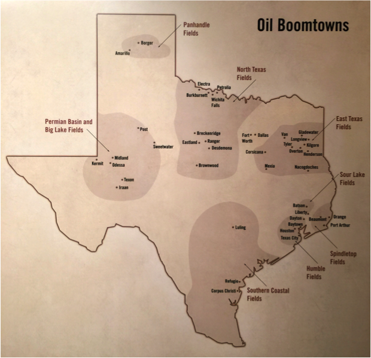

## Table of Contents

## What are the major oil cities in Texas?

Texas has many cities that are important for oil. Some of the biggest ones are Houston, Midland, and Odessa. Houston is the biggest city in Texas and it has a lot of oil companies. It is a big place for oil and gas business. Midland and Odessa are in West Texas. They are known for oil because they are in the Permian Basin, which has a lot of oil.

Midland is a city where many people work in the oil industry. It is not as big as Houston, but it is very important for oil. Odessa is close to Midland and it also has a lot of oil activity. Both cities help Texas produce a lot of oil. They are smaller than Houston but still very important for the oil business in Texas.

These cities show how important oil is to Texas. Houston is a big center for oil companies, while Midland and Odessa are key places for getting oil out of the ground. Together, they help make Texas a big oil state.

## How did these cities become significant in the oil industry?

Houston became a big oil city because it has a good location on the Gulf of Mexico. This makes it easy to ship oil to other places. In the early 1900s, oil was found near Houston, and many oil companies started to move there. Over time, Houston grew into a major center for oil and gas businesses. It has many big companies and a lot of people who work in the oil industry. This made Houston a very important city for oil.

Midland and Odessa became important because they are in the Permian Basin. This area has a lot of oil underground. In the 1920s, people started drilling for oil in this area and found a lot of it. This made Midland and Odessa grow quickly. Many people moved there to work in the oil fields. Even today, these cities are still very important for getting oil out of the ground. They help Texas produce a lot of oil, even though they are smaller than Houston.

These three cities show how oil has shaped Texas. Houston is a big hub for oil companies, while Midland and Odessa are key places for drilling and getting oil. Together, they make Texas a very important state for oil in the United States.

## What is the history of oil discovery in these Texas cities?

Oil was first found near Houston in the early 1900s. A big oil field called Spindletop was discovered in 1901, close to Beaumont, which is not far from Houston. This discovery brought a lot of people and companies to the area. They started drilling for oil and building businesses around it. Over time, Houston grew into a major center for oil and gas. It became a place where many big oil companies set up their offices. This made Houston very important for the oil industry in Texas and the whole country.

In the 1920s, oil was found in West Texas, in an area called the Permian Basin. This area includes Midland and Odessa. The first big oil find in the Permian Basin happened in 1923 near a place called Big Lake. This discovery led to a lot of drilling in Midland and Odessa. People moved there to work in the oil fields, and the cities grew quickly. Even today, the Permian Basin is known for having a lot of oil, and Midland and Odessa are still important places for getting oil out of the ground.

These discoveries changed the cities a lot. Houston became a big hub for oil companies, while Midland and Odessa became key places for drilling and producing oil. Together, these cities helped make Texas a very important state for oil in the United States.

## What are the current oil production levels in these cities?

Houston does not produce oil directly because it is a big city with a lot of oil companies. Instead, it helps manage and sell oil from other places. Houston is a center for oil and gas businesses, so it is very important for the oil industry. Many big oil companies have their offices in Houston, and they help with things like planning and selling oil. This makes Houston a key part of the oil business, even though it does not drill for oil itself.

Midland and Odessa, on the other hand, are in the Permian Basin, which is a big area for oil drilling. In 2022, the Permian Basin produced about 5.5 million barrels of oil every day. Midland and Odessa are part of this, and they help a lot with the oil that comes from this area. These cities are smaller than Houston, but they are very important for getting oil out of the ground. The oil they produce helps make Texas a big oil state.

Together, these cities show how important oil is to Texas. Houston is a big center for oil companies, while Midland and Odessa are key places for drilling and producing oil. This makes Texas a very important place for oil in the United States.

## How do these cities contribute to the global oil market?

Houston helps the global oil market a lot. It is a big city where many oil companies have their offices. These companies plan and sell oil from all over the world. Houston is like a big meeting place for oil business. People from different countries come to Houston to buy and sell oil. This makes Houston very important for the global oil market, even though it does not drill for oil itself.

Midland and Odessa are different. They are in the Permian Basin, which is a big place for drilling oil. The oil they produce is sold all over the world. This oil helps meet the world's need for energy. The oil from Midland and Odessa is important because it adds to the total amount of oil that countries can use. This makes these cities important for the global oil market too.

Together, these cities help make Texas a big player in the world of oil. Houston manages and sells oil, while Midland and Odessa produce it. This teamwork helps the global oil market by making sure there is enough oil for everyone.

## What are the major oil companies operating in these Texas cities?

In Houston, you will find many big oil companies. Some of the biggest ones are ExxonMobil, Chevron, and ConocoPhillips. These companies have their main offices in Houston and they do a lot of work there. They plan where to drill for oil, how to sell it, and how to move it around the world. Houston is a busy place because of all these companies working together to manage oil.

In Midland and Odessa, there are also many oil companies, but they are often smaller than the ones in Houston. Some big companies that work there are Occidental Petroleum and Pioneer Natural Resources. These companies focus on drilling for oil in the Permian Basin. They work hard to get oil out of the ground and then sell it to other places. Midland and Odessa are important because they help produce a lot of the oil that these companies sell.

Both Houston and the cities in the Permian Basin are key places for oil companies. Houston helps with the business side of oil, while Midland and Odessa focus on getting oil out of the ground. Together, they make Texas a very important place for oil in the world.

## What economic impacts have the oil industry had on these cities?

The oil industry has made a big difference in Houston. It has brought a lot of jobs to the city. Many people work for oil companies, and this helps the city grow. The money from oil has also helped build things like roads and schools. This makes Houston a good place to live and work. But, the oil business can also go up and down. When oil prices are low, it can be hard for the city because people might lose their jobs. Still, the oil industry has been very important for making Houston a strong city.

In Midland and Odessa, the oil industry has changed things a lot too. These cities grew quickly because of oil. Many people moved there to work in the oil fields, and this made the cities bigger. The money from oil has helped build things like hospitals and parks. But, like in Houston, the oil business can be up and down. When oil prices drop, it can be tough for people in these cities. Even with these challenges, the oil industry has been very important for making Midland and Odessa strong places.

Overall, the oil industry has had a big impact on these Texas cities. It has brought jobs and money, helping them grow and become important places. But, the oil business can also be hard because it changes a lot. Still, the oil industry has been a big part of making these cities strong and successful.

## What environmental challenges do these oil cities face?

The oil industry in Houston, Midland, and Odessa brings some big problems for the environment. One big problem is air pollution. When oil is drilled and moved around, it can release harmful gases into the air. This can make the air dirty and hard to breathe. It can also cause health problems for people who live in these cities. Another problem is water pollution. Sometimes, oil spills can happen, and this can make rivers and lakes dirty. This is bad for fish and other animals that live in the water.

Another challenge is what to do with old oil wells. When an oil well is not used anymore, it can leak oil and gas. This can harm the land and the water around it. Cleaning up these old wells can be hard and expensive. Also, the oil industry uses a lot of water, and this can be a problem in places where water is already hard to find. People in these cities need to work hard to find ways to make the oil industry safer for the environment.

## How have oil prices affected the economy of these Texas cities?

Oil prices have a big effect on the economy of Houston. When oil prices are high, the city does well. Oil companies make a lot of money, and they hire more people. This means more jobs and more money for people in Houston. The city can use this money to build things like new roads and schools. But when oil prices go down, it can be hard. Oil companies might have to let people go, and this can make it tough for people to find work. This can slow down the city's growth and make it harder for everyone.

In Midland and Odessa, oil prices also make a big difference. When oil prices are high, these cities do well. More people move there to work in the oil fields, and this helps the cities grow. The money from oil can be used to build things like hospitals and parks. But when oil prices drop, it can be a problem. People might lose their jobs, and this can make it hard for the cities to keep growing. Even with these ups and downs, oil prices are very important for the economy of Midland and Odessa.

## What technological advancements in oil extraction are being utilized in these cities?

In Houston, Midland, and Odessa, new technology is helping to get oil out of the ground in better ways. One big change is fracking. This is when people use water, sand, and chemicals to break open rocks and get oil out. It helps to get more oil from places that were hard to reach before. Another new thing is horizontal drilling. This means drilling down and then sideways to reach more oil. These new ways of getting oil help the cities produce more and keep the oil business going strong.

These new technologies also help make drilling safer and better for the environment. For example, better ways of controlling the drilling process mean less chance of oil spills. Also, new tools help to use less water and make less waste. This is good for the cities because it helps keep the environment cleaner. Even though these new ways of getting oil can be expensive, they are important for keeping the oil business strong in Houston, Midland, and Odessa.

## What are the future prospects for the oil industry in these Texas cities?

The future of the oil industry in Houston looks busy. Houston will keep being a big place for oil companies to plan and sell oil. New technology will help make drilling safer and better for the environment. But, the oil business can go up and down. When oil prices are low, it can be hard for the city. Still, Houston will stay important for oil because it has so many big companies and smart people working there.

In Midland and Odessa, the future of oil looks good too. These cities will keep drilling for oil in the Permian Basin. New ways of getting oil, like fracking and horizontal drilling, will help them get more oil out of the ground. But, like in Houston, oil prices can make things hard. When prices drop, it can be tough for people in these cities. Even with these challenges, Midland and Odessa will stay important places for oil because they have a lot of oil underground.

Overall, the oil industry in these Texas cities has a bright future. New technology will help them get more oil and do it in safer ways. But, they will need to be ready for changes in oil prices. If they can handle these ups and downs, Houston, Midland, and Odessa will keep being key places for oil in Texas and the world.

## How do local regulations and policies influence oil operations in these cities?

Local rules and laws in Houston, Midland, and Odessa help shape how oil companies work. In Houston, the city has rules to make sure oil companies do not harm the environment too much. They have to follow laws about air and water pollution. These rules can make it harder for oil companies to do their work, but they help keep the city safe and clean. Also, Houston's rules can affect how much it costs to drill for oil. If the rules are strict, it can cost more money to follow them, but it can also make the city a better place to live.

In Midland and Odessa, local laws also play a big role in oil operations. These cities are in the Permian Basin, where a lot of oil is drilled. The local government has rules to make sure oil companies do not cause too much harm to the land and water. These rules can slow down drilling, but they are important for keeping the environment safe. The cost of following these rules can also affect how much money oil companies make. Even with these challenges, the rules help make sure that oil drilling is done in a way that is good for both the economy and the environment.

Overall, local regulations and policies in these Texas cities help balance the needs of the oil industry with the need to protect the environment. While these rules can make oil operations more expensive and sometimes slower, they are important for keeping the cities safe and healthy. By following these rules, oil companies can help make sure that Houston, Midland, and Odessa remain good places to live and work, even as they continue to produce oil.

## References & Further Reading

[1]: Black, B. C. (2021). ["Oil in Texas: The Gusher Age, 1895–1945"](https://academic.oup.com/jah/article-abstract/90/1/265/742295) Texas A&M University Press.

[2]: Yergin, D. (1991). ["The Prize: The Epic Quest for Oil, Money & Power"](https://www.amazon.com/Prize-Epic-Quest-Money-Power/dp/1439110123) Simon & Schuster.

[3]: Stevens, P. A. (2012). ["The Shale Oil Boom: How Successful Will It Be?"](https://onlinelibrary.wiley.com/doi/full/10.1002/jae.3059) Geographical Journal, The Royal Geographical Society.

[4]: Lopez de Prado, M. (2018). ["Advances in Financial Machine Learning"](https://www.amazon.com/Advances-Financial-Machine-Learning-Marcos/dp/1119482089) Wiley.

[5]: Jansen, S. (2020). ["Machine Learning for Algorithmic Trading"](https://github.com/stefan-jansen/machine-learning-for-trading) Packt Publishing.

[6]: Robertson, C. (2020). ["The Terrifying Consequences of a Fracking Boom in West Texas."](https://www.texastribune.org/2022/02/08/west-texas-earthquakes-fracking/) The New York Times.

[7]: Aronson, D. (2006). ["Evidence-Based Technical Analysis: Applying the Scientific Method and Statistical Inference to Trading Signals"](https://www.wiley.com/en-us/Evidence+Based+Technical+Analysis%3A+Applying+the+Scientific+Method+and+Statistical+Inference+to+Trading+Signals-p-9780470008744) Wiley.