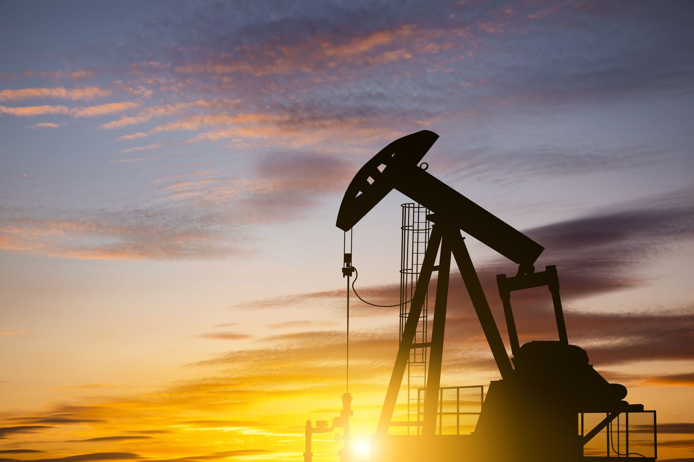

## Table of Contents

## What countries in Asia are considered major oil producers?

Several countries in Asia are major oil producers. The biggest one is Saudi Arabia. It is in the Middle East part of Asia. Saudi Arabia has a lot of oil and is one of the top oil producers in the world. Another important oil producer in Asia is Iraq, also in the Middle East. Iraq has big oil reserves and produces a lot of oil every day.

In addition to Saudi Arabia and Iraq, Iran is also a major oil producer in Asia. Iran is next to Iraq and also has a lot of oil. It is one of the countries with the most oil in the world. Russia is sometimes counted as part of Asia, and it is a very big oil producer too. Even though part of Russia is in Europe, its oil production is very important for Asia.

Other countries like the United Arab Emirates and Kuwait in the Middle East also produce a lot of oil. These countries are smaller but still very important for the world's oil supply. China, in East Asia, is also becoming a bigger oil producer, but it uses a lot of the oil itself.

## How much oil does each major Asian oil-producing country produce annually?

Saudi Arabia is the biggest oil producer in Asia. It makes about 10 to 12 million barrels of oil every day. That means it produces around 3.65 to 4.38 billion barrels of oil each year. Iraq is another big oil producer. It makes about 4.5 million barrels of oil every day, which adds up to about 1.64 billion barrels a year. Iran also produces a lot of oil, around 3.8 million barrels a day, which comes to about 1.39 billion barrels annually.

Russia, which is partly in Asia, is a huge oil producer too. It makes about 10.5 million barrels of oil every day, which means about 3.83 billion barrels a year. The United Arab Emirates produces around 3.8 million barrels a day, which totals about 1.39 billion barrels yearly. Kuwait makes about 2.7 million barrels a day, which adds up to about 0.99 billion barrels each year. China, while not as big as these others, still produces around 4.8 million barrels a day, which comes to about 1.75 billion barrels annually.

## What percentage of the world's oil production comes from Asia?

Asia produces a big part of the world's oil. In 2022, the world made about 94 million barrels of oil every day. Asia, including countries like Saudi Arabia, Russia, Iraq, Iran, the United Arab Emirates, Kuwait, and China, made about 39.5 million barrels of oil each day. That means Asia produced around 42% of the world's oil that year.

Some of these countries are in the Middle East, which is part of Asia. Saudi Arabia, Iraq, Iran, the United Arab Emirates, and Kuwait are all in the Middle East and they produce a lot of the world's oil. Russia is partly in Asia and it also makes a lot of oil. China is in East Asia and it produces oil too, but it uses a lot of it itself. So, Asia is very important for the world's oil supply.

## Which Asian country has the largest oil reserves?

Saudi Arabia has the largest oil reserves in Asia. It has about 267 billion barrels of oil. That is a lot of oil! Saudi Arabia is in the Middle East part of Asia. It is one of the biggest oil producers in the world too. The oil reserves in Saudi Arabia are important because they help the country and the world have enough oil.

Other countries in Asia also have big oil reserves, but not as big as Saudi Arabia. Iran, which is next to Saudi Arabia, has about 209 billion barrels of oil. That is the second largest in Asia. Russia, which is partly in Asia, has around 80 billion barrels. Iraq and the United Arab Emirates also have a lot of oil, but less than Saudi Arabia and Iran. These countries help make sure there is enough oil for everyone.

## How have oil production levels in major Asian countries changed over the past decade?

Over the past decade, oil production in Saudi Arabia has stayed pretty steady. They usually produce around 10 to 12 million barrels of oil every day. Sometimes, they change how much they produce to help keep the world's oil supply balanced. Iraq has increased its oil production a lot over the last 10 years. They went from making about 3 million barrels a day to around 4.5 million barrels a day now. This is because they have been working hard to improve their oil fields and make more oil.

Iran's oil production has gone up and down. It used to make around 3.8 million barrels a day, but because of some rules and problems, it dropped to about 2.1 million barrels a day. Lately, it has been going back up to around 3.8 million barrels a day again. Russia, which is partly in Asia, has also seen changes. They used to make about 10 million barrels a day, and now they are making around 10.5 million barrels a day. The United Arab Emirates and Kuwait have kept their production pretty steady too, with the UAE making about 3.8 million barrels a day and Kuwait around 2.7 million barrels a day. China has been making more oil too, going from about 4 million barrels a day to around 4.8 million barrels a day, but they use a lot of it themselves.

## What are the primary methods of oil extraction used in Asia?

In Asia, the main way to get oil out of the ground is called drilling. They use big machines to make deep holes in the earth, and then they bring the oil up through pipes. This can happen on land or out in the ocean, where they use platforms to drill into the sea floor. Some countries, like Saudi Arabia and Iraq, use a lot of this method because they have big oil fields. They also use advanced technology to make sure they can get as much oil as possible from the ground.

Another way they get oil in Asia is called enhanced oil recovery. This is when they use special methods to get more oil out of places that are hard to reach or where the oil does not flow easily. They might use water, steam, or chemicals to push the oil out of the ground. Countries like Iran and Russia use these methods a lot because their oil fields are getting older and they need to find new ways to keep producing oil. These methods help them get more oil and keep their production levels high.

## What are the environmental impacts of oil production in these Asian countries?

Oil production in Asian countries like Saudi Arabia, Iraq, Iran, and Russia can harm the environment in many ways. When they drill for oil, they might spill oil into the water or onto the land. This can kill plants and animals and make the water dirty. Also, when they burn the oil to use it, it puts a lot of gases into the air, like carbon dioxide. These gases can make the air dirty and cause the earth to get warmer, which is called climate change. The warmer earth can change the weather and make it harder for people and animals to live.

In some places, they use a lot of water to get the oil out of the ground. This can use up the water that people and animals need to drink. Also, when they are done with the oil, they might leave big holes in the ground where they drilled. These holes can be dangerous and hard to fix. The oil companies might not clean up these places well, so the land stays dirty and cannot be used for other things like farming or building homes. This can make life harder for the people who live near the oil fields.

## How do geopolitical factors influence oil production in Asia?

Geopolitical factors can change how much oil Asian countries produce. For example, some countries might decide to make less oil to keep the price high. They might work together in groups like OPEC, which includes Saudi Arabia, Iraq, and Iran. These countries can agree to produce less oil so the world does not have too much, and the price stays good for them. Sometimes, there are fights or disagreements between countries that can stop oil from being made or sent to other places. For example, if two countries do not get along, one might block the other's oil from going through important paths like the Strait of Hormuz.

Another big thing is rules from other countries. Sometimes, other countries put rules on oil-producing countries, like not letting them sell oil to certain places. This happened to Iran when other countries said they could not buy Iranian oil because of some disagreements. These rules can make a country produce less oil because they cannot sell it. Also, some countries might want to be friends with oil-producing countries, so they help them make more oil. For example, China might help countries in the Middle East make more oil because they want to buy it. All these things show how politics can change how much oil is made in Asia.

## What role do state-owned vs. private companies play in the oil industry in Asia?

In Asia, state-owned companies are very important in the oil industry. Countries like Saudi Arabia, Iran, and Iraq have big state-owned companies that control most of their oil. For example, Saudi Aramco in Saudi Arabia is owned by the government and it is one of the biggest oil companies in the world. These companies decide how much oil to produce and where to sell it. They often work with the government to make rules about oil and help the country make money from it. State-owned companies can be good because they keep the oil money in the country and help the government plan for the future.

Private companies also have a role in the oil industry in Asia, but it is usually smaller than state-owned companies. In countries like China, private companies like CNOOC work alongside state-owned ones. These private companies can sometimes be faster at finding new oil and using new technology. They might also work in other countries to find oil. However, private companies often have to follow the rules set by the state-owned companies and the government. This can make it hard for them to grow big or make decisions on their own. Both state-owned and private companies are important, but in many Asian countries, the state-owned ones have more power.

## How does the oil industry in Asia contribute to the global energy market?

The oil industry in Asia is very important for the global energy market. Countries like Saudi Arabia, Iraq, Iran, and Russia produce a lot of oil. They help make sure there is enough oil for everyone in the world. These countries work together in groups like OPEC to decide how much oil to make. This helps keep the price of oil steady. When they make less oil, the price goes up, and when they make more, the price can go down. This is important because many countries and companies around the world need oil to work and live.

Asian oil also travels all over the world. Big ships [carry](/wiki/carry-trading) oil from places like the Middle East to countries like the United States, Europe, and Asia. This helps keep the global energy market running smoothly. Sometimes, if there are problems in Asia, like fights between countries or new rules, it can change how much oil is sent to other places. This can make the price of oil go up or down and affect how much energy people can use. So, what happens in the oil industry in Asia can change things for everyone who uses oil around the world.

## What are the future projections for oil production in major Asian countries?

Over the next few years, oil production in major Asian countries is expected to change in different ways. Saudi Arabia plans to keep making a lot of oil. They want to produce around 12 million barrels of oil every day by 2027. This is because they have big oil fields and they are using new technology to get more oil out of the ground. Iraq also wants to make more oil. They are working on new projects to increase their production to about 6 million barrels a day by 2025. Iran hopes to make more oil too, but it depends on rules from other countries. If the rules change, they might be able to produce up to 4.5 million barrels a day.

Russia, which is partly in Asia, is planning to keep their oil production steady. They want to make around 10.5 million barrels a day for the next few years. The United Arab Emirates and Kuwait are also looking to keep their production levels the same. The United Arab Emirates wants to make about 4 million barrels a day by 2025, and Kuwait wants to stay at around 2.7 million barrels a day. China is different because they use a lot of the oil they make. They plan to increase their production a little bit, but not as much as other countries. They want to make about 5 million barrels a day by 2025. All these plans show that Asian countries will keep playing a big role in the world's oil supply.

## What technological advancements are being made in oil extraction and processing in Asia?

In Asia, they are using new technology to get more oil out of the ground. One big thing they are doing is using better ways to find oil. They use special machines and computers to look deep into the earth and see where the oil is. This helps them drill in the right places and get more oil. They are also using new methods like horizontal drilling, where they drill sideways to reach more oil. This is helpful in places like Saudi Arabia and Iraq where they want to make the most out of their oil fields. Another thing they are doing is using steam to make the oil flow better. This is called steam injection, and it is used a lot in countries like Iran and Russia to get oil from places that are hard to reach.

They are also making the oil better once they get it out of the ground. In places like the United Arab Emirates and Kuwait, they are using new ways to clean the oil and make it ready to use. They use big machines that can take out the bad stuff from the oil, like sulfur, so it burns cleaner. This helps the environment and makes the oil worth more money. In China, they are working on new ways to turn oil into other things, like chemicals and plastics. This is called refining, and it helps them use the oil in different ways. All these new technologies are helping Asian countries make more oil and use it better.

## What are the future prospects and challenges?

As Asia navigates the evolving landscape of the oil industry, several future trends and challenges have begun to shape the region's energy policies. A critical [factor](/wiki/factor-investing) influencing these trends is the role of renewable energy and sustainability. Governments are increasingly pressured to integrate sustainable practices and alternative energy sources to reduce carbon emissions and reliance on fossil fuels. This shift is evident in policies and investments focused on solar, wind, and bioenergy. In turn, these changes impact the dynamics of the oil market, as demand gradually transitions from oil to cleaner energy forms. 

Mathematically, this transition can be analyzed using basic models of supply and demand, where the introduction of renewable energy sources reduces the demand for oil, potentially leading to a decrease in price and production levels. For example, the demand function can be adjusted to reflect a percentage decrease in oil consumption due to renewable alternatives:

$$
D_{\text{new}} = D_{\text{old}} \times (1 - \text{renewable impact})
$$

where $D_{\text{new}}$ is the adjusted demand, $D_{\text{old}}$ is the original demand, and $\text{renewable impact}$ is the estimated proportionate reduction in demand due to renewables.

Geopolitical issues pose another significant challenge to the future of the Asian oil industry. The region has several geopolitically sensitive areas, such as the South China Sea and the Korean Peninsula, which can affect oil supply and trade routes. Political instability, territorial disputes, and diplomatic tensions can disrupt production, impact the safe passage of oil tankers, and lead to fluctuations in global oil prices. This geopolitical uncertainty requires strategic navigation by Asian countries to ensure energy security and maintain oil supply continuity.

In terms of future outlook, Asia's oil industry must also contend with global energy needs that increasingly emphasize decarbonization and climate resilience. Cooperation among Asian nations, alongside international allies, is vital to address these complex challenges. Advancements in technology and infrastructure, as well as comprehensive energy policies, will play crucial roles in enabling Asia to meet its energy demands while transitioning toward a sustainable future.

In summary, while the Asian oil industry continues to be a cornerstone of the region's energy portfolio, the future will undeniably require a delicate balance between maintaining oil production and embracing sustainable energy solutions. The involvement of renewables and the impact of geopolitical factors will significantly determine the trajectory of Asia's energy policies and its contribution to the global energy landscape.

## References & Further Reading

[1]: BP. (2023). ["Statistical Review of World Energy 2023"](https://www.energyinst.org/statistical-review).

[2]: International Energy Agency (IEA). (2021). ["World Energy Outlook 2021"](https://www.iea.org/reports/world-energy-outlook-2021).

[3]: O'Sullivan, S. (2019). ["Asian Oil Buyers See Growing Dependence on Mid-East Supplies"](https://www.sciencedirect.com/science/article/abs/pii/S0301421519300436). Reuters.

[4]: Lopez de Prado, M. (2018). ["Advances in Financial Machine Learning"](https://www.amazon.com/Advances-Financial-Machine-Learning-Marcos/dp/1119482089).

[5]: Energy Information Administration (EIA). (2021). ["International Energy Outlook 2021"](https://www.eia.gov/outlooks/ieo/pdf/IEO2021_ReleasePresentation.pdf).

[6]: Aronson, D. (2007). ["Evidence-Based Technical Analysis: Applying the Scientific Method and Statistical Inference to Trading Signals"](https://www.amazon.com/Evidence-Based-Technical-Analysis-Scientific-Statistical/dp/0470008741).

[7]: Jansen, S. (2020). ["Machine Learning for Algorithmic Trading"](https://github.com/stefan-jansen/machine-learning-for-trading).