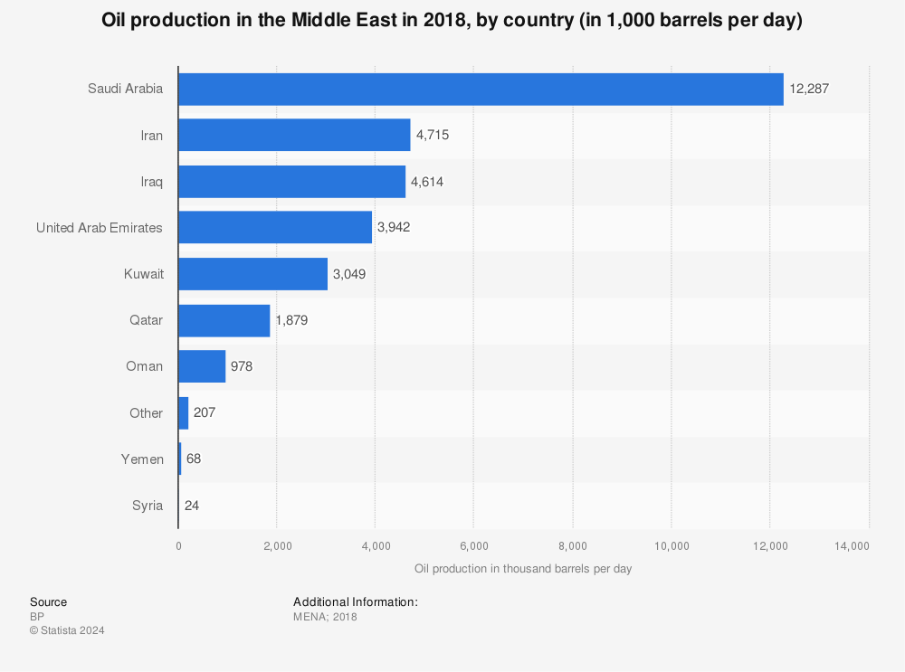

## Table of Contents

## What countries in the Middle East are considered major oil producers?

The Middle East has several countries that are major oil producers. The biggest one is Saudi Arabia. It has a lot of oil and is one of the top countries in the world for oil production. Another important country is Iraq. It also has a lot of oil and is working to produce more. Iran is another major oil producer in the region. It has big oil reserves and produces a lot of oil every day.

The United Arab Emirates (UAE) is also a key player in the oil industry. It has several large oil fields and is known for its high oil production. Kuwait is another country in the Middle East with significant oil production. It has been producing oil for a long time and has large reserves. Qatar, although smaller in size, is also an important oil producer and is well-known for its oil and gas industry.

These countries are all part of the Organization of the Petroleum Exporting Countries (OPEC), which helps them work together to manage oil production and prices. The Middle East is very important for the world's oil supply because of these countries.

## How does oil production contribute to the economy of Middle Eastern countries?

Oil production is very important for the economies of Middle Eastern countries. It brings in a lot of money for these countries. They can use this money to build roads, schools, and hospitals. It also helps create jobs for people who work in the oil industry, like engineers and workers on oil rigs. Countries like Saudi Arabia, Iraq, and the UAE earn a big part of their money from selling oil to other countries. This money helps make their economies stronger and helps them grow.

Oil also helps these countries trade with other countries around the world. When they sell oil, they can buy things they need, like food and technology. This makes their economies more connected to the global market. But, relying a lot on oil can be risky. If oil prices go down, it can hurt their economies. So, some countries are trying to make other parts of their economies stronger, like tourism and technology, to not depend only on oil.

## What is the history of oil discovery in the Middle East?

The history of oil discovery in the Middle East began in the early 20th century. The first big discovery happened in Iran in 1908. A British company found oil there and started drilling. This was a big deal because it showed that the Middle East had a lot of oil. After that, other countries in the region started looking for oil too. In 1932, oil was found in Bahrain, and this discovery encouraged more exploration in the area.

Soon after, Saudi Arabia discovered oil in 1938. This was a huge find because Saudi Arabia had a lot of oil, more than anyone expected. The discovery in Saudi Arabia made the country very important in the world of oil. Other countries like Iraq, Kuwait, and the UAE also found oil around the same time. By the middle of the 20th century, the Middle East became known as a major oil-producing region. This changed the economies of these countries and made them important players in the global oil market.

## Which Middle Eastern country has the largest oil reserves?

Saudi Arabia has the largest oil reserves in the Middle East. It has a lot of oil under its ground, more than any other country in the region. This makes Saudi Arabia very important in the world of oil. They can produce a lot of oil every day and sell it to other countries.

Because of these big oil reserves, Saudi Arabia's economy depends a lot on oil. The money they get from selling oil helps them build things like roads and schools. It also creates jobs for people who work in the oil industry. So, having the largest oil reserves is very important for Saudi Arabia.

## How do oil production levels vary among Middle Eastern countries?

Oil production levels in the Middle East vary a lot from country to country. Saudi Arabia produces the most oil. They can make millions of barrels of oil every day. This is because they have a lot of oil in their ground. Iraq and Iran also produce a lot of oil, but not as much as Saudi Arabia. They still make a big amount of oil every day and are important in the oil world.

The United Arab Emirates (UAE) and Kuwait also have high oil production levels. They make less oil than Saudi Arabia, but they still produce a lot. The UAE has several big oil fields, and Kuwait has been making oil for a long time. Qatar produces less oil than these countries, but it is still important because it also has a big gas industry. Each country's oil production depends on how much oil they have and how much they can take out of the ground every day.

## What are the major oil companies operating in the Middle East?

Many big oil companies work in the Middle East. Saudi Aramco is one of the biggest. It is from Saudi Arabia and produces a lot of oil. Another important company is the National Iranian Oil Company, which is in Iran. They also produce a lot of oil and help Iran's economy. The Kuwait Petroleum Corporation is another big company in Kuwait. They work to produce and sell oil from Kuwait.

Other companies from outside the Middle East also work there. ExxonMobil from the United States and TotalEnergies from France have operations in the region. They work with local companies to produce oil. The Abu Dhabi National Oil Company (ADNOC) in the UAE is also very important. They produce a lot of oil and help the UAE's economy. These companies all help to get oil out of the ground and sell it to other countries.

The Qatar Petroleum, now known as QatarEnergy, is another key player in the region. They not only produce oil but also a lot of natural gas. These companies are important because they help Middle Eastern countries make money from their oil and gas. They also create jobs and help build the countries' economies.

## How has oil influenced the geopolitical dynamics in the Middle East?

Oil has a big effect on the way countries in the Middle East act with each other and with the rest of the world. Because the Middle East has a lot of oil, other countries want to be friends with them. This makes the countries with oil, like Saudi Arabia and Iran, very powerful. They can use their oil to make deals with other countries. Sometimes, countries fight over oil too. For example, Iraq and Iran have had problems because of oil. Oil also makes some countries richer than others, which can cause tension.

Oil also affects how countries work together. Countries with a lot of oil, like those in the Middle East, joined a group called OPEC. This group helps them decide how much oil to produce and sell. By working together, they can control oil prices and make more money. But sometimes, countries in OPEC disagree on what to do, which can cause problems. Overall, oil makes the Middle East a very important place in the world, and it shapes how countries there interact with each other and with other countries.

## What are the environmental impacts of oil production in the Middle East?

Oil production in the Middle East can harm the environment. When oil is taken out of the ground, it can cause pollution. The machines and factories used to get oil out can release harmful gases into the air. These gases can make the air dirty and cause health problems for people. Oil spills can also happen. When oil spills, it can go into the water and harm fish and other animals that live in the water. The land around oil fields can also get damaged. The ground can become dry and hard to use for farming.

To try to fix these problems, Middle Eastern countries are working on ways to produce oil that is kinder to the environment. They are using new technology to make less pollution. Some countries are also trying to use more clean energy, like solar power, to not depend so much on oil. But, it is still hard because oil is very important for their economies. So, they have to find a balance between making money from oil and keeping the environment safe.

## How do Middle Eastern oil producers manage oil prices and production through OPEC?

Middle Eastern oil producers work together in a group called OPEC to manage oil prices and production. OPEC stands for Organization of the Petroleum Exporting Countries. Countries like Saudi Arabia, Iran, Iraq, and others in the Middle East are part of this group. They meet regularly to talk about how much oil they should produce. By working together, they can decide to produce more or less oil. This helps them control how much oil is available in the world, which affects the price of oil. If they produce less oil, the price goes up because there is less oil to buy. If they produce more oil, the price can go down because there is more oil available.

Sometimes, OPEC countries have different ideas about what to do. Some countries might want to produce more oil to make more money right away. Others might want to produce less oil to keep prices high. When they can't agree, it can be hard to control oil prices. But when they do agree, they can have a big effect on the world's oil market. OPEC helps Middle Eastern countries work together to make sure they all benefit from their oil. This cooperation is important because it helps them have more control over their economies and the global oil market.

## What technological advancements have been made in oil extraction in the Middle East?

Oil extraction in the Middle East has seen many new technologies that make it easier and better. One big change is the use of advanced drilling techniques. These techniques let oil companies drill deeper into the ground and reach oil that was hard to get before. They use machines that can drill in different directions, not just straight down. This helps them find more oil in places that were too hard to reach before. Another important technology is called hydraulic fracturing, or "fracking." This method uses water, sand, and chemicals to break apart rock and release oil trapped inside. It has helped increase the amount of oil that can be taken out of the ground.

There are also new ways to find oil. Scientists use special tools and computers to look deep into the ground without drilling. They can make detailed pictures of what's underground, which helps them know where to drill. This saves time and money because they don't have to drill in places where there might not be any oil. Another big advancement is in the way oil is moved and stored. Pipelines and storage tanks are now made with better materials that last longer and are safer. All these new technologies help Middle Eastern countries produce more oil and do it in a way that is better for the environment.

## How are Middle Eastern countries diversifying their economies away from oil dependency?

Middle Eastern countries are trying to depend less on oil by growing other parts of their economies. They are focusing on things like tourism, technology, and finance. For example, the United Arab Emirates (UAE) is building big hotels and attractions to bring in more tourists. They are also making Dubai a big center for business and technology. Saudi Arabia is working on a project called Vision 2030, which aims to make their economy stronger in areas like entertainment and renewable energy. By doing these things, these countries hope to make money from different sources and not just oil.

Another way they are diversifying is by investing in education and skills training. They want to make sure their people have the knowledge and skills to work in new industries. Qatar, for example, has been spending a lot of money on building good schools and universities. They want to turn their country into a place known for education and innovation. By doing this, they hope to create jobs that don't depend on oil. Overall, Middle Eastern countries are trying hard to build economies that can stand on their own, even if oil prices go down.

## What future trends are predicted for oil production in the Middle East?

In the future, oil production in the Middle East is expected to keep growing. Countries like Saudi Arabia, Iraq, and the UAE have big plans to increase how much oil they produce. They are using new technology to find and get more oil out of the ground. This means they can produce more oil than before. But, they also know that the world is trying to use less oil because of climate change. So, they are trying to find a balance between making more oil and being ready for a world that might need less oil in the future.

Another big trend is that Middle Eastern countries are working to use more renewable energy. They are building big solar and wind farms to make electricity without using oil. This is part of their plan to not depend only on oil for their economies. They want to have other ways to make money, like tourism and technology. By doing this, they hope to be ready for a future where oil might not be as important as it is now. This shift could change how much oil they produce and sell in the coming years.

## References & Further Reading

[1]: BP. (2023). [Statistical Review of World Energy 2023.](https://www.energyinst.org/statistical-review) BP Global.

[2]: Lopez de Prado, M. (2018). ["Advances in Financial Machine Learning."](https://www.amazon.com/Advances-Financial-Machine-Learning-Marcos/dp/1119482089) John Wiley & Sons.

[3]: Chan, E. P. (2009). [Quantitative Trading: How to Build Your Own Algorithmic Trading Business.](https://github.com/ftvision/quant_trading_echan_book) John Wiley & Sons.

[4]: Jansen, S. (2020). [Machine Learning for Algorithmic Trading.](https://github.com/stefan-jansen/machine-learning-for-trading) Packt Publishing.

[5]: Aronson, D. R. (2007). [Evidence-Based Technical Analysis: Applying the Scientific Method and Statistical Inference to Trading Signals.](https://onlinelibrary.wiley.com/doi/book/10.1002/9781118268315) John Wiley & Sons.

[6]: Johnson, B. (2010). [Algorithmic Trading & DMA: An Introduction to Direct Access Trading Strategies.](https://archive.org/details/algorithmictradi0000john) 4Myeloma Press.