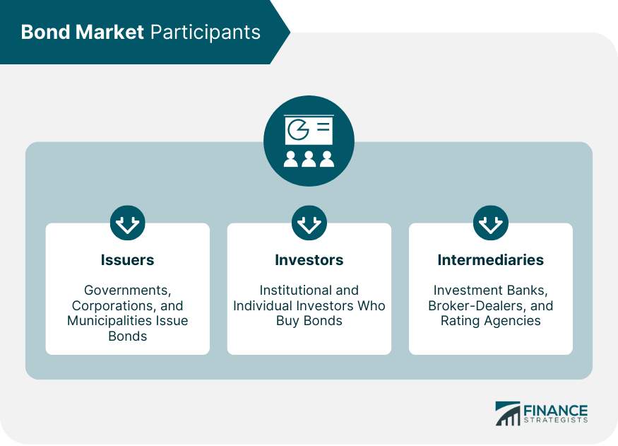

## Table of Contents

## What is the bond market and why is it important?

The bond market is like a big store where people and organizations can buy and sell bonds. Bonds are like IOUs where one party promises to pay back money they borrowed, plus some extra, over time. Governments and companies often use bonds to borrow money when they need it. For example, if a government needs money to build roads, it can issue bonds to the public. People who buy these bonds are lending money to the government and will get their money back with interest later.

The bond market is important because it helps the economy work smoothly. It gives governments and companies a way to borrow money to do big projects or grow their business. This can lead to more jobs and better services for people. Also, the bond market is a safe place for people to invest their money. When people buy bonds, they know they will get their money back plus interest, which can help them save for the future or have money when they retire. So, the bond market helps both borrowers and lenders, making it a key part of the financial world.

## Who are considered major participants in the bond market?

The bond market has many important players. Governments are big ones. They issue bonds to borrow money for things like building schools or roads. Companies also join in. They sell bonds to get money for growing their business or starting new projects. These are called corporate bonds.

Another group of major participants is investors. They can be regular people saving for the future, or big institutions like banks and pension funds. These investors buy bonds to earn interest over time. They see bonds as a safe way to grow their money. Bond traders are also key players. They buy and sell bonds quickly, trying to make a profit from the small changes in bond prices. All these participants together make the bond market work.

## How do governments participate in the bond market?

Governments participate in the bond market by issuing bonds to borrow money. When a government needs money for big projects like building hospitals or highways, it can sell bonds to the public. People and institutions buy these bonds, which means they are lending money to the government. In return, the government promises to pay back the money they borrowed, plus interest, over a certain period. This way, governments can raise money without raising taxes right away.

Governments also play a role in the bond market by managing the economy. They can issue more or fewer bonds depending on how much money they need and what's happening in the economy. For example, if the economy is growing too fast, the government might issue more bonds to take some money out of circulation and slow things down. On the other hand, if the economy needs a boost, the government might issue fewer bonds so more money stays in people's pockets. By doing this, governments help keep the economy stable and balanced.

## What role do central banks play in the bond market?

Central banks are very important in the bond market. They help control the economy by buying and selling bonds. When a central bank buys bonds, it puts more money into the economy. This can help make the economy grow because people and businesses have more money to spend. On the other hand, when a central bank sells bonds, it takes money out of the economy. This can slow down the economy if it's growing too fast.

Central banks also set interest rates, which affect bond prices. If the central bank lowers interest rates, new bonds will pay less interest. This makes older bonds, which pay higher interest, more valuable. So their prices go up. If the central bank raises interest rates, new bonds will pay more interest. This makes older bonds, which pay less interest, less valuable. So their prices go down. By doing these things, central banks can help keep the economy stable and make sure it doesn't grow too fast or too slow.

## How do commercial banks engage with the bond market?

Commercial banks are active in the bond market in several ways. They buy bonds as a way to invest the money they get from their customers' deposits. When a bank buys a bond, it's like lending money to the government or a company. The bank earns interest on these bonds, which helps it make money. Banks also sell bonds to their customers. They might help people and businesses buy bonds as a safe way to save or invest money. This way, banks act like a middleman between people who want to invest and those who need to borrow money.

Commercial banks also use the bond market to manage their own money. If a bank has extra money, it might buy bonds to earn some interest until it needs that money again. If a bank needs more money, it might sell some of its bonds. Banks also trade bonds among themselves. They might buy and sell bonds to make a profit from small changes in bond prices. This trading helps keep the bond market active and liquid, meaning it's easy for people to buy and sell bonds whenever they want.

## What is the involvement of institutional investors like pension funds and insurance companies in the bond market?

Institutional investors like pension funds and insurance companies are big players in the bond market. They buy bonds as a way to invest the money they manage for other people. For example, a pension fund takes money from workers to save for their retirement. They use this money to buy bonds because bonds are seen as safe and steady investments. They earn interest from these bonds, which helps them grow the money they need to pay pensions in the future. Insurance companies do something similar. They collect money from people buying insurance and invest some of it in bonds to make sure they have enough money to pay out claims when needed.

These institutions also help make the bond market stable and active. Because they manage so much money, their buying and selling can affect bond prices and interest rates. When they buy a lot of bonds, it can push bond prices up and interest rates down. When they sell a lot of bonds, it can do the opposite. This activity helps keep the bond market liquid, meaning it's easy for people to buy and sell bonds. By investing in bonds, pension funds and insurance companies not only help themselves but also help keep the whole financial system running smoothly.

## How do mutual funds and ETFs participate in the bond market?

Mutual funds and ETFs, which stands for exchange-traded funds, are ways for people to invest in the bond market without buying bonds directly. These funds collect money from many people and use it to buy a bunch of different bonds. This way, people can own a small piece of many bonds, which spreads out their risk. If one bond doesn't do well, it won't hurt their investment too much because they have many others. Mutual funds are managed by professionals who choose which bonds to buy and sell, while ETFs often try to match the performance of a bond index, like the Bloomberg Barclays U.S. Aggregate Bond Index.

Both mutual funds and ETFs help make the bond market more active and easier for people to invest in. When these funds buy and sell bonds, it helps keep the market moving and liquid, meaning people can buy and sell bonds easily. This is good for the whole economy because it helps money flow where it's needed. Also, by offering different types of bond funds, like those that focus on government bonds or corporate bonds, mutual funds and ETFs give people more choices to match their investment goals and how much risk they want to take.

## What strategies do hedge funds use in the bond market?

Hedge funds use different strategies in the bond market to try to make money. One common strategy is called "[arbitrage](/wiki/arbitrage)." This is when hedge funds look for small differences in bond prices and try to make money from these differences. For example, they might buy a bond in one place where it's cheaper and sell it in another place where it's more expensive. Another strategy is "relative value trading." Here, hedge funds compare different bonds and try to figure out which ones are a better deal. They might buy one bond and sell another, betting that the one they bought will do better than the one they sold.

Hedge funds also use a strategy called "[macro trading](/wiki/macro-trading)." This is when they try to guess what will happen to the economy and use that guess to make money in the bond market. For example, if they think interest rates will go up, they might sell bonds because bond prices usually go down when interest rates go up. Another strategy is "distressed debt investing." This is when hedge funds buy bonds from companies that are having money problems. They hope to buy these bonds cheap and then make a lot of money if the company gets better or if they can get their money back in other ways.

These strategies show how hedge funds try to make money in the bond market. They use their knowledge and guesses about the market to find ways to make a profit. This can make the bond market more active and help it work better, but it also adds some risk because hedge funds are trying to make big profits, which can sometimes lead to big losses.

## How do individual investors access the bond market?

Individual investors can access the bond market in a few different ways. One way is by buying bonds directly from the government or a company. For example, they can buy U.S. Treasury bonds from the government's website or through a bank. This is a good way to lend money to the government and earn interest over time. Another way is through a broker. Brokers are people or companies that help you buy and sell bonds. They can give you advice on which bonds to buy and handle the buying and selling for you.

Individual investors can also access the bond market through mutual funds and ETFs. These are funds that pool money from many people and use it to buy a bunch of different bonds. By investing in a bond mutual fund or [ETF](/wiki/etf-trading-strategies), you own a small piece of many bonds, which spreads out your risk. This can be a good way to invest in bonds without having to pick them yourself. Plus, these funds are managed by professionals who know a lot about bonds, so you can benefit from their expertise.

## What are the differences in bond market participation between developed and emerging markets?

In developed markets, like the United States or Europe, the bond market is big and very active. Governments in these places issue a lot of bonds to borrow money for things like building roads or schools. Companies also use the bond market to get money for growing their business. There are many investors, like banks, pension funds, and regular people, who buy these bonds. They see bonds as a safe way to invest their money and earn interest. The bond market in developed countries is well-organized and easy to access, with lots of different types of bonds to choose from.

In emerging markets, like Brazil or India, the bond market is smaller and not as active. Governments and companies in these places still issue bonds, but there are fewer investors interested in buying them. This can make it harder for them to borrow money. Also, the bond market in emerging markets can be riskier because these countries might have more ups and downs in their economy. But, because of this risk, bonds from emerging markets can sometimes offer higher interest rates, which can attract some investors looking for bigger returns. The bond market in these countries is growing, but it's not as easy to access or as well-developed as in richer countries.

## How do regulatory bodies influence the activities of major participants in the bond market?

Regulatory bodies, like the Securities and Exchange Commission (SEC) in the U.S., have a big role in how people and organizations act in the bond market. They make rules that everyone has to follow to make sure the market is fair and safe. For example, they might require companies to give clear information about their bonds so investors know what they're buying. They also watch to make sure no one is cheating or doing anything wrong. If someone breaks the rules, these bodies can punish them with fines or other actions.

These rules affect everyone in the bond market, from governments and companies that issue bonds to banks and investors who buy them. Governments have to follow rules about how they can borrow money and what they need to tell people about their bonds. Companies have to be honest about their financial health when they sell bonds. Banks and other big investors have to follow rules about how they can buy and sell bonds. All these rules help keep the bond market running smoothly and make sure it's a safe place for everyone to invest their money.

## What are the advanced trading and risk management techniques used by expert participants in the bond market?

Expert participants in the bond market use advanced trading techniques like [algorithmic trading](/wiki/algorithmic-trading) and high-frequency trading to make quick and smart decisions. Algorithmic trading uses computer programs to buy and sell bonds based on a set of rules. This helps traders act fast and take advantage of small changes in bond prices. High-frequency trading is a type of algorithmic trading that happens very quickly, often in milliseconds. Traders using this technique can make many trades in a short time, trying to make small profits from tiny price differences. These techniques help experts manage their trading better and try to make more money.

For risk management, experts use techniques like duration analysis and credit analysis to understand and control the risks they face. Duration analysis helps them see how sensitive their bond investments are to changes in interest rates. If interest rates go up, bond prices usually go down, and duration analysis helps them figure out how much. Credit analysis is about looking at how likely a bond issuer is to pay back the money they borrowed. Experts study the financial health of governments and companies to decide if their bonds are safe to buy. By using these techniques, experts can make smarter choices and protect their investments from big losses.

## References & Further Reading

[1]: ["Algorithmic Trading and DMA: An Introduction to Direct Access Trading Strategies"](https://www.amazon.com/Algorithmic-Trading-DMA-introduction-strategies/dp/0956399207) by Barry Johnson

[2]: ["Fixed Income Securities: Tools for Today's Markets"](https://www.amazon.com/Fixed-Income-Securities-Markets-Finance/dp/1119835550) by Bruce Tuckman and Angel Serrat

[3]: ["The Handbook of Fixed Income Securities"](https://www.amazon.com/Handbook-Fixed-Income-Securities-Ninth/dp/1260473899) by Frank J. Fabozzi

[4]: Hendershott, T., Jones, C. M., & Menkveld, A. J. (2011). ["Does Algorithmic Trading Improve Liquidity?"](https://onlinelibrary.wiley.com/doi/full/10.1111/j.1540-6261.2010.01624.x) Journal of Finance, 66(1), 1-33.

[5]: O'Hara, M. (2015). ["High-Frequency Trading and its Impact on Markets."](https://www.tandfonline.com/doi/abs/10.2469/faj.v70.n3.6) Annual Review of Financial Economics, 7, 133-150.