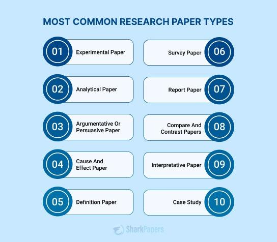

## Table of Contents

## What is considered a major research paper?

A major research paper is a detailed and thorough piece of academic writing that explores a specific topic in depth. It usually involves a lot of research, analysis, and original thought. These papers are often longer than regular essays and can take months or even years to complete. They are commonly required for advanced degrees like master's or doctoral programs, where students need to show they can conduct significant research and contribute new ideas to their field.

Major research papers often follow a structured format, including an introduction, literature review, methodology, results, discussion, and conclusion. The introduction sets the stage for the research, explaining why the topic is important. The literature review looks at what other researchers have already found on the topic. The methodology section explains how the research was done, and the results section shows what was discovered. The discussion interprets the findings and their implications, while the conclusion wraps up the paper and suggests areas for future research. These papers are important because they help advance knowledge in various fields and can influence future studies and practices.

## How do major research papers contribute to scientific knowledge?

Major research papers are very important for growing our understanding of the world. They do this by adding new information and ideas to what we already know. When someone writes a major research paper, they look at a specific topic very closely. They read a lot of other papers and then do their own research. This helps them find new things that nobody knew before. By sharing these new findings in their paper, they help other scientists learn more about the topic.

These papers also help to check and improve the information we already have. Scientists read these papers to see if the new ideas make sense and fit with what they already know. Sometimes, the new research can show that old ideas were wrong or need to be changed. This is good because it helps make sure that our knowledge is correct and up to date. Over time, as more major research papers are written, our understanding of the world keeps getting better and more detailed.

## What are the key components of a major research paper?

A major research paper has several important parts that help explain the research clearly. The first part is the introduction, which tells why the topic is important and what the paper will talk about. After that comes the literature review, where the writer looks at what other people have already found out about the topic. This helps show what we already know and what still needs to be learned. The next part is the methodology, which explains how the research was done, like what methods or experiments were used.

The results section then shows what the research found. This part can have tables or graphs to make the information easier to understand. After the results, the discussion section explains what the findings mean and how they fit with what we already know. It can also talk about any problems with the research and suggest ways to do better research in the future. Finally, the conclusion sums up the main points of the paper and can suggest new questions to study.

These parts work together to make a strong research paper. By following this structure, the writer can clearly show their research process and findings, helping other people understand and learn from their work.

## How can one identify a high-quality major research paper?

A high-quality major research paper is easy to spot because it follows a clear structure and has strong evidence. The paper should start with a good introduction that explains why the topic is important and what the paper will talk about. The literature review should be thorough, showing what other people have found out and what still needs to be learned. The methodology section should explain how the research was done in a way that others can understand and repeat. The results should be clear and well-organized, often with tables or graphs to help explain the findings. The discussion should connect the results to what we already know and suggest new ideas or questions for future research. The conclusion should sum up the main points and leave the reader with something to think about.

Another way to tell if a major research paper is high-quality is by looking at how well it is written and how it contributes to the field. The writing should be clear and easy to follow, with no confusing parts. The paper should also add something new to what we already know. This could be new data, a new way of looking at things, or a solution to a problem that people have been trying to solve. High-quality papers often get cited by other researchers because they are useful and important. They also go through a process called peer review, where other experts check the paper to make sure it is accurate and well-done. If a paper has been through peer review and published in a respected journal, it is usually a good sign that it is high-quality.

## What are some examples of influential major research papers in various fields?

In the field of physics, one very influential major research paper is Albert Einstein's 1905 paper on the theory of special relativity. In this paper, Einstein explained that time and space are not separate but connected, and that the speed of light is always the same no matter how fast you are moving. This paper changed how we think about the universe and led to many new discoveries and technologies. Another important paper in physics is the 2012 paper announcing the discovery of the Higgs boson, also known as the "God particle." This paper confirmed a key part of the Standard Model of particle physics and helped us understand how particles get their mass.

In the field of medicine, a famous major research paper is the 1953 paper by James Watson and Francis Crick on the structure of DNA. They showed that DNA is shaped like a twisted ladder, called a double helix, and this discovery helped us understand how life works at the most basic level. It opened the door to new fields like genetics and biotechnology. In psychology, a well-known paper is B.F. Skinner's 1938 work on operant conditioning, which explained how behavior can be changed using rewards and punishments. This paper has had a big impact on how we teach and train people and animals.

In the field of economics, a significant paper is John Maynard Keynes' 1936 book "The General Theory of Employment, Interest and Money." This book introduced new ideas about how governments can help fix economic problems like unemployment and recessions. It changed how countries around the world manage their economies. In the field of environmental science, a key paper is Rachel Carson's 1962 book "Silent Spring," which showed how pesticides were harming the environment and wildlife. This book led to new laws to protect the environment and started the modern environmental movement.

## How does the peer-review process work for major research papers?

The peer-review process is a way to check if a major research paper is good and correct before it gets published. When a researcher finishes their paper, they send it to a scientific journal. The journal's editor looks at the paper first to see if it fits with what the journal publishes. If it does, the editor sends the paper to other experts in the same field. These experts, called peer reviewers, read the paper carefully. They check if the research was done well, if the results make sense, and if the paper is written clearly. The reviewers write down their thoughts and send them back to the editor. They might say the paper is good and should be published, or they might suggest changes, or they might say it's not good enough to publish.

After the editor gets the reviews, they decide what to do next. If the reviewers said the paper needs changes, the editor sends their comments back to the researcher. The researcher then fixes the paper and sends it back. The editor might send it to the same reviewers again to see if they think the changes are good enough. If everyone agrees the paper is now good, it gets published. This whole process can take a few months or even longer. Peer review helps make sure that only good, correct research gets published, which is important for growing our knowledge and trust in science.

## What are the common challenges faced when writing a major research paper?

Writing a major research paper can be hard for many reasons. One big challenge is finding good information. You need to read a lot of other papers and [books](/wiki/algo-trading-books) to learn what is already known about your topic. This can take a long time, and sometimes it's hard to find the right sources. Another challenge is figuring out the right way to do your research. You have to decide what methods to use, and this can be tricky because you want to make sure your research is done well and that other people can repeat it if they want to.

Another common problem is keeping everything organized. A major research paper has many parts, like the introduction, literature review, and results. It can be tough to keep all these parts clear and connected. Writing the paper can also be challenging. You need to explain your ideas and findings in a way that is easy to understand, but also sounds smart and professional. This can be hard, especially if English is not your first language. Finally, the whole process can take a long time, and it can be stressful to keep working on the paper for months or even years.

## How do major research papers influence policy and industry?

Major research papers can change how governments make rules and how businesses work. When a research paper shows new information or a new way to solve a problem, it can help people who make laws to make better decisions. For example, if a paper shows that a certain chemical is bad for the environment, the government might make a new rule to stop using that chemical. This can help protect the environment and make people's lives better. Research papers can also help businesses by showing them new ways to make their products or services better. If a paper finds a new technology that can save energy, a company might start using that technology to make their products more efficient and save money.

Sometimes, the influence of a major research paper can be seen right away, but other times it can take a long time. For example, a paper on the dangers of smoking helped lead to new laws about where people can smoke and how cigarettes are sold. This took many years, but it made a big difference in public health. In industry, a research paper might lead to a new product or a new way of doing things. For example, a paper on how to make solar panels better might help a company start making new, more efficient solar panels. This can help the company grow and help the environment by making more people use solar energy.

## What methodologies are commonly used in major research papers?

Major research papers often use different ways to gather and study information. One common way is through experiments, where researchers set up conditions to test their ideas. For example, in medicine, they might give some people a new medicine and others a fake one to see if the new medicine works better. Another way is through surveys and questionnaires, where researchers ask people questions to learn about their thoughts or behaviors. This is often used in social sciences like psychology or sociology. Researchers also use observational methods, where they watch and record what happens without changing anything. This can be useful in fields like anthropology or animal behavior studies.

Another common method is using existing data, called secondary data analysis. Researchers look at data that was already collected by someone else, like government [statistics](/wiki/bayesian-statistics) or past studies, to answer new questions. This can save time and money. Some papers use qualitative methods, like interviews or focus groups, to get deep, detailed information about people's experiences or opinions. Others use quantitative methods, like statistical analysis, to look at numbers and find patterns. Many major research papers use a mix of these methods to get a full picture of their topic.

## How has the approach to major research papers evolved over the last century?

Over the last century, the way people write major research papers has changed a lot. In the early 1900s, research papers were often written by hand or typed on typewriters. They were usually shorter and focused on just one main idea. Back then, researchers had to go to libraries to find information because the internet did not exist. As time went on, technology like computers and the internet made it easier to write and share research. Papers started to get longer and more detailed because researchers could use more data and connect with other scientists around the world. The structure of research papers also became more standardized, with sections like introduction, methods, results, and discussion becoming common.

In recent decades, the approach to major research papers has continued to evolve with new technology and methods. Now, researchers can use powerful computers to analyze huge amounts of data quickly. They can also share their work online, making it easier for others to read and use their findings. The rise of interdisciplinary research means that papers often combine ideas from different fields, like biology and computer science. Peer review has also become more important, with more journals using this process to make sure research is good and correct. Overall, the way we do research and write papers has become more connected, detailed, and collaborative over the last century.

## What role do major research papers play in academic careers?

Major research papers are very important for people who want to have a career in academia. When someone wants to become a professor or a researcher, they need to show that they can do good research. Writing a major research paper is a way to do this. It shows that the person can think of new ideas, do experiments or studies, and write about what they found in a clear way. When someone finishes their PhD, they usually have to write a big research paper called a dissertation. This paper is very important because it helps them get their degree. After they get their degree, they can use their research papers to apply for jobs at universities or research institutes. The more good papers someone has, the better their chances of getting a good job.

Once someone has a job in academia, major research papers keep being important. They need to keep writing papers to show that they are still doing good work. These papers can help them get promoted to higher positions, like becoming a full professor. They can also help them get money for more research, called grants. When someone writes a good paper, other researchers might want to read it and use the ideas in their own work. This can make the person more well-known in their field. So, major research papers are important for getting a job in academia and for doing well in that job over time.

## How can emerging researchers contribute to major research papers?

Emerging researchers can help with major research papers by working with more experienced scientists. They can do things like collecting data, running experiments, or helping to write parts of the paper. This helps them learn how to do research and write papers. It also lets them be part of big projects that can lead to important discoveries. By working with others, they can learn a lot and start to make their own contributions to the field.

As they gain more experience, emerging researchers can start to lead their own projects and write their own major research papers. They can come up with new ideas and questions to study. They can also use what they learned from working with others to do their own research well. Writing major research papers helps them show what they can do and can help them get better jobs or more funding for their work. Over time, they can become important researchers in their field and help move science forward.

## Stylized facts

**Empirical properties of asset returns: stylized facts and statistical issues**

Rama Cont, 2001

📕 [Paper](https://drive.google.com/file/d/1EQjTa_FFS4CXA7LWWyix58ccvzyQvzRI/view?usp=share_link)

He shares findings from a statistical analysis of price changes in different financial markets. He talks about general issues in studying financial data and describes various properties of asset returns, such as distribution, tail properties, extreme changes, and dependencies. He highlights common features across different markets and instruments. Finally, he explains how these properties challenge traditional statistical methods used in financial data analysis and discusses the issues faced in each situation.

## Market microstructure

**A Stochastic Model for Order Book**

Rama Cont, Sasha Stoikov, Rishi Talreja, 2010

📕 [Paper](https://drive.google.com/file/d/1SupWLqB_mhrfP3ZyLk1t_1lbZbwhBXxj/view?usp=share_link)

They suggest a continuous-time model for limit [order book](/wiki/order-book-trading-strategies) dynamics that is easy to estimate from data, captures key empirical properties, and allows for quick calculations without simulation. They explain a parameter estimation method using high-frequency order book data and demonstrate it with Tokyo Stock Exchange data. By using matrix calculations and Laplace transform methods, they efficiently compute event probabilities based on the order book's state. They show that their model effectively captures short-term limit order book dynamics using high-frequency data and assess a simple trading strategy based on their findings.

**Order Book Dynamics in Liquid Markets: Limit Theorems and Diffusion Approximations**

Rama Cont, Adrien de Larrard, 2012

📕 [Paper](https://drive.google.com/file/d/1vkkOfp_1dbHgeW1c2jX3TdBP_TdHvb1L/view?usp=share_link)

They suggest a model to study how buy and sell orders change quickly in a busy market. They find a way to simplify the model using a process called Markovian jump-diffusion. This makes it easier to predict things like price changes and how long it takes for the next price move. Their method works for many different assumptions and models, including ones based on Poisson point processes, self-exciting point processes, and ACD-GARCH models.

## Optimal execution

**Optimal Execution of Portfolio Transactions**

Robert Almgren, Neil Chriss, 2000

📕 [Paper](https://drive.google.com/file/d/1xWUAFBGUjCU7IqtDebbEunubOYSEY9_0/view?usp=share_link)

They study how to [carry](/wiki/carry-trading) out portfolio transactions while reducing both price changes and transaction costs. Using a basic cost model, they create a range of strategies that balance these [factor](/wiki/factor-investing)s over time. They can choose the best approach by minimizing a certain value or by considering the tradeoff between price change risk and transaction costs, which they call Liquidity-adjusted Value at Risk (L-VaR).

**Bayesian Adaptive Trading with a Daily Cycle**

Robert Almgren, Julian Lorenz, 2006

📕 [Paper](https://drive.google.com/file/d/1hYwyoFB1nkHV-z4zw9qX6d-a6UFSRGNq/view?usp=share_link)

In this study, they create a model that accounts for the daily cycle in [algorithmic trading](/wiki/algorithmic-trading). The trader uses price information throughout the day to update their estimates of other traders' targets and directions. This helps determine an optimal trade schedule to minimize trading costs while following sign constraints. Although the strategies are based on simple dynamic reasoning, they are actually the globally optimal strategies that dynamic programming would determine.

**The Mathematics of Optimal Execution**

Olivier Guéant, 2016

📕 [Paper](https://drive.google.com/file/d/1QI9-58FCs9f4vdbM04VlLPjqcgFe7gJE/view?usp=share_link)

This paper present the mathematical models most commonly used to solve optimal execution problems in finance. It presents a general modeling framework for optimal execution problems–inspired from the Almgren-Chriss approach–and then demonstrates the use of that framework across a wide range of areas.

## Market impact models

**How markets slowly digest changes in supply and demand**

Jean-Philippe Bouchaud, J. Doyne Farmer, Fabrizio Lillo, 2008

📕 [Paper](https://drive.google.com/file/d/16UDAdNc5U9MzC09Xx-MkUnA3CG09XUHR/view?usp=share_link)

In this article, they reexamine price formation in market microstructure, focusing on how supply and demand fluctuations are incorporated into prices. Large orders take a long time to trade due to low market [liquidity](/wiki/liquidity-risk-premium), resulting in highly persistent order flow. This affects price formation, liquidity dynamics, and market impact. They review theories that make quantitative predictions about market impact, bid-ask spread, order book dynamics, and [volatility](/wiki/volatility-trading-strategies), finding encouraging successes when compared to data. This framework suggests that most information comes from supply and demand rather than external news, which is relevant for market regulation, agent-based models, execution strategies, and market ecologies.

**No-Dynamic-Arbitrage and Market Impact**

Jim Gatheral, 2008

📕 [Paper](https://drive.google.com/file/d/1jO49QjFiTBknDSxjLbeL_-NY3Ew8dhNI/view?usp=share_link)

In this study, they establish a connection between the market impact function, which shows how market price responds to traded quantity, and the decay of market impact. They demonstrate that exponential decay of market impact is only compatible with linear market impact. They also derive various inequalities linking the typical shape of the market impact function to the decay of market impact and observe that these inequalities are usually close to being equalities in practice.

## Market making

**High-frequency trading in a limit order book**

Marco Avellaneda, Sasha Stoikov, 2008

📕 [Paper](https://drive.google.com/file/d/1LeNIWtykRN_K-Q6hAkoaJRpTkYJUGb2K/view?usp=share_link)

They investigate how a stock dealer can decide on bid and ask quotes in a limit order book. The dealer faces risks due to price changes and the random arrival of buy and sell orders. They use a two-step process to solve this problem: first, the dealer calculates a personal value for the stock based on their inventory; then, they adjust their bid and ask quotes according to the market. They compare this "inventory-based" strategy to a simpler one and find that their approach results in less variation in profits and final inventories.

**Dealing with the Inventory Risk. A solution to the market making problem**

Olivier Guéant, Charles-Albert Lehalle, Joaquin Fernandez Tapia, 2011

📕 [Paper](https://drive.google.com/file/d/1dFHru6khuUiQDscGrdLFZvuq0ovJ770A/view?usp=share_link)

Market makers need to set bid and ask quotes for stocks while balancing their potential returns and the price risk from their inventory. In this study, they look at a similar problem to the one studied by Ho and Stoll, and Avellaneda and Stoikov. They use a model where the market has a reference price that changes randomly, and the arrival rates of buy and sell orders depend on this reference price. The market maker aims to maximize their profit within a specific time frame. They show that the equations for this problem can be simplified and solved when considering inventory limits. They also examine the behavior of the optimal quotes and suggest approximations based on a special analysis of these quotes.

## References & Further Reading

[1]: Cont, R. (2001). ["Empirical properties of asset returns: stylized facts and statistical issues."](http://rama.cont.perso.math.cnrs.fr/pdf/empirical.pdf) The Journal of Finance, 55(2), 679-720.

[2]: Cont, R., Stoikov, S., & Talreja, R. (2010). ["A Stochastic Model for Order Book Dynamics."](http://rama.cont.perso.math.cnrs.fr/pdf/CST2010.pdf) Operations Research, 58(3), 549-563.

[3]: Almgren, R., & Chriss, N. (2000). ["Optimal Execution of Portfolio Transactions."](https://www.smallake.kr/wp-content/uploads/2016/03/optliq.pdf) The Journal of Risk, 3(2), 5-39.

[4]: Bouchaud, J.-P., Farmer, J. D., & Lillo, F. (2008). ["How markets slowly digest changes in supply and demand."](https://arxiv.org/pdf/0809.0822) 

[5]: Gatheral, J. (2008). ["No-Dynamic-Arbitrage and Market Impact."](https://papers.ssrn.com/sol3/papers.cfm?abstract_id=1292353) Quantitative Finance, 10(7), 749-759.

[6]: Avellaneda, M., & Stoikov, S. (2008). ["High-frequency trading in a limit order book."](https://math.nyu.edu/~avellane/HighFrequencyTrading.pdf) Quantitative Finance, 8(3), 217-224.

[7]: Guéant, O., Lehalle, C.-A., & Fernandez-Tapia, J. (2011). ["Dealing with the Inventory Risk. A solution to the market making problem."](https://arxiv.org/abs/1105.3115) Mathematics and Financial Economics, 5(1), 47-71.