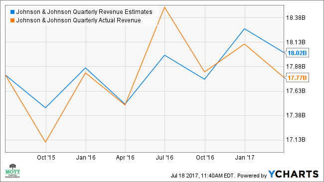

Johnson & Johnson (J&J) has a history stretching over 135 years, during which it has solidified its position as a global leader in healthcare. Established in 1886, the company has developed a comprehensive operational framework comprising three primary segments: Pharmaceuticals, Medical Devices, and Consumer Products. Through these divisions, J&J consistently generates significant revenue, profoundly influencing the landscape of health and wellness across the world.

The Pharmaceuticals division stands as the cornerstone of J&J's revenue, driven by its commitment to developing innovative medicines that address unmet medical needs globally. Meanwhile, the Medical Devices segment plays a crucial role in supporting healthcare professionals by providing essential tools and technologies, even amidst challenges such as the COVID-19 pandemic. The Consumer Products division further diversifies J&J's portfolio by delivering a wide range of health and self-care solutions, contributing to the company's strong market presence.

Additionally, the company is exploring emerging technological trends, such as algorithmic trading, to enhance its financial operations and optimize portfolio management. This approach signifies J&J's strategic effort to integrate advanced technology with its extensive healthcare expertise, aiming for more efficient and effective financial strategies. Through these multifaceted operations, J&J continues to maintain its influence and position itself at the forefront of the healthcare industry.

## Table of Contents

## Johnson & Johnson: A Brief Overview

Founded in 1886, Johnson & Johnson (J&J) has emerged as one of the world's largest and most influential multinational corporations in the healthcare sector. With its corporate headquarters located in New Brunswick, New Jersey, the company operates across more than 60 countries globally. J&J's expansive operations are supported by a workforce of over 130,000 employees, illustrating its extensive reach and commitment to addressing healthcare needs worldwide.

Throughout its history, Johnson & Johnson has demonstrated resilience and adaptability, enabling sustained growth and market presence. This is reflected in the company's substantial market capitalization, which exceeded $442 billion in 2021. This financial milestone underscores the company's robust financial health and significant impact on the global healthcare landscape. The strategic expansion into diverse markets and continuous innovation in healthcare products and services have been central to J&J’s ability to maintain and enhance its market position.

The company's influence is further amplified by its diversified operational segments encompassing Pharmaceuticals, Medical Devices, and Consumer Products. These segments collectively contribute to J&J's financial strength by addressing a wide array of healthcare needs, from complex medical treatments to everyday consumer health solutions. This diversification not only stabilizes its revenue streams but also positions J&J as a pivotal player in improving global health outcomes.

J&J’s strategic initiatives, including investments in technology and innovation, reinforce its commitment to progress and adaptation in an evolving industry. As the company continues to expand its global footprint, its blend of historic legacy, financial acumen, and forward-thinking strategies ensures its sustained prominence in the healthcare sector, reflecting both its past achievements and future potential for growth.

## Pharmaceuticals: The Cornerstone of J&J's Revenue

Johnson & Johnson's pharmaceutical division stands as the primary driver of the company's revenue, accounting for over 55% of total sales. In 2020, this segment witnessed a robust growth rate of 8.4%, largely spurred by the rising demand for biologic medications, which are innovative drugs derived from living organisms. These biologics are proving increasingly vital in treating severe conditions that were previously hard to manage with traditional pharmaceuticals.

The creation and distribution of the world's first single-dose COVID-19 vaccine marked a significant milestone for J&J’s pharmaceutical branch. The vaccine not only responded to a critical global health need during the pandemic but also bolstered the company's financial performance. The unique single-dose feature of the vaccine attracted numerous countries looking for effective and logistically simpler solutions to their vaccination campaigns.

This combination of high-impact vaccine development and biologic therapies underscores the pharmaceutical division's critical role within Johnson & Johnson. By leveraging cutting-edge research and development, the segment has secured its position as a leader in providing breakthrough medical solutions, driving both corporate growth and global health advancement.

## Medical Devices: Meeting Urgent Healthcare Needs

The medical devices division of Johnson & Johnson, despite experiencing a 10.5% decline in revenue in 2020 due to the COVID-19 pandemic, continues to be an essential component of the company's revenue stream. This segment focuses on empowering healthcare professionals through comprehensive training programs and supplying essential medical equipment, generating approximately $22.96 billion in sales.

Johnson & Johnson's medical devices segment has a long-standing history of innovation and adaptation, ensuring that it meets the evolving needs of the global healthcare industry. The division's commitment to developing cutting-edge medical technologies and solutions plays a significant role in upholding the company's status as a leader in healthcare solutions. This includes advancements in surgical technologies, orthopedics, cardiovascular devices, and diabetes management systems, all aimed at improving patient outcomes.

The company's strategy in the medical devices sector is centered around expanding its product offerings and refining existing technologies to meet the changing demands of healthcare providers and patients. This is achieved through significant investment in research and development, collaboration with medical professionals, and incorporating insights from clinical practice into product design and functionality.

Moreover, Johnson & Johnson is actively involved in strategic partnerships and acquisitions to further enhance its medical devices portfolio. These collaborations enable the company to integrate novel technologies and expand its global reach, bringing advanced healthcare solutions to a broader audience.

In summary, while the medical devices division of Johnson & Johnson faced financial challenges during the pandemic, its continuous innovation and strategic focus have allowed it to remain a crucial player in the healthcare industry. By prioritizing the development of advanced medical technologies and fostering partnerships, the division aims to address urgent healthcare needs and maintain its leadership position in the sector.

## Consumer Products: Delivering Everyday Health Solutions

Johnson & Johnson's consumer products segment is a vital part of its business model, providing a wide range of products that address everyday health needs. This division includes categories such as skin health, self-care, and essential health products, which have become household staples around the globe. In 2020, this segment accounted for 17% of J&J's total revenue, generating $14.05 billion in sales. This performance underscores the segment's significance in the company's overall financial success. 

One of the key factors contributing to the growth of the consumer products segment is J&J’s proactive approach to innovation, marked by the introduction of approximately 200 new product lines in 2020 alone. These products encompass a variety of needs, from skincare solutions to nutritional supplements, catering to an ever-evolving consumer demand for health and wellness products. The use of digital tools and technology has also been a focus, enhancing consumer access and engagement with J&J products.

Moreover, J&J leverages its strong market presence to expand the reach of its consumer products. By capitalizing on its established brand reputation and extensive distribution networks, the company continues to maintain its competitive edge in the consumer health product market. The introduction of new products, underpinned by scientific research and consumer insights, plays a crucial role in sustaining the segment's growth trajectory. This commitment to consumer health and innovation ensures that J&J remains at the forefront of delivering practical health solutions to people worldwide.

## Algorithmic Trading: A New Frontier for J&J

Algorithmic trading, or algo trading, represents a transformative approach in the financial sector, where computer algorithms execute trading decisions at speeds and frequencies that are beyond human capabilities. This technological advancement is primarily driven by the need to improve the efficiency and precision of trading activities, thereby enhancing financial returns. Johnson & Johnson (J&J), an established leader in healthcare, has recognized the potential of this innovative strategy and has begun harnessing it as part of its broader initiative to leverage cutting-edge technology in financial operations.

The introduction of [algorithmic trading](/wiki/algorithmic-trading) into J&J's operations aligns with its mission to optimize portfolio management effectively. By utilizing sophisticated algorithms, the company can analyze vast datasets rapidly to identify patterns and trends that inform better trading decisions. This approach enhances their ability to forecast market movements, mitigate risks, and capitalize on investment opportunities with greater precision and timing. The deployment of such technology also allows for dynamic and adaptive trading strategies that can be modified continuously based on real-time data inputs, thereby improving the responsiveness of their financial operations.

Moreover, the integration of healthcare expertise with advanced trading algorithms sets J&J apart by enabling unique applications that extend beyond traditional financial metrics. For instance, by incorporating healthcare-related datasets, such as patient outcomes or pharmaceutical developments, J&J can refine its trading models to reflect sector-specific insights. This synergy not only augments financial performance but also ensures that the company's portfolio decisions are grounded in a comprehensive understanding of the healthcare landscape.

In summary, J&J's strategic embrace of algorithmic trading reflects a forward-thinking approach that seeks to enhance its financial operations through state-of-the-art technology. By integrating healthcare knowledge with algorithmic prowess, the company stands to achieve optimized portfolio management, ensuring sustained growth and resilience in an increasingly competitive market.

## Conclusion

Johnson & Johnson continues to maintain its status as a dominant force in the healthcare industry, supported by the robust performance of its Pharmaceuticals, Medical Devices, and Consumer Products segments. The integration of algorithmic trading reflects J&J’s progressive strategy to modernize its financial operations. By leveraging technology to improve trading efficiency and optimize portfolio management, the company is reinforcing its commitment to innovation. The ongoing incorporation of advanced algorithms into financial decision-making processes demonstrates J&J’s adaptability and foresight in navigating the complexities of modern financial markets.

Furthermore, J&J's strategic decision to bifurcate into two distinct publicly traded entities marks a pivotal moment for the company. This structural transformation is poised to enhance its ability to achieve more specialized growth and innovation within its core business lines. By separating into entities that are more focused, each segment can potentially unlock greater value and operate with enhanced agility in addressing market demands. This reorganization is anticipated to not only strengthen J&J’s operational efficiency but also optimize shareholder value, underscoring the company's enduring influence and adaptability in the global healthcare landscape.

## References & Further Reading

[1]: Marks, G. L. (2009). ["The Story of Johnson & Johnson"](https://www.researchgate.net/publication/228634517_An_Educational_Psychology_Success_Story_Social_Interdependence_Theory_and_Cooperative_Learning). Broadway Books.

[2]: Stoffel, B. (2020). ["Johnson & Johnson: How a Global Healthcare Giant Thrives."](https://www.linkedin.com/in/jennifer-stoffel-ba105484) The Motley Fool.

[3]: ["Johnson & Johnson's Pharmaceutical Innovative Advances."](https://www.jnj.com/innovative-medicine) Johnson & Johnson Official Website.

[4]: ["Medical Devices: Johnson & Johnson."](https://www.jnj.com/medtech) Johnson & Johnson Medical Devices Companies Official Website.

[5]: Hwang, T.B. (2021). ["Big Pharma’s Covid-19 Vaccine Winners and Losers"](https://pubmed.ncbi.nlm.nih.gov/36380135/) Harvard Business Review.

[6]: ["Algorithmic Trading: How It Works and What It’s Used For."](https://en.wikipedia.org/wiki/Algorithmic_trading) Investopedia.

[7]: Carpenter, S.E. & Cockle, E. (2022). ["Johnson & Johnson, FSMAA 2022 Presentation."](https://journals.sagepub.com/doi/full/10.3233/ISU-220160) Johnson & Johnson Official Website.