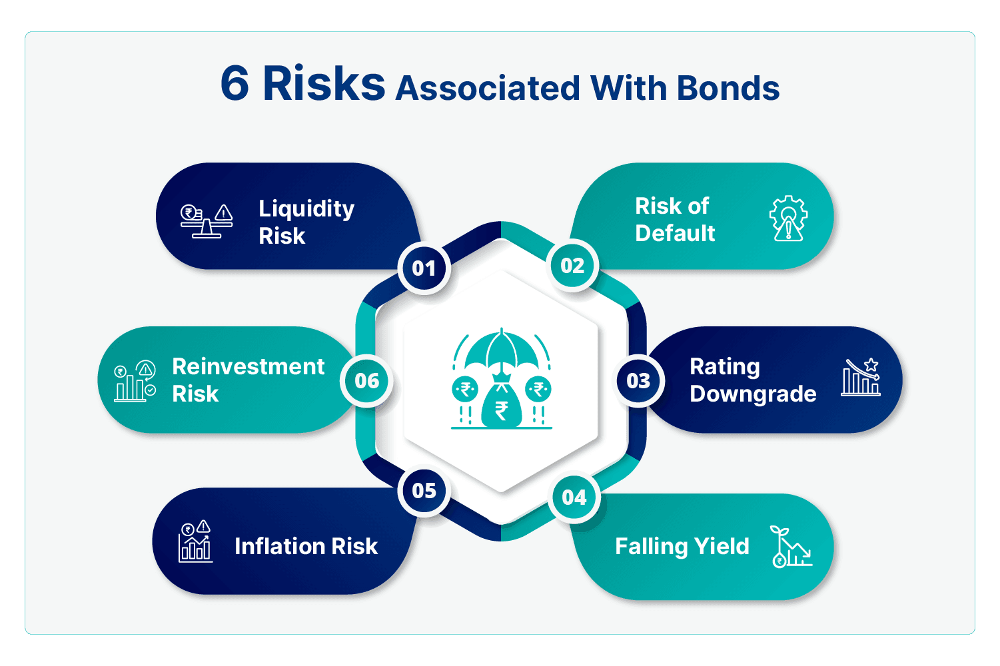

The financial markets present a landscape filled with various investment opportunities, each promising potential returns. However, with these prospects come inherent risks that can significantly influence the outcomes of such investments. Investors are often attracted to bonds for their perceived safety compared to equities, given their reputation for offering stable income through interest payments. Yet, the bond market is not without its complexities. Factors such as interest rate fluctuations, creditworthiness of issuers, and market liquidity are vital considerations that can affect bond prices and yields.

Meanwhile, the advent of technology has revolutionized trading methodologies, with algorithmic trading taking center stage. By utilizing algorithms to automate trading decisions, this approach promises improved efficiency and precision in executing trades. Nonetheless, this innovation has introduced a new dimension of risk. Concerns regarding algorithm-driven market manipulation and the potential for systemic risks highlight the need for caution.

This article intends to illuminate the dynamics of investment risks associated with bonds and algorithmic trading. An in-depth understanding of these aspects not only aids investors in making more informed decisions but also plays a crucial role in safeguarding investments. Through strategic risk management, it becomes possible to navigate the financial markets effectively, thus maximizing potential returns while minimizing potential losses.

## Table of Contents

## Understanding Bond Investment Risks

Bonds have long been perceived as relatively secure investment vehicles, appealing to conservative investors seeking stable returns. Despite this reputation, bonds are not devoid of risks. Understanding these risks is crucial for investors aiming to safeguard their investments. The main risks associated with bond investments include interest rate risk, reinvestment risk, credit/default risk, and liquidity risk.

**Interest Rate Risk** is a primary concern for bond investors. It stems from the inverse relationship between interest rates and bond prices: as interest rates rise, bond prices tend to fall, and vice-versa. This inverse relationship can be expressed mathematically as:

$$

\Delta P \approx -D \times \Delta y 
$$

where $\Delta P$ is the change in bond price, $D$ is the bond's duration (a measure of sensitivity to interest rate changes), and $\Delta y$ is the change in yield. This sensitivity implies that long-term bonds are more susceptible to interest rate fluctuations compared to short-term bonds.

**Reinvestment Risk** emerges when interest payments from bonds cannot be reinvested at the same rate as the original bond. For callable bonds, this risk is exacerbated because issuers often redeem them during periods of declining interest rates, forcing investors to reinvest at lower yields.

**Credit/Default Risk** pertains to the possibility that a bond issuer fails to meet its financial obligations, including interest payments and principal repayment. This risk is more pronounced in corporate bonds when compared to government bonds, which are typically backed by the government's creditworthiness. Credit rating agencies like Moody's, S&P, and Fitch provide ratings to gauge an issuer's default risk, with lower-rated bonds offering higher yields to compensate for heightened risk.

**Liquidity Risk** refers to the difficulty an investor may face in selling a bond before its maturity without impacting its price. Bonds traded less frequently in the market may have higher liquidity risk, affecting their marketability. Investors often demand a premium for holding such bonds, which can translate into higher yields.

Different bond types, namely corporate, government, and municipal bonds, exhibit varied risk levels:

- **Corporate Bonds** generally offer higher yields due to increased credit risk and are influenced heavily by the issuing company's financial health.
- **Government Bonds**, especially those issued by stable governments, are considered low-risk. U.S. Treasury bonds, for instance, are often deemed risk-free in terms of credit risk.
- **Municipal Bonds** are generally tax-exempt and tend to have moderate risk levels, influenced by the fiscal stability of the issuing municipality.

In summary, while bonds provide a relatively stable investment avenue, it is essential for investors to remain cognizant of the associated risks, which can significantly influence potential returns. Balancing these risks through strategic portfolio management is key to optimizing bond investments.

## Algorithmic Trading: A New Dimension of Risk

Algorithmic trading employs sophisticated algorithms and high-speed data feeds to execute trades automatically, often within fractions of a second. This technology-driven approach allows traders to capitalize on minor price fluctuations with exceptional efficiency and precision. However, the benefits of [algorithmic trading](/wiki/algorithmic-trading) bring forth new risks, notably in market manipulation and systemic risk amplification.

One of the most significant risks associated with algorithmic trading is market manipulation, where traders might use algorithms to execute strategies like spoofing and layering. Spoofing involves submitting a large number of fake orders to create an illusion of demand or supply, thus manipulating the market price. Once the price adjusts, the spoofing orders are canceled, and traders execute real trades to profit from the resultant price change. Both the Commodity Futures Trading Commission (CFTC) and the Securities and Exchange Commission (SEC) have highlighted the detrimental impact of such manipulative strategies on market integrity. 

Systemic risk amplification is another profound concern with algorithmic trading. Algorithms react to market data without human intervention, making markets more susceptible to rapid, large-scale sell-offs. A situation where multiple algorithms react to the same market trigger can lead to significant market movements in a short time, often exacerbating market [volatility](/wiki/volatility-trading-strategies). This was observed in the Flash Crash of 2010, where a cascade of automated selling caused a brief but severe market plunge, wiping out nearly $1 trillion in market value within minutes.

Given these challenges, the importance of implementing robust safeguards cannot be overstated. Risk management strategies within algorithmic trading systems are pivotal in mitigating potential harm from errant algorithms. This includes employing kill switches, which can immediately halt trading activities in the event of abnormal behavior detection. 

Furthermore, algorithms should undergo rigorous [backtesting](/wiki/backtesting) and stress testing to evaluate their performance under varied market conditions. Monitoring real-time trading activity with advanced analytics can enable early detection of unusual patterns that might indicate a brewing issue with the trading algorithm. Policymakers and market participants advocate for stricter regulations and continuous monitoring to prevent the adverse impacts of algorithmic trading on financial markets.

In conclusion, while algorithmic trading provides unmatched trading efficiency and precision, the introduction of sophisticated algorithms comes with distinct risks that require comprehensive safeguards and regulatory oversight to maintain market stability and integrity.

## Case Studies and Real-World Examples

The Flash Crash of 2010 is a significant event that underscores the risks associated with algorithmic trading. Occurring on May 6, 2010, this unprecedented market event saw the Dow Jones Industrial Average plunge nearly 1,000 points within minutes, only to recover a large portion of the loss shortly after. At its core, the Flash Crash was driven by a confluence of high-frequency trading algorithms, which led to a rapid escalation and subsequent evaporation of market [liquidity](/wiki/liquidity-risk-premium).

High-frequency trading ([HFT](/wiki/high-frequency-trading-strategies)) employs algorithms to execute orders at extremely high speeds, often capitalizing on minute price discrepancies across various markets. During the Flash Crash, a large sell algorithm was initiated by a mutual fund to hedge its equity exposure. This algorithm opted to sell futures contracts indexed to the S&P 500 at an aggressive rate, without consideration for prevailing market conditions. The wave of sell orders overwhelmed traditional market participants, leaving HFTs as the principal actors in a rapidly thinning market. As volatility spiked, algorithms began to withdraw liquidity, exacerbating the sell-off as automated strategies engaged in rapid-fire selling and buying, trying to minimize their exposure to adverse conditions.

The event highlighted several vulnerabilities in market structures related to HFT. First, the reliance on algorithmic trading can sometimes lead to a feedback loop where trading actions: $P_{t+1} = P_{t} + \Delta P$, disproportionately amplify minute fluctuations due to the speed and [volume](/wiki/volume-trading-strategy) of trades executed by algorithms. Second, the lack of human discretion in algorithmic trading decisions, which operate purely on predefined parameters and logic, can lead to unintended outcomes during atypical market conditions.

Parallel to this are bond market fluctuations, which often demonstrate the complexities of risk assessment in fixed-income investments. A relevant instance is the 2020 bond market turmoil triggered by the COVID-19 pandemic. During the early months of 2020, investors scrambled to rebalance portfolios amidst global economic uncertainty, causing significant volatility in bond prices. The fear of mass defaults led to a decline in prices of corporate bonds, as spreads widened sharply. This fluctuation resulted from a combination of liquidity concerns and spikes in credit risk perception, emphasizing how quickly bond markets can react to external shocks.

Both of these examples illustrate the real-world implications of investment risks. On one hand, high-frequency trading can precipitate sudden market dislocations due to its inherent design of executing orders at breakneck speeds. On the other hand, the bond market's reaction to economic variables underscores its susceptibility to both systematic and idiosyncratic risks. Understanding these dynamics is crucial for crafting responsive strategies that mitigate adverse impacts while navigating the complexities of modern financial markets.

## Mitigating Investment Risks

Diversification is a fundamental principle in reducing investment risks. By constructing a portfolio with a variety of asset types, investors can diminish the impact of any single asset's poor performance on the overall portfolio. This approach spreads risk, as different asset classes like stocks, bonds, and real estate often perform differently under the same economic conditions. The potential benefit is mathematically quantifiable through the Modern Portfolio Theory, which demonstrates that an optimal asset mix can reduce portfolio risk for a given level of expected return.

Investors seeking to mitigate risks should meticulously assess historical performance data to inform their decisions. Historical analysis provides insights into asset volatility, correlation coefficients, and potential return profiles, enabling investors to make informed predictions about future performance. However, relying solely on past performance is insufficient. Thorough research into the current economic environment, company fundamentals, and geopolitical factors is also necessary. This research should be ongoing, as markets and conditions can shift rapidly.

Adaptability to evolving market conditions is essential for risk mitigation. Investors should be prepared to modify their investment strategies in response to changes such as [interest rate](/wiki/interest-rate-trading-strategies) fluctuations, regulatory shifts, or technological advancements. Continuous monitoring and reevaluation of investment strategies help ensure alignment with current and projected market conditions.

Advanced risk management tools and techniques are indispensable in safeguarding investments against potential losses. For bond investments, tools such as duration analysis and stress testing can help assess interest rate risk exposure. Duration is a measure of a bond's sensitivity to interest rate changes, and understanding it can guide investment decisions in an environment of fluctuating rates. Stress testing, on the other hand, examines potential outcomes under extreme conditions, offering insights into potential vulnerabilities.

In the context of algorithmic trading, sophisticated algorithms equipped with stop-loss orders and real-time monitoring can help manage risks. These algorithms are programmed to execute trades automatically when certain market conditions are met, thereby reducing the emotional bias in trading decisions. However, rigorous backtesting of these algorithms is critical. Backtesting involves simulating algorithm performance using historical data to evaluate its effectiveness and reliability before deploying it in real-market scenarios.

Incorporating these strategies and technologies into investment practices can significantly reduce exposure to risk and enhance the likelihood of achieving financial goals. While diversification and adaptability remain timeless principles, leveraging modern analytical tools and technologies provides an additional layer of security in today's complex financial landscape.

## Conclusion

Investing in financial markets entails navigating a diverse array of risks, notably those related to bonds and algorithmic trading. A thorough understanding of these risks is essential for making educated investment decisions. Bonds, traditionally seen as secure assets, possess an inherent susceptibility to various risks such as interest rate fluctuations, credit defaults, and liquidity constraints. The inverse correlation between interest rates and bond prices illustrates the impact that macroeconomic factors can have on bond investments.

Algorithmic trading introduces a separate dimension of risk, encompassing issues like market manipulation and the amplification of systemic vulnerabilities. While automation in trading presents advantages in terms of speed and efficiency, it concurrently raises concerns about market stability and integrity. Real-world incidents, like the Flash Crash of 2010, exemplify how algorithmic missteps can rapidly destabilize financial markets.

For investors aiming to achieve their financial goals, devising and implementing robust risk management strategies is vital. Diversification, a well-established method of risk mitigation, can help reduce exposure to market volatility. Furthermore, investors should leverage advanced risk management tools and remain abreast of evolving market conditions to protect their portfolios against unforeseen events.

Employing strategic measures can enable investors to achieve a balanced approach to risk and reward, contributing to the attainment of long-term financial objectives. The development of a well-rounded understanding of market dynamics, coupled with vigilant risk assessment and management, lays the groundwork for successful investment outcomes.

## References & Further Reading

[1]: Fabozzi, F. J. (2013). ["Bond Markets, Analysis, and Strategies"](https://books.google.com/books/about/Bond_Markets_Analysis_and_Strategies_ten.html?id=bQpNEAAAQBAJ) (8th ed.). Pearson Education.

[2]: Treynor, J. L., & Black, F. (1973). ["How to Use Security Analysis to Improve Portfolio Selection."](https://www.jstor.org/stable/2351280) The Journal of Business, 46(1), 66-86.

[3]: Aldridge, I. (2013). ["High-Frequency Trading: A Practical Guide to Algorithmic Strategies and Trading Systems"](https://www.amazon.com/High-Frequency-Trading-Practical-Algorithmic-Strategies/dp/1118343506) (2nd ed.). Wiley.

[4]: Liao, J., & Lin, J. (2011). ["Liquidity Risk in the Corporate Bond Market."](https://www.jstor.org/stable/26166314) The European Journal of Finance, 17(8), 707-721.

[5]: Aitken, M., Harris, F. H., & McInish, T. H. (2013). ["Market Microstructure: A Practitioner's Guide"](https://onlinelibrary.wiley.com/doi/full/10.1111/j.1467-629X.2007.00235.x). Wiley.

[6]: Hendershott, T., Jones, C. M., & Menkveld, A. J. (2011). ["Does Algorithmic Trading Improve Liquidity?"](https://onlinelibrary.wiley.com/doi/full/10.1111/j.1540-6261.2010.01624.x) The Review of Financial Studies, 24(6), 2028-2054.

[7]: Mackintosh, P. (2020). ["The Flash Crash: High-Frequency Trading and Regulatory Failures."](https://www.researchgate.net/publication/377743286_The_Flash_Crash_The_Impact_of_High-Frequency_Trading_on_the_Stability_of_Financial_Market) Journal of Banking and Finance Law and Practice.