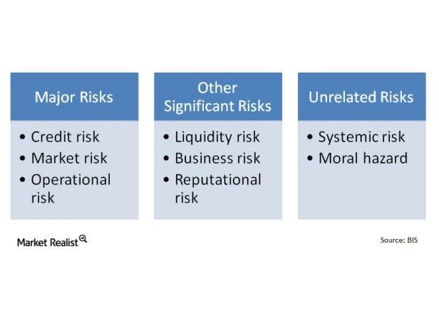

The banking industry is in a state of constant evolution, facing a landscape comprised of intricate challenges and risks. Rapid technological advancements, stringent regulatory requirements, and the growing integration of algorithmic trading systems are reshaping the traditional banking model. These factors present a dual-edged sword, offering opportunities for innovation and efficiency while simultaneously introducing new threats and complexities. 

Technological advancements, such as AI and blockchain, promise to enhance banking operations, improve customer experiences, and streamline regulatory compliance processes. However, these technologies also enhance the sophistication of cyber threats, demanding robust cybersecurity measures to protect sensitive financial data. Furthermore, the regulatory landscape is ever-more stringent, necessitating banks to invest heavily in compliance functions to meet evolving legal standards. 



The incorporation of algorithmic trading, notably through High-Frequency Trading (HFT), has transformed financial markets by increasing market liquidity and transaction efficiency. Nevertheless, this rapid trade execution introduces systemic risks, exemplified by events like the 2010 Flash Crash. Such dynamics underline the need for financial institutions to understand and manage these modern challenges effectively.

This article investigates into the major challenges banks face today due to these evolving factors, highlighting the importance of strategic adaptation as banks strive to navigate this complex environment successfully. Understanding these dynamics is critical for financial institutions aiming to achieve stability, mitigate risks, and maintain consumer trust amidst these transformations.

## Table of Contents

## Banking Risks and Challenges

Banks are confronted with a myriad of risks that transcend traditional credit and depository services. In today's digitally driven environment, cybercrime is a prevailing challenge, posing significant threats to data security and eroding customer trust. Financial institutions are prime targets for cybercriminals due to the sensitive nature of the data they handle. Sophisticated cyberattacks, such as phishing, malware, and ransomware, have the potential to compromise vast amounts of confidential data, leading to substantial financial losses and damaging the bank’s reputation. Research from IBM in 2021 showed that the average cost of a data breach in the financial sector was $5.72 million, underscoring the severe financial repercussions banks can face when these threats are not effectively mitigated.

Alongside cyber threats, regulatory compliance remains a pressing concern for banks. Ever-evolving legal requirements demand that financial institutions continually adapt to maintain compliance. In jurisdictions heavily influenced by statutes such as Dodd-Frank in the United States, banks must allocate significant resources to ensure adherence to the intricate web of regulations. This scenario is particularly challenging for smaller banks that might lack the infrastructure and capital necessary to satisfy these often complex legal standards.

Moreover, the increasing reliance on advanced technologies, such as Artificial Intelligence (AI) and Machine Learning (ML), introduces new dimensions of risk that require astute management. While these technologies provide avenues for efficiency and enhanced service delivery, they also present vulnerabilities. The integration of AI in automated decision-making, for instance, can lead to unintended biases or errors if not properly monitored. Furthermore, the complexity of these systems can make it difficult for banks to identify and mitigate potential risks swiftly.

In conclusion, the challenges facing banks today are multifaceted, requiring robust strategies to navigate successfully. Addressing cybercrime, complying with stringent regulatory standards, and managing the risks associated with technological advances are integral to maintaining the soundness and reputation of financial institutions amid an ever-changing risk landscape.

## Cybercrime and Its Impact on Banking

Cybercrime represents a dynamic and ever-evolving threat to the banking sector, with attacks becoming increasingly sophisticated and damaging over time. Criminals employ a variety of methods to compromise bank security systems, aiming to steal sensitive data, cause financial harm, and erode consumer trust. The consequences of such breaches can be significantly detrimental, both financially and reputationally, for the institutions involved.

Data breaches are among the most critical risks associated with cybercrime in banking. According to the 2021 IBM Cost of a Data Breach report, the average cost of a data breach for organizations in the financial sector was $5.72 million. Such incidents not only entail direct financial losses but also potential regulatory fines and long-term damage to the bank's reputation. Customers, whose data privacy is breached, may lose confidence in the bank's ability to safeguard their information, prompting them to switch to competitors.

In response, banks are compelled to invest heavily in cybersecurity measures to mitigate these risks. Robust cybersecurity strategies often include deploying advanced technologies such as [artificial intelligence](/wiki/ai-artificial-intelligence) (AI) and [machine learning](/wiki/machine-learning) to detect and prevent attacks. These technologies can analyze vast amounts of data to identify anomalous patterns indicative of cyber threats in real-time. Additionally, regular security audits, employee training on cybersecurity protocols, and the implementation of multi-[factor](/wiki/factor-investing) authentication (MFA) are essential practices for strengthening defenses against cyber intrusions.

The investment in cybersecurity infrastructure is not just a defensive measure but also a critical component in maintaining consumer confidence and trust. By demonstrating proactive and comprehensive cybersecurity strategies, banks can reassure their customers of their commitment to protecting sensitive data. This trust is paramount, not only for retaining existing customers but also for attracting new ones in a competitive market landscape where data security has become a key differentiator. 

In summary, as cybercrime threats grow in scale and complexity, banks must adapt by implementing comprehensive cybersecurity systems and protocols. The financial and reputational stakes necessitate a strategic approach to safeguarding digital assets and ensuring regulatory compliance, all while cultivating customer trust.

## Regulatory Compliance Challenges

The banking industry operates under an increasingly stringent regulatory environment. This evolution reflects the global financial crisis' aftereffects, such as the introduction of comprehensive measures aiming to enhance financial stability and improve consumer protection. Among these regulations, the Dodd-Frank Wall Street Reform and Consumer Protection Act stands out. Enacted in the United States in 2010, Dodd-Frank introduced significant overhauls, including the establishment of the Financial Stability Oversight Council (FSOC) and the Consumer Financial Protection Bureau (CFPB). It mandates banks to maintain higher capital reserves and undergo regular stress testing, thereby necessitating a constant state of readiness and adaptation.

Banks are compelled to invest heavily in compliance infrastructures to meet these complex regulatory requirements. This increased scrutiny translates into considerable expenditure on legal expertise, compliance officers, and integrated technology solutions capable of managing risks effectively and ensuring the institutions remain aligned with the legislation.

Large banking institutions typically possess the resources to absorb these additional operational costs. However, smaller banks often encounter formidable challenges. Their limited financial and human resources constrain their ability to implement robust compliance frameworks comparable to those of their larger counterparts. Consequently, these smaller banks may face disproportionately high compliance burdens, potentially compromising their competitiveness. 

To illustrate, compliance technology requires continuous updates to handle regulatory amendments, thereby incurring further costs. Banks might utilize Python libraries such as `pandas` and `numpy` for data analysis to ensure accurate compliance reporting. Leveraging machine learning algorithms can also assist in predictive analytics to foresee regulatory breaches, potentially diminishing non-compliance risks.

```python
import pandas as pd
import numpy as np

# Example of a compliance reporting mechanism
data = pd.read_csv('financial_data.csv')  # Hypothetical file containing financial data
compliance_metrics = data['capital_reserve'] > data['required_reserve']
compliance_summary = compliance_metrics.value_counts(normalize=True) * 100
print(compliance_summary)
```

Overall, the regulatory compliance landscape poses significant challenges, especially for smaller institutions striving to balance regulatory adherence with strategic growth objectives. Efficiently navigating these pressures is essential for sustaining competitive viability in the banking sector.

## The Role of Algorithmic Trading

Algorithmic trading has fundamentally transformed the financial markets, with High-Frequency Trading ([HFT](/wiki/high-frequency-trading-strategies)) being one of the most influential aspects. HFT uses algorithms to execute a large number of orders at extremely rapid speeds, often within milliseconds. This practice offers notable benefits including increased market efficiency and enhanced [liquidity](/wiki/liquidity-risk-premium). Through [algorithmic trading](/wiki/algorithmic-trading), trades can be executed based on pre-set criteria such as timing, price, and quantity, allowing for swift responses to changing market conditions. This efficiency helps narrow bid-ask spreads, reducing the cost for traders and possibly leading to more competitive pricing.

Despite these advantages, algorithmic trading is not without risks, particularly due to its capacity for rapid transactions. One of the primary concerns is the potential for systemic disruptions. The interconnectivity and speed inherent in HFT can lead to cascading effects during market anomalies. An exemplar of this risk was the "Flash Crash" of May 6, 2010, when the Dow Jones Industrial Average plummeted almost 1,000 points within minutes before rebounding quickly. Investigations suggested that high-frequency trading contributed to this extreme [volatility](/wiki/volatility-trading-strategies) by rapidly amplifying price movements initiated by a large sell order.

The algorithms used in these trading systems are complex and not always transparent, posing challenges in predicting and modulating their impacts. As a result, there is a crucial need for robust risk management frameworks within financial institutions that employ algorithmic trading. Enhanced regulatory oversight is also necessary to ensure market stability while allowing the benefits of algorithmic trading to be harnessed effectively.

In conclusion, while algorithmic trading contributes positively to market dynamics through efficiency and liquidity, the potential for rapid downturns and systemic risks cannot be overlooked. Financial markets and regulators must remain vigilant and adaptable to manage these challenges effectively.

## Addressing Risks Through Risk Management

Banks are increasingly prioritizing advanced risk management strategies as they navigate the complexities of modern financial landscapes. A significant element of these strategies involves adopting cutting-edge technological advancements. With the proliferation of big data analytics, machine learning, and artificial intelligence, financial institutions can predict, assess, and mitigate risks with greater accuracy and efficiency. For example, machine learning algorithms can analyze transaction data to identify patterns indicative of fraudulent activity, allowing banks to take precautionary measures promptly.

Compliance remains another critical aspect of effective risk management. Banks are under constant scrutiny from regulators, necessitating vigilant adherence to legal and regulatory standards. Implementing automated compliance systems can help banks streamline their processes, reduce human error, and ensure timely compliance with changes in regulatory frameworks. By embedding compliance into their operational workflows, banks can minimize the risk of regulatory breaches and associated penalties.

Moreover, partnerships with fintech firms are becoming increasingly common as banks seek to leverage external expertise and innovative solutions. These collaborations enable banks to integrate novel technologies and services that enhance operational efficiency and customer experience while also addressing potential security vulnerabilities. Fintech partnerships often bring advanced cybersecurity tools, real-time data analytics, and automated customer service platforms, all of which contribute to a robust risk management framework.

The integration of technology and fintech partnerships not only enhances risk management capabilities but also positions banks to adapt to the dynamic nature of financial risks effectively. By continuously evolving their strategies, banks can safeguard their operations against unforeseen threats and maintain a competitive edge in a rapidly changing industry.

## Conclusion

The challenges faced by banks in today's financial landscape are diverse and complex, necessitating strategic approaches for effective management. The integration of technology into banking operations, while offering numerous advantages, presents new challenges that banks must carefully navigate. Achieving a successful equilibrium between embracing technological advancements and maintaining stringent risk oversight is crucial for ensuring sustainable growth and resilience in an ever-evolving industry.

Cyber threats, consistently a critical concern for financial institutions, require ongoing vigilance and proactive defense strategies. Investing in advanced cybersecurity measures not only protects against potential data breaches but also helps maintain customer trust and safeguard the institution's reputation. By regularly updating security protocols and participating in industry initiatives to combat cybercrime, banks can better shield themselves from these persistent threats.

Regulatory landscapes are continually evolving, demanding that banks remain adaptable and compliant with new legal requirements. It is essential for financial institutions to have robust compliance frameworks that enable swift adjustments to regulatory shifts. Smaller banks, in particular, need innovative solutions to manage compliance costs effectively, which may involve leveraging partnerships with fintech companies to optimize resources and expertise.

Ultimately, the financial stability and trustworthiness of banks hinge on their ability to navigate these multifaceted challenges successfully. By anticipating changes in cyber threats and regulatory environments, banks can secure their operations and maintain consumer confidence. Strategic planning, combined with an agile approach to technology adoption and risk management, is imperative for banks seeking to thrive in a complex and dynamic financial ecosystem.

## References & Further Reading

[1]: Lopez de Prado, M. (2018). ["Advances in Financial Machine Learning."](https://www.amazon.com/Advances-Financial-Machine-Learning-Marcos/dp/1119482089) Wiley.

[2]: Aronson, D. R. (2006). ["Evidence-Based Technical Analysis: Applying the Scientific Method and Statistical Inference to Trading Signals."](https://www.amazon.com/Evidence-Based-Technical-Analysis-Scientific-Statistical/dp/0470008741) Wiley.

[3]: Jansen, S. (2020). ["Machine Learning for Algorithmic Trading: Predictive models to extract signals from market and alternative data for systematic trading strategies with Python."](https://www.amazon.com/Machine-Learning-Algorithmic-Trading-alternative/dp/1839217715) Packt Publishing.

[4]: Chan, E. P. (2009). ["Quantitative Trading: How to Build Your Own Algorithmic Trading Business."](https://github.com/ftvision/quant_trading_echan_book) Wiley.

[5]: Hull, J. C. (2018). ["Risk Management and Financial Institutions."](https://books.google.com/books/about/Risk_Management_and_Financial_Institutio.html?id=1J1QDwAAQBAJ) Wiley. 

[6]: Aldridge, I. (2013). ["High-Frequency Trading: A Practical Guide to Algorithmic Strategies and Trading Systems."](https://books.google.com/books/about/High_Frequency_Trading.html?id=8QpIsVUMhmEC) Wiley. 

[7]: Kroszner, R. S., & Strahan, P. E. (2014). ["Regulation and Deregulation of the U.S. Banking Industry: Causes, Consequences, and Implications for the Future."](https://www.nber.org/books-and-chapters/economic-regulation-and-its-reform-what-have-we-learned/regulation-and-deregulation-us-banking-industry-causes-consequences-and-implications-future) National Bureau of Economic Research Working Paper Series. 

[8]: IBM Security. (2021). ["Cost of a Data Breach Report 2021."](https://newsroom.ibm.com/2021-07-28-IBM-Report-Cost-of-a-Data-Breach-Hits-Record-High-During-Pandemic) IBM.