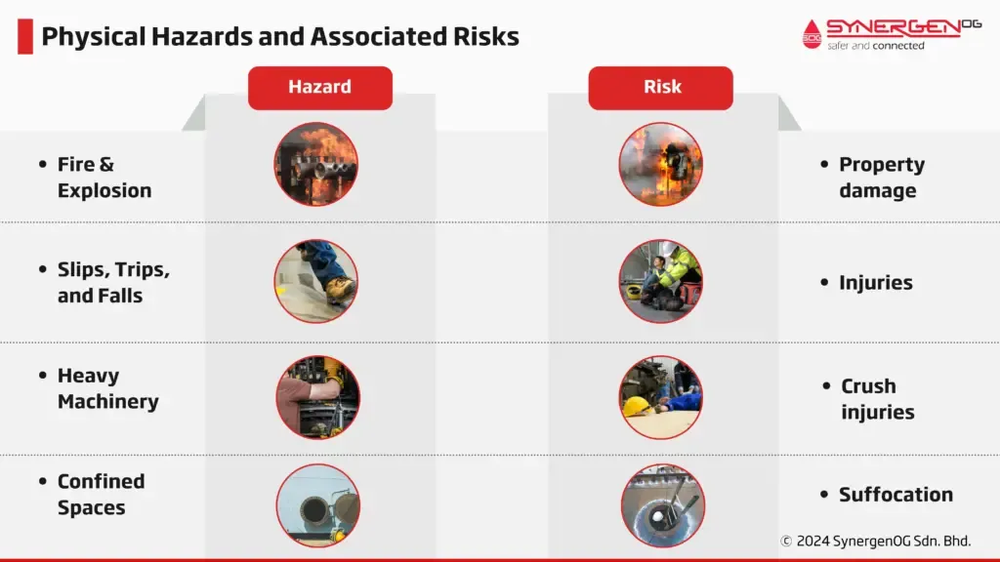

## Table of Contents

## What are the basic safety risks associated with working in the oil and gas industry?

Working in the oil and gas industry can be dangerous because there are many safety risks. One big risk is explosions and fires. This can happen because oil and gas are very flammable. If there is a leak, it can catch fire or explode. Another risk is working with heavy machinery and equipment. If workers are not careful, they can get hurt or even killed by these machines. Also, workers often have to work at high places, like on oil rigs. If they fall, it can be very dangerous.

Another safety risk in the oil and gas industry is exposure to harmful chemicals. Workers can breathe in or touch chemicals that can make them sick. These chemicals can cause problems like breathing issues, skin irritation, or even cancer if workers are exposed to them for a long time. The environment can also be a risk. Workers might have to work in very hot or cold places, or during bad weather. This can lead to heat stroke, frostbite, or accidents caused by slippery or icy conditions.

To stay safe, it's important for workers to follow safety rules and use protective equipment. Companies need to train their workers well and make sure they have safe working conditions. By doing this, they can lower the chances of accidents and keep their workers healthy.

## How do environmental factors contribute to risks in oil and gas operations?

Environmental factors play a big role in making oil and gas operations risky. One major issue is the weather. Workers often have to deal with extreme heat or cold, which can lead to health problems like heat stroke or frostbite. Bad weather like storms or high winds can also make it hard to work safely. For example, slippery surfaces during rain or ice can cause workers to fall, and strong winds can make it dangerous to work at heights.

Another way the environment affects safety is through the location of oil and gas operations. Many oil rigs are in the ocean, where workers can face rough seas and sudden storms. This can make it hard to get to and from the rig safely, and can also cause equipment to fail. On land, operations might be in remote areas where it's hard to get medical help quickly if there's an accident. All these factors mean that companies need to be very careful and plan well to keep their workers safe.

## What are the common causes of accidents in oil and gas extraction?

Accidents in oil and gas extraction often happen because of equipment failure. Machines and tools can break or wear out, leading to dangerous situations. For example, a broken valve might cause a leak, which can lead to a fire or explosion. It's important for companies to check their equipment regularly and fix any problems quickly to prevent these accidents.

Human error is another big reason for accidents in this industry. Workers might not follow safety rules or might not be trained well enough. They might make mistakes like not wearing the right protective gear or not following the correct steps when working with dangerous chemicals. Good training and clear safety rules can help reduce these kinds of accidents.

Environmental conditions also play a role in causing accidents. Bad weather like storms or extreme heat and cold can make it hard for workers to do their jobs safely. Working in remote areas or on offshore rigs adds more risk because it can be hard to get help quickly if something goes wrong. Companies need to plan carefully and make sure their workers are prepared for these challenges.

## How can equipment failure lead to major incidents in the oil and gas sector?

Equipment failure can lead to major incidents in the oil and gas sector because it can cause dangerous things to happen. For example, if a valve breaks, it might leak oil or gas. Oil and gas are very flammable, so a leak can easily start a fire or even cause an explosion. These fires and explosions can be very big and cause a lot of damage to the equipment and the area around it. They can also hurt or kill workers who are nearby.

Another way equipment failure can lead to major incidents is by making other parts of the system stop working. If one piece of equipment fails, it can put too much pressure on other parts, causing them to break too. This can lead to a chain reaction of failures, making the problem much worse. For example, if a pump fails, it might cause a pipeline to burst, leading to a big spill. These spills can harm the environment and are very hard and expensive to clean up.

## What are the regulatory frameworks that address safety in the oil and gas industry?

Safety in the oil and gas industry is managed by different rules and laws, depending on where you are. In the United States, the main rule is the Occupational Safety and Health Administration (OSHA). OSHA makes rules to keep workers safe, like wearing protective gear and having safety training. There's also the Bureau of Safety and Environmental Enforcement (BSEE) which looks after safety on offshore oil and gas operations. These groups check to make sure companies follow the rules and can give out fines if they don't.

In other countries, there are similar groups that make and enforce safety rules. For example, in the United Kingdom, the Health and Safety Executive (HSE) oversees safety in the oil and gas industry. They make sure companies have good safety plans and check to see if they are following them. The goal of all these rules is to stop accidents from happening and to keep workers safe. Companies have to follow these rules or they can get in trouble and have to pay a lot of money.

## How does human error contribute to risks in oil and gas operations?

Human error can cause big problems in oil and gas operations. Workers might not follow the safety rules, like not wearing the right protective gear or not using equipment the right way. This can lead to accidents, like getting hurt by heavy machinery or getting sick from breathing in harmful chemicals. If workers are not trained well, they might not know how to do their jobs safely. This can make mistakes more likely to happen.

Another way human error can cause risks is by not paying attention or being tired. Working long hours can make workers tired, and when they are tired, they might not notice important things, like a small leak that could turn into a big problem. Also, if workers are not careful, they might make mistakes that cause equipment to break or fail. This can lead to big accidents, like fires or explosions, which can hurt people and damage the environment.

## What are the financial implications of major risks in the oil and gas industry?

Major risks in the oil and gas industry can lead to big money problems. When there are accidents like fires, explosions, or spills, companies have to spend a lot of money to fix the damage. They might need to pay for new equipment, clean up the mess, and fix any harm done to the environment. Plus, if workers get hurt, the company might have to pay for their medical bills and might even get sued, which can cost a lot of money. All these costs can add up quickly and hurt the company's profits.

Also, when big accidents happen, it can make people trust the company less. This can make it harder for the company to do business. They might lose customers or have trouble getting money from banks or investors. Governments might also fine the company for breaking safety rules, which adds more costs. So, it's really important for companies in the oil and gas industry to take safety seriously to avoid these big financial problems.

## How do companies mitigate risks associated with oil and gas transportation?

Companies in the oil and gas industry take many steps to make sure oil and gas are moved safely. They use strong pipelines and tankers that are checked often to make sure they don't leak. They also have special systems that watch the pipelines all the time to catch any problems early. If there is a leak, these systems can shut off the flow of oil or gas quickly to stop it from getting worse. Companies also train their workers well so they know what to do if something goes wrong. They practice emergency plans to be ready for any accidents.

Another way companies lower the risks is by following strict rules and laws about how to move oil and gas. They have to meet safety standards set by groups like the Pipeline and Hazardous Materials Safety Administration (PHMSA) in the U.S. These rules tell companies how to build and take care of their pipelines and tankers. Companies also use technology like drones and robots to check their equipment without putting workers in danger. By doing all these things, companies can move oil and gas more safely and avoid big accidents.

## What role does technology play in managing risks in the oil and gas industry?

Technology helps a lot in keeping oil and gas operations safe. Companies use special machines and systems to watch over their equipment all the time. For example, they use sensors to check pipelines for leaks. If there's a problem, these systems can shut off the oil or gas flow right away to stop a small leak from becoming a big spill. Also, companies use drones and robots to check equipment without putting workers in danger. These tools can go into hard-to-reach places and find problems that people might miss.

Another way technology helps is by making work safer for people. Workers can use virtual reality to practice what to do in emergencies without any real danger. This helps them be ready if something goes wrong. Companies also use computers to plan their work better, so they can avoid risky situations. By using all these technologies, companies can find and fix problems early, keep their workers safe, and prevent big accidents from happening.

## How do geopolitical factors influence risk management in the oil and gas sector?

Geopolitical factors can make things tricky for oil and gas companies when they try to manage risks. Sometimes, countries where oil and gas come from can have political problems or wars. This can make it hard for companies to keep their operations safe. For example, if there's a war, workers might not be able to get to the oil fields, or the pipelines might get damaged. Also, if a country changes its laws suddenly, it can make it harder for companies to follow safety rules or get the supplies they need.

Another way geopolitical factors affect risk management is through trade and sanctions. If one country puts sanctions on another, it can stop oil and gas from being moved easily. This can lead to delays and make it harder to keep everything running smoothly. Companies have to plan carefully and sometimes find new ways to move their oil and gas. They also need to keep good relationships with different countries to make sure they can keep working safely and without big interruptions.

## What are the long-term environmental risks associated with oil and gas activities?

Oil and gas activities can harm the environment in big ways over a long time. One major problem is oil spills. When oil spills happen, they can spread over a large area and hurt the water, land, and animals. It can take many years to clean up a big spill, and even after cleaning, the area might never be the same. Oil spills can kill fish and birds, and make it hard for plants to grow. This can mess up the whole ecosystem and make it hard for nature to recover.

Another long-term risk is the release of greenhouse gases. When oil and gas are burned, they put out a lot of carbon dioxide and methane into the air. These gases make the Earth warmer, which is called climate change. Climate change can cause big problems like melting ice caps, rising sea levels, and more extreme weather. It can also make it harder for animals and plants to live, which can change whole ecosystems. Over time, these changes can cause even more problems for people and nature.

## How can advanced risk assessment models improve safety in the oil and gas industry?

Advanced risk assessment models can help make the oil and gas industry safer by finding problems before they turn into big accidents. These models use a lot of data and computer power to look at all the things that could go wrong, like equipment breaking or workers making mistakes. By studying this data, the models can tell companies where they need to be extra careful and what they should do to stop accidents from happening. This can help companies plan better and make sure they have the right safety measures in place.

Using these models also helps companies learn from past accidents and use that knowledge to do better in the future. For example, if a model shows that a certain type of equipment often breaks down, the company can check that equipment more often or replace it with something safer. This way, the models not only help prevent accidents but also make the whole industry safer over time. By using advanced risk assessment models, companies can keep their workers safe and protect the environment from harm.

## References & Further Reading

[1]: BP. (2022). ["Statistical Review of World Energy 2022."](https://www.bp.com/content/dam/bp/business-sites/en/global/corporate/pdfs/energy-economics/statistical-review/bp-stats-review-2022-full-report.pdf)

[2]: EIA. (2023). ["Oil Market Volatility and Financing Conditions."](https://www.eia.gov/finance/markets/crudeoil/financial_markets.php?funnelFromId=56)

[3]: Yergin, D. (2011). ["The Quest: Energy, Security, and the Remaking of the Modern World."](https://archive.org/details/questenergysecur0000yerg) Penguin Press.

[4]: IEA. (2022). ["World Energy Outlook 2022."](https://www.iea.org/reports/world-energy-outlook-2022)

[5]: Maugeri, L. (2012). ["Oil: The Next Revolution."](https://ciaotest.cc.columbia.edu/wps/isp/0026605/index.html) Harvard Kennedy School Belfer Center for Science and International Affairs.