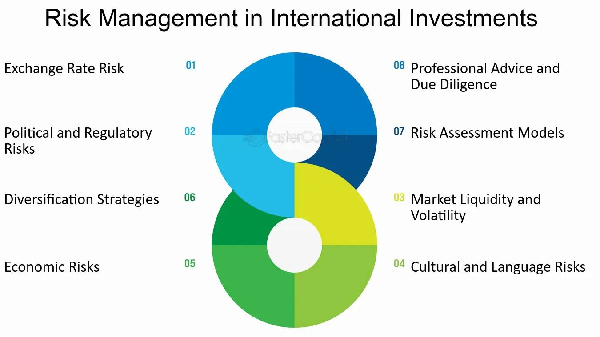

## Table of Contents

## What are the basic risks that international investors face?

International investors face several basic risks when they invest in foreign markets. One major risk is currency risk. This happens when the value of the investor's home currency changes compared to the currency of the country they are investing in. If the home currency becomes weaker, it can reduce the value of the investment when it is converted back. Another risk is political risk, which includes changes in government policies or instability in the country that can affect investments. For example, a new law might make it harder for foreign investors to make money or even take their money out of the country.

Another important risk is economic risk. This involves the general health of the economy in the country where the investment is made. If the economy goes into a recession, it can lower the value of investments. Market risk is also a concern, as the stock market in another country might be more volatile than the investor's home market. This means the value of investments can go up and down a lot more. Finally, there's liquidity risk, where it might be hard to sell an investment quickly without losing money, especially in less developed markets.

Overall, while international investing can offer great opportunities for higher returns, it comes with these additional risks that investors need to be aware of and manage carefully. Understanding these risks can help investors make better decisions and protect their investments.

## How does currency fluctuation impact international investments?

Currency fluctuation can really affect international investments. When you invest in another country, you usually have to change your money into that country's currency. If the value of your home currency goes down compared to the foreign currency, your investment becomes worth more when you change it back. But if your home currency gets stronger, your investment will be worth less when you convert it back. This can make your returns go up or down, even if the investment itself hasn't changed in value.

For example, let's say you're from the US and you invest in a company in Japan. If the US dollar gets weaker against the Japanese yen, the value of your investment in dollars will go up when you convert it back. But if the US dollar gets stronger, the value of your investment in dollars will go down. This means that currency changes can add extra risk to your investment, and you need to think about this when you're deciding where to put your money.

## What is political risk and how can it affect investments abroad?

Political risk is when the government or political situation in a country can hurt your investments. This can happen if the government changes laws, like making it harder for you to take your money out of the country, or if there's a lot of unrest or even war. These changes can make it risky to invest in that country because you might lose money if the political situation gets worse.

For example, if a new government comes into power and decides to nationalize industries, they might take over companies that you've invested in. This means you could lose your investment completely. Or, if there's a lot of political instability, like protests or violence, it can scare away other investors and make the stock market go down, lowering the value of your investments. So, when you're thinking about investing in another country, you need to look at how stable the government is and what kinds of political risks you might face.

## Can you explain the concept of economic risk in international investing?

Economic risk in international investing is about the health of the economy in the country where you're putting your money. If the economy of that country starts to do badly, like going into a recession, it can make your investments worth less. For example, if a lot of people in that country lose their jobs, they won't spend as much money, and companies might not make as much profit. This can cause the value of stocks and other investments to go down.

This kind of risk is important to think about because it can affect how much money you make from your investments. If you invest in a country with a strong and growing economy, your investments might do well. But if you invest in a country where the economy is struggling, you might lose money even if the companies you invest in are good. So, it's a good idea to look at how the economy is doing in a country before you decide to invest there.

## How do regulatory changes in a foreign country influence investment outcomes?

Regulatory changes in a foreign country can really affect how well your investments do. If the government decides to change the rules, like making it harder for foreign investors to take their money out of the country, it can make your investments less valuable. For example, if a new law says you have to pay more taxes on your earnings, it means you'll get to keep less of the money you make from your investments.

These changes can also make the whole market go up or down. If the government makes rules that are good for businesses, like giving them tax breaks, it can make companies do better and their stock prices go up. But if the government makes rules that are bad for businesses, like making them pay more for workers or limiting what they can do, it can make companies struggle and their stock prices go down. So, it's important to keep an eye on what the government is doing in the country where you're investing.

## What are the implications of cultural differences on investment strategies?

Cultural differences can really change how you should invest in a foreign country. Different cultures have different ways of doing business and different values. For example, in some places, people might trust family businesses more than big companies. This means if you're investing in that country, you might want to look at family-run businesses instead of big corporations. Also, some cultures might value long-term planning over quick profits. So, if you're investing there, you might want to focus on companies that are good at planning for the future rather than ones that are just trying to make money fast.

Another thing is how people in different cultures see money and risk. In some cultures, people might be more willing to take big risks to make big profits. In other cultures, people might be more careful and want to keep their money safe. Understanding these differences can help you pick the right kind of investments. For example, if you're investing in a country where people are more cautious, you might want to choose investments that are less risky and more stable. Overall, knowing about the culture of the country you're investing in can help you make better choices and be more successful with your investments.

## How does market liquidity vary across different countries and affect investments?

Market [liquidity](/wiki/liquidity-risk-premium) is how easy it is to buy or sell something without changing its price too much. In some countries, it's easier to sell investments quickly because there are a lot of buyers and sellers. These countries usually have big and busy markets, like the United States or the United Kingdom. But in other countries, especially smaller or less developed ones, it can be harder to find someone to buy what you want to sell. This means you might have to wait longer or sell your investment for less money than you wanted.

When you're investing in a country with low liquidity, you need to be careful. If you need to get your money out fast, you might not be able to, or you might lose money trying to sell quickly. This can make your investments riskier. On the other hand, if you're okay with keeping your money in the investment for a long time, then low liquidity might not be a big problem. But it's important to know about the liquidity of the market you're investing in so you can plan your strategy the right way.

## What role does taxation play in international investment decisions?

Taxation can really change how you decide to invest in other countries. Different countries have different tax rules, and these rules can affect how much money you get to keep from your investments. For example, if a country has high taxes on earnings from investments, you might end up with less money than you expected. This means you might choose to invest in a country with lower taxes instead, where you can keep more of your profits.

Also, some countries have special tax agreements with other countries. These agreements can make it easier for you to invest because you might not have to pay as much in taxes. For example, if your home country has a tax treaty with the country you're investing in, you might be able to avoid paying taxes twice on the same earnings. Understanding these tax rules and agreements is important because they can make a big difference in how much money you make from your international investments.

## How can investors mitigate the risks associated with foreign exchange controls?

Foreign exchange controls are rules set by a country's government that can limit how much money you can move in and out of the country. These controls can make it hard for investors to get their money back when they want to. One way to deal with this risk is by looking at countries with fewer or no foreign exchange controls. If a country has a good history of letting money move freely, it might be a safer place to invest. Another way is to use financial tools like currency hedging. This means you can use special agreements or investments to protect yourself against changes in currency value, which can help if you need to move your money out of the country.

Another strategy is to spread your investments across different countries. This way, if one country puts tight controls on money movement, you still have investments in other places that might be easier to manage. It's also smart to keep some money in your home country or in countries with stable economies and open markets. This can give you a safety net if you run into problems with foreign exchange controls in other countries. By planning ahead and understanding the rules of the countries you're investing in, you can better handle the risks that come with foreign exchange controls.

## What advanced strategies can investors use to hedge against international investment risks?

One advanced strategy investors can use to hedge against international investment risks is currency hedging. This involves using financial instruments like forward contracts or options to lock in exchange rates for future transactions. By doing this, investors can protect themselves from sudden changes in currency values that might hurt their investments. For example, if an investor from the U.S. is worried about the dollar getting weaker against the euro, they can use a forward contract to buy euros at today's rate for a future date. This way, even if the euro gets more expensive, the investor's costs stay the same, helping them keep more of their investment returns.

Another strategy is diversification, but not just across different companies or industries—across different countries and currencies too. By spreading investments across multiple countries, investors can reduce the impact of any single country's economic, political, or currency problems. If one country faces a crisis, the investments in other countries might still do well, balancing out the losses. Investors can also use global funds or ETFs that invest in a mix of international assets, making it easier to diversify without having to pick individual stocks in each country.

A third approach is to use political risk insurance. This is a type of insurance that protects investors from losses due to political events like government takeovers, wars, or new laws that hurt investments. By paying for this insurance, investors can get some money back if their investments are hurt by political changes. It's like having a safety net that can make investing in riskier countries a bit less scary. These strategies, when used together, can help investors manage the many risks that come with putting money into international markets.

## How do global economic sanctions impact investment portfolios?

Global economic sanctions can really mess up investment portfolios. When a country puts sanctions on another country, it means they're trying to limit or stop certain kinds of business or money moving between them. This can make it hard for investors who have money in the sanctioned country. Their investments might lose value because companies in that country can't sell their products or get the things they need to make them. Also, if the sanctions make the country's economy do badly, the value of the whole market can go down, which means investors might lose money even if they didn't do anything wrong.

Another way sanctions can affect investment portfolios is by making it hard to get money out of the sanctioned country. If the government says you can't move money out, investors might be stuck with their investments there, even if they want to sell them. This can be really frustrating and risky because they can't use that money for other investments or needs. So, when thinking about where to invest, it's important to consider if the country might face sanctions in the future, because it can change how much money you might make or lose from your investments.

## What are the long-term geopolitical risks that international investors should consider?

Long-term geopolitical risks are big changes in the world that can affect where and how you invest your money. These risks can come from things like wars, big changes in government, or even countries breaking apart. For example, if two countries start fighting, it can make their economies do badly, and the value of your investments in those countries can go down. Also, if a government changes a lot, like if it becomes more strict or starts making new rules, it can make it harder for you to make money from your investments. So, it's important to think about how stable a country is before you put your money there.

Another thing to consider is how countries work together or against each other. If countries start putting up trade walls or stopping each other from doing business, it can hurt the companies you've invested in. For example, if a big country decides to stop buying things from another country, the companies in that country might lose a lot of money, and so might you. Also, if countries start working together more, like making big trade deals, it can be good for some investments but bad for others. So, keeping an eye on how countries are getting along can help you make better choices about where to invest your money over the long term.

## References & Further Reading

[1]: Bergstra, J., Bardenet, R., Bengio, Y., & Kégl, B. (2011). ["Algorithms for Hyper-Parameter Optimization."](https://papers.nips.cc/paper/4443-algorithms-for-hyper-parameter-optimization) Advances in Neural Information Processing Systems 24.

[2]: ["Advances in Financial Machine Learning"](https://www.amazon.com/Advances-Financial-Machine-Learning-Marcos/dp/1119482089) by Marcos Lopez de Prado

[3]: ["Evidence-Based Technical Analysis: Applying the Scientific Method and Statistical Inference to Trading Signals"](https://www.amazon.com/Evidence-Based-Technical-Analysis-Scientific-Statistical/dp/0470008741) by David Aronson

[4]: ["Machine Learning for Algorithmic Trading"](https://github.com/stefan-jansen/machine-learning-for-trading) by Stefan Jansen

[5]: ["Quantitative Trading: How to Build Your Own Algorithmic Trading Business"](https://www.amazon.com/Quantitative-Trading-Build-Algorithmic-Business/dp/1119800064) by Ernest P. Chan