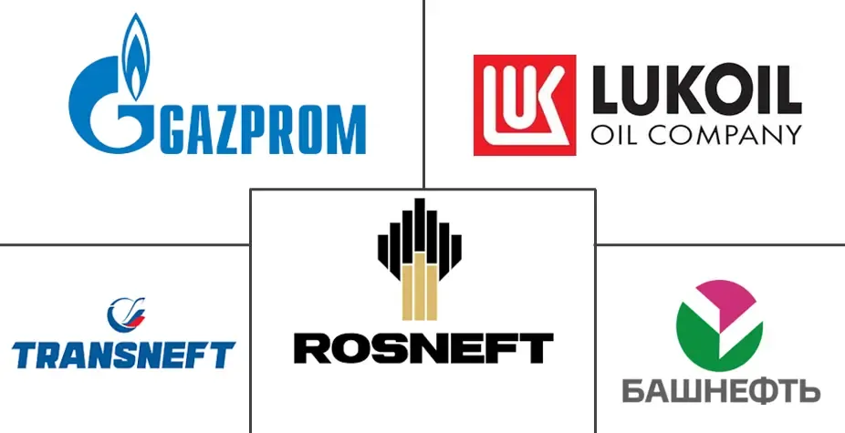

## Table of Contents

## What are the major oil companies in Russia?

The major oil companies in Russia include Rosneft, Gazprom Neft, and Lukoil. Rosneft is the largest oil producer in Russia and one of the biggest in the world. It is owned by the Russian government and produces a lot of oil and gas. Gazprom Neft is another big company, and it is a part of the Gazprom group, which is known for natural gas but also has a big oil business. Lukoil is a private company and is also very important in Russia's oil industry.

These companies are very important for Russia's economy because they produce a lot of oil and gas, which Russia sells to other countries. Rosneft, Gazprom Neft, and Lukoil not only produce oil but also have refineries where they turn the oil into things like gasoline and diesel. They also have many gas stations where people can buy fuel for their cars. These companies help Russia earn a lot of money from selling oil and gas around the world.

## How were these Russian oil companies established?

Rosneft was created in 1993 when the Russian government decided to combine several smaller oil companies into one big company. This was done to make the oil industry stronger and more organized. Over the years, Rosneft has grown a lot by buying other companies and finding new places to drill for oil. Today, it is owned by the Russian government and is the biggest oil company in Russia.

Gazprom Neft started in 1995 when Gazprom, a company that mostly deals with natural gas, decided to get into the oil business. They did this by taking over an existing oil company and renaming it Gazprom Neft. Since then, Gazprom Neft has grown by finding new oil fields and building more refineries. It is now a very important part of the Gazprom group.

Lukoil was founded in 1991, right after the Soviet Union broke up. It was created by combining three smaller oil companies. Lukoil was one of the first big companies in Russia to be owned by private people, not the government. It has grown a lot since then, finding new oil fields and building more refineries. Today, Lukoil is one of the biggest private oil companies in Russia.

## What is the market share of each major Russian oil company?

Rosneft is the biggest oil company in Russia. It has about 38% of the market share. This means that almost 4 out of every 10 barrels of oil produced in Russia come from Rosneft. The Russian government owns Rosneft, and it plays a very big role in Russia's oil industry. Rosneft not only produces a lot of oil but also has many refineries and gas stations.

Gazprom Neft has about 10% of the market share. This means that 1 out of every 10 barrels of oil produced in Russia comes from Gazprom Neft. It is part of the Gazprom group, which is known for natural gas but also has a big oil business. Gazprom Neft helps Russia earn money by selling oil and gas to other countries.

Lukoil has about 16% of the market share. This means that about 1 out of every 6 barrels of oil produced in Russia comes from Lukoil. It is a private company, which means it is owned by people, not the government. Lukoil is very important for Russia's economy because it produces a lot of oil and has many refineries and gas stations.

## How do these companies contribute to Russia's economy?

Rosneft, Gazprom Neft, and Lukoil are very important for Russia's economy. They produce a lot of oil and gas, which Russia sells to other countries. This helps Russia earn a lot of money. The money from selling oil and gas is used to pay for things like schools, hospitals, and roads. These companies also create many jobs for people in Russia. When people have jobs, they can buy things they need, which helps the economy grow.

These oil companies also have refineries where they turn oil into things like gasoline and diesel. People use these to drive their cars and trucks. The companies also have many gas stations where people can buy fuel. This makes it easier for people to travel and move goods around the country. When people and goods can move easily, it helps businesses grow and the economy gets stronger. So, these oil companies are very important for making life better in Russia.

## What are the main operations and activities of these oil companies?

Rosneft, Gazprom Neft, and Lukoil all do a lot of things to help with oil and gas. They find new places to drill for oil and gas, which is called exploration. Once they find oil, they drill wells to get it out of the ground. This is called production. They also have big machines called refineries where they turn the oil into things like gasoline and diesel. These are used in cars and trucks. They also have many gas stations where people can buy fuel for their cars.

These companies also sell oil and gas to other countries. This is called exporting. When they sell oil and gas to other countries, Russia makes a lot of money. They use this money to pay for things like schools, hospitals, and roads. These companies also create many jobs for people in Russia. When people have jobs, they can buy things they need, which helps the economy grow.

## What are the key financial performance indicators for these companies?

Rosneft, Gazprom Neft, and Lukoil have important numbers that show how well they are doing with money. These numbers are called financial performance indicators. For Rosneft, they make a lot of money from selling oil and gas, which is called revenue. They also have a lot of profit, which is the money left after they pay for everything they need to run the company. Rosneft also has a lot of assets, which are things like oil wells and refineries that they own. Their debt is also important to look at, which is the money they have borrowed and need to pay back.

Gazprom Neft also has good financial numbers. They have high revenue from selling oil and gas. Their profit is good too, showing they are making more money than they spend. Gazprom Neft has assets like oil fields and refineries. They also have some debt, but they manage it well. Lukoil, being a private company, also does well financially. They have strong revenue and profit numbers. Lukoil owns a lot of assets, including oil wells and refineries. They also have debt, but they handle it carefully to keep their business strong.

These financial performance indicators help us see how well these companies are doing. Revenue shows how much money they are making from selling oil and gas. Profit shows how much money they have left after paying for everything. Assets are important because they help the companies keep making money. Debt is something they need to watch carefully because it can affect how much money they have left after paying for everything.

## How do these companies impact the global oil market?

Rosneft, Gazprom Neft, and Lukoil are very important in the global oil market. They produce a lot of oil and gas, and Russia sells this to other countries. When these companies produce more oil, it can help keep the price of oil lower around the world. If they produce less, the price can go up. These companies also work with other big oil countries like OPEC to decide how much oil to sell. This helps them control the price of oil and make sure they can keep making money.

These Russian oil companies also have a big impact because they sell oil and gas to many different countries. When they sell more oil to places like Europe and Asia, it can change how much oil those countries need from other places. This can affect the oil market in those regions. Also, when these companies build new oil fields or refineries, it can change how much oil is available around the world. This can make the global oil market more stable or sometimes more unpredictable.

## What are the environmental policies and practices of these Russian oil companies?

Rosneft, Gazprom Neft, and Lukoil all have to follow Russia's environmental laws. They try to reduce the harm they do to the environment. They do things like checking their oil wells and pipelines often to make sure they don't leak oil. They also work on cleaning up any oil spills quickly. These companies also try to use less energy and water when they produce oil and gas. They do this to help the environment and save money.

These companies also have programs to help the environment. For example, they plant trees and clean up areas where they work. Rosneft has a program to reduce greenhouse gases, which are bad for the environment. Gazprom Neft has projects to use less energy and produce less waste. Lukoil works on making their refineries cleaner and using technology to reduce pollution. All these things help make the environment better, but there is still a lot of work to do.

## How do geopolitical factors affect these oil companies' operations?

Geopolitical factors can really change how Rosneft, Gazprom Neft, and Lukoil work. For example, if Russia has problems with other countries, it can be hard for these oil companies to sell their oil and gas to those places. Sometimes, other countries put special rules or taxes on Russian oil to make it harder for Russia to sell it. This can make it less profitable for these companies to sell oil abroad. Also, if there are wars or conflicts near where they work, it can be dangerous for their workers and hard to keep their oil wells and pipelines safe.

Another big thing is how Russia works with other oil-producing countries, like those in OPEC. They often talk about how much oil to sell and at what price. If they agree to sell less oil, the price can go up, which is good for these companies. But if they can't agree, it can make the oil market unpredictable, which can be bad for business. Also, changes in the government or laws in Russia can affect these companies. If the government changes the rules about how oil companies can work, it can make things harder or easier for Rosneft, Gazprom Neft, and Lukoil.

## What technological advancements have these companies adopted in their operations?

Rosneft, Gazprom Neft, and Lukoil have used new technology to make their work better. They use special machines and computers to find new places to drill for oil. These machines can see deep underground and help them know where the oil is. They also use robots and drones to check their oil wells and pipelines. This helps them find problems quickly and fix them before they cause big trouble. They also use new ways to get oil out of the ground, like using steam or chemicals to make the oil flow better.

These companies also use technology to make their refineries work better. They use computers to control the machines in the refineries, which helps them make more gasoline and diesel with less waste. They also use special filters and machines to clean the air and water they use, which is good for the environment. They are always looking for new technology to help them work better and be safer.

## What are the future projections and strategic plans for these oil companies?

Rosneft, Gazprom Neft, and Lukoil are looking to grow in the future. They want to find more oil and gas and sell it to more countries. They plan to use new technology to find oil in places that are hard to reach, like under the sea or in very cold areas. They also want to build more refineries and make them work better. This will help them turn more oil into things like gasoline and diesel. They also want to sell more oil and gas to places like China and India, where more people are buying cars and need fuel.

These companies also care about the environment. They plan to use less energy and water when they produce oil and gas. They want to make less pollution and clean up any oil spills quickly. They are also looking at new kinds of energy, like wind and solar power, to help the environment. They know that the world is changing and they want to be ready for the future. By doing these things, they hope to keep making money and helping Russia's economy grow.

## How do these companies handle corporate governance and compliance with international standards?

Rosneft, Gazprom Neft, and Lukoil all have rules they follow to make sure they do things the right way. This is called corporate governance. They have boards of directors who make big decisions and watch over the company. They also have special people who check that the company is following all the rules. These companies make sure they follow Russian laws and also try to follow international rules. They do this because they want to be trusted by people around the world and keep doing business with other countries.

These companies also care about being fair and open. They tell people about their plans and how they are doing. They do this by writing reports that anyone can read. They also work hard to make sure they follow rules about the environment and safety. This helps them stay in good standing with other countries and organizations. By following these rules, they can keep selling oil and gas to other countries and help Russia's economy grow.

## References & Further Reading

[1]: Henderson, J., & Mitrova, T. (2016). ["Energy Relations Between Russia and China: Playing Chess with the Dragon."](https://www.researchgate.net/profile/Tatiana-Mitrova/publication/333680585_Energy_Relations_between_Russia_and_China_Playing_Chess_with_the_Dragon/links/5cff4928a6fdccd13091d294/Energy-Relations-between-Russia-and-China-Playing-Chess-with-the-Dragon.pdf?origin=publication_detail) The Oxford Institute for Energy Studies.

[2]: Prasad, K. (2019). ["Algorithmic Trading and Its Implications on Financial Markets."](https://www.researchgate.net/publication/378548435_Algorithmic_Trading_and_AI_A_Review_of_Strategies_and_Market_Impact) Research in International Business and Finance.

[3]: Henderson, J., & Loe, J. S. P. (2020). ["The Prospects and Challenges for Arctic Oil Development."](https://www.semanticscholar.org/paper/The-Prospects-and-Challenges-for-Arctic-Oil-Henderson-Loe/d6588ca3eee488186ea453b1b2b0de095d78d284) The Oxford Institute for Energy Studies.

[4]: Slobodan, V. (2020). ["Russia's new energy geopolitics: The challenges of the East Siberia‐Pacific Ocean pipeline."](https://www.tandfonline.com/doi/full/10.1080/00263206.2020.1775590) WIREs Energy and Environment.

[5]: Jansen, S. (2020). ["Machine Learning for Algorithmic Trading."](https://github.com/stefan-jansen/machine-learning-for-trading) Packt Publishing.