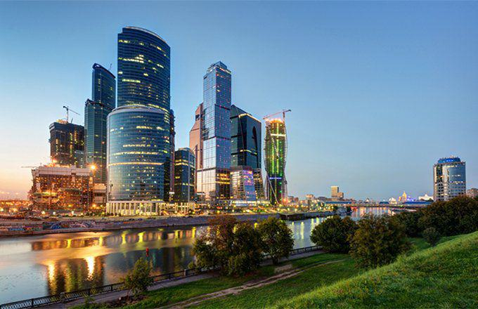

Russia holds a pivotal position in the global oil industry, being one of the world's top crude oil producers. Its vast reserves and strategic geographic location enable it to play a key role in shaping global oil dynamics. Russia's oil industry is primarily driven by several leading companies, which contribute significantly to its economy and influence worldwide oil markets.

Major Russian oil companies, such as Rosneft, Lukoil, and Gazprom Neft, are central to the country's oil sector. Rosneft, the largest publicly traded oil company in Russia, operates immense upstream and downstream assets, positioning itself as a major player in the global market. Lukoil, one of the largest oil producers globally, maintains extensive operations across numerous countries, while Gazprom Neft, a subsidiary of the state-owned Gazprom, also holds a substantial share of the oil production and refining market. These companies not only support Russia's status as an oil powerhouse but also engage in various international partnerships and projects that enhance their global reach and influence.

Algorithmic trading, on the other hand, refers to the use of computer algorithms to automate trading decisions with speed and precision that surpass human capability. Its burgeoning role in the oil sector is transforming the way oil markets operate by enhancing liquidity, efficiency, and market stability. The impact of algorithmic trading extends to areas such as price discovery and risk management, offering potential strategic advantages to oil producers and traders.

The purpose of this article is to explore the intersection of Russian oil production with algorithmic trading, delving into how these powerful industries converge and influence each other. Understanding these dynamics is crucial in the context of global economics, as the strategies adopted by Russian oil companies and the increasing prevalence of algorithmic trading can have significant implications for international trade flows, geopolitical relations, and economic stability. By examining these elements, the article aims to shed light on the transformative role of technology and strategic resource management in the modern world.

## Table of Contents

## Major Russian Oil Producers

Russian oil companies are central to the global energy landscape, with several key players leading the charge in production and exports. The most prominent of these are Rosneft, Lukoil, and Gazprom Neft, which have established themselves as vital contributors to both domestic energy supply and international markets.

**Rosneft**

Rosneft, Russia's largest oil company, plays a pivotal role in the country's energy sector. As of recent data, Rosneft's production capacity exceeds 4 million barrels per day, placing it among the top oil producers worldwide. Its global market share reflects its substantial production capabilities, and it has continued to expand through strategic acquisitions and investments in new fields.

Rosneft's evolution traces back to its origins during the Soviet era, but significant growth occurred post-1990s, particularly after acquiring Yukos assets in 2004. The geopolitical landscape has profoundly impacted Rosneft, as evident in its dealings with sanctions from Western countries. Despite these challenges, Rosneft has maintained strong partnerships, notably with Chinese and Indian oil firms, further solidifying its international presence.

**Lukoil**

Lukoil is another dominant Russian oil company, known for being Russia's largest privately-owned oil producer. With a production capacity of around 2 million barrels per day, Lukoil commands a substantial portion of Russia's oil output. Globally, it represents a significant market player, with operations spanning more than 30 countries.

The company’s growth trajectory surged after the collapse of the Soviet Union, freely capitalizing on the privatization wave during the early 1990s. Lukoil's international strategy includes acquiring foreign assets and engaging in joint ventures, which have shielded it to some extent from geopolitical tensions affecting Russia.

**Gazprom Neft**

Gazprom Neft, part of the state-controlled Gazprom conglomerate, is a notable oil producer with production figures hovering around 1.5 million barrels per day. While primarily recognized for its natural gas operations, Gazprom’s oil subsidiary has increasingly contributed to Russia’s crude output.

Initially focusing on domestic markets, Gazprom Neft has progressively expanded its global footprint. Geopolitical factors have influenced its strategies, guiding the company to enhance its technologies and partnerships, particularly in Asia.

**Comparisons and Geopolitical Influence**

The influence of geopolitical factors on these Russian oil giants cannot be overstated. Western sanctions, aimed primarily at restricting technological access and financial transactions, have catalyzed a pivot towards non-traditional markets and partnerships. This shift highlights the nimbleness of Russian companies in adapting to external pressures while seeking opportunities in emerging markets.

When compared to international oil majors like ExxonMobil and Saudi Aramco, Russian firms often operate under different strategic paradigms. While Western companies might focus more on diversification and energy transition, Russian oil producers have emphasized sustaining and increasing production volumes and exploring new fields, particularly in the Arctic and East Siberia.

Despite challenges, the revenues of Russian oil companies remain robust. As state backing often buffers these corporations from full market impacts, they usually show resilience better than their purely private counterparts. However, in terms of technological advancement and sustainability initiatives, there is a notable gap that Russian firms are slowly working to bridge as global market demands evolve. 

In sum, the major Russian oil producers are integral to not only Russia's economy but also the global oil supply chain, influencing energy security and market dynamics worldwide. Understanding their production capabilities, historical growth, geopolitical navigation, and strategic focus is crucial in grasping their roles and potential future impacts.

## Role of Russia in the Global Oil Market

Russia holds a significant position in the global oil market as one of the leading producers and exporters of [crude oil](/wiki/crude-oil). This strategic positioning is supported by substantial reserves and vast production capabilities that consistently place Russia among the top three oil-producing countries worldwide. According to data from the International Energy Agency, Russia contributes to approximately 12% of the global oil production, a figure that underscores its substantial influence over global energy markets.

### Oil Export Strategies and Global Implications

Russia's export strategies are designed to maximize its influence and economic gains on the global stage. Primarily, Russia exports crude oil and refined products to Europe and Asia, with these regions accounting for the bulk of its exports. The country has strategically developed pipeline networks like the Druzhba pipeline in Europe and the Eastern Siberia-Pacific Ocean pipeline for Asian customers, diversifying its export routes and reducing dependence on any single market.

Russia's export strategy has several global implications. Firstly, it affects regional supply dynamics, particularly in Europe, where it meets a significant portion of oil demand. Secondly, it allows Russia to establish long-term energy relationships with key economies in Asia, including China and India. This diversification helps mitigate risks associated with geopolitical tensions in any particular region.

### OPEC and Non-OPEC Collaborations 

Russia is not a member of the Organization of the Petroleum Exporting Countries (OPEC) but has increasingly engaged in coordinated efforts with the group through the OPEC+ agreement, which includes OPEC members and other leading oil producers like Russia. This collaboration aims to stabilize global oil prices by managing production levels amongst participating countries. The OPEC+ alliance, formed in 2016, has been pivotal in countering the effects of oversupply and supporting price levels, benefiting oil-dependent economies.

The cooperation between Russia and OPEC has proven essential during periods of market [volatility](/wiki/volatility-trading-strategies), such as the oil price crash of 2020 due to the COVID-19 pandemic, where coordinated production cuts helped rebalance the market. This alliance showcases Russia's ability to shape market conditions in tandem with traditional oil-producing nations.

### Impact of Global Oil Prices on Russian Economy and Policies

The Russian economy is heavily reliant on hydrocarbon exports, with oil and gas revenues constituting a significant portion of its federal budget. This reliance exposes the country's economic stability to fluctuations in global oil prices. When prices are high, Russia benefits from substantial export revenues, which bolster its fiscal capacity and foreign reserves. Conversely, a decline in oil prices can have adverse effects, leading to budget deficits and economic slowdowns.

To mitigate these effects, Russia has implemented policies such as the fiscal rule, which caps budget spending based on a base oil price, saving excess revenues in the National Wealth Fund. This approach aims to reduce economic volatility and maintain budget stability irrespective of global oil price trends.

### Future Projections for Russian Oil Production

Looking ahead, Russia's oil production is poised for a shift into more technologically advanced and potentially less economically viable regions, such as the Arctic and Eastern Siberia. These regions hold untapped reserves, which could sustain Russia's production levels in the long term. However, developing these areas presents challenges, including harsh environmental conditions, higher production costs, and environmental concerns.

Moreover, global moves towards decarbonization and the increasing emphasis on renewable energy pose challenges for Russia's oil industry. Nonetheless, with ongoing investments in technology and infrastructure, Russia is likely to continue as a major oil producer, adapting to changing global energy dynamics while maintaining its key role in the energy sector. 

Russia's role in the global oil market is multifaceted, balancing between maximizing short-term economic benefits and planning for long-term sustainability in a rapidly evolving energy landscape.

 to Algorithmic Trading in the Oil Industry

Algorithmic trading, often known as algo trading, refers to the use of computer algorithms to execute trades in financial markets. These algorithms are pre-programmed with specific criteria, such as timing, price, or quantity, and they operate without human intervention. The primary advantage of [algorithmic trading](/wiki/algorithmic-trading) is its ability to process large volumes of data and execute trades at speeds and frequencies that are impossible for a human trader. 

### Applications of Algo Trading in the Oil Markets

In the oil industry, algorithmic trading is utilized for a variety of purposes. These include:

1. **Price Discovery**: Algorithms can analyze vast amounts of market data to predict price movements. By considering historical price data, futures contracts, and market news, these systems can provide accurate forecasts and facilitate more informed trading decisions.

2. **Arbitrage Opportunities**: Algorithms can quickly identify and exploit arbitrage opportunities across various markets, such as spotting price discrepancies between Brent Crude and West Texas Intermediate.

3. **Risk Management**: By continuously monitoring market conditions and executing trades at pre-defined criteria, algorithmic systems help manage exposure to risk, especially in volatile oil markets.

### Benefits of Algorithmic Trading for Oil Producers and Traders

Algorithmic trading offers several benefits for oil producers and traders:

- **Efficiency**: Algorithms can execute trades much faster than human traders, increasing market efficiency and reducing transaction costs.

- **Consistency**: Trading algorithms eliminate emotional decision-making, leading to more consistent trading outcomes.

- **Capacity to Handle Complex Data**: Algorithms can process multiple variables and complex datasets, leading to more nuanced trading strategies.

- **Improved Liquidity**: High-frequency trading facilitated by algorithms often leads to increased liquidity in the markets.

### Challenges and Risks Associated with Algorithmic Trading

While algorithmic trading offers numerous benefits, it also poses certain challenges and risks:

- **Market Volatility**: High-frequency trading can exacerbate market volatility, potentially leading to large price swings within short periods.

- **System Failures**: Technical glitches or flaws in the algorithm can cause significant financial losses, and operational risks are inherent as well.

- **Regulatory Scrutiny**: Given the potential impact on market stability, algorithmic trading is subject to stringent regulatory frameworks. Compliance with these regulations can be burdensome for traders.

### Technological Advancements Facilitating Algo Trading in the Oil Industry

Recent advancements have significantly enhanced the capabilities of algorithmic trading in the oil sector. Technologies such as [machine learning](/wiki/machine-learning) and [artificial intelligence](/wiki/ai-artificial-intelligence) are improving the accuracy and adaptability of trading algorithms. Big data technologies provide access to larger datasets, enabling more comprehensive market analysis. Additionally, cloud computing has provided scalable resources that allow for real-time data processing and algorithm execution. 

These technological innovations continue to transform the landscape of oil trading, providing traders and producers with unprecedented tools for market engagement. As these systems become increasingly sophisticated, their role is expected to grow, reshaping traditional trading frameworks and offering new opportunities for market participants.

## Impact of Algorithmic Trading on Russian Oil Companies

Russian oil companies have increasingly turned to algorithmic trading to gain strategic advantages in the competitive global oil market. Algorithmic trading, also known as algo trading, employs computer algorithms to execute trading orders at speeds and volumes unmanageable by human traders. This adoption has introduced opportunities and challenges for Russian oil firms.

Several Russian oil companies have embraced algorithmic trading techniques to optimize their trading operations. For example, Rosneft has been noted for integrating advanced data analytics and algorithmic models to enhance decision-making processes. This adoption is motivated by the need to remain competitive, as major international firms have already embraced similar technologies.

Algorithmic trading has significantly improved trading efficiency and market responsiveness for these companies. By analyzing vast datasets and executing trades rapidly, Russian oil firms can respond to market fluctuations and capitalize on price movements more swiftly than traditional trading methods permit. This capability not only optimizes profit margins but also aids in maintaining market share amidst fluctuating global oil prices. The execution speed provided by algorithmic trading is crucial in a market where seconds can determine profitability. Python, with libraries such as NumPy and pandas, is often used to develop these algorithms due to its robust data handling capabilities and ease of integration with other systems.

One of the notable impacts of algorithmic trading on Russian oil companies is its influence on price volatility and risk management. While algorithmic trading can exacerbate volatility through rapid, large-[volume](/wiki/volume-trading-strategy) trades, it can also enhance risk management by employing complex statistical and predictive models to forecast price trends and manage exposure. This dual impact necessitates a careful balance between leveraging the benefits of speed and mitigating the risks associated with increased volatility.

However, the adoption of algorithmic trading in Russia faces regulatory considerations and compliance challenges. The Russian government and financial regulatory bodies have established guidelines to ensure market stability. These regulations require companies to maintain transparency in their trading activities and implement measures to prevent market manipulation. Compliance involves rigorous testing of algorithms before deployment, ongoing monitoring of trading activities, and maintaining audit trails.

In conclusion, Russian oil companies are increasingly leveraging algorithmic trading to enhance their strategic capabilities. By adopting these technologies, they improve trading efficiency and gain a competitive edge in the global market. However, they must also navigate the challenges of managing price volatility and adhering to regulatory standards. As the industry evolves, continued innovation and careful regulation will be critical to harnessing the full potential of algorithmic trading in Russia's oil sector.

## Challenges and Opportunities

Russian oil firms face several challenges when integrating algorithmic trading into their business models. Primarily, the complexity of algorithms requires significant investment in advanced technology and skilled personnel to design, maintain, and upgrade systems. The volatile nature of the oil market necessitates rapid adaptability, and any delay in upgrading or recalibrating algorithms can lead to substantial financial losses. Furthermore, Russian companies may encounter regulatory hurdles, as the legislative framework surrounding algorithmic trading is still evolving. This uncertainty can lead to operational risks and compliance challenges.

Despite these obstacles, there are considerable opportunities for growth and innovation. Algorithmic trading can enhance efficiency by enabling faster and more accurate trading decisions, leveraging data analytics to predict market trends, and optimizing pricing strategies. The automation of trading processes reduces human error and allows Russian firms to operate in global markets with improved agility and competitiveness.

Balancing traditional practices with modern trading technologies presents another layer of complexity. While established trading practices offer reliability and trust, algorithmic trading introduces speed and scalability. Therefore, Russian oil firms must carefully integrate these technologies without disrupting the core operations that have long sustained their success. This balance requires a gradual approach, often starting with pilot programs and expanding successful strategies across the organization.

Environmental considerations are increasingly prominent in today's trading landscape. As Russia's oil industry is a significant contributor to carbon emissions, incorporating sustainable practices is crucial. Advancements in technology offer firms the possibility to monitor and minimize environmental impacts through better resource management and sophisticated data analytics. These technologies also present opportunities for Russian firms to explore cleaner energy sources and more sustainable extraction methods as part of their trading strategies.

Looking forward, several trends could shape the future of oil trading in Russia. The continuous evolution of machine learning and artificial intelligence has the potential to further refine trading algorithms, offering predictive insights that were previously unattainable. There is also a growing interest in blockchain technology for secure and transparent transactions, which could enhance trust and reduce counterparty risks in trading processes. Lastly, as global demand shifts towards sustainable energy solutions, Russian oil firms will need to evolve their strategies, potentially integrating renewable energy trading into their portfolios to stay relevant in a changing market landscape.

## Conclusion

In this article, we explored the intersection of Russian oil production and algorithmic trading, highlighting the critical role Russian oil producers such as Rosneft, Lukoil, and Gazprom Neft play in the global market. These companies have established themselves as significant influencers in the energy sector, leveraging their production capacities and geopolitical strategies. Their adaptation to global shifts in oil demand and price dynamics underscores Russia's continued prominence.

Algorithmic trading represents a transformative force in oil trading, providing Russian oil companies with enhanced market responsiveness and efficiency. The integration of sophisticated algorithms has enabled these firms to optimize trading strategies, reduce transaction costs, and manage risks more effectively. However, it also introduces potential challenges, such as increased price volatility and regulatory hurdles, which require careful navigation to harness the full benefits.

The impact of Russia's oil production practices extends beyond its borders, influencing global oil prices and economic stability. As advances in technology continue to reshape the industry, the modernization of trading strategies through algorithmic systems marks a pivotal shift from traditional methods. These developments point to a future where technology and oil industry practices are increasingly intertwined.

We encourage further research and exploration into these dynamic interactions to fully understand their implications on both regional and global scales. Continued study is essential as technology evolves and integrates more deeply with oil production and trading sectors. Understanding these trends not only assists practitioners in adapting to changing times but also provides insights for policymakers and economists aiming to foresee the future landscape.

In conclusion, the integration of oil production and trading technologies is poised to redefine the sector's capabilities and influence. As Russia's oil industry and trading practices evolve, their strategic importance and impact on global economics will undoubtedly grow, making it a critical area for ongoing observation and analysis.

## References & Further Reading

[1]: Henderson, J., & Mitrova, T. (2016). ["Energy Relations Between Russia and China: Playing Chess with the Dragon."](https://www.researchgate.net/profile/Tatiana-Mitrova/publication/333680585_Energy_Relations_between_Russia_and_China_Playing_Chess_with_the_Dragon/links/5cff4928a6fdccd13091d294/Energy-Relations-between-Russia-and-China-Playing-Chess-with-the-Dragon.pdf?origin=publication_detail) The Oxford Institute for Energy Studies.

[2]: Prasad, K. (2019). ["Algorithmic Trading and Its Implications on Financial Markets."](https://www.researchgate.net/publication/378548435_Algorithmic_Trading_and_AI_A_Review_of_Strategies_and_Market_Impact) Research in International Business and Finance.

[3]: Henderson, J., & Loe, J. S. P. (2020). ["The Prospects and Challenges for Arctic Oil Development."](https://www.semanticscholar.org/paper/The-Prospects-and-Challenges-for-Arctic-Oil-Henderson-Loe/d6588ca3eee488186ea453b1b2b0de095d78d284) The Oxford Institute for Energy Studies.

[4]: Slobodan, V. (2020). ["Russia's new energy geopolitics: The challenges of the East Siberia‐Pacific Ocean pipeline."](https://www.tandfonline.com/doi/full/10.1080/00263206.2020.1775590) WIREs Energy and Environment.

[5]: Jansen, S. (2020). ["Machine Learning for Algorithmic Trading."](https://github.com/stefan-jansen/machine-learning-for-trading) Packt Publishing.