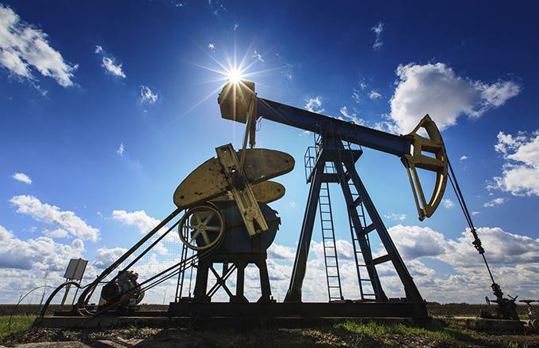

The global energy sector is a cornerstone of the international economy, underpinning the development and economic growth of nations worldwide. Its evolution has been shaped by a myriad of factors, including geopolitical events, advancements in technology, and shifts in economic paradigms. In recent years, the energy markets have undergone profound transformations, leading to new opportunities and challenges for stakeholders.

Russia is a dominant force in the oil and gas industry, primarily due to its substantial reserves and considerable production capacity. As one of the world’s leading suppliers, Russia's influence extends across global energy markets. This article examines the major Russian oil and natural gas companies and their significant role in the global energy landscape. Furthermore, it considers the impact of algorithmic trading—a technology increasingly shaping modern trading practices—within this domain.



Sanctions imposed on Russian entities have had a considerable impact, altering the operational strategies of these companies. They have responded by exploring alternative markets and forming new partnerships to sustain their market relevance. Energy trading complexities, accentuated by the rise of algorithmic trading, add another layer of intricacy to this sector. Algorithmic trading leverages advanced mathematical models and computational power to enhance efficiency and lower transaction costs, a trend that is becoming increasingly prevalent in energy markets.

This article seeks to provide a comprehensive overview of the Russian energy sector, highlighting its critical components and examining the transformative role of algorithmic trading. By analyzing these elements, the discussion aims to offer a deeper understanding of how Russian oil and gas companies navigate the dynamic landscape of global energy markets.

## Table of Contents

## The Role of Natural Gas and Oil in Russia's Economy

Russia is renowned for its vast reserves of oil and natural gas, which play an essential role in its economy. These natural resources make Russia one of the leading energy producers globally, contributing significantly to its Gross Domestic Product (GDP) and serving as pivotal sources of export revenues. The country’s dominance in the energy sector was shaped by historical developments, strategic economic policies, and the emergence of major companies such as Rosneft, Gazprom, and Lukoil.

The Soviet era marked the beginning of significant advancements in Russia's energy sector, with massive investments in infrastructure and exploration activities. The discovery of rich natural gas fields, notably in Siberia, positioned the Soviet Union as a crucial energy supplier. Following the dissolution of the Soviet Union, Russia inherited this immense energy potential. The transition to a market economy in the 1990s further catalyzed the growth of its energy sector. The government enacted strategies to modernize and optimize oil and gas production, laying the groundwork for today's energy giants.

Rosneft, Gazprom, and Lukoil emerged as leading players in the Russian energy landscape. Each of these companies has contributed uniquely to Russia's position in the global energy market. Gazprom holds a near-monopoly on Russia's natural gas reserves, cementing its role as a key player in supplying European markets. Rosneft is one of the largest publicly traded companies in terms of petroleum reserves and production, while Lukoil has established itself as a significant oil producer with extensive operations both domestically and abroad.

Russia's natural resources have also been instrumental in shaping its geopolitical strategies and economic policies. Energy exports have not only provided substantial revenues but have also reinforced Russia's influence on the global stage. For instance, natural gas supplies to Europe have been a critical lever in Russia's diplomatic engagements. The strategic use of energy resources enables Russia to negotiate from a position of strength, impacting both regional and international politics.

Over the years, Russia has implemented policies to manage its energy sector efficiently. Tax regimes, investment incentives, and state ownership in major companies highlight the government's approach to maintaining control over this vital sector. These resources are not only economic assets but are also considered tools for political leverage in Russia's relations with other nations.

The energy sector faces complex challenges due to fluctuating oil prices, evolving environmental regulations, and geopolitical tensions. Despite these issues, Russia continues to adapt and leverage its natural resource wealth, underscoring the integral role oil and natural gas play in its economic stability and growth.

## Key Players in the Russian Oil and Gas Industry

Russia's oil and gas industry is dominated by several key players, each possessing substantial market positions, production capacities, and international influence. The principal companies in this sector include Rosneft, Gazprom Neft, Lukoil, Surgutneftegas, and Novatek.

### Rosneft

Rosneft is the largest oil producer in Russia and one of the world's leading publicly traded petroleum companies. Its operations span oil and gas exploration, production, refining, and sales. Rosneft's extensive network of refineries and distribution channels underpin its significant domestic and international market presence. The company is actively pursuing partnerships and projects abroad, notably in Asia and Europe, to mitigate risks associated with geopolitical tensions and sanctions.

### Gazprom Neft

Gazprom Neft, a subsidiary of Gazprom, focuses on the oil segment and plays a critical role both domestically and globally. It engages in exploration, production, and refining activities across Russia and has strategic assets in other countries. The company has witnessed exponential growth, largely due to its integration within Gazprom's extensive gas pipeline network, which facilitates efficient resource distribution. Gazprom Neft continues to explore opportunities in new markets while adhering to stringent environmental standards and regulations.

### Lukoil

Lukoil is another major entity, ranking high among the world’s largest international vertically integrated oil and gas companies. It operates across the entirety of the oil and gas value chain—from exploration to distribution. Lukoil's significant investments in technology and sustainability have helped it maintain a competitive edge. The company is adept at navigating the challenges posed by global environmental policies, focusing on reducing its carbon footprint while expanding its renewable energy portfolio.

### Surgutneftegas

Surgutneftegas is known for its robust production capabilities and conservative financial strategy, which has enabled it to maintain considerable [liquidity](/wiki/liquidity-risk-premium). This approach provides resiliency against market fluctuations and sanctions. The company’s operations are concentrated mainly in Western Siberia, and it plays a pivotal role in Russia’s oil production and export. Surgutneftegas focuses heavily on innovation and technology to sustain production efficiency and environmental compliance.

### Novatek

Novatek primarily ventures in natural gas and is the largest independent gas producer in Russia. Its flagship project, Yamal LNG, exemplifies Novatek's capabilities in constructing and managing extensive liquefied natural gas (LNG) operations in challenging Arctic conditions. The company's strategic initiatives focus on expanding LNG exports to Asian markets, taking advantage of Russia’s proximity and geopolitical ties with these nations. Novatek's strategy is closely aligned with Russia's broader energy policy to pivot towards natural gas as a staple of global energy transition.

### Challenges and Opportunities

These companies face a variety of challenges, including global sanctions that restrict access to Western technology and financial markets. However, they leverage opportunities through alliances with non-Western partners, focusing on emerging markets in Asia and the Middle East.

Environmental policies present both challenges and prospects for innovation. Russian oil and gas companies are progressively investing in cleaner technologies and enhancing operational efficiency, aiming to balance regulatory compliance with economic viability. The shift towards greener energy sources, such as natural gas and renewables, is inevitable, and these companies are positioning themselves accordingly to capture market share in a future dominated by sustainability.

The evolving regulatory landscape, technological advancements, and shifts in global energy demand necessitate strategic agility. As these companies continue to navigate complexities within the energy sector, their ability to innovate and form strategic international partnerships will determine their ongoing success in the global market.

## The Impact of Sanctions on Russian Energy Companies

International sanctions have profoundly impacted Russian energy companies, influencing their operational capabilities and strategic directions. These sanctions, primarily imposed by Western nations, were designed to limit Russia's ability to finance its energy projects and restrict its access to advanced technology necessary for developing complex reserves, such as those in the Arctic and deep-water environments.

### Trade Restrictions and Investment Barriers

Sanctions have imposed significant trade restrictions, particularly on the export of certain technologies and equipment necessary for oil and gas exploration and production. This has directly affected the technological advancement and modernization of Russian energy infrastructure. Companies like Rosneft and Gazprom have found themselves constrained in accessing Western technology, crucial for enhancing production efficiency and exploring challenging reserves.

Investment barriers are another critical aspect of the sanctions. Financial sanctions have limited Russian companies' access to Western capital markets, curbing their ability to raise funds for large-scale projects. For instance, Western financial institutions are prohibited from providing medium to long-term financing to major Russian energy firms, which has forced these companies to rely more on domestic funding sources or look towards alternative markets, such as China and India, for investment and financing.

### Strategies for Navigating Sanctions

Facing these challenges, Russian energy companies have adopted various strategies to mitigate the impact of sanctions. One primary strategy has been pivoting towards new markets and forming strategic partnerships with non-Western countries. For example, increased collaboration with Chinese firms has been a significant trend, as evidenced by Gazprom's Power of Siberia pipeline, which supplies natural gas to China.

Additionally, Russian companies have been investing in developing indigenous technologies to reduce dependence on Western imports. This self-reliance approach not only helps in circumventing technology embargoes but also supports domestic industries and technological advancement within Russia. 

### Implications on Global Energy Supplies and Prices

The sanctions on Russian energy companies have far-reaching implications for global energy supplies and prices. With constrained investment and technology access, the potential for Russian companies to expand production capacity is limited, contributing to fluctuations in global energy supply. This restricted output can lead to increased [volatility](/wiki/volatility-trading-strategies) in global oil and gas prices depending on demand dynamics and geopolitical developments.

Moreover, the shift in Russia's energy trade towards Asia could alter traditional energy trade routes, impacting markets that have historically relied on Russian energy exports. The diversified market presence might cushion the immediate impact on Russian companies but could lead to geopolitical realignments in global energy trade patterns.

In summary, while international sanctions have imposed significant restrictions on Russian energy companies, these companies have demonstrated adaptability by seeking alternative markets and developing domestic capabilities. The broader impact on global energy supplies and prices presents an evolving challenge for the international community as it seeks to balance sanctions' geopolitical objectives with the realities of global energy demand.

## The Rise of Algorithmic Trading in the Energy Sector

Algorithmic trading has emerged as a transformative force within the energy sector, revolutionizing how trading operations are conducted. By employing computer algorithms to execute trades, companies can process large volumes of transactions at unprecedented speed and accuracy. These algorithms leverage complex mathematical models and are designed to respond instantly to market changes, enhancing both the efficiency and profitability of energy trading.

One of the primary advantages of [algorithmic trading](/wiki/algorithmic-trading) is its ability to significantly reduce transaction costs. By automating the trading process, the need for manual intervention is minimized, allowing trades to be executed at optimal pricing points. This reduction in human involvement also means fewer errors, contributing to cost efficiency. For instance, high-frequency trading ([HFT](/wiki/high-frequency-trading-strategies)), a subset of algorithmic trading, enables traders to capitalize on minute price discrepancies that occur in fractions of a second, maximizing returns.

Algorithmic trading also offers improved market liquidity and price discovery. As algorithms can pull data from numerous sources and analyze trends quickly, they can execute trades that reflect true market conditions more accurately. This contributes to more stable markets and aids in setting fair energy prices, benefiting all stakeholders, from producers to consumers.

However, the implementation of algorithmic trading in energy markets is not without challenges. Market volatility is a notable concern. The rapid execution of trades can sometimes exacerbate volatility, leading to sudden price swings that can affect market stability. Moreover, the reliance on complex algorithms introduces security vulnerabilities. Should these algorithms be compromised, they could be manipulated to influence markets unjustly, prompting regulatory scrutiny and the need for robust cybersecurity measures.

Despite these risks, the adoption of algorithmic trading continues to grow. Companies invest heavily in technology and data analytics to refine their algorithms for better performance. The precision and speed offered by algorithmic trading are shaping modern energy markets, paving the way for innovations that promise enhanced market dynamics and participant engagement.

## Algorithmic Trading in Russian Energy Markets

Russian oil and gas companies are progressively integrating algorithmic trading into their operations, revolutionizing market strategies and enhancing overall efficiency. Algorithmic trading, which employs complex mathematical models and algorithms to make trading decisions and execute orders, offers significant advantages in trading accuracy and decision-making processes. This technological advancement allows companies to analyze vast datasets swiftly, derive trends, and act upon them in real time, thereby improving trading outcomes and competitive standing in the global energy market.

Technological advancements play a crucial role in this transformation, with sophisticated algorithms utilizing data analytics to optimize trading strategies. Machine learning and [artificial intelligence](/wiki/ai-artificial-intelligence) (AI) are increasingly employed to predict market movements, evaluate risks, and identify optimal trading opportunities. These technologies enable the assimilation of historical data, market trends, and news sentiments to generate predictive models that can inform trading strategies. Python, with its extensive libraries such as NumPy, pandas, and scikit-learn, is often used to implement these algorithms. For instance, a simplified [machine learning](/wiki/machine-learning) model for predicting energy prices might follow this structure:

```python
import pandas as pd
from sklearn.model_selection import train_test_split
from sklearn.ensemble import RandomForestRegressor
from sklearn.metrics import mean_squared_error

# Load dataset
data = pd.read_csv('energy_market_data.csv')

# Preprocessing
features = data[['feature1', 'feature2', 'feature3']]
target = data['energy_price']

# Train-test split
X_train, X_test, y_train, y_test = train_test_split(features, target, test_size=0.2, random_state=42)

# Model training
model = RandomForestRegressor(n_estimators=100, random_state=42)
model.fit(X_train, y_train)

# Predictions
predictions = model.predict(X_test)

# Evaluation
rmse = mean_squared_error(y_test, predictions, squared=False)
print(f"Root Mean Squared Error: {rmse}")
```

Despite these advancements, Russian energy markets face unique challenges in adopting algorithmic trading. The regulatory landscape in Russia is evolving, with authorities striving to balance innovation with market stability. Regulations surrounding data privacy, trading transparency, and systemic risk management are critical factors companies must navigate. Moreover, infrastructure barriers, such as limited access to cutting-edge technological resources and skilled personnel, pose challenges to widespread implementation.

Furthermore, the geopolitical climate and its implications for trade and finance contribute to the complexities faced by Russian companies. Sanctions and economic restrictions may limit access to global markets and advanced technology, impacting the integration of algorithmic trading systems. Nonetheless, Russian oil and gas companies are actively seeking partnerships and investing in domestic capabilities to overcome these hurdles.

In conclusion, while Russian energy companies encounter specific challenges in adopting algorithmic trading, the benefits in terms of efficiency and strategic market positioning underscore its growing importance. By leveraging technological advancements and addressing regulatory and infrastructure barriers, these companies can continue to adapt and thrive in the dynamic global energy landscape.

## Future Prospects for the Russian Energy Sector

The future of the Russian energy sector is poised to be shaped by several critical factors that encompass technological advancements, environmental concerns, and geopolitical dynamics. As the global energy landscape continues to evolve, these elements will significantly influence Russia's strategic direction.

Technological advancements remain a cornerstone in improving the efficiency and sustainability of the Russian energy sector. The integration of digital technologies, such as artificial intelligence and machine learning, is expected to enhance the operational efficiency of energy companies. These technologies can aid in predictive maintenance, optimization of exploration and production processes, and reducing operational costs. The development and implementation of smart grid technologies also present a promising avenue for improving energy distribution and reducing losses in the transmission network.

Environmental concerns are increasingly becoming central to the operations of Russian energy companies. With international pressure mounting to reduce carbon emissions and promote sustainable energy practices, there is an accelerated push towards diversifying the energy mix. Investments in renewable energy sources, such as wind, solar, and hydropower, are beginning to gain traction. Additionally, efforts to improve fuel efficiency and carbon capture technology are crucial in aligning with global environmental standards.

Geopolitical dynamics continue to play a pivotal role in shaping the Russian energy strategy. Sanctions have compelled Russian energy companies to seek new partnerships and markets outside traditional Western territories. This shift is evident in the growing energy cooperation with Asian countries, notably China and India, which offer vast and expanding markets. Furthermore, the geopolitical landscape's influence on global energy prices and supply chains remains a critical consideration for future prospects.

Potential growth areas for Russian energy companies include the expansion of liquefied natural gas (LNG) projects and the development of Arctic resources. The Arctic region holds immense untapped reserves, presenting opportunities for long-term resource extraction, albeit with significant environmental and technological challenges. Meanwhile, the LNG market is set for substantial growth due to its relatively lower carbon footprint compared to other fossil fuels.

Innovation is a driving force behind sustainable practices within the sector. Russian companies are investing in research and development to improve extraction techniques, reduce environmental impact, and enhance the longevity of existing fields. Collaborative efforts with international firms to share knowledge and technology are also vital for spearheading innovation.

Global energy policies will undoubtedly continue to affect Russia's energy sector. The commitment to international agreements, such as the Paris Agreement, necessitates a reevaluation of energy production and consumption patterns. Russian energy companies must balance between adhering to these policies and meeting domestic and international demand.

Algorithmic trading's evolution is another critical [factor](/wiki/factor-investing) molding the sector's future. Its increasing adoption promises enhanced market efficiency, accurate pricing strategies, and mitigation of financial risks. However, the complexity of global energy markets necessitates robust mechanisms to address potential market volatility and cybersecurity threats associated with algorithmic trading.

In conclusion, the future of the Russian energy sector is likely to be characterized by a complex interplay of technological, environmental, and geopolitical factors. Embracing innovation, adapting to global energy policies, and leveraging algorithmic trading will be instrumental for Russian energy companies to maintain their competitive edge and contribute to global energy stability.

## Conclusion

The Russian energy sector is a vital pillar of the global energy landscape, driven by its vast oil and natural gas reserves. Despite significant challenges, including international sanctions and evolving market dynamics, Russian oil and gas companies have shown resilience. These firms continue to adapt by leveraging innovations and strategic realignments, navigating a complex geopolitical environment with agility.

The integration of algorithmic trading is increasingly shaping the energy sector, offering promising advancements in efficiency and opening new opportunities. This modern trading approach allows companies to optimize operations and enhance market positioning, mitigating some of the instability caused by external pressures. By harnessing data analytics and adopting state-of-the-art technologies, these entities are not only streamlining their processes but also preparing for future fluctuations in global energy demands.

Looking ahead, the future of the Russian energy sector hinges on its ability to balance traditional energy practices with modern technological methodologies. Sustainable practices and innovations will be crucial for maintaining its stature as an influential player in the global energy markets. As technological and environmental landscapes continue to evolve, Russian energy companies must remain agile, ensuring they not only survive but thrive, securing their position as critical contributors to the world's energy needs.

## References & Further Reading

[1]: ["Algorithmic Trading and High-Frequency Trading"](https://assets.cambridge.org/97811070/91146/frontmatter/9781107091146_frontmatter.pdf) - Investopedia

[2]: Henderson, J., Phillips, P., & Powell, N. (2021). ["The Evolution of Algorithmic Trading in Global Markets: A Research Review."](https://www.taylorfrancis.com/books/mono/10.4324/9781315757230/handbook-training-evaluation-measurement-methods-jack-phillips-patricia-pulliam-phillips) Journal of Financial Markets.

[3]: Simola, H. (2018). ["Russia's Energy Policy and Its Impact on Global Energy Markets."](https://link.springer.com/chapter/10.1007/978-3-031-17057-7_6) Bank of Finland Institute for Economies in Transition (BOFIT).

[4]: ["Russian Oil and Gas Sector Update"](https://www.iea.org/articles/energy-fact-sheet-why-does-russian-oil-and-gas-matter) by Igor Danilenko - ResearchGate

[5]: Balmaceda, M. (2008). ["Energy Dependency, Politics and Corruption in the Former Soviet Union: Russia's Power, Oligarchs' Profits and Ukraine's Missing Energy Policy."](https://www.taylorfrancis.com/books/mono/10.4324/9780203934340/energy-dependency-politics-corruption-former-soviet-union-margarita-balmaceda) Routledge.

[6]: "The Sanctions on Russia: Impacts and Strategies". The International Energy Agency (IEA). Available at [https://www.iea.org/articles/sanctions-on-russia-impacts-and-strategies](https://onlinelibrary.wiley.com/doi/full/10.1155/2024/5548311)

[7]: "Rosneft and Gazprom: The global strategies of Russia’s energy giants." (2023) [https://www.oilandgastechnology.net/news/rosneft-gazprom-global-strategies-russia%E2%80%99s-energy-giants](https://www.oilandgastechnology.net/news/rosneft-gazprom-global-strategies-russia%E2%80%99s-energy-giants) 

[8]: "Algorithmic Trading in Energy Markets". The Journal of Energy Markets. (2023). [https://www.risk.net/journals/journal-of-energy-markets](https://www.researchgate.net/publication/376617284_Algorithmic_Trading_in_Energy_Markets_Navigating_the_Transition_to_Renewable_Resources)