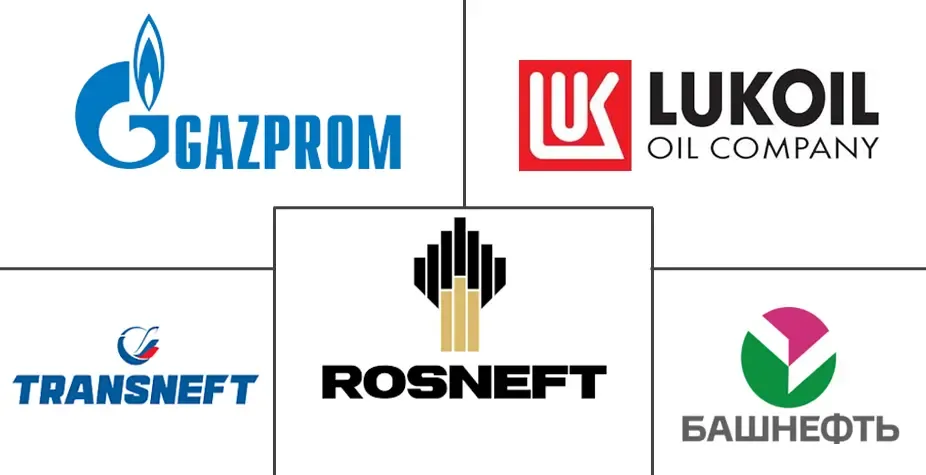

## Table of Contents

## What are the major Russian oil and natural gas companies?

Russia has several major companies that focus on oil and natural gas. The biggest one is Gazprom, which is known all over the world. Gazprom mainly deals with natural gas. They find it, produce it, and send it to many countries. Another big company is Rosneft. Rosneft is very important for oil. They explore for oil, take it out of the ground, and sell it.

There are also other important companies. Lukoil is one of them. Lukoil works with both oil and gas, but they are more known for oil. They operate in many countries, not just Russia. Another company is Novatek. Novatek is also big in natural gas. They are growing fast and becoming more important in the industry.

These companies are very important for Russia's economy. They help Russia sell oil and gas to other countries and make a lot of money. They also help Russia have a big say in the world's energy market.

## What is the history of oil and gas exploration in Russia?

The history of oil and gas exploration in Russia started a long time ago, in the late 1800s. The first big oil field was found in 1864 near Baku, which is now in Azerbaijan but was part of the Russian Empire back then. This discovery led to a lot of drilling and oil production in the area. By the early 1900s, Russia was one of the top oil producers in the world. After the Russian Revolution in 1917, the Soviet government took control of the oil industry. They focused on finding more oil and gas within the country, especially in places like the Volga-Urals region, which became a major oil-producing area.

In the 1960s and 1970s, the Soviet Union started exploring for oil and gas in Siberia, a very cold and tough area. They found huge amounts of oil and gas there, especially in West Siberia. This helped the Soviet Union become one of the biggest oil and gas producers in the world. After the Soviet Union broke up in 1991, Russia kept most of these oil and gas resources. The Russian government started to work with big companies like Gazprom and Rosneft to explore and produce more oil and gas. Today, Russia is still a major player in the global oil and gas market because of these efforts.

## How do these companies contribute to the global energy market?

Russian oil and gas companies like Gazprom, Rosneft, Lukoil, and Novatek are very important in the global energy market. They find and produce a lot of oil and gas. This oil and gas is then sent to many countries around the world. Gazprom, for example, sends natural gas to Europe and other places. This helps these countries meet their energy needs. Rosneft and Lukoil also send a lot of oil to different parts of the world, helping to keep the global oil market stable.

These companies also help Russia have a big say in the energy market. By controlling a large part of the world's oil and gas supply, Russia can influence prices and how much oil and gas is available. This can affect how much people pay for energy and how countries plan their energy use. Because of this, Russian oil and gas companies are watched closely by other countries and energy experts around the world.

## What are the key operations and infrastructure of these companies?

Gazprom, one of the biggest Russian companies, focuses on natural gas. They find gas in places like Siberia, get it out of the ground, and then send it to Europe and other countries through pipelines. Gazprom owns a huge network of pipelines that stretch thousands of miles. They also have gas storage sites to keep the gas safe until it's needed. Gazprom works with other companies to explore new places for gas and to build more pipelines.

Rosneft and Lukoil are important for oil. They explore for oil in Russia and other countries, drill wells to get the oil out, and then refine it into things like gasoline. Rosneft has big oil fields in Siberia and the Far East of Russia. They also own refineries and send oil to many countries using ships and pipelines. Lukoil works in places like the Caspian Sea and West Siberia. They also have refineries and sell oil products around the world.

Novatek is growing fast and focuses on natural gas. They find and produce gas in places like the Yamal Peninsula in Siberia. Novatek builds special ships called LNG carriers to send the gas to other countries. They also work with other companies to build more gas plants and explore new areas. All these companies have a lot of workers, big machines, and special technology to do their jobs well.

## How do Russian oil and natural gas companies impact the Russian economy?

Russian oil and natural gas companies are very important for the Russian economy. They make a lot of money by finding and selling oil and gas. This money helps the Russian government pay for things like schools, roads, and hospitals. The money also helps people in Russia have jobs. Many people work for these companies, and they earn money to buy things they need. This makes the whole economy stronger.

These companies also help Russia trade with other countries. When Russia sells oil and gas to other countries, it earns money from those countries. This is called export earnings, and it's a big part of Russia's money coming in. The more oil and gas Russia can sell, the more money it can make. This helps Russia's economy grow and stay strong. But if the prices of oil and gas go down, it can be hard for Russia's economy.

## What are the environmental impacts of these companies' operations?

The operations of Russian oil and natural gas companies have big impacts on the environment. When they drill for oil and gas, they can harm the land and water. Drilling can cause oil spills, which can kill plants and animals and make the water dirty. The companies also build big pipelines to move the oil and gas. These pipelines can leak, causing more harm to the environment. The land where they drill and build can be destroyed, and it can be hard for nature to recover.

These companies also add to the problem of climate change. When they take oil and gas out of the ground and burn it, it releases a lot of gases like carbon dioxide into the air. These gases make the earth warmer, which can cause problems like melting ice and more storms. The companies also sometimes burn off extra gas, which is called flaring. This adds more bad gases to the air. Even though these companies are trying to be more careful, their work still has a big impact on the environment.

## How do geopolitical factors influence these companies?

Geopolitical factors have a big impact on Russian oil and gas companies. Russia uses its oil and gas to make friends with other countries and to have power in the world. For example, Russia sends a lot of gas to Europe. This makes Europe depend on Russia for energy. If there are problems between Russia and other countries, Russia might use its oil and gas to try to get what it wants. This can cause tension and disagreements.

Also, other countries can put rules or sanctions on Russian oil and gas companies. These rules can make it harder for the companies to sell their oil and gas. For example, if a country thinks Russia is not behaving well, it might stop buying Russian oil or gas. This can hurt the Russian companies and the Russian economy. The companies have to be careful and plan for these problems. They might need to find new places to sell their oil and gas or work with different countries.

## What are the major challenges faced by Russian oil and gas companies?

Russian oil and gas companies face many challenges. One big challenge is the changing prices of oil and gas. When prices go down, it's hard for these companies to make money. They have to spend a lot to find and get oil and gas out of the ground. If they can't sell it for enough money, they lose money. Another challenge is the tough places they have to work in, like Siberia. It's very cold there, and it's hard to build and keep machines working. This makes it more expensive and risky to find and produce oil and gas.

Another challenge is the rules and sanctions from other countries. Some countries don't want to buy Russian oil and gas because of political problems. This makes it hard for Russian companies to sell their products and make money. They have to find new places to sell their oil and gas, which can be difficult. Also, there are more rules about protecting the environment. These rules can make it harder and more expensive for the companies to work. They have to find ways to be safer and cleaner, which can be a big challenge.

Lastly, there is the challenge of new technology and competition. Other countries are finding new ways to get energy, like wind and solar power. This can make less people want to buy oil and gas. Russian companies have to keep up with new technology to stay competitive. They also have to deal with other oil and gas companies around the world that are trying to sell their products. All these challenges make it hard for Russian oil and gas companies to keep growing and making money.

## How do these companies adapt to fluctuating oil and gas prices?

Russian oil and gas companies adapt to changing prices by being smart about how they spend money. When prices are high, they make more money and can spend it on finding new oil and gas. But when prices go down, they have to be careful. They might cut back on spending for new projects or try to find ways to make their old projects cheaper. They also might try to sell their oil and gas in new places where they can get a better price. This helps them keep making money even when prices are low.

Another way they adapt is by using special tools and ways to make their work more efficient. They use new technology to find oil and gas faster and cheaper. They also try to make their machines and pipelines work better so they don't waste money. Sometimes, they work together with other companies to share the cost of big projects. By doing these things, they can keep their business going strong, even when oil and gas prices go up and down.

## What role do these companies play in technological advancements in the energy sector?

Russian oil and gas companies are working hard to find new ways to do their jobs better. They use new technology to explore for oil and gas in tough places like Siberia. This helps them find oil and gas faster and cheaper. They also use special machines and tools to get the oil and gas out of the ground more easily. By doing this, they can make their work more efficient and save money.

These companies also help make pipelines and other ways to move oil and gas better. They use new technology to make sure their pipelines don't leak and to send oil and gas to more places. They also work on new ways to turn oil and gas into things like gasoline. By working on these new technologies, Russian companies help the whole energy industry get better and more advanced.

## How do Russian oil and gas companies engage in international partnerships and agreements?

Russian oil and gas companies work with other countries to grow their business and sell more oil and gas. They make agreements with companies from places like Europe, China, and India. These agreements help them share the cost of big projects and find new places to sell their oil and gas. For example, Gazprom might work with a German company to build a new pipeline to send gas to Europe. This helps both companies make more money and helps Russia have a bigger say in the energy market.

Sometimes, these partnerships help Russian companies get new technology and learn new ways to work. They might work with a company from another country that has special machines or knows how to find oil and gas in a new way. By working together, Russian companies can use this new technology to find more oil and gas and make their work safer and cleaner. These partnerships are important for Russian oil and gas companies to keep growing and staying strong in the global energy market.

## What are the future prospects and strategies for these companies in the global energy transition?

Russian oil and gas companies are looking at the future and seeing that the world is changing. More countries want to use clean energy like wind and solar power instead of oil and gas. This is called the global energy transition. To stay important, these companies are thinking about new ways to make money. They might start working on clean energy projects, like making hydrogen or using wind power. They also want to keep finding new oil and gas in places like the Arctic, but they know they need to be careful about the environment. They are trying to use new technology to make their work cleaner and safer.

Another big part of their plan is to keep working with other countries. They want to make more agreements with companies in Europe, China, and other places. These agreements can help them sell their oil and gas and also learn new ways to work. They might also start selling more oil and gas to countries in Asia, where demand is growing. By doing this, they can keep making money even as the world moves toward clean energy. They know they need to be smart and flexible to stay strong in the changing energy market.

## References & Further Reading

[1]: ["Algorithmic Trading and High-Frequency Trading"](https://assets.cambridge.org/97811070/91146/frontmatter/9781107091146_frontmatter.pdf) - Investopedia

[2]: Henderson, J., Phillips, P., & Powell, N. (2021). ["The Evolution of Algorithmic Trading in Global Markets: A Research Review."](https://www.taylorfrancis.com/books/mono/10.4324/9781315757230/handbook-training-evaluation-measurement-methods-jack-phillips-patricia-pulliam-phillips) Journal of Financial Markets.

[3]: Simola, H. (2018). ["Russia's Energy Policy and Its Impact on Global Energy Markets."](https://link.springer.com/chapter/10.1007/978-3-031-17057-7_6) Bank of Finland Institute for Economies in Transition (BOFIT).

[4]: ["Russian Oil and Gas Sector Update"](https://www.iea.org/articles/energy-fact-sheet-why-does-russian-oil-and-gas-matter) by Igor Danilenko - ResearchGate

[5]: Balmaceda, M. (2008). ["Energy Dependency, Politics and Corruption in the Former Soviet Union: Russia's Power, Oligarchs' Profits and Ukraine's Missing Energy Policy."](https://www.taylorfrancis.com/books/mono/10.4324/9780203934340/energy-dependency-politics-corruption-former-soviet-union-margarita-balmaceda) Routledge.

[6]: "The Sanctions on Russia: Impacts and Strategies". The International Energy Agency (IEA). Available at [https://www.iea.org/articles/sanctions-on-russia-impacts-and-strategies](https://onlinelibrary.wiley.com/doi/full/10.1155/2024/5548311)

[7]: "Rosneft and Gazprom: The global strategies of Russia’s energy giants." (2023) [https://www.oilandgastechnology.net/news/rosneft-gazprom-global-strategies-russia%E2%80%99s-energy-giants](https://www.oilandgastechnology.net/news/rosneft-gazprom-global-strategies-russia%E2%80%99s-energy-giants) 

[8]: "Algorithmic Trading in Energy Markets". The Journal of Energy Markets. (2023). [https://www.risk.net/journals/journal-of-energy-markets](https://www.researchgate.net/publication/376617284_Algorithmic_Trading_in_Energy_Markets_Navigating_the_Transition_to_Renewable_Resources)