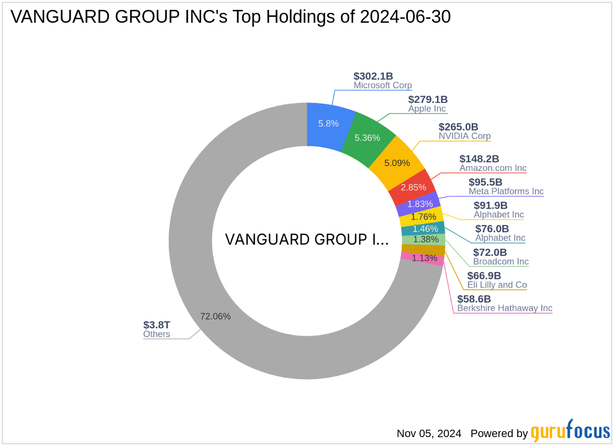

## Table of Contents

## What is a shareholder?

A shareholder is someone who owns shares in a company. When you buy shares, you become part-owner of that company. The more shares you have, the bigger your ownership is. Shareholders can be individuals or other companies. They often get to vote on important company decisions, like who should be on the board of directors.

Shareholders also have a chance to make money from their shares. If the company does well, the value of the shares can go up, and shareholders can sell their shares for more than they paid. Sometimes, companies also pay dividends, which are like little rewards for owning shares. These dividends are paid out regularly, usually from the company's profits. However, if the company does poorly, the value of the shares can go down, and shareholders might lose money.

## Who are the major shareholders of Chipotle?

The biggest shareholder of Chipotle is Pershing Square Capital Management, run by Bill Ackman. They own a lot of Chipotle's shares, around 10%. Bill Ackman and his team at Pershing Square have a big say in what happens at Chipotle because they own so many shares.

Other big shareholders include big investment companies like Vanguard Group and BlackRock. These companies own shares for lots of people who invest with them. They each own about 8% to 9% of Chipotle. So, they also have a big influence on the company, but not as much as Pershing Square.

## How much of Chipotle is owned by institutional investors?

A big part of Chipotle is owned by institutional investors. These are big companies like banks or investment firms that buy a lot of shares. They own around 90% of Chipotle. That's a huge amount! It means most of Chipotle is owned by these big groups, not by small individual people.

The biggest of these institutional investors is Pershing Square Capital Management. They own about 10% of Chipotle. Other big ones are Vanguard Group and BlackRock, each owning around 8% to 9%. These big investors have a lot of say in what happens at Chipotle because they own so many shares.

## What percentage of Chipotle is owned by insiders?

Insiders are people who work at Chipotle, like the CEO or other top managers. They own a small piece of the company. About 1% of Chipotle is owned by these insiders. That's not a lot compared to the big investors.

Even though it's a small percentage, it's still important. It shows that the people running the company believe in it and want to own part of it. But the big decisions are mostly made by the big investors who own most of the shares.

## Who is the largest individual shareholder of Chipotle?

The largest individual shareholder of Chipotle is Bill Ackman. He owns a big part of Chipotle through his company, Pershing Square Capital Management. They have about 10% of Chipotle's shares. That's a lot of shares, so Bill Ackman has a big say in what happens at Chipotle.

Bill Ackman is known for being a smart investor. He looks for companies that he thinks can do well and then buys a lot of their shares. With Chipotle, he saw a chance to help the company grow and make it better. That's why he bought so many shares and became the biggest individual shareholder.

## How has the ownership structure of Chipotle changed over the past five years?

Over the past five years, the ownership structure of Chipotle has seen some changes, but the big picture has stayed mostly the same. Pershing Square Capital Management, led by Bill Ackman, has been the biggest shareholder all along. They still own about 10% of Chipotle. This shows that Bill Ackman and his team believe in Chipotle and want to keep a big part of it. Other big investors like Vanguard Group and BlackRock have also kept their shares steady, each owning around 8% to 9% of the company.

One small change is that the percentage of shares owned by insiders has gone down a bit. Five years ago, insiders owned about 2% of Chipotle, but now it's down to around 1%. This means that the people working at Chipotle own a little less of the company than they used to. Overall, though, the big investors still own most of Chipotle, with about 90% of the shares in the hands of institutional investors. This shows that the company is still mostly controlled by big investment groups.

## What impact do major shareholders have on Chipotle's corporate governance?

Major shareholders like Pershing Square Capital Management, Vanguard Group, and BlackRock have a big impact on how Chipotle is run. They own a lot of shares, so they get to vote on important things like who should be on the board of directors. The board of directors makes big decisions for the company, so these shareholders can help choose the people who will lead Chipotle. This means they can influence what the company does and how it grows.

Because these big investors own so much of Chipotle, they also talk a lot with the company's leaders. They can suggest new ideas or changes that they think will make Chipotle better. For example, they might want the company to open new stores or change the menu. Since they own so many shares, Chipotle's leaders often listen to what they say. This helps the big shareholders make sure the company is doing well and making choices that they agree with.

## How do Chipotle's major shareholders influence its strategic decisions?

Chipotle's major shareholders, like Pershing Square Capital Management, Vanguard Group, and BlackRock, have a big say in the company's strategic decisions. They own a lot of shares, so they can vote on important things, like who should be on the board of directors. The board makes big choices for Chipotle, so these shareholders can help pick the people who will lead the company. This means they can guide what Chipotle does and how it grows.

These big investors also talk a lot with Chipotle's leaders. They can suggest new ideas or changes they think will make the company better. For example, they might want Chipotle to open new stores or change the menu. Because these shareholders own so many shares, Chipotle's leaders often listen to what they say. This helps the big shareholders make sure Chipotle is doing well and making choices they agree with.

## What are the voting rights associated with Chipotle's shares?

Each share of Chipotle gives the owner one vote. This means if you own more shares, you have more votes. Shareholders use these votes to decide on important things like who should be on the board of directors. The board makes big decisions for the company, so voting for them is a big deal.

At Chipotle's annual meeting, shareholders get to vote on these important issues. If you can't go to the meeting, you can still vote by sending in a proxy vote. This lets you tell the company how you want to vote without being there in person. The more shares you own, the more influence you have on these decisions.

## How do Chipotle's major shareholders benefit from the company's performance?

Chipotle's major shareholders benefit from the company's performance in a few ways. If Chipotle does well, the value of its shares can go up. This means that shareholders like Pershing Square Capital Management, Vanguard Group, and BlackRock can sell their shares for more money than they paid. This is a big reason why they want Chipotle to do well. They also get dividends sometimes. Dividends are like little rewards that Chipotle pays out to shareholders from its profits. So, if Chipotle makes more money, the shareholders can get bigger dividends.

Another way major shareholders benefit is by having a say in how Chipotle is run. Because they own a lot of shares, they can vote on important things like who should be on the board of directors. The board makes big decisions for Chipotle, so by choosing the board, shareholders can help guide the company in a way that they think will make it successful. This can lead to better performance and more money for them in the long run.

## What are the recent trends in shareholder activism at Chipotle?

In the last few years, shareholder activism at Chipotle has been pretty quiet. The big shareholders like Pershing Square Capital Management, led by Bill Ackman, have been more focused on working with Chipotle's leaders to make the company better. They talk a lot with the company to suggest new ideas and changes. This kind of working together has helped Chipotle grow and improve without much public fighting or big demands from shareholders.

However, there have been some small signs of activism. Some shareholders have pushed for more transparency about how Chipotle is doing with things like food safety and sustainability. They want to know more about how the company is working on these important issues. Even though these demands haven't been loud or aggressive, they show that shareholders are still keeping an eye on Chipotle and want to make sure it's doing the right things.

## How do analysts predict the future changes in Chipotle's shareholder composition?

Analysts think that Chipotle's shareholder composition might not change a lot in the future. The big investors like Pershing Square Capital Management, Vanguard Group, and BlackRock have been holding onto their shares for a while. They seem to believe in Chipotle and want to keep a big part of it. So, it's likely that these big investors will keep owning most of Chipotle. They might buy or sell a little bit of their shares, but overall, they are expected to stay as the main shareholders.

However, there could be some small changes. Some analysts think that more individual investors might start buying Chipotle shares. This could happen if Chipotle keeps doing well and more people want to own a piece of it. Also, if Chipotle starts paying bigger dividends or if the stock price goes up a lot, it might attract more investors. But even with these changes, the big investors are still expected to own most of Chipotle, keeping the overall shareholder composition pretty stable.

## References & Further Reading

[1]: Popper, N. (2012). Knight Capital Says Trading Glitch Cost It $440 Million. The New York Times. Retrieved from [https://www.nytimes.com/2012/08/03/business/knight-capital-says-trading-glitch-cost-it-440-million.html](https://archive.nytimes.com/dealbook.nytimes.com/2012/08/02/knight-capital-says-trading-mishap-cost-it-440-million/)

[2]: Kirilenko, A. A., Kyle, A. S., Samadi, M., & Tuzun, T. (2017). ["The Flash Crash: High-Frequency Trading in an Electronic Market."](https://onlinelibrary.wiley.com/doi/abs/10.1111/jofi.12498) The Journal of Finance, 72(3), 967-998.

[3]: ["Advances in Financial Machine Learning"](https://www.amazon.com/Advances-Financial-Machine-Learning-Marcos/dp/1119482089) by Marcos Lopez de Prado

[4]: ["Machine Learning for Algorithmic Trading"](https://github.com/stefan-jansen/machine-learning-for-trading) by Stefan Jansen

[5]: ["Quantitative Trading: How to Build Your Own Algorithmic Trading Business"](https://www.amazon.com/Quantitative-Trading-Build-Algorithmic-Business/dp/1119800064) by Ernest P. Chan