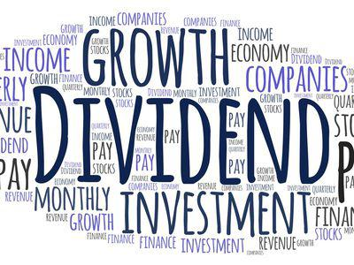

Algorithmic trading has emerged as a prominent element in modern financial markets, revolutionizing the way trading activities are executed. This advancement leverages complex mathematical models and sophisticated software to automate the buying and selling of stocks at speeds unattainable by human traders. As a result, algorithmic trading can process vast amounts of market data in real time, offering a strategic edge to investors seeking to optimize their portfolios.

For companies such as Chipotle Mexican Grill, algorithmic trading represents a significant opportunity for investors. As Chipotle continues its robust growth trajectory, its stocks have captured the attention of both individual and institutional investors aiming to capitalize on this potential. In an environment where split-second decisions can translate into substantial financial gains or losses, algorithmic trading provides a mechanism for executing trades with enhanced precision and reduced latency.

By integrating algorithmic trading strategies, Chipotle investors stand to gain valuable insights into market trends and stock performance dynamics. These methodologies allow for the efficient management of large volumes of trades, benefiting from the ability to adapt rapidly to market fluctuations. Consequently, investors who effectively harness algorithmic trading algorithms can potentially enhance return on investments while mitigating risks associated with emotional trading decisions.

This article endeavors to equip Chipotle investors with a deeper comprehension of how algorithmic trading can affect their investment outcomes and overall shareholder value. By demystifying the intricacies of this technologically driven approach, investors can make informed decisions concerning their involvement with Chipotle's stock. Through a careful analysis of the contributions and impacts of algorithmic trading, shareholders can strategically position themselves to benefit from its enhanced trading capabilities.

## Table of Contents

## Understanding Algorithmic Trading

Algorithmic trading, commonly known as algo trading, employs computer-based algorithms to handle the trading of stocks and other financial instruments. The primary advantage of this approach lies in its ability to process and analyze vast datasets with remarkable speed, thereby enabling traders to execute buy and sell orders more efficiently compared to human capabilities.

These algorithms are designed to identify patterns and trends within the financial markets, using historical data and statistical models to make informed predictions about future price movements. This analysis is conducted at such a high speed that it leverages even the smallest discrepancies in stock prices, often in mere microseconds. By capitalizing on these minute market inefficiencies, algo trading can potentially lead to higher profitability for traders.

Initially, [algorithmic trading](/wiki/algorithmic-trading) was predominantly the purview of large financial institutions, such as hedge funds and investment banks, which possessed the necessary technology and data infrastructure. However, advancements in computing power and the democratization of technology have made algo trading increasingly accessible to individual investors and smaller firms. This has opened new avenues for retail investors to participate in markets that were once dominated by institutional players.

A significant feature of algo trading is its ability to manage risk more effectively than traditional methods. By systematically applying predetermined rules, algorithms can react swiftly to changing market conditions, ensuring that trading strategies remain aligned with the investor’s risk appetite and investment goals. This is achieved without the need for continuous human oversight, reducing the likelihood of emotional decision-making, which can often lead to suboptimal trading outcomes.

Furthermore, algo trading is adept at optimizing trading strategies. It can automatically make adjustments to the trading parameters to optimize for consistent returns or to mitigate losses. This adaptability ensures that trading strategies remain relevant across different market cycles. In this way, algo trading serves as a valuable tool for investors aiming to enhance their market engagement through precision and efficiency.

## Benefits of Algorithmic Trading for Chipotle Shareholders

For Chipotle investors, algorithmic trading presents several notable advantages that can enhance trading outcomes and potentially improve shareholder returns. One significant benefit is increased trading precision. Algorithms can process and analyze vast amounts of market data at speeds unattainable by humans, enabling precise execution of trades. This precision minimizes slippage—the difference between the expected price of a trade and the actual price—and reduces transaction costs, allowing investors to retain more of their profits.

Shareholders also gain an advantage through the rapid adaptability of algorithms to market changes. Unlike traditional methods that might rely on slower, manual interventions, algorithms can instantly respond to evolving market conditions. This capability provides a potential edge, especially in volatile markets, where swift decision-making is crucial to capitalizing on emerging opportunities or mitigating risks.

Furthermore, algorithmic trading facilitates high-frequency trading ([HFT](/wiki/high-frequency-trading-strategies)), a strategy that leverages the ability of computers to execute thousands of trades in fractions of a second. Through HFT, investors can exploit small price discrepancies in the market that are typically overlooked in conventional trading approaches. Although these price movements are minor, the cumulative effect of capitalizing on such fluctuations can significantly impact returns over time.

Another important aspect of algorithmic trading is its potential to reduce the influence of emotional biases on decision-making. By automating trades based on predefined criteria and strategies, investors can adhere to a disciplined approach, minimizing impulsive decisions driven by market sentiment. This objectivity is particularly beneficial in maintaining consistency in trading performance.

In conclusion, algorithmic trading equips Chipotle shareholders with tools for enhanced trading precision, cost efficiency, rapid adaptation to market dynamics, and reduced emotional influence, all of which contribute to improved investment decision-making and, ultimately, potential increases in shareholder value.

## Challenges and Risks Involved

Algorithmic trading, while offering numerous benefits, is not without its significant challenges and risks that investors must carefully navigate. Technical glitches are perhaps one of the most daunting issues, as errors in the algorithm can result in substantial financial losses. These glitches may stem from coding errors, system failures, or unforeseen interactions between different algorithms, leading to incorrect order placements or executions. A historical example is the 2012 incident with Knight Capital, where a software glitch resulted in a $440 million loss in under an hour, emphasizing the catastrophic potential of such failures (Popper, 2012).

Rapid and unpredictable market conditions pose another challenge. Algorithms are typically designed to operate within specific parameters and rely on historical data to predict future movements. However, markets can be influenced by unforeseen events, such as political changes or natural disasters, which might exceed the predictive capabilities of these systems. An algorithm that fails to adapt to these abrupt changes can execute trades that might not align with the current market reality, potentially causing substantial financial damage.

Moreover, the high-frequency nature of algorithmic trading introduces the risk of increased market [volatility](/wiki/volatility-trading-strategies). Given the [volume](/wiki/volume-trading-strategy) of trades executed in milliseconds, any systemic issue can propagate quickly and magnify market swings. This phenomenon, sometimes referred to as a "flash crash," can result in severe short-term price distortions, as observed during the Flash Crash of 2010 when the Dow Jones Industrial Average plummeted almost 1,000 points in mere minutes before recovering just as quickly (Kirilenko et al., 2017).

To mitigate these risks, robust risk management practices are essential. Investors should institute comprehensive [backtesting](/wiki/backtesting) procedures, rigorous stress testing, and real-time monitoring to ensure algorithms are both effective and adaptable. It's crucial to implement circuit breakers within trading algorithms that pause trading under extreme volatility to prevent excessive losses. Additionally, maintaining diversified trading strategies can help distribute risk, reducing the impact of any one strategy's failure.

In conclusion, while algorithmic trading offers a competitive edge through speed and efficiency, the inherent challenges and risks necessitate careful planning and continuous oversight. By understanding and managing these variables, investors can leverage algorithmic trading more effectively while safeguarding their investments against potential pitfalls.

**References**

- Popper, N. (2012). Knight Capital Says Trading Glitch Cost It $440 Million. The New York Times. Retrieved from [https://www.nytimes.com](https://www.nytimes.com/2012/08/03/business/knight-capital-says-trading-glitch-cost-it-440-million.html)
- Kirilenko, A. A., Kyle, A. S., Samadi, M., & Tuzun, T. (2017). The Flash Crash: High‐Frequency Trading in an Electronic Market. *The Journal of Finance*, 72(3), 967-998.

## The Role of Institutional Shareholders

Institutional shareholders such as Vanguard Group and BlackRock wield significant influence on Chipotle's stock through their substantial holdings and strategic trading activities. These institutions employ advanced algorithmic trading systems to manage and optimize their large portfolios efficiently. Algorithmic trading allows them to execute large trades at optimal times, reduce market impact, and achieve favorable transaction prices, which can result in more advantageous outcomes for their investors.

The algorithms used by these institutional investors analyze market data, including price movements, trading volumes, and historical trends, to make quick, data-driven decisions. An example of a typical algorithm might involve statistical [arbitrage](/wiki/arbitrage), where the algorithm identifies price inefficiencies between correlated assets and exploits them for profit. This not only allows institutions to manage their exposure effectively but also enables them to adapt rapidly to market changes.

When an institutional shareholder like Vanguard or BlackRock makes significant trades in Chipotle's stock, the sheer volume of transactions can lead to noticeable shifts in the stock’s market price and trend. This is particularly impactful in a highly liquid stock such as Chipotle, where large buy or sell orders can push prices up or down, affecting short-term market dynamics. Retail investors, who often do not have access to the same level of data or trading technology, need to be aware of these dynamics.

Aligning strategies with institutional behaviors can potentially help individual investors enhance their own trading outcomes. By monitoring the trading patterns of large institutional shareholders, retail investors can gain insights into potential future movements of Chipotle’s stock. For instance, if Vanguard or BlackRock increase their holdings, it may suggest a positive outlook for the stock, providing useful information for bullish strategies.

Moreover, understanding the regulatory environment in which these large institutional trades occur is crucial. Institutions are subject to numerous trading regulations designed to maintain market stability and protect investors. This regulatory oversight can sometimes limit their trading strategies, adding a layer of complexity that retail investors should consider when evaluating the influence of institutional shareholders on Chipotle's stock performance.

In conclusion, the activities of institutional shareholders like Vanguard Group and BlackRock have a potent impact on Chipotle’s stock due to their use of algorithmic trading systems. Retail investors can benefit from staying informed about these movements and aligning their trading strategies accordingly, considering both the opportunities and challenges presented by institutional trades.

## Conclusion

Algorithmic trading represents a significant advancement for Chipotle investors seeking to refine their trading approaches. This method offers a suite of advantages, such as improved precision and efficiency in executing trades. However, investors must exercise caution, bearing in mind the inherent risks associated with algorithmic trading. These risks include technical failures and heightened market volatility, which could adversely impact investment outcomes. 

To effectively leverage the benefits of algorithmic trading, Chipotle shareholders should remain informed about the latest developments in trading algorithms and risk management strategies. By maintaining awareness, they equip themselves to proactively manage their investment portfolios, potentially enhancing decision-making processes and minimizing the influence of emotional biases.

Ultimately, the strategic implementation of algorithmic trading can serve as a powerful tool for investors, aiding in the optimization of returns and strengthening Chipotle's stock performance over time. Investors who adeptly integrate these automated trading systems into their strategies may achieve more robust financial outcomes, contributing positively to their investment portfolios and Chipotle's market success.

## References & Further Reading

[1]: Popper, N. (2012). Knight Capital Says Trading Glitch Cost It $440 Million. The New York Times. Retrieved from [https://www.nytimes.com/2012/08/03/business/knight-capital-says-trading-glitch-cost-it-440-million.html](https://archive.nytimes.com/dealbook.nytimes.com/2012/08/02/knight-capital-says-trading-mishap-cost-it-440-million/)

[2]: Kirilenko, A. A., Kyle, A. S., Samadi, M., & Tuzun, T. (2017). ["The Flash Crash: High-Frequency Trading in an Electronic Market."](https://onlinelibrary.wiley.com/doi/abs/10.1111/jofi.12498) The Journal of Finance, 72(3), 967-998.

[3]: ["Advances in Financial Machine Learning"](https://www.amazon.com/Advances-Financial-Machine-Learning-Marcos/dp/1119482089) by Marcos Lopez de Prado

[4]: ["Machine Learning for Algorithmic Trading"](https://github.com/stefan-jansen/machine-learning-for-trading) by Stefan Jansen

[5]: ["Quantitative Trading: How to Build Your Own Algorithmic Trading Business"](https://www.amazon.com/Quantitative-Trading-Build-Algorithmic-Business/dp/1119800064) by Ernest P. Chan