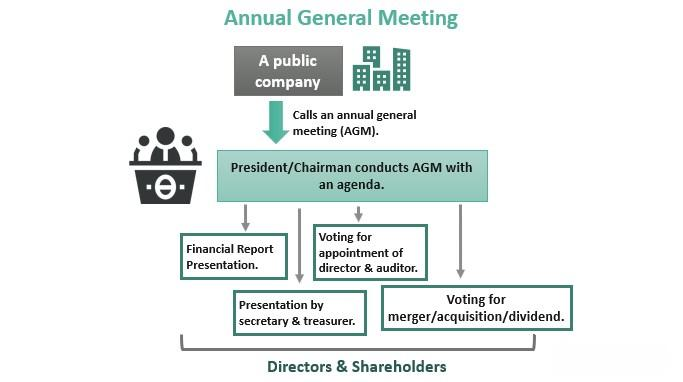

General Motors (GM) stands as a cornerstone of the global automotive industry, establishing its reputation through decades of innovation, resilience, and growth. Founded in 1908, GM has evolved into one of the largest automobile manufacturers worldwide, with a diverse portfolio of brands that include Chevrolet, Cadillac, GMC, and Buick. As a major player, GM is not only pivotal in shaping industry trends but also in pioneering technologies, such as electric vehicles (EVs) and autonomous driving systems. These innovations underscore GM’s commitment to sustainable transportation and contribute significantly to its investment appeal.

For investors and shareholders, GM represents more than just an automobile manufacturer; it is a bellwether for the automotive sector's health and dynamism. The company's strong market presence, extensive product range, and ongoing technological advancements provide a myriad of investment opportunities. Key stakeholders include individual shareholders, institutional investors, and executive insiders, all of whom influence and drive GM’s strategic direction. Their involvement is crucial, particularly as GM navigates challenges such as market competition, regulatory changes, and evolving consumer preferences. Investment in GM is often seen as a long-term commitment due to its potential for growth and resilience in overcoming setbacks.



Parallel to the dynamic landscape of the automotive industry is the rapid growth of algorithmic trading in financial markets. Algorithmic trading employs computer algorithms to execute trades at speeds and frequencies beyond human capability, transforming how stocks are bought and sold. Key features include precision, efficiency, and the ability to process vast amounts of data in real-time. The proliferation of algorithmic trading is largely driven by the advancement of technology and data analytics, underscoring its burgeoning role in modern finance.

This article aims to explore the intersection of GM as a viable investment opportunity and the transformative impact of algorithmic trading on its stock. We will analyze how algorithmic strategies could influence GM's market valuation, volatility, and liquidity. Additionally, we will provide insights into how traditional investors can adjust their strategies in this automated trading environment. As algorithmic trading continues to revolutionize the stock market, understanding its implications on GM’s stock can offer valuable investment strategies for shareholders.

## Table of Contents

## Understanding General Motors (GM)

General Motors (GM) stands as a cornerstone of the automotive industry, with a rich history dating back to its establishment in 1908. Founded by William C. Durant in Flint, Michigan, GM rapidly expanded by acquiring several smaller car companies and became a dominant force in the U.S. automotive sector. Its early success was marked by the introduction and popularization of iconic brands such as Chevrolet, Cadillac, and Buick. 

A significant milestone in GM's history was its initial public offering (IPO) in 1916, which facilitated major capital acquisition and laid the groundwork for future expansion. However, the company's journey has not been without its challenges. In 2009, GM filed for Chapter 11 bankruptcy, a consequence of the global financial crisis and declining sales. The restructuring process was supported by a U.S. government bailout, amounting to $49.5 billion, which enabled GM to emerge from bankruptcy within 40 days and begin its recovery. By 2010, GM had returned to the stock market with a successful IPO, raising $20.1 billion, one of the largest in U.S. history.

Today, GM commands a significant share of the global automotive market, producing vehicles under various brand names, including Chevrolet, GMC, Cadillac, and Buick. With advancements in electric vehicle technology, GM has committed substantial resources towards the development and production of electric cars, primarily through its Chevrolet Bolt EV and initiatives like the Ultium platform. Additionally, GM's focus on autonomous vehicle technology is highlighted by its investment in Cruise, a subsidiary dedicated to autonomous vehicle innovation.

Leadership has played a critical role in navigating GM's strategic direction, particularly under the guidance of CEO Mary Barra since 2014. Barra has been instrumental in streamlining operations, emphasizing sustainability, and steering GM towards a future with zero crashes, zero emissions, and zero congestion. The company's strategic shifts and operational efficiencies have attracted significant investments from institutional investors such as BlackRock and Vanguard Group, which hold substantial shares and exert substantial influence over corporate policies.

Institutional investors have been pivotal in shaping GM's strategic priorities, driving the company to focus on long-term sustainability and shareholder value. These investors often advocate for governance practices that ensure transparency and accountability, thereby influencing GM's policymaking and strategic initiatives. 

In conclusion, General Motors remains a formidable entity in the automotive sector, balancing its storied past with forward-looking strategies geared towards innovation and sustainability. Through resilient leadership and strategic partnerships with institutional investors, GM continues to position itself as a leader in the future of mobility.

## General Motors: A Closer Look at Investors and Shareholders

General Motors (GM) attracts a diverse group of investors and shareholders, including both individual insiders and significant institutional investors, each playing a critical role in shaping the company's strategic direction.

Individual insider shareholders are crucial to GM's internal decision-making process. Among them, Mary Barra, GM's Chairman and CEO, is a prominent figure. Since assuming her role in 2014, Barra has been instrumental in driving GM's transformation towards electric vehicles (EVs) and autonomous technologies. Her leadership and insider ownership signify her vested interest in the company's long-term vision and performance. Mark Reuss, another key insider, serves as GM's President, overseeing product innovation and global operations. His insights and stakes in GM reflect his commitment to advancing the firm's competitiveness in the automotive sector.

On the institutional front, GM's shareholder base includes prominent investment management firms such as BlackRock, Vanguard Group, and Capital Research Global Investors. These institutional investors hold substantial stakes in GM, leveraging their financial clout to influence the firm's strategic direction. BlackRock, known for its emphasis on sustainable investing, often advocates for GM's initiatives in EV development and corporate responsibility. Similarly, Vanguard Group, with its vast array of index funds, aligns GM’s success with broader market indices, reflecting the health of both the company and the automotive industry at large. Capital Research Global Investors also plays a significant role, driving corporate governance and investment strategies that prioritize shareholder value.

The motivations of these investors range from pursuing long-term capital appreciation and dividends to advancing environmental, social, and governance ([ESG](/wiki/esg-investing)) principles. Their influence extends to policymaking at GM, where institutional investors, in particular, can sway corporate strategies through shareholder voting rights and board appointments. This dynamic ensures that GM's leadership remains aligned with the evolving priorities and expectations of its diverse investor base, driving the company towards innovation and profitability while balancing sustainability and stakeholder interests.

## Algorithmic Trading: Revolutionizing the Stock Market

Algorithmic trading, often referred to as algo trading, leverages computer algorithms to execute trades in financial markets at high speeds and volumes unachievable by human traders. This approach primarily relies on complex mathematical models and precise data analysis to make trading decisions.

The key features of [algorithmic trading](/wiki/algorithmic-trading) include its speed, accuracy, and ability to process vast amounts of data rapidly. Algorithms are designed to analyze a multitude of market conditions, such as price, timing, and [volume](/wiki/volume-trading-strategy), ensuring optimal execution. These algorithms can operate on predefined criteria or adapt to changing market conditions using [machine learning](/wiki/machine-learning) techniques.

### Impact on Market Dynamics

Algorithmic trading has significantly influenced traditional market dynamics. By handling massive volumes of trades efficiently, it enhances market [liquidity](/wiki/liquidity-risk-premium), which can lower transaction costs for investors. Additionally, algo trading can lead to more efficient price discovery, as it often corrects price discrepancies faster than human traders.

However, this type of trading can also introduce [volatility](/wiki/volatility-trading-strategies), particularly when multiple algorithms react to market changes simultaneously, leading to rapid price swings. Instances like the "Flash Crash" of 2010 underscore how high-frequency trading algorithms, a subset of algo trading, can exacerbate market instability.

### Advantages and Challenges

The advantages of algorithmic trading are numerous. It minimizes human intervention, thereby reducing the risk of emotional trading decisions. It also allows for the [backtesting](/wiki/backtesting) of trading strategies using historical data, granting traders insights into potential outcomes before risking capital.

Despite these benefits, algorithmic trading faces challenges. Developing and maintaining sophisticated algorithms demand significant computational resources and expertise. Moreover, the reliance on technology makes it susceptible to system failures and cyber threats. Regulatory scrutiny is another critical area, with authorities emphasizing the need for transparency and the mitigation of market manipulation risks.

### Common Algorithmic Trading Strategies

Several algorithmic trading strategies dominate the landscape:

1. **Trend Following**: This strategy capitalizes on ongoing market trends using technical indicators such as moving averages to generate buy or sell signals.

2. **Arbitrage**: Algorithms seek to exploit price discrepancies between different markets or instruments, buying at a lower price in one market and selling at a higher price in another.

3. **Mean Reversion**: Based on the statistical premise that asset prices will revert to their mean over time, this strategy buys stocks that have fallen and sells stocks that have risen relative to historical averages.

4. **Market Making**: Algorithms place simultaneous buy and sell orders to profit from the bid-ask spread, providing liquidity to the market.

5. **Statistical Arbitrage**: This approach employs mathematical models to identify mispriced securities within the same sector or market, hedging risks while exploiting price differences.

In summary, algorithmic trading is a transformative force in financial markets, characterized by its efficiency, advanced modeling, and adaptability. While it offers substantial benefits, the associated challenges necessitate well-crafted strategies and robust risk management measures.

## Impacts of Algorithmic Trading on GM Stock

Algorithmic trading has become a significant [factor](/wiki/factor-investing) influencing the stock market, and its effects on General Motors (GM) stock provide a tangible case study of its impact. First introduced in the late 1980s, algorithmic trading uses computer programs to execute trades based on pre-defined criteria, enabling rapid and efficient transactions. This method has altered market dynamics and greatly influenced GM's stock movements.

### Historical Trends in GM Stock Movements

The impact of algorithmic trading on GM stock can be seen through its historical trend patterns. Before the adoption of algorithmic trading, stock movements were primarily influenced by [fundamental analysis](/wiki/fundamental-analysis) and macroeconomic factors. However, with the rise of algorithmic trading, there is increased sensitivity to short-term market fluctuations, often leading to heightened volatility.

### Case Studies: Algorithmic Trading and GM's Market Valuation

Algorithmic trading strategies, such as [momentum](/wiki/momentum) trading, [arbitrage](/wiki/arbitrage), and mean reversion, affect GM's market valuation. For instance, during announcements of quarterly earnings or product launches, algorithmic trading can trigger rapid price changes. These fluctuations are often amplified by high-frequency trading ([HFT](/wiki/high-frequency-trading-strategies)) algorithms, which react to press releases and news with minimal time lags.

A notable example occurred during GM's announcement of its electric vehicle (EV) strategy. Algorithmic trading intensified the immediate market response due to its ability to parse and act on press release data in milliseconds. Consequently, GM's stock experienced swift, substantial fluctuations, underlining the role of algorithmic strategies in current trading environments.

### Volatility and Liquidity in an Algorithm-Driven Market

Algorithmic trading contributes to both the volatility and liquidity of GM stock. The speed and volume of trades conducted by algorithms can lead to sharp price swings, sometimes detached from GM's intrinsic value. Algorithm-driven markets thus exhibit increased volatility, creating challenges for traditional investors.

However, algorithmic trading also enhances market liquidity by increasing trading frequency. This increased liquidity ensures tighter bid-ask spreads and more efficient price discovery for GM shares, providing benefits to all market participants by potentially reducing transaction costs.

### Future Predictions for GM Stock

As algorithmic trading grows, its influence on GM's stock is expected to increase. Predictive analytics and [artificial intelligence](/wiki/ai-artificial-intelligence) are poised to refine algorithmic strategies further, possibly leading to even quicker adaptations to market conditions. Moreover, as retail investors gain access to algorithmic trading tools, the democratization of its effects could see broader impacts on GM stock.

In conclusion, algorithmic trading represents both a challenge and an opportunity for GM shareholders. While it introduces greater volatility, it also provides enhanced liquidity, which can be advantageous. Stakeholders must adapt investment strategies to navigate the increasingly dynamic market landscape shaped by these technological advancements.

## Strategies for GM Investors and Shareholders in the Age of Algorithmic Trading

In the evolving landscape of stock markets heavily influenced by algorithmic trading, investors and shareholders of General Motors (GM) need to adapt their strategies to achieve favorable outcomes. This section provides actionable insights for traditional investors seeking to navigate this sophisticated environment, enhance their returns, manage risks, and leverage technology and data-driven analysis effectively.

### Tips for Traditional Investors in an Algorithmically Influenced Market

1. **Stay Informed and Educated**: Investors should ensure they are up-to-date with the latest developments in algorithmic trading technology. This includes understanding how algorithms can affect stock prices rapidly and often unpredictably. Continuous education through financial news, research papers, and market analysis is crucial.

2. **Diversification**: Algorithmic trading can introduce volatility into the market. To mitigate risks, investors should diversify their portfolios across different asset classes and industries. This not only spreads risk but also capitalizes on market movements that might be favorable in one sector while another faces declines.

3. **Adopt a Long-term Perspective**: While algorithmic trading often leads to short-term price fluctuations, maintaining a long-term investment horizon can help investors remain focused on the underlying fundamentals of GM and the broader automotive industry rather than transitory market noise.

### Investment Strategies to Maximize Returns from GM Stocks

1. **Value Investing**: Identify and invest in undervalued GM stocks with strong potential for appreciation. This includes analyzing financial ratios such as the price-to-earnings (P/E) ratio, return on equity (ROE), and debt-to-equity ratio to assess valuation.

2. **Technical Analysis**: Use technical indicators such as moving averages, Bollinger Bands, and Relative Strength Index (RSI) to identify trends and potential buy/sell signals within the algorithm-influenced trading environment.

3. **Automated Trading Systems**: Leverage automated trading platforms that allow investors to set predefined rules for buying and selling GM stocks. These algorithms can execute trades based on technical indicators or news events, ensuring timely and emotion-free decision-making.

### Risk Management Techniques Tailored for Shares Subject to Algorithmic Trading

1. **Stop-Loss Orders**: Implement stop-loss orders to limit potential losses by automatically selling a stock when it reaches a predetermined price. This strategy can help manage downside risk in volatile markets.

2. **Hedging**: Utilize options and futures contracts to hedge against adverse price movements in GM stock. Options such as puts can provide insurance against falling stock prices, while futures can lock in prices for future transactions.

3. **Volatility Assessment**: Regularly assess market volatility using tools such as the Volatility Index (VIX). High volatility may warrant a reassessment of risk tolerance levels and portfolio adjustments.

### Leveraging Technology and Data Analysis for Informed Decision-Making

1. **Data Analytics**: Utilize advanced data analytics and machine learning models to process vast amounts of market data and derive actionable insights. Investors can use platforms like Python for data analysis, employing libraries such as pandas and NumPy to analyze trends and patterns.

   ```python
   import pandas as pd
   import numpy as np

   # Example: Analyzing GM stock data
   gm_data = pd.read_csv('gm_stock_data.csv')
   moving_average = gm_data['Close'].rolling(window=20).mean()  # 20-day moving average
   ```

2. **Sentiment Analysis**: Use sentiment analysis to gauge market perception and investor sentiments by analyzing news articles, social media, and financial reports. This can provide an edge in predicting stock movements, particularly in algorithm-influenced contexts where sentiment can drive rapid changes.

3. **Integration of AI Tools**: Incorporate artificial intelligence tools that can predict stock trends based on historical data and market indicators. Using AI models like neural networks can uncover complex patterns that traditional analysis might miss.

By implementing these strategies, GM investors and shareholders can better navigate the complexities introduced by algorithmic trading, enhancing their ability to achieve investment objectives and manage associated risks effectively.

## Conclusion

General Motors (GM) stands as a pivotal entity in both the automotive and investment markets. Since its inception in 1908, and through significant milestones such as its IPO, bankruptcy, and recovery, GM has continually evolved to maintain a formidable market position. This adaptability makes GM a notable consideration for investors, especially in light of its diverse offerings and strategic leadership.

The integration of algorithmic trading into the stock market has introduced a dynamic dimension to investing in GM. This technology-driven approach has reshaped market interactions, influencing trading practices and affecting stock valuations. GM shareholders, both individual insiders such as Mary Barra and Mark Reuss, and institutional powerhouses like BlackRock and Vanguard Group, play strategic roles in navigating these complexities. The motivations and influence of these stakeholders are crucial in understanding how GM adapts and thrives under the pressures of algorithmic intervention.

For investors, the evolving landscape presents both challenges and opportunities. The volatility and liquidity shifts in GM stock catalyzed by algorithmic trading necessitate a nuanced approach to investing. Traditional investors are encouraged to employ adaptive strategies that leverage technological tools and data analytics to make informed decisions. This includes risk management techniques specifically tailored for environments influenced by algorithmic trading.

Ultimately, GM's saga in the automotive industry and its robust investor base highlight its significance in the investment world. The interplay between GM shareholders and the forces of algorithmic trading underscores the importance of staying informed and agile. For investors seeking opportunities amidst these changes, a blend of strategic foresight and technological adoption will be key to maximizing returns in this dynamic financial landscape.

## References & Further Reading

[1]: Bergstra, J., Bardenet, R., Bengio, Y., & Kégl, B. (2011). ["Algorithms for Hyper-Parameter Optimization."](https://dl.acm.org/doi/10.5555/2986459.2986743) Advances in Neural Information Processing Systems 24.

[2]: ["Advances in Financial Machine Learning"](https://www.amazon.com/Advances-Financial-Machine-Learning-Marcos/dp/1119482089) by Marcos Lopez de Prado

[3]: ["Evidence-Based Technical Analysis: Applying the Scientific Method and Statistical Inference to Trading Signals"](https://www.amazon.com/Evidence-Based-Technical-Analysis-Scientific-Statistical/dp/0470008741) by David Aronson

[4]: ["Machine Learning for Algorithmic Trading"](https://github.com/stefan-jansen/machine-learning-for-trading) by Stefan Jansen

[5]: ["Quantitative Trading: How to Build Your Own Algorithmic Trading Business"](https://www.amazon.com/Quantitative-Trading-Build-Algorithmic-Business/dp/1119800064) by Ernest P. Chan