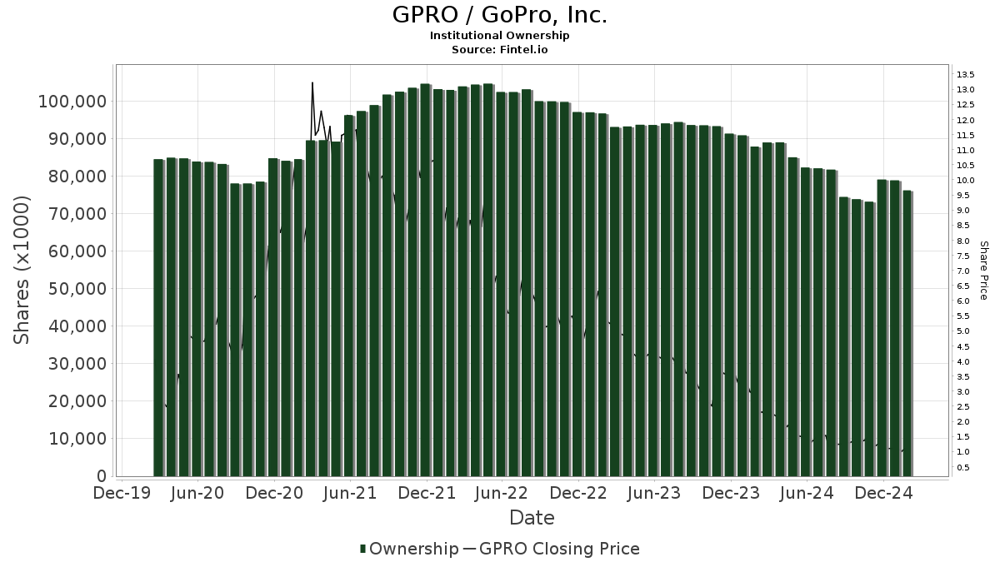

## Table of Contents

## What is a major shareholder?

A major shareholder is someone who owns a big part of a company's stock. When someone owns a lot of stock, it means they have a big say in how the company is run. Usually, if someone owns more than 5% or 10% of the company's stock, they are called a major shareholder.

Major shareholders can influence important decisions, like who should be on the board of directors or whether the company should merge with another company. Because they own so much stock, they want the company to do well so their stock value goes up. Sometimes, major shareholders are the founders of the company or big investment firms.

## Who are the current major shareholders of GoPro?

The biggest shareholder of GoPro right now is Nicholas Woodman, who started the company. He owns about 22% of GoPro's stock. Because he owns so much, he has a big say in how the company is run. He wants GoPro to do well because it makes his stock more valuable.

Another big shareholder is The Vanguard Group, which is an investment company. They own about 7% of GoPro's stock. They invest in many companies, and GoPro is one of them. They also want GoPro to do well so their investment grows.

## How much of GoPro's stock do these major shareholders own?

Nicholas Woodman, who started GoPro, owns about 22% of the company's stock. This makes him the biggest shareholder. Because he owns so much, he has a lot of power in deciding what GoPro does. He wants the company to do well because it makes his stock worth more money.

The Vanguard Group is another big shareholder of GoPro. They own about 7% of the stock. The Vanguard Group is an investment company that puts money into many different companies, including GoPro. They also want GoPro to succeed because it helps their investment grow.

## What is the role of institutional investors in GoPro?

Institutional investors, like The Vanguard Group, play a big role in GoPro. They own a lot of GoPro's stock, about 7% in the case of The Vanguard Group. This means they have a say in how GoPro is run. They want GoPro to do well because it makes their investment grow. Institutional investors often have teams of experts who study companies and decide where to invest money. This can help GoPro because these investors bring a lot of knowledge and resources to the table.

These investors also help GoPro by providing stability. When big investors like The Vanguard Group buy a lot of stock, it can make other people feel more confident about investing in GoPro too. This can help keep the stock price steady. Institutional investors also vote on important company decisions, like who should be on the board of directors. Their votes can influence what GoPro does in the future. So, institutional investors are important because they help guide and support GoPro's growth.

## How has the ownership of GoPro's major shareholders changed over the past year?

Over the past year, the ownership of GoPro's major shareholders has seen some changes. Nicholas Woodman, who started GoPro, still owns about 22% of the company's stock. His ownership has stayed pretty much the same, which means he still has a big say in how GoPro is run. He wants GoPro to do well because it makes his stock more valuable.

The Vanguard Group, another big shareholder, has also kept their ownership steady at around 7% of GoPro's stock. They are an investment company that puts money into many different companies, and GoPro is one of them. They want GoPro to succeed so their investment grows. Overall, the ownership of GoPro's major shareholders has not changed much over the past year, showing that they still believe in the company's future.

## What impact do major shareholders have on GoPro's corporate governance?

Major shareholders like Nicholas Woodman and The Vanguard Group have a big impact on GoPro's corporate governance. They own a lot of GoPro's stock, so they get to vote on important decisions. For example, they can vote on who should be on the board of directors. The board makes big decisions about how GoPro is run, so having a say in who is on the board is very important. Nicholas Woodman, who owns about 22% of the stock, has a lot of power because he can influence these votes a lot.

The Vanguard Group, with about 7% of the stock, also has a say in GoPro's governance. They might not have as much power as Nicholas Woodman, but they still have a voice. Institutional investors like The Vanguard Group often have teams of experts who study companies and help guide them. Their votes can help shape GoPro's future plans and strategies. Overall, major shareholders help make sure GoPro is run in a way that they think will make the company successful.

## How do major shareholders influence GoPro's strategic decisions?

Major shareholders like Nicholas Woodman and The Vanguard Group have a big say in GoPro's strategic decisions because they own a lot of the company's stock. Nicholas Woodman, who started GoPro, owns about 22% of the stock. This means he can influence big choices like whether GoPro should start making new products or if they should work with other companies. He wants GoPro to do well because it makes his stock worth more money.

The Vanguard Group, which owns about 7% of GoPro's stock, also has a say in these decisions. They are an investment company that puts money into many different companies, including GoPro. They want GoPro to succeed so their investment grows. Because they own so much stock, they can vote on important things like who should be on GoPro's board of directors. The board helps decide the company's big plans, so their votes matter a lot.

## What are the voting rights associated with GoPro's shares held by major shareholders?

Major shareholders like Nicholas Woodman and The Vanguard Group have voting rights because they own a lot of GoPro's stock. Nicholas Woodman owns about 22% of the stock, so he gets to vote on important things like who should be on the board of directors. The board makes big decisions about how GoPro is run, so his votes matter a lot. He wants GoPro to do well because it makes his stock worth more money.

The Vanguard Group owns about 7% of GoPro's stock, so they also get to vote on important decisions. They are an investment company that puts money into many different companies, including GoPro. They want GoPro to succeed so their investment grows. Even though they own less stock than Nicholas Woodman, their votes still help shape GoPro's future plans and strategies.

## How do insider ownership and major shareholders differ at GoPro?

Insider ownership at GoPro means that people who work at the company, like the CEO or other top executives, own some of the company's stock. These insiders, like Nicholas Woodman who started GoPro, have a big say in how the company is run because they own a lot of stock. Nicholas Woodman is both an insider and a major shareholder because he owns about 22% of GoPro's stock. Insiders want GoPro to do well because it makes their stock worth more money.

Major shareholders, on the other hand, can be anyone who owns a big part of GoPro's stock, not just people who work at the company. The Vanguard Group, for example, is a major shareholder but they are not insiders because they don't work at GoPro. They own about 7% of the stock and they want GoPro to succeed so their investment grows. Both insiders and major shareholders have voting rights and can influence important decisions, but insiders are more directly involved in running the company day-to-day.

## What is the historical performance of GoPro's stock in relation to changes in major shareholder positions?

GoPro's stock has gone up and down over the years, and sometimes these changes have been linked to what major shareholders do with their stock. For example, when Nicholas Woodman, who started GoPro, has kept his big ownership of about 22%, it has often made other people feel more confident about the company. This is because they see that he believes in GoPro and wants it to do well. When major shareholders like him don't sell their stock, it can help keep the stock price steady or even make it go up.

On the other hand, if major shareholders like The Vanguard Group, which owns about 7% of GoPro's stock, start buying more stock, it can also be a good sign for the stock price. More buying can push the stock price higher because it shows that big investors think GoPro has a bright future. But if major shareholders start selling a lot of their stock, it can make the stock price go down because it might look like they don't believe in GoPro anymore. Overall, the actions of major shareholders can have a big impact on how GoPro's stock does over time.

## How do major shareholders of GoPro engage with environmental, social, and governance (ESG) issues?

Major shareholders like Nicholas Woodman and The Vanguard Group can influence how GoPro deals with environmental, social, and governance ([ESG](/wiki/esg-investing)) issues because they own a lot of the company's stock. They can vote on things like who should be on the board of directors, and the board decides what GoPro does about ESG. For example, they might want GoPro to use less plastic in their products to help the environment, or they might want GoPro to treat their workers well, which is a social issue. By voting and talking to the board, major shareholders can make sure GoPro thinks about these important things.

The Vanguard Group, being an institutional investor, often cares a lot about ESG issues because they invest in many companies and want them all to be good for the world. They might use their voting power to push GoPro to do things like reduce waste or support community projects. Nicholas Woodman, as the founder, might also want GoPro to be a good company that people respect, so he might support ESG initiatives too. Both major shareholders can use their influence to make sure GoPro is not just making money, but also doing good things for the environment, society, and how the company is run.

## What are the potential risks and benefits for GoPro from its major shareholders' investment strategies?

The major shareholders of GoPro, like Nicholas Woodman and The Vanguard Group, can bring both benefits and risks to the company through their investment strategies. One big benefit is that when these major shareholders keep their stock or buy more, it can make other people feel more confident about GoPro. This can help keep the stock price steady or even make it go up. Also, because they own a lot of stock, they can vote on important decisions and help guide GoPro to do things that are good for the environment, society, and how the company is run. This can make GoPro a better company that people respect and want to invest in.

On the other hand, there are risks too. If major shareholders start selling a lot of their stock, it can make the stock price go down because it might look like they don't believe in GoPro anymore. This can scare other investors away. Also, if major shareholders focus too much on making money quickly, they might push GoPro to do things that are not good for the long term, like cutting corners on quality or not caring about the environment. This can hurt GoPro's reputation and make it harder for the company to grow in the future. So, the actions of major shareholders can have a big impact on GoPro, both good and bad.

## References & Further Reading

[1]: Bergstra, J., Bardenet, R., Bengio, Y., & Kégl, B. (2011). ["Algorithms for Hyper-Parameter Optimization."](https://dl.acm.org/doi/10.5555/2986459.2986743) Advances in Neural Information Processing Systems 24.

[2]: ["Advances in Financial Machine Learning"](https://www.amazon.com/Advances-Financial-Machine-Learning-Marcos/dp/1119482089) by Marcos Lopez de Prado

[3]: ["Evidence-Based Technical Analysis: Applying the Scientific Method and Statistical Inference to Trading Signals"](https://www.amazon.com/Evidence-Based-Technical-Analysis-Scientific-Statistical/dp/0470008741) by David Aronson

[4]: ["Machine Learning for Algorithmic Trading"](https://github.com/PacktPublishing/Machine-Learning-for-Algorithmic-Trading-Second-Edition) by Stefan Jansen

[5]: ["Quantitative Trading: How to Build Your Own Algorithmic Trading Business"](https://books.google.com/books/about/Quantitative_Trading.html?id=j70yEAAAQBAJ) by Ernest P. Chan