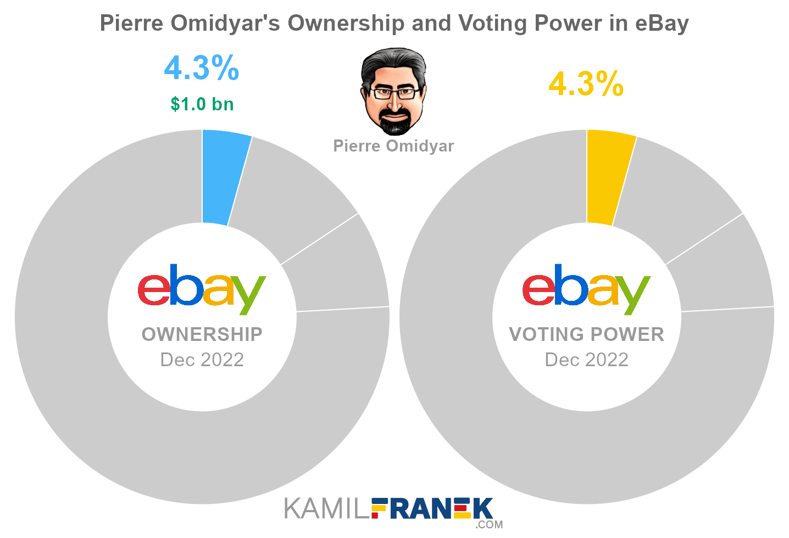

## Table of Contents

## What is a shareholder?

A shareholder is someone who owns shares in a company. When you buy shares, you become a part-owner of that company. The more shares you own, the bigger your ownership stake is. Shareholders can be individuals or other companies, and they have a say in how the company is run.

Shareholders can make money in two main ways. First, they can earn dividends, which are payments made by the company to its shareholders from its profits. Second, they can sell their shares for a higher price than they paid for them, which is called capital gain. However, if the company does not do well, the value of the shares can go down, and shareholders can lose money.

Being a shareholder also comes with certain rights. Shareholders can vote on important company decisions, like choosing the board of directors or approving big changes in the company's structure. They also have the right to get information about the company's financial health and performance. This helps them make better decisions about buying, holding, or selling their shares.

## Who are the major shareholders of eBay?

The biggest shareholder of eBay is The Vanguard Group, which owns a lot of eBay's shares. They manage money for many people and help them invest in companies like eBay. Another big shareholder is BlackRock, which also owns a large number of eBay's shares. These two companies together own a big part of eBay.

Other important shareholders include State Street Corporation and various mutual funds and institutional investors. These groups buy shares to help their clients make money. Sometimes, company founders or top executives also own shares, but for eBay, most of the shares are owned by these big investment companies.

## What percentage of eBay does the largest shareholder own?

The biggest shareholder of eBay is The Vanguard Group. They own about 8% of eBay's shares. This means they have a big say in what eBay does because they own a lot of the company.

The Vanguard Group helps many people invest their money. When they own shares in a company like eBay, they are doing it for all those people. So, when eBay does well, all those people can make money too.

## How has the ownership structure of eBay changed over the past five years?

Over the past five years, the ownership structure of eBay has seen some changes, but the big investment companies still own most of it. The Vanguard Group has stayed the biggest shareholder, owning around 8% of eBay's shares. BlackRock and State Street Corporation have also kept their big stakes in the company. These companies manage money for a lot of people, so when they own shares in eBay, it's like a lot of people own a little bit of eBay together.

There have been some smaller changes too. Some hedge funds and other investors have bought and sold eBay shares, but these changes haven't really shifted the overall picture much. The number of shares owned by insiders, like eBay's top executives, has stayed pretty low, showing that the company is mostly owned by outside investors. Overall, eBay's ownership has stayed pretty stable, with the big investment companies still holding the most power.

## Who are the institutional investors in eBay?

The main institutional investors in eBay are big companies that manage money for a lot of people. The Vanguard Group is the biggest one, owning about 8% of eBay's shares. They help people invest their money by buying shares in companies like eBay. BlackRock is another big investor, and they also own a lot of eBay's shares. State Street Corporation is another important investor in eBay. These big companies hold a big part of eBay because they manage money for many people.

Besides these big names, there are other institutional investors like mutual funds and pension funds that own eBay shares. These funds buy shares to help their clients make money. Sometimes, hedge funds also invest in eBay, but they might buy and sell shares more often. Overall, most of eBay's shares are owned by these big investment companies, which means a lot of people have a small piece of eBay through them.

## What role do insider shareholders play in eBay's governance?

Insider shareholders, like eBay's top executives and board members, own a small part of the company. They help make big decisions for eBay. Even though they don't own a lot of shares, they still have a say in how the company runs. They can vote on important things like who should be on the board of directors or if the company should make big changes.

Because insider shareholders know the company well, they can help guide eBay in the right direction. They work to make the company better and more successful. Even though most of eBay's shares are owned by big investment companies, the insider shareholders play an important role in making sure eBay is managed well and stays on track.

## How does eBay's shareholder composition compare to its competitors?

eBay's shareholder composition is similar to many of its competitors in the e-commerce industry, like Amazon and Etsy. The biggest shareholders of these companies are often big investment firms like The Vanguard Group and BlackRock. These firms own a lot of shares because they manage money for many people. For example, The Vanguard Group is a top shareholder in both eBay and Amazon, showing that big investors see value in these e-commerce companies.

However, there are some differences too. Amazon has a higher percentage of shares owned by its founder, Jeff Bezos, compared to eBay's insiders. This means that Amazon's founder has a bigger say in how the company is run. Etsy, on the other hand, has a more diverse group of institutional investors, with fewer shares owned by the top few firms compared to eBay. This can mean that Etsy's decisions might be influenced by a wider range of investors. Overall, while the big picture is similar, each company has its own unique mix of shareholders.

## What impact do major shareholders have on eBay's strategic decisions?

Major shareholders, like The Vanguard Group and BlackRock, have a big say in eBay's strategic decisions because they own a lot of the company's shares. When these big investors want eBay to do something different, like change how it makes money or who runs the company, they can vote on it. Because they own so many shares, their votes count a lot. This means eBay has to listen to what these big investors want, or they might sell their shares and make the company's stock price go down.

Even though these big investors have a lot of power, eBay's top executives and board members, who are called insider shareholders, also help make big decisions. They know the company really well and can guide eBay to do things that will make it better. But because insider shareholders own a smaller part of eBay, the big investors can still have more say in the end. So, eBay's strategy is a mix of what the big investors want and what the insiders think is best for the company.

## How do eBay's major shareholders influence its stock price?

eBay's major shareholders, like The Vanguard Group and BlackRock, can affect the stock price a lot. When these big investors buy more eBay shares, it can make the stock price go up. This is because more people want to buy the stock, so the price goes higher. On the other hand, if these big investors decide to sell a lot of their eBay shares, it can make the stock price go down. This is because there are more shares for sale, and people might think something is wrong with the company, so they don't want to buy as much.

These big investors also influence eBay's stock price by voting on important decisions. If they vote for things that make eBay do better, like choosing good leaders or making smart business moves, the stock price might go up because people think eBay will make more money. But if they vote for things that don't work out well, the stock price might go down because people might worry that eBay won't do as well in the future. So, what these big shareholders do can really change how people see eBay's stock and what they're willing to pay for it.

## What are the voting rights associated with eBay's shares?

When you own eBay shares, you get to vote on important things that the company does. Each share you own gives you one vote. So, if you own a lot of shares, you have more votes and more say in what eBay does. The big shareholders, like The Vanguard Group and BlackRock, have a lot of votes because they own a lot of shares. They can vote on who should be on eBay's board of directors, big changes in the company, and other important decisions.

Voting happens at meetings called shareholder meetings. eBay sends out information about these meetings and what will be voted on. Shareholders can vote in person at the meeting, or they can vote by sending in their votes before the meeting. This way, even if you can't go to the meeting, you can still have a say in what happens. The votes from all the shareholders are counted, and the decisions that get the most votes win. This helps make sure that eBay does what most of its owners want.

## How can one become a shareholder of eBay?

To become a shareholder of eBay, you need to buy eBay's shares. You can do this through a stockbroker, which is a person or a company that helps you buy and sell stocks. You can find stockbrokers online or through a bank. Once you have a stockbroker, you tell them you want to buy eBay shares, and they will do it for you. You can buy as many or as few shares as you want, depending on how much money you have and how much you want to invest.

After you buy the shares, you own a part of eBay. This means you can vote on big decisions the company makes and might get money from eBay if they do well. You can keep the shares for a long time or sell them later if you want. If eBay's stock price goes up, you can sell your shares for more money than you paid for them. But if the stock price goes down, you might lose money. So, it's important to think carefully before buying shares.

## What are the potential risks and benefits of investing in eBay based on its major shareholders?

Investing in eBay can have both benefits and risks, and the major shareholders play a big role in this. The Vanguard Group and BlackRock, which own a lot of eBay's shares, can help make the stock price go up if they keep buying more shares or if they vote for good decisions that make eBay do better. When these big investors are happy with eBay, it can make other people want to buy the stock too, which can push the price higher. Also, if eBay does well and makes more money, you might get dividends, which are payments to shareholders. So, having big and smart investors like The Vanguard Group and BlackRock can be good for eBay's stock price and your investment.

But there are also risks to think about. If these big shareholders decide to sell a lot of their eBay shares, it can make the stock price go down. This is because when a lot of shares are for sale, people might think something is wrong with eBay and not want to buy as much. Also, if the big investors vote for decisions that don't work out well, it can hurt eBay's business and make the stock price drop. So, even though having big investors can be good, it can also be risky if they change their minds about eBay. It's important to watch what these big shareholders do and think carefully before investing.

## References & Further Reading

[1]: Hansen, L. P., & McMahon, M. (2016). ["Algorithmic Trading and Its Implications for Market Quality."](https://sekhansen.github.io/pdf_files/jie_2016.pdf) National Bureau of Economic Research Working Paper No. 22052.

[2]: O'Hara, M. (2015). ["High Frequency Market Microstructure."](https://www.sciencedirect.com/science/article/pii/S0304405X15000045) Review of Financial Studies, 19(1), 1-20.

[3]: Easley, D., López de Prado, M. M., & O'Hara, M. (2011). ["The Microstructure of the 'Flash Crash': Flow Toxicity, Liquidity Crashes, and the Probability of Informed Trading."](https://www.semanticscholar.org/paper/Flow-Toxicity-and-Liquidity-in-a-High-Frequency-Easley-Prado/9369430bd005d194f9332ae7cbd5a57ace5e9ab3) The Journal of Finance, 66(6), 2049-2079.

[4]: Clarke, E., de Silva, H., & Thorley, S. (2018). ["Fundamentals of Efficient Factor Investing."](https://papers.ssrn.com/sol3/papers.cfm?abstract_id=2616071) Financial Analysts Journal, 74(4), 14-27.

[5]: Schwartz, R. A., & Francioni, R. (2004). ["Equity Markets in Action: The Fundamentals of Liquidity, Market Structure, and Trading."](https://books.google.com/books/about/Equity_Markets_in_Action.html?id=fPV16sxH8oUC) Wiley.