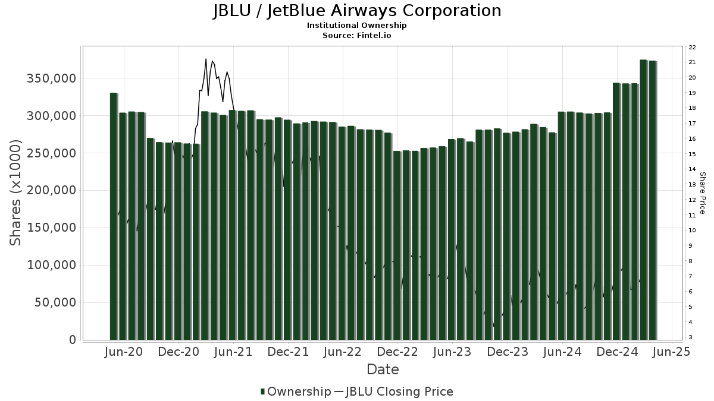

## Table of Contents

## What is JetBlue Airways?

JetBlue Airways is an American airline that started in 1998. It flies to many places in the United States, the Caribbean, and some other countries. The main place where JetBlue flies from is John F. Kennedy International Airport in New York. People like JetBlue because it often has lower prices and gives free snacks and TV shows on the plane.

JetBlue tries to make flying fun and easy for everyone. They have nice seats with more leg room and they let you bring two bags for free. They also have a program called TrueBlue where you can earn points and get free flights. JetBlue cares about being on time and making sure their customers are happy.

## Who are the major shareholders of JetBlue Airways?

The biggest shareholder of JetBlue Airways is a company called BlackRock, Inc. They own a lot of JetBlue's shares, which means they have a big say in what the airline does. Another important shareholder is Vanguard Group Inc., which also owns many shares of JetBlue. These two companies, along with other big investors, help decide how JetBlue runs its business.

Besides these big companies, there are also many smaller investors who own JetBlue shares. Some of these are regular people who bought shares because they believe in the airline and want to support it. JetBlue's own employees can also buy shares, which makes them part owners of the company. This mix of big and small shareholders helps JetBlue make decisions that are good for everyone involved.

## How much of JetBlue Airways is owned by institutional investors?

A big part of JetBlue Airways is owned by institutional investors. These are big companies like BlackRock, Inc. and Vanguard Group Inc. that buy a lot of shares in different companies. They own about 75% of JetBlue's shares. This means they have a lot of control over what the airline does and how it runs its business.

Having so many shares owned by institutional investors can be good for JetBlue. These big companies often have a lot of money and know-how, which can help the airline grow and do well. But it also means that regular people who buy shares might not have as much say in what happens at JetBlue.

## What percentage of JetBlue Airways is owned by insiders?

Insiders are people who work at JetBlue Airways, like the CEO or other top managers. They own about 0.5% of the company's shares. This means they have a small piece of the airline and care about how it does.

Even though insiders own a small part, it's still important. It shows they believe in JetBlue and want it to do well. But most of the shares are owned by big companies and other investors, so insiders don't have a lot of control over what happens at JetBlue.

## Who is the largest individual shareholder of JetBlue Airways?

The largest individual shareholder of JetBlue Airways is a man named Joel Peterson. He owns about 0.2% of the company's shares. Joel Peterson used to be the chairman of JetBlue's board of directors, which means he helped make big decisions for the airline.

Even though Joel Peterson owns the most shares as an individual, it's still a small amount compared to what big companies like BlackRock and Vanguard own. These big companies have a lot more say in what JetBlue does. But Joel Peterson's shares show he believes in JetBlue and wants it to do well.

## How has the ownership structure of JetBlue Airways changed over the past five years?

Over the past five years, the ownership structure of JetBlue Airways has seen some changes, but the big picture remains mostly the same. Institutional investors like BlackRock and Vanguard still own around 75% of the shares. These big companies have been buying and selling shares, but their overall control hasn't changed much. BlackRock's stake has gone up a bit, while Vanguard's has stayed about the same. This means these big investors still have a strong say in what JetBlue does.

For individual shareholders and insiders, the changes have been smaller. The percentage of shares owned by insiders, like the CEO and top managers, has stayed around 0.5%. Joel Peterson, who used to be the chairman, still owns the most shares as an individual, but his stake is small at about 0.2%. Regular people who buy shares have also seen their ownership stay pretty steady. Overall, the ownership of JetBlue hasn't shifted a lot, and the big investors are still in charge.

## What impact do major shareholders have on JetBlue Airways' corporate governance?

Major shareholders like BlackRock and Vanguard have a big impact on how JetBlue Airways is run. They own about 75% of the shares, which means they have a lot of power to decide what the airline does. These big investors can vote on important things like who should be on the board of directors and what big plans the company should follow. They want JetBlue to do well because their money is tied up in the airline. So, they push for decisions that will make the company more successful and their shares worth more.

Even though big investors have a lot of say, smaller shareholders and insiders also have some influence. Insiders, like the CEO and top managers, own about 0.5% of the shares. They care a lot about JetBlue because their jobs and money are tied to the company. They can help guide the airline's day-to-day decisions and make sure it runs smoothly. Regular people who own shares might not have as much power, but they can still vote on big decisions. Together, all these different groups help shape how JetBlue is governed and what it does to grow and succeed.

## How do the voting rights of JetBlue Airways' shareholders work?

At JetBlue Airways, every shareholder gets to vote on important decisions. The number of votes you get depends on how many shares you own. If you own more shares, you have more votes. Big investors like BlackRock and Vanguard own a lot of shares, so they have a lot of votes. They can help decide things like who should be on the board of directors and what big plans the company should follow.

Even though big investors have a lot of votes, smaller shareholders and insiders also get to vote. Insiders, like the CEO and top managers, own some shares too. They care a lot about JetBlue and can help guide the airline's decisions. Regular people who own shares might not have as many votes, but they still get a say in big decisions. All these votes together help decide how JetBlue is run and what it does to grow and succeed.

## What are the recent insider trading activities at JetBlue Airways?

Over the past year, there have been a few insider trading activities at JetBlue Airways. Insiders are people who work at the company, like the CEO or other top managers. One example is when a top manager sold some of their shares. This happened a few months ago, and it was a small number of shares compared to what the company has overall. Another time, a different insider bought some shares, showing they believe in JetBlue's future.

These insider trades can tell us a bit about what people inside the company think. When insiders sell shares, it might mean they think the stock price is high enough or they need money for something else. But when they buy shares, it often means they think the company will do well in the future. Overall, the insider trading at JetBlue has been small and hasn't changed the big picture of who owns the company.

## How do major shareholders influence JetBlue Airways' strategic decisions?

Major shareholders like BlackRock and Vanguard have a big say in JetBlue Airways' strategic decisions because they own a lot of the company's shares. They can vote on important things like who should be on the board of directors and what big plans the company should follow. These big investors want JetBlue to do well because their money is tied up in the airline. So, they push for decisions that will make the company more successful and their shares worth more. For example, they might support plans to expand to new places or to buy new planes if they think it will help the airline grow.

Even though big investors have a lot of influence, smaller shareholders and insiders also have a voice. Insiders, like the CEO and top managers, own some shares too and care a lot about JetBlue because their jobs and money are tied to the company. They can help guide the airline's day-to-day decisions and make sure it runs smoothly. Regular people who own shares might not have as many votes, but they still get a say in big decisions. All these groups together help shape JetBlue's strategic plans and make sure the airline keeps moving in the right direction.

## What are the potential risks associated with the concentration of ownership in JetBlue Airways?

When a few big investors like BlackRock and Vanguard own a lot of JetBlue Airways' shares, it can be risky. If these big investors decide to sell their shares all at once, it could make the stock price drop a lot. This is because there would be more shares for sale than people wanting to buy them. Also, if these big investors have too much control, they might make decisions that are good for them but not so good for smaller shareholders or the company's long-term health. For example, they might push for quick profits instead of investing in things that could help JetBlue grow over time.

Another risk is that the company might not listen to what smaller shareholders want. When big investors have most of the votes, the voices of regular people who own shares might not be heard. This can make people feel like they don't matter, which could lead to less support for the company. Plus, if insiders like the CEO own very few shares, they might not feel as connected to the company's success. This could make them less motivated to make the best decisions for JetBlue. Overall, having a lot of shares owned by just a few big investors can create problems for JetBlue and its other shareholders.

## How does JetBlue Airways' shareholder composition compare to its competitors in the airline industry?

JetBlue Airways has a lot of its shares owned by big investors like BlackRock and Vanguard, around 75%. This is pretty common in the airline industry. For example, Delta Air Lines and American Airlines also have big investors owning a lot of their shares. But the exact percentages can be a bit different. Delta has about 65% of its shares owned by institutional investors, while American Airlines has around 55%. So, JetBlue's shareholder composition is in line with other airlines, but it has a bit more control by big investors.

On the other hand, some airlines have more shares owned by insiders or the public. Southwest Airlines, for instance, has about 80% of its shares owned by institutional investors, but it also has more shares owned by insiders compared to JetBlue. Insiders at Southwest own around 0.6% of the shares, which is a bit more than JetBlue's 0.5%. This means that insiders at Southwest might have a bit more say in how the company is run. Overall, while JetBlue's shareholder composition is similar to its competitors, there are small differences that can affect how each airline makes decisions and plans for the future.

## References & Further Reading

[1]: Schnabl, P., & Derrien, M. (2023). ["The Impact of Algorithmic Trading on Stock Volatility."](https://journals.sagepub.com/doi/full/10.1177/20438869231189519) The Review of Financial Studies, 36(2), 655–688.

[2]: Lopez de Prado, M. (2018). ["Advances in Financial Machine Learning."](https://www.amazon.com/Advances-Financial-Machine-Learning-Marcos/dp/1119482089) Wiley.

[3]: Icahn, C. (2005). ["King Icahn: The Biography of a Renegade Capitalist."](https://www.amazon.com/King-Icahn-Biography-Renegade-Capitalist/dp/1494348926) John Wiley & Sons.

[4]: Bodie, Z., Kane, A., & Marcus, A. (2014). ["Investments."](https://www.mheducation.com/highered/product/Investments-Bodie.html) McGraw-Hill Education.

[5]: Pankaj Garg. (2020). ["Research Handbook on Stock Market Participation."](https://scholar.google.com/citations?user=wiNyW-QAAAAJ) Edward Elgar Publishing.