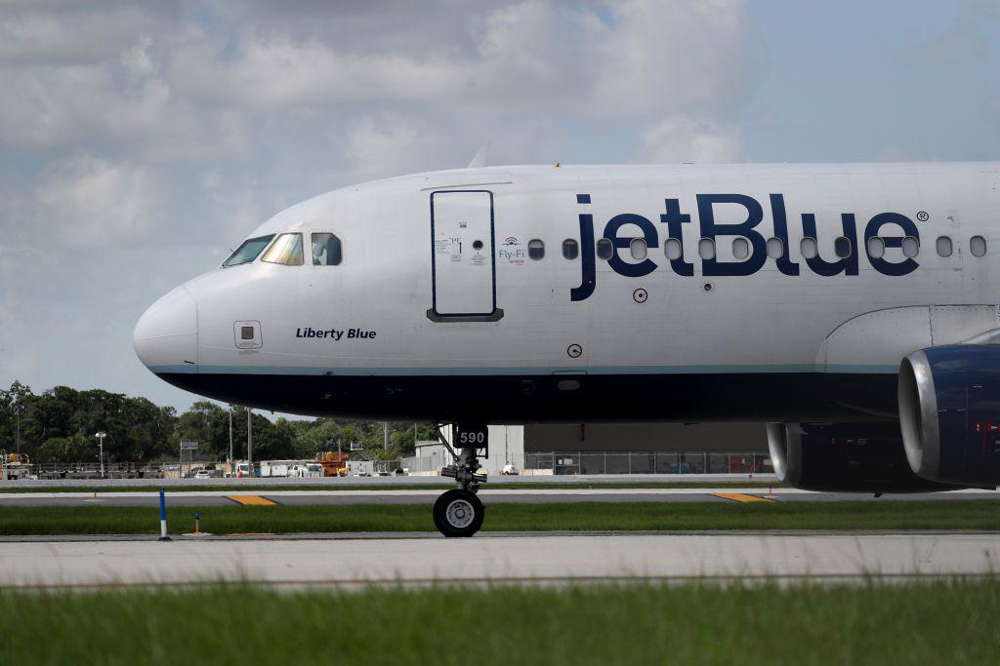

JetBlue Airways Corporation, a prominent player in the aviation industry, has garnered significant attention from investors and shareholders. The airline's operations are closely watched due to its position in a highly competitive market, where strategic decisions and financial performance are influenced by its ownership structure. Shareholders play a crucial role in shaping the company's future, impacting everything from governance to strategic planning. For stakeholders, understanding these dynamics is essential, as they can significantly affect investment outcomes and company policies.

In recent years, algorithmic trading, or algo trading, has emerged as a key component of modern investment strategies. By using complex algorithms and mathematical models, investors can make swift, data-driven decisions that enhance trading efficiency. This approach is particularly relevant in fast-paced markets like aviation, where stock prices can be volatile. Algo trading allows investors to execute large orders with minimal market impact, potentially driving liquidity and influencing share prices in real time.

For companies like JetBlue, understanding shareholder dynamics is important because these entities hold the power to guide corporate strategies. Major shareholders, often a mix of individual and institutional investors, can influence decisions on mergers and acquisitions, board member appointments, and long-term business strategies. In the aviation sector, where market conditions are prone to rapid changes, the role of shareholders cannot be overstated. For analysts and investors, recognizing these dynamics provides a clearer perspective on the potential risks and rewards associated with a company. By staying informed about shareholder actions and market trends, stakeholders can make more informed decisions about their investments in companies like JetBlue.

## Table of Contents

## Understanding JetBlue's Shareholder Structure

JetBlue Airways Corporation's shareholder structure plays a critical role in influencing the company's policies and future directions. At the helm of JetBlue's executive leadership are key individual shareholders such as Robin Hayes, the Chief Executive Officer, Joanna Geraghty, the President and Chief Operating Officer, and Brandon Nelson, the General Counsel and Corporate Secretary. These executives not only steer the operational strategies of the airline but also hold significant sway in shaping its strategic vision.

In addition to individual shareholders, institutional investors hold a substantial portion of JetBlue's shares. Major institutional shareholders include BlackRock Inc., Vanguard Group Inc., and Dimensional Fund Advisors LP. These entities are among the largest asset managers globally and bring significant financial clout and investment expertise to the table. Their involvement is crucial as they possess the power to influence major decisions through voting rights and active engagement with the company’s management.

Institutional shareholders like BlackRock and Vanguard typically adopt a long-term investment perspective, which can provide stability to the shareholder base and influence the company's strategy towards sustainable growth. Their emphasis on Environmental, Social, and Governance ([ESG](/wiki/esg-investing)) factors aligns with a broader trend in investment that encourages companies to consider long-term impacts rather than short-term gains.

Dimensional Fund Advisors, known for its data-driven investment strategies, also contributes to the analytical oversight of JetBlue’s performance. The presence of these large institutional investors can significantly impact JetBlue's policies, including decisions on capital allocation, corporate governance, and strategic initiatives.

The shareholder structure of JetBlue can be visualized as a blend of individual leadership influence and institutional financial backing, which together drive the airline’s strategic initiatives. The active involvement of institutional investors means that JetBlue must continuously align its operations with shareholder expectations, focusing on profitability, efficiency, and sustainability.

In conclusion, understanding JetBlue’s shareholder structure is essential for grasping how internal and external influences shape the company’s policies and future directions. The synergy between executive leadership and institutional backing forms a dynamic environment where strategic decisions are made, impacting the airline’s trajectory in a competitive industry.

## Carl Icahn's Stake in JetBlue

Carl Icahn, a prominent activist investor, has recently made headlines with his acquisition of nearly a 10% stake in JetBlue Airways Corporation. This significant move signals Icahn’s strategic interest in influencing the direction of the airline. Historically, Icahn has been known to leverage his substantial holdings to effect change within companies, often through board representations and strategic decision-making.

The market's reaction to Icahn's stake in JetBlue was immediate, with stock fluctuations reflecting investor anticipation of potential strategic shifts. Activist investors like Icahn typically seek to enhance shareholder value, often by advocating for cost reductions, operational efficiency improvements, or strategic reorganization. His involvement suggests that JetBlue may undergo substantial changes aimed at improving its competitiveness and financial performance.

Activist investors exert influence in several ways, primarily through acquiring sufficient shares to gain representation on the company's board of directors. This enables them to advocate for the adoption of strategies that align with their vision for the company. Icahn's track record demonstrates a pattern of pushing for restructuring, exploring mergers or acquisitions, and optimizing business operations to maximize returns.

The implications of Icahn’s involvement in JetBlue could be profound. He may push for strategic moves, such as revisiting merger opportunities, enhancing operational efficiencies, or re-evaluating route and fleet strategies to better align with current market conditions. These actions could position JetBlue for greater profitability and market presence. However, they may also involve challenging transitions and restructuring efforts, requiring careful navigation to balance immediate gains with long-term sustainability.

Icahn’s stake in JetBlue underscores the critical role of shareholder activism in shaping corporate strategies and underscores the need for careful analysis and consideration of these dynamics by both management and shareholders. As JetBlue continues to navigate the complexities of the post-pandemic aviation industry, Icahn’s influence is likely to play a pivotal role in determining the airline’s strategic path forward.

## The Role of Algo Trading in Investment Strategies

Algorithmic trading, often referred to as algo trading, involves the use of computer algorithms to automate trading decisions. This method leverages complex mathematical models and advanced statistical techniques to make trading decisions at speeds and frequencies that a human trader cannot achieve. The primary appeal of algo trading lies in its efficiency and its ability to parse large volumes of data to identify patterns and opportunities, thereby making data-driven decisions that can maximize returns or minimize risks.

Algo trading has seen increasing popularity among institutional and retail investors due to its precision and capacity for high-frequency trading, where thousands or even millions of orders can be executed in seconds. This has led to a significant reduction in transaction costs and has improved the [liquidity](/wiki/liquidity-risk-premium) in the markets. For stocks like JetBlue, algo trading can have profound impacts. It can create [volatility](/wiki/volatility-trading-strategies) because large volumes of stocks can be bought or sold in fractions of a second based on algorithmic strategies. This can lead to rapid price shifts as algorithms react to data inputs or market triggers.

However, algo trading also serves to provide liquidity. By ensuring there is a ready market for buying and selling shares, algo trading helps stabilize prices and allows for smoother transaction flows. This can be particularly advantageous during periods of market stress or when a stock is thinly traded.

The integration of algo trading into investment practices brings significant benefits. For institutional investors, algos can execute complex strategies that incorporate multiple asset classes and take advantage of [arbitrage](/wiki/arbitrage) opportunities across markets. Retail investors, on the other hand, benefit from reduced costs and access to sophisticated trading strategies that were previously reserved for institutional players.

Nevertheless, there are challenges associated with implementing algo trading. Market events such as the "flash crash" of May 2010, where rapid sell-offs driven by algorithms led to a sudden market collapse, highlight the risk of unforeseen interactions between algorithms. Regulatory environments are also constantly evolving as authorities attempt to mitigate these risks while maintaining market integrity.

Additionally, the need for advanced technology and infrastructure can be a barrier for smaller investors or firms. The reliance on high-speed internet, powerful computing systems, and comprehensive data analysis tools implies significant initial outlay and ongoing operational costs. Furthermore, there is the challenge of model risk, where the assumptions made in algorithmic models may not hold true in all market conditions, potentially leading to undesirable outcomes.

In conclusion, while algo trading offers efficiency and a high level of precision, both institutional and retail investors must carefully consider the associated costs, regulatory requirements, and potential market impacts when integrating these strategies into their investment portfolios.

## Impact of Shareholder Actions on JetBlue's Future

JetBlue Airways has been at the center of various strategic initiatives, with its recent attempt to acquire Spirit Airlines serving as a pivotal moment. This attempted merger, valued at approximately $3.8 billion, aimed to integrate Spirit's operational network, expand JetBlue's market share, and potentially transform the low-cost airline landscape in the United States. However, the failure to secure regulatory approval for the acquisition marked a significant setback, highlighting the complexities of such corporate maneuvers ([source](https://www.nytimes.com/2023/07/27/business/jetblue-spirit-airlines-merger.html)).

The impact of this failed acquisition is multifaceted. Firstly, JetBlue's management must reassess their approach to growth and expansion. The involvement and reaction of major shareholders, such as BlackRock Inc. and Vanguard Group Inc., are crucial, as they wield significant influence over corporate governance and strategic decisions. Institutional shareholders can drive change by advocating for alternative strategies to foster growth, potentially affecting company policies regarding route expansion, fleet modernization, or partnership strategies.

The interest of shareholders like Carl Icahn, known for his activist investment approach, can also play a transformative role. Icahn's stake in JetBlue signals the potential for strategic shifts, particularly if he secures board representation. With his influence, he might push for cost-cutting measures, operational efficiency, or leverage JetBlue’s competitive advantages over other carriers. Such actions would not only serve to increase shareholder value but could set the stage for defining JetBlue's strategic direction in a competitive market.

Post-pandemic recovery presents another arena where shareholder actions could significantly impact JetBlue's future. The aviation industry's rebound depends on several factors such as fluctuating oil prices, changes in air travel demand, and regulatory policies. Shareholders, especially those with substantial stakes, might advocate for cautious capital allocation, focusing on strengthening core operations, customer service enhancements, or technological integration to improve operational efficiency.

Potential scenarios for growth could involve JetBlue prioritizing domestic market consolidation to enhance profitability before considering international expansion. Additionally, the airline might explore alliances or partnerships that align with shareholder interests to facilitate route diversification without the pitfalls of large-scale acquisitions. These strategies could be critical in navigating a competitive, post-pandemic environment.

In summary, shareholder actions and strategic decisions will continuously shape JetBlue's trajectory. Insights from major stakeholders could not only inform JetBlue's recovery plans but also drive sustainable growth aligned with investor expectations, ensuring the airline remains competitive in a dynamically shifting aviation landscape.

## Conclusion

In conclusion, the intricate dynamics between JetBlue's investors, shareholders, and modern trading strategies play a crucial role in shaping the airline's future. The shareholder structure, with key figures such as Robin Hayes, Joanna Geraghty, and institutional giants like BlackRock Inc. and Vanguard Group Inc., positions these entities to significantly influence corporate decisions and strategic directions. Notably, Carl Icahn's acquisition of a substantial stake highlights the transformative power of activist investors. His involvement could lead to pivotal changes in JetBlue's operational strategies, potentially steering the company toward new ventures or altering its long-term goals.

Simultaneously, [algorithmic trading](/wiki/algorithmic-trading) has emerged as a significant force in the financial markets. Its ability to enhance efficiency and leverage data-driven decisions may impact JetBlue’s stock by influencing market liquidity and volatility. Both institutional and retail investors employing these strategies need to carefully balance the benefits of speed and data analysis with the challenges of market unpredictability.

Staying informed about these variables is essential for investors considering JetBlue. Understanding how shareholder actions and prevailing market trends interact can uncover opportunities and risks pertinent to investment decisions. As the aviation industry continues to navigate post-pandemic recovery, these factors are poised to play a decisive role in determining JetBlue's trajectory.

## References & Further Reading

[1]: Schnabl, P., & Derrien, M. (2023). ["The Impact of Algorithmic Trading on Stock Volatility."](https://journals.sagepub.com/doi/full/10.1177/20438869231189519) The Review of Financial Studies, 36(2), 655–688.

[2]: Lopez de Prado, M. (2018). ["Advances in Financial Machine Learning."](https://www.amazon.com/Advances-Financial-Machine-Learning-Marcos/dp/1119482089) Wiley.

[3]: Icahn, C. (2005). ["King Icahn: The Biography of a Renegade Capitalist."](https://www.amazon.com/King-Icahn-Biography-Renegade-Capitalist/dp/1494348926) John Wiley & Sons.

[4]: Bodie, Z., Kane, A., & Marcus, A. (2014). ["Investments."](https://www.mheducation.com/highered/product/Investments-Bodie.html) McGraw-Hill Education.

[5]: Pankaj Garg. (2020). ["Research Handbook on Stock Market Participation."](https://scholar.google.com/citations?user=wiNyW-QAAAAJ) Edward Elgar Publishing.