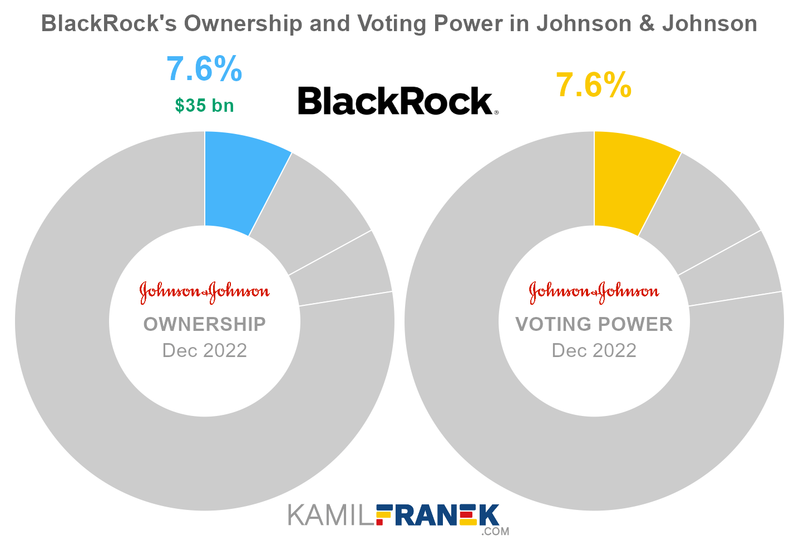

## Table of Contents

## What is a major shareholder?

A major shareholder is someone who owns a big part of a company's shares. When someone owns a lot of shares, they have more power in the company. This is because they can vote on important decisions and have a say in how the company is run. Usually, someone is called a major shareholder if they own at least 5% of the company's shares.

Major shareholders can be individuals, other companies, or even groups of people. They often get special reports and information from the company that smaller shareholders don't get. This helps them make better decisions about their investments. Because they own a big part of the company, major shareholders are very interested in making sure the company does well, since their own success is tied to the company's success.

## Who are considered major shareholders of Johnson & Johnson?

The major shareholders of Johnson & Johnson include big investment companies and funds. Some of the biggest ones are The Vanguard Group, which owns about 9% of the company's shares, and BlackRock, which owns around 7%. These companies manage money for lots of people, so they buy shares in big companies like Johnson & Johnson to help their clients' money grow.

Besides these big investment companies, there are also other important shareholders. State Street Corporation owns about 4% of Johnson & Johnson's shares. Sometimes, individual people or families can be major shareholders too, but for Johnson & Johnson, it's mostly big investment firms that hold the most shares. These shareholders have a big say in how Johnson & Johnson is run because they own so much of the company.

## How much of Johnson & Johnson do the major shareholders own?

The major shareholders of Johnson & Johnson own a big part of the company. The Vanguard Group owns about 9% of the shares. This means they have a lot of say in how the company is run. BlackRock is another big shareholder, owning around 7% of Johnson & Johnson's shares. They also have a strong influence on the company's decisions.

State Street Corporation owns about 4% of the shares. While this is less than The Vanguard Group and BlackRock, it's still a big enough share to make them important in the company. Together, these three major shareholders own around 20% of Johnson & Johnson. This shows how much control they have over the company's future.

## What is the role of major shareholders in Johnson & Johnson's decision-making?

Major shareholders like The Vanguard Group, BlackRock, and State Street Corporation have a big say in how Johnson & Johnson makes decisions. Because they own a lot of the company's shares, they can vote on important things like who should be on the board of directors and what big plans the company should follow. This means they can help decide the direction the company takes and make sure it's doing well.

These shareholders care a lot about Johnson & Johnson doing well because their own success depends on it. They get special reports and information from the company, which helps them make smart choices about their investments. By having a big part of the company, they can push for changes that they think will make Johnson & Johnson even better and more successful in the future.

## How has the ownership of major shareholders in Johnson & Johnson changed over the past five years?

Over the past five years, the ownership of major shareholders in Johnson & Johnson has seen some changes. The Vanguard Group, which is one of the biggest shareholders, has slightly increased its stake in the company. They now own about 9% of Johnson & Johnson's shares, up from around 8.5% five years ago. This shows that they believe in the company's future and want to have a bigger say in its decisions.

BlackRock, another major shareholder, has also seen a small increase in its ownership. Five years ago, they owned about 6.5% of the shares, and now they own around 7%. This means they have a bit more power in how the company is run. State Street Corporation's ownership has stayed pretty much the same, holding steady at about 4% of Johnson & Johnson's shares over the past five years. Overall, these big shareholders continue to have a strong influence on the company, with some of them choosing to own a bit more of it over time.

## Who are the institutional investors in Johnson & Johnson?

Institutional investors in Johnson & Johnson are big organizations that manage money for lots of people. They buy shares in companies like Johnson & Johnson to help their clients' money grow. Some of the biggest institutional investors in Johnson & Johnson are The Vanguard Group, BlackRock, and State Street Corporation. The Vanguard Group owns about 9% of Johnson & Johnson's shares, BlackRock owns around 7%, and State Street Corporation owns about 4%. These big investors have a lot of say in how the company is run because they own so much of it.

These institutional investors get special reports and information from Johnson & Johnson, which helps them make smart choices about their investments. Because they own a big part of the company, they care a lot about making sure Johnson & Johnson does well. Their success depends on the company's success, so they try to help guide the company in the right direction. Over the past few years, some of these investors have even bought more shares in Johnson & Johnson, showing they believe in its future.

## What percentage of Johnson & Johnson is owned by institutional investors?

Institutional investors own a big part of Johnson & Johnson. They are big organizations that manage money for a lot of people. The biggest ones are The Vanguard Group, BlackRock, and State Street Corporation. Together, these three own about 20% of Johnson & Johnson's shares. This means they have a lot of power in how the company is run because they own so much of it.

These institutional investors get special reports and information from Johnson & Johnson. This helps them make smart choices about their investments. Because they own a big part of the company, they really care about making sure Johnson & Johnson does well. Their own success depends on the company's success, so they try to help guide the company in the right direction. Over the past few years, some of these investors have even bought more shares in Johnson & Johnson, showing they believe in its future.

## How do major shareholders influence Johnson & Johnson's corporate governance?

Major shareholders like The Vanguard Group, BlackRock, and State Street Corporation have a big say in how Johnson & Johnson is run. They own a lot of the company's shares, which means they can vote on important things like who should be on the board of directors. The board helps make big decisions for the company. Because these shareholders own so much, they can help choose people for the board who they think will make good choices for Johnson & Johnson.

These shareholders also get special reports and information from the company. This helps them make smart choices about their investments. They care a lot about making sure Johnson & Johnson does well because their own success depends on it. By having a big part of the company, they can push for changes that they think will make Johnson & Johnson even better and more successful in the future.

## What are the voting rights of major shareholders in Johnson & Johnson?

Major shareholders in Johnson & Johnson, like The Vanguard Group, BlackRock, and State Street Corporation, have important voting rights because they own a lot of the company's shares. Each share they own gives them one vote, so the more shares they have, the more votes they get. This means they can have a big say in important decisions, like who should be on the board of directors. The board helps make big choices for the company, so choosing the right people is very important.

These shareholders can vote at the company's annual meetings or special meetings. They can vote on things like approving the company's financial reports, deciding on executive pay, and making changes to the company's rules. Because they own so many shares, their votes can really affect the outcome of these decisions. This gives them a lot of power to help guide Johnson & Johnson in the direction they think is best.

## How do insider ownership and major shareholders impact Johnson & Johnson's stock performance?

Insider ownership and major shareholders can both affect how Johnson & Johnson's stock does. When insiders, like the company's top leaders and employees, own a lot of stock, it shows they believe in the company's future. This can make other people feel more confident about buying the stock too. If insiders sell a lot of their stock, it might make others worried that something is wrong, and the stock price could go down. So, what insiders do with their stock can really move the stock's price.

Major shareholders, like big investment companies such as The Vanguard Group and BlackRock, also have a big impact. Because they own a lot of the company's shares, they can vote on important decisions and help choose who runs the company. If these big shareholders think Johnson & Johnson is doing well, they might buy more shares, which can push the stock price up. But if they start selling their shares, it could make the stock price go down because it might look like they don't believe in the company anymore. So, both insider actions and what major shareholders do can make a big difference in how Johnson & Johnson's stock performs.

## What are the recent buying and selling activities of major shareholders in Johnson & Johnson?

Recently, major shareholders like The Vanguard Group and BlackRock have been making some changes in their ownership of Johnson & Johnson. The Vanguard Group, which already owns about 9% of the company's shares, has been slowly buying more shares over the past year. This shows they believe in Johnson & Johnson's future and want to have a bigger say in how the company is run. On the other hand, BlackRock, which owns around 7% of the shares, has also been active but their activity has been more mixed. They've bought some shares but also sold some, keeping their overall ownership pretty stable.

State Street Corporation, another big shareholder with about 4% of the shares, has not made big changes in their ownership recently. They've been holding onto their shares without buying or selling a lot. This means they're happy with their current level of investment in Johnson & Johnson. Overall, these major shareholders are still very important to the company, and their buying and selling activities can affect how the stock does, even if the changes are small.

## How do major shareholders' strategies align with Johnson & Johnson's long-term goals?

Major shareholders like The Vanguard Group, BlackRock, and State Street Corporation have strategies that often line up with Johnson & Johnson's long-term goals. They want the company to do well because they own a big part of it. Their goal is to make sure Johnson & Johnson grows and makes more money over time. This means they support plans that help the company be successful in the long run. For example, they might vote for people to join the board of directors who have good ideas for growing the company. They also like it when Johnson & Johnson invests in new products or buys other companies that can help it grow.

These shareholders also pay attention to how Johnson & Johnson handles risks and keeps people happy, like its workers and customers. They want the company to be strong and last a long time. So, they might push for things like better ways to manage money or new ways to make sure the company is doing things safely and well. By working together with Johnson & Johnson's leaders, these major shareholders help guide the company towards its long-term goals. This way, everyone can benefit from the company's success over many years.

## References & Further Reading

[1]: ["Influence of Institutional Investors on Corporate Governance"](https://ijrpr.com/uploads/V4ISSUE8/IJRPR16477.pdf) by CFA Institute

[2]: ["The Role of Institutional Investors in Corporate Governance"](https://link.springer.com/content/pdf/10.1057/9781137327031.pdf) by the OECD

[3]: ["Algorithmic and High-Frequency Trading"](https://www.amazon.com/Algorithmic-High-Frequency-Trading-Mathematics-Finance/dp/1107091144) by Charles M. Jones

[4]: Lopez de Prado, M. (2018). ["Advances in Financial Machine Learning"](https://www.amazon.com/Advances-Financial-Machine-Learning-Marcos/dp/1119482089) Hardcover.

[5]: ["Quantitative Finance and Algorithmic Trading"](https://medium.com/@rajat01221/algorithmic-trading-and-quantitative-finance-a-comprehensive-overview-308819b48184) by Xueting Bai, Álvaro Cartea, Sebastian Jaimungal

[6]: ["The Impact of Algorithmic Trading on the Stock Market"](https://wjaets.com/sites/default/files/WJAETS-2024-0136.pdf) by Hendershott, Jones, and Menkveld